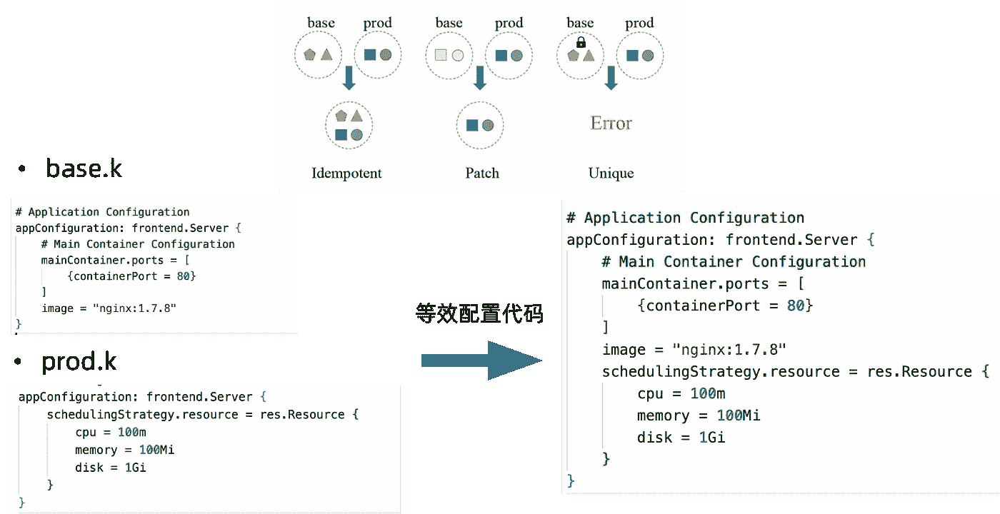

# 声明性配置的前景

> 原文：<https://blog.devgenius.io/the-landscape-of-declarative-configuration-55bb85d6997b?source=collection_archive---------9----------------------->

本博客仅用于阐明声明式配置的前景， [KCL](https://github.com/KusionStack/KCLVM) 核心概念和特性，以及与其他配置语言的比较。

# 1.陈述性配置[的景观](https://kcl-lang.io/blog/2022-declarative-config-overview#1-the-landscape-of-declarative-configuration)

# 1.1[配置的重要性](https://kcl-lang.io/blog/2022-declarative-config-overview#11-importance-of-configuration)

*   每天有成千上万的配置更新是因为软件开发和配置本身都在逐渐进化，对大规模效率的需求很高。
*   1.配置更新更频繁:不断发展的业务需求、基础设施需求和其他因素意味着系统需要不断变化，而配置提供了一种低成本的方式来改变系统功能。
*   2.配置规模越来越大:一个配置经常分布到不同的云站点、不同的租户、不同的环境等。
*   3.广泛的配置场景:应用、数据库、网络、监控等。
*   4.各种配置格式:JSON，YAML，XML，TOML，各种配置模板如 Java Velocity，Go 模板等。
*   配置的稳定性至关重要。系统出错的一个主要原因是大量工程师频繁更新配置。表 1 显示了由配置引起的几个系统错误事件。


表 1 由配置引起的系统错误事件。

# 1.2 陈述性配置的分类[](https://kcl-lang.io/blog/2022-declarative-config-overview#12-classification-of-declarative-configuration)

云原生时代带来了快速的技术发展，出现了大量的声明式配置。如图 1 所示，声明性配置通常可以分为以下几种方式。


图 1:声明性配置的分类。

## 1.2.1 结构化 K-V[](https://kcl-lang.io/blog/2022-declarative-config-overview#121-structured-k-v)

结构化 K-V 满足最低数据声明要求(int、string、list、dict 等。).随着云原生技术的快速发展和应用，声明式 API 满足了 X as Data 的开发需求。机器可读和可写，人类可读。

赞成。

*   简单的语法，易于书写和阅读。
*   丰富的多语言 API。
*   数据查询的各种路径工具，如 XPath、JsonPath 等。

缺点。

*   冗余信息过多:当配置规模较大时，很难维护配置，因为重要的配置信息隐藏在大量不相关的重复数据细节中。
*   缺乏功能:约束、复杂逻辑、测试、调试、抽象等。
*   [Kustomize](https://kustomize.io/) 的补丁基本上是通过固定几个补丁合并策略

结构化 KV 的代表性技术包括:

*   JSON/YAML:阅读和自动化非常方便，并且有不同语言的 API 支持。
*   [Kustomize](https://kustomize.io/) :提供了一种无需模板和 DSL 就可以定制 Kubernetes 资源库配置和差异配置的解决方案。它本身并不解决约束问题而是需要配合大量的附加工具来检查约束，比如 [Kube-linter](https://github.com/stackroxkube-linter) 、 [Checkov](https://github.com/bridgecrewio/checkov) 。图 2 显示了 Kustomize 的典型工作模式。


图 Kustomize 的典型工作模式。

## 1.2.3 模板化的 K-V[](https://kcl-lang.io/blog/2022-declarative-config-overview#123-templated-k-v)

模板化的 KV 具有静态配置数据和动态参数的能力，可以用一个模板+动态参数输出不同的静态配置数据。优点和缺点如下:

赞成。

*   简单的配置逻辑和循环支持。
*   外部动态参数支持。

缺点。

*   很容易陷入所有配置都是模板参数的陷阱。
*   当配置规模变大时，开发者和工具很难对其进行维护和分析。

模板化 KV 的代表性技术包括:

*   [Helm](https://helm.sh/):Kubernetes 资源的包管理工具，通过配置模板管理 Kubernetes 资源的配置。图 3 示出了 Helm Jekins 包配置图配置模板。可以看出，这些模板非常简短，逻辑简单。适合 Kubernetes 基本组件的一系列资源配置是通过包管理和附加配置参数安装的。与简单的模板化 K-V 相比，Helm 提供了模板存储、引用和语义版本管理能力。与 Kustomize 相比，Helm 更适合管理外部图表，但不擅长多环境和多租户配置管理。
*   其他配置模板:Java Velocity、Go Template 等文本模板引擎非常适合 HTML 编写模板。然而，当在配置场景中使用时，开发人员和工具很难维护和分析它们。


图 3: Helm Jekins 包配置图配置模板。

## 1.2.3 可编程 K-V[](https://kcl-lang.io/blog/2022-declarative-config-overview#123-programmable-k-v)

`Configuration as Code (CaC)`使用代码生成配置，就像工程师只需要编写高级的 GPL 代码，而不是手工编写容易出错、难以理解的服务器二进制代码。

*   配置变更会像代码变更一样被认真对待，也可以执行单元测试和集成测试。
*   代码模块化是维护配置代码比手动编辑配置文件(如 JSON/YAML)更容易的一个关键原因。

能力

*   必要的编程语言能力(变量定义、逻辑判断、循环、断言等。).
*   必要的模板功能，支持定义数据模板和使用模板获取新的配置数据。
*   代码模块化:结构定义和包管理。
*   机器可读可写，人类可读可写。

赞成。

*   必要的编程能力。
*   代码模块化和抽象。
*   配置模板和覆盖能力。

缺点。

*   类型检查不足。
*   约束能力不足。
*   许多运行时错误。

可编程 KV 的代表性技术包括:

*   [GCL](https://github.com/rix0rrr/gcl) :用 Python 实现的声明式配置编程语言提供了必要的语言能力来支持模板抽象。但是，编译器本身是用 Python 写的，语言本身是解释和执行的。对于大型模板实例(如 Kubernetes 模型)，性能很差。
*   [HCL](https://github.com/hashicorp/hcl) :一种 Go 实现结构化配置语言。HCL 的原生语法受 libucl 和 Nginx 配置的启发。用于创建一种对人和机器友好的结构化配置语言，主要用于 DevOps 工具、服务器配置、资源配置作为 Terraform 语言。
*   [Jsonnet](https://github.com/google/jsonnet) :一种用 C++实现的数据模板语言，适用于应用和工具开发人员，可以生成配置数据，组织、简化和管理大型配置，并且没有副作用。

## 1.2.4 键入 K-V[](https://kcl-lang.io/blog/2022-declarative-config-overview#124-typed-k-v)

能力

*   在可编程 K-V 的基础上，类型化 K-V 具有更多的类型约束能力。

赞成。

*   配置合并是完全幂等的，这自然防止了配置冲突。
*   用于编写配置的丰富约束语法。
*   将类型和值约束抽象成相同的形式，这很容易编写。
*   配置顺序独立。

缺点。

*   图合并和幂等合并概念复杂，理解成本高。
*   类型和值的混合定义提高了抽象程度和理解成本。所有约束都在运行时检查，对于大规模配置代码来说，存在性能瓶颈。
*   很难实现想要配置覆盖和修改的多租户和多环境场景。
*   对于有条件的约束场景，编写定义和验证的混合定义的用户界面是不友好的。

KV 型的代表性技术包括:

*   [CUE](https://github.com/cue-lang/cue):CUE 解决的核心问题是“类型检查”，主要用于配置约束验证场景和简单的云原生配置场景。

## 1.2.5 模拟 K-V[T3](https://kcl-lang.io/blog/2022-declarative-config-overview#125-modeled-k-v)

能力

*   作为核心描述的高级语言建模能力

赞成。

*   建模
*   不变
*   限制
*   通过隔离配置块的自动合并机制实现高可扩展性。
*   像高级编程语言一样的编写和测试方法。
*   机器可读可写，人类可读可写。

缺点。

*   新模式的拓展和生态建设需要一定的 R&D 成本

模拟 KV 的代表性技术包括:

*   [KCL](https://github.com/KusionStack/KCLVM):Rust 实现的声明式配置和策略编程语言，通过成熟的编程语言技术和实践改进大量复杂配置的编写，致力于围绕配置构建更好的模块化、可扩展性和稳定性，逻辑编写更简单，自动化速度快，生态外延良好。图 4 显示了 KCL 编写应用交付配置代码的典型场景。


图 KCL 编写应用交付配置代码的典型场景。

# 1.3 不同声明性配置的指南和最佳实践[](https://kcl-lang.io/blog/2022-declarative-config-overview#13-guidelines-and-best-practices-for-different-declarative-configurations)

*   配置规模:对于小规模的配置场景，我们可以使用 YAML/JSON 等配置，比如应用本身的简单配置和 CI/CD 配置。此外，针对小规模配置场景下多环境、多租户的需求，可以利用 Kustomize 的 overlay 能力实现简单配置的合并、覆盖等操作。
*   模型抽象和约束的必要性:对于大规模的配置场景，尤其是对配置模型和 O&M 特性 R&D 有迫切需求，多租户多环境沉淀的场景，可以采用编码、分型、建模的 K-V 方法。

此外，考虑不同声明性配置的使用场景:

*   如果你需要编写结构化的静态 K-V 或者使用 Kubernetes 的原生工具，推荐使用 YAML。
*   如果您想使用编程语言的便利性来删除具有良好可读性的样板文件，或者如果您已经是 Terraform 用户，那么建议使用 HCL。
*   如果您希望使用类型系统来提高稳定性和维护可伸缩的配置，建议使用 CUE。
*   如果您想要像现代语言、可伸缩配置、内部纯功能和规则以及生产就绪性能和自动化这样的类型和建模，那么推荐使用 KCL。

与社区中其他同类型语言不同，KCL 是一种面向应用开发者的静态强类型编译语言，采用了现代语言设计和技术。

> *注意，本博客不会讨论用于编写配置的通用语言。一般的语言通常是矫枉过正，即远远超出了需要解决的问题。通用语言存在各种安全问题，比如能力边界问题(启动本地线程、访问 IO、网络、代码无限循环等安全风险)。例如，在音乐领域，有专门的音符来表达音乐，便于学习和交流，这是用一般语言无法表达清楚的。*
> 
> *此外，由于其通用语言风格各异，因而具有统一维护、管理和自动化的成本。通用语言通常用于编写客户端运行时，它是服务器运行时的延续。不适合写独立于运行时的配置，编译成二进制，最后从进程启动。此外，稳定性和可扩展性不容易控制。然而，配置语言经常被用来写数据，它与简单的逻辑相结合，它描述了预期的最终结果，然后由编译器或引擎使用。*

# 2.KCL 核心特性和用例[](https://kcl-lang.io/blog/2022-declarative-config-overview#2-kcl-core-features-and-use-cases)

KCL 的核心特性是它的建模和约束能力，KCL 的基本功能围绕着这两个核心特性。此外，KCL 遵循以用户为中心的配置理念来设计其基本功能，这可以从两个方面来理解:

*   以领域模型为中心的配置视图:借助 KCL 语言和 [KCL OpenAPI](https://kcl-lang.io/docs/tools/cli/openapi/) 工具的丰富特性，我们可以直接将社区中大量设计良好的模型集成到 KCL 中(如 K8s 资源模型)。我们还可以根据不同的场景设计实现自己的 KCL 模型或库，形成一套完整的领域模型，供其他配置终端用户使用。
*   以最终用户为中心的配置视图:借助 KCL 的代码封装、抽象和重用能力，可以进一步抽象和简化模型架构(例如将 K8s 资源模型抽象为以应用程序为中心的服务器模型)，最大限度地减少最终用户的配置输入**，简化用户的配置界面，方便手动或自动修改 API。

无论配置视图以什么为中心，对于配置代码来说，都有对配置数据约束的要求，比如类型约束、配置属性的必选/可选约束、范围约束、不变性约束等。这也是 KCL 致力于解决的核心问题之一。KCL 主要包含图 5 所示的核心特性。


图 5: KCL 核心特性。

*   易用性:源于 Python、Golang 等高级语言，融入了低副作用的函数式语言特性。
*   设计良好:独立的规范驱动的语法、语义、运行时和系统模块设计。
*   快速建模:[模式](https://kcl-lang.io/docs/reference/lang/tour#schema)-以配置类型和模块化抽象为中心。
*   丰富的功能:基于[配置](https://kcl-lang.io/docs/reference/lang/tour#config-operations)、[模式](https://kcl-lang.io/docs/reference/lang/tour#schema)、[λ](https://kcl-lang.io/docs/reference/lang/tour#function)、[规则](https://kcl-lang.io/docs/reference/lang/tour#rule)的类型、逻辑和策略配置。
*   稳定性:基于[静态类型系统](https://kcl-lang.io/docs/reference/lang/tour/#type-system)、[约束](https://kcl-lang.io/docs/reference/lang/tour/#validation)和[规则](https://kcl-lang.io/docs/reference/lang/tour#rule)的配置稳定性。
*   可伸缩性:通过隔离配置块的[自动合并机制](https://kcl-lang.io/docs/reference/lang/tour/#-operators-1)实现高可伸缩性。
*   快速自动化:[CRUD API](https://kcl-lang.io/docs/reference/lang/tour/#kcl-cli-variable-override)、[多语言 SDK](https://kcl-lang.io/docs/reference/xlang-api/overview)、[语言插件](https://github.com/KusionStack/kcl-plugin)的梯度自动化方案
*   高性能:使用 Rust & C 和 [LLVM](https://llvm.org/) 的高编译时间和运行时性能，支持编译到原生代码和 [WASM](https://webassembly.org/) 。
*   API 亲缘性:原生支持 API 生态规范，如 [OpenAPI](https://github.com/KusionStack/kcl-openapi) ，Kubernetes CRD，Kubernetes YAML 规范。
*   开发友好:友好的开发体验，拥有丰富的[语言工具](https://kcl-lang.io/docs/tools/cli/kcl/) (Format，Lint，Test，Vet，Doc 等)。)和 [IDE 插件](https://github.com/KusionStack/vscode-kcl)。
*   安全性和可维护性:面向领域，无系统级功能，如本机线程和 IO，低噪音和安全风险，易于维护和治理。
*   生产就绪:广泛应用于蚂蚁集团平台工程和自动化的生产实践中。


图 6: KCL 核心设计。

有关更多语言设计和功能，请参见 [KCL 文档](https://kcl-lang.io/docs/reference/lang/tour)。KCL 虽然不是通用语言，但是有相应的应用场景。如图 6 所示，开发者可以通过 KCL 编写 config、schema、function 和 rule，其中 config 用来定义数据，schema 用来描述数据的模型定义，rule 用来验证数据，schema 和 rule 也可以结合使用完整描述数据的模型和约束，另外我们还可以使用 KCL 中的 lambda pure 函数来组织数据代码，封装常用代码，需要时直接调用。

对于用例，KCL 可以进行结构化的 K-V 数据验证复杂的配置模型定义和抽象，强约束验证以避免配置错误，自动化集成和工程扩展。这些功能和使用案例描述如下。

# 2.1 结构化数据的验证[](https://kcl-lang.io/blog/2022-declarative-config-overview#21-validation-of-structured-data)

如图 7 所示，KCL 支持 JSON/YAML 数据的格式验证。作为一种配置语言，KCL 在验证方面几乎涵盖了 OpenAPI 的所有特性。在 KCL 中，配置数据可以受到结构定义的约束。同时支持用户自定义约束规则，通过校验块，在模式中编写验证表达式，对模式中定义的属性进行验证和约束。check 表达式可用于清楚而简单地验证输入的 JSON/YAML 是否满足相应的模式结构定义和检查约束。


图 KCL 中结构化数据的验证。

基于此，KCL 提供了相应的[验证工具](https://kcl-lang.io/docs/tools/cli/kcl/vet)，直接对 JSON/YAML 数据进行验证。此外，基于这种能力，我们可以构建如图 8 所示的 K-V 验证可视化产品。


图 8:基于 KCL 的 K-V 验证可视化产品。

# 2.2 复杂配置模型[的定义和抽象](https://kcl-lang.io/blog/2022-declarative-config-overview#22-definition-and-abstraction-of-complex-configuration-model)

如图 9 所示，在 [KCL OpenAPI](https://kcl-lang.io/docs/tools/cli/openapi/) 工具的帮助下，我们可以直接集成各种各样设计良好的模型。


图 KCL 复杂配置建模的一般方法。

如图 10 所示， [Konfig](https://github.com/KusionStack/konfig) 用于管理所有 KCL 配置代码，业务配置代码和基础配置代码存储在一个 mono repo 中，方便代码之间的版本依赖管理，系统自动化处理相对简单。定位唯一代码库的目录和文件就足够了。代码相互连接，统一管理，易于查找、修改和维护。此外，统一的 CI/CD 流程可用于配置管理。


图 10:使用 KCL 的语言能力来集成领域模型和用户模型。

# 2.3 强约束避免错误[](https://kcl-lang.io/blog/2022-declarative-config-overview#23-strong-constraint-to-avoid-errors)

如图 11 所示，配置错误可以通过 KCL 中的强约束检查方法来避免。


图 11:KCL 中的强约束检查方法。

*   KCL 语言的类型系统被设计成静态的。类型定义和值定义是分开的。支持编译时的类型派生和类型检查。静态类型不仅可以提前分析编译时的大多数类型错误，还可以减少运行时动态类型检查的性能损失。此外，KCL 模式的属性被强制为非空，这可以有效地避免配置遗漏。
*   声明要导出的 KCL 配置时，其类型和值不能更改。这个静态特性确保了配置不会被随意篡改。
*   KCL 支持通过结构的内置验证规则进一步确保稳定性。例如，图 12 显示 KCL 代码定义了`App`中`containerPort`、`services`和`volumes`的约束。


图 12:带有约束规则的 KCL 代码验证。

# 2.4 隔离配置块合并[](https://kcl-lang.io/blog/2022-declarative-config-overview#24-isolated-configuration-block-merging)

KCL 提供了编写隔离的配置块并自动合并它们的能力，并支持幂等合并、补丁合并和其他策略。幂等合并中的多个配置需要满足交换定律，开发人员需要手动处理 base 和不同环境之间的配置冲突。补丁合并包括覆盖、删除和添加。KCL 简化了用户端的协同开发，通过多种合并策略降低了配置之间的耦合。



图 13:多环境场景配置块写入。

# 2.5 自动化[](https://kcl-lang.io/blog/2022-declarative-config-overview#25-automation)

KCL 提供了许多自动化相关的功能，主要包括工具和多语言 API。通过`package_identifier : key_identifier`模式，KCL 支持对任意配置的键值进行索引，从而完成任意键值的添加、删除、修改和查询。例如，图 14。显示我们可以直接执行下面的命令来修改图像。图 14 中还示出了修改前后代码差异。


图 14:通过 KCL CLI/API 自动修改应用程序配置映像。

此外，KCL 的自动化功能可以实现并集成到 CI/CD 中，如图 15 所示。


图 15:典型的 KCL 自动化集成。

# 3.KCL 与其他陈述性结构的比较[](https://kcl-lang.io/blog/2022-declarative-config-overview#3-comparison-between-kcl-and-other-declarative-configurations)

# 3.1 vs. JSON/YAML[](https://kcl-lang.io/blog/2022-declarative-config-overview#31-vs-jsonyaml)

YAML/JSON 配置适用于小规模的配置场景。对于需要频繁修改的大规模云原生配置场景，更适合 KCL。涉及的主要区别是配置数据抽象和部署之间的区别:

使用 KCL 进行配置的优势在于:对于静态数据，抽象一层的优势意味着整体系统具有部署灵活性。不同的配置环境、租户和运行时可能对静态数据有不同的要求，甚至不同的组织可能有不同的规范和产品要求。KCL 可用于向用户公开最需要和最频繁修改的配置。

# 3.2 vs. Kustomize[](https://kcl-lang.io/blog/2022-declarative-config-overview#32-vs-kustomize)

Kustomize 的核心能力是它的文件级覆盖能力。但是，多个覆盖链有一个问题，因为找到特定属性值的语句并不能保证它是最终值，因为在其他地方出现的另一个特定值可以覆盖它。对于复杂的场景，检索 Kustomize 文件的继承链通常不如检索 KCL 代码的继承链方便，需要仔细考虑指定的配置文件覆盖顺序。此外，Kustomize 无法解决 YAML 配置编写、约束验证、模型抽象和开发等问题，更适合简单配置场景。

在 KCL 中，配置合并操作可以细化到代码中的每个配置属性，合并策略可以灵活设置，不局限于整体资源，通过 KCL 的 import 语句可以静态分析配置之间的依赖关系。

# 3.3 对 HCL[](https://kcl-lang.io/blog/2022-declarative-config-overview#33-vs-hcl)

## 3.3.1 特性[](https://kcl-lang.io/blog/2022-declarative-config-overview#331-features)


## 3.3.2 示例[](https://kcl-lang.io/blog/2022-declarative-config-overview#332-examples)

Terraform HCL 变量与 KCL 模式

*   highcostofliving 高生活费

```
variable "subnet_delegations" {
  type = list(object({
    name               = string
    service_delegation = object({
      name    = string
      actions = list(string)
    })
  }))
  default     = null
  validation {
    condition = var.subnet_delegations == null ? true : alltrue([for d in var.subnet_delegations : (d != null)])
  }
  validation {
    condition = var.subnet_delegations == null ? true : alltrue([for n in var.subnet_delegations.*.name : (n != null)])
  }
  validation {
    condition = var.subnet_delegations == null ? true : alltrue([for d in var.subnet_delegations.*.service_delegation : (d != null)])
  }
  validation {
    condition = var.subnet_delegations == null ? true : alltrue([for n in var.subnet_delegations.*.service_delegation.name : (n != null)])
  }
}
```

*   圆锥形角膜线

```
schema SubnetDelegation:
    name: str
    service_delegation: ServiceDelegation

schema ServiceDelegation:
    name: str  # Required attributes
    actions?: [str]  # Optional attributes

subnet_delegations: [SubnetDelegation] = option("subnet_delegations")
```

Terraform HCL 函数与 KCL 的关系

*   如图[https://www.terraform.io/language/functions](https://www.terraform.io/language/functions)和[https://github.com/hashicorp/terraform/issues/27696](https://github.com/hashicorp/terraform/issues/27696)所示，Terraform HCL 提供了丰富的内置函数，但不支持用户在 Terraform 中定义函数(或者需要编写复杂的 Go 提供程序来模拟本地用户自定义函数)；KCL 不仅支持用户使用 lambda 关键字直接在 KCL 代码中定义函数，还支持使用 Python、Go 等语言编写[插件](https://kcl-lang.io/docs/reference/plugin/overview)。
*   在 KCL 中定义函数并调用它们

```
add_func = lambda x: int, y: int -> int {
    x + y
}
two = add_func(1, 1)  # 2
```

移除 HCL 中的空值与移除 KCL 中的空值

*   highcostofliving 高生活费

```
variable "conf" {
  type = object({
    description = string
    name        = string
    namespace   = string
    params = list(object({
      default     = optional(string)
      description = string
      name        = string
      type        = string
    }))
    resources = optional(object({
      inputs = optional(list(object({
        name = string
        type = string
      })))
      outputs = optional(list(object({
        name = string
        type = string
      })))
    }))
    results = optional(list(object({
      name        = string
      description = string
    })))
    steps = list(object({
      args    = optional(list(string))
      command = optional(list(string))
      env = optional(list(object({
        name  = string
        value = string
      })))
      image = string
      name  = string
      resources = optional(object({
        limits = optional(object({
          cpu    = string
          memory = string
        }))
        requests = optional(object({
          cpu    = string
          memory = string
        }))
      }))
      script     = optional(string)
      workingDir = string
    }))
  })
}

locals {
  conf = merge(
    defaults(var.conf, {}),
    { for k, v in var.conf : k => v if v != null },
    { resources = { for k, v in var.conf.resources : k => v if v != null } },
    { steps = [for step in var.conf.steps : merge(
      { resources = {} },
      { for k, v in step : k => v if v != null },
    )] },
  )
```

*   KCL(使用`-n`标志)

```
schema Param:
    default?: str
    name: str

schema Resource:
    cpu: str
    memory: str

schema Step:
    args?: [str]
    command?: [str]
    env?: {str:str}
    image: str
    name: str
    resources?: {"limits" | "requests": Resource}
    script?: str
    workingDir: str

schema K8sManifest:
    name: str
    namespace: str
    params: [Param]
    results?: [str]
    steps: [Step]

conf: K8sManifest = option("conf")
```

综上所述，在 KCL 中，它的类型和约束是通过 schema 以声明的方式定义的。可以看出，与 Terraform HCL 相比，在实现相同功能时，KCL 约束可以更简单地编写(验证和条件字段不需要像 Terraform 那样重复编写)，此外，它还提供了将字段设置为可选的能力(不像 Terraform 配置字段可以默认为空)。

# 3.4 对比提示[](https://kcl-lang.io/blog/2022-declarative-config-overview#34-vs-cue)

## 3.4.1 特性[](https://kcl-lang.io/blog/2022-declarative-config-overview#341-features)


## 3.4.2 示例[](https://kcl-lang.io/blog/2022-declarative-config-overview#342-examples)

线索约束与 KCL 约束

提示(运行`cue export base.cue prod.cue`

*   基地.线索

```
// base.cue
import "list"

#App: {
    domainType: "Standard" | "Customized" | "Global",
    containerPort: >=1 & <=65535,
    volumes: [...#Volume],
    services: [...#Service],
}
#Service: {
    clusterIP: string,
    type: string,
    if type == "ClusterIP" {
        clusterIP: "None"
    }
}
#Volume: {
    container: string | *"*"  // The default value of `container` is "*"
    mountPath: string,
    _check: false & list.Contains(["/", "/boot", "/home", "dev", "/etc", "/root"], mountPath),
}
app: #App & {
    domainType: "Standard",
    containerPort: 80,
    volumes: [
        {
            mountPath: "/tmp"
        }
    ],
    services: [
        {
            clusterIP: "None",
            type: "ClusterIP"
        }
    ]
}
```

*   产品提示

```
// prod.cue
app: #App & {
    containerPort: 8080,  // error: app.containerPort: conflicting values 8080 and 80:
}
```

KCL(跑`kcl base.k prod.k`)

*   base.k

```
# base.k
schema App:
    domainType: "Standard" | "Customized" | "Global"
    containerPort: int
    volumes: [Volume]
    services: [Service]

    check:
        1 <= containerPort <= 65535

schema Service:
    clusterIP: str
    $type: str
    check:
        clusterIP == "None" if $type == "ClusterIP"

schema Volume:
    container: str = "*"  # The default value of `container` is "*"
    mountPath: str
    check:
        mountPath not in ["/", "/boot", "/home", "dev", "/etc", "/root"]

app: App {
    domainType = "Standard"
    containerPort = 80
    volumes = [
        {
            mountPath = "/tmp"
        }
    ]
    services = [
        {
            clusterIP = "None"
            $type = "ClusterIP"
        }
    ]
}
```

*   生产 k

```
# prod.k
app: App {
    # Using `=` attribute operator to modify the `containerPort` of the base `app`.
    containerPort = 8080
    # Using `+=` attribute operator to add volumes of the base `app`.
    # Here, it means to add one volume in the prod environment.
    volumes += [
        {
            mountPath = "/tmp2"
        }
    ]
}
```

此外，由于 CUE 的幂等合并特性，不容易使用类似于 Kustomize 的覆盖配置来覆盖场景中的附加功能，例如上面的 CUE 代码将报告冲突错误。

# 3.5 性能[](https://kcl-lang.io/blog/2022-declarative-config-overview#35-performance)

在代码量较大或计算负载较高的场景下(CUE 和其他语言受到运行时约束检查开销的限制，而 KCL 是一种静态编译语言)，KCL 的表现优于 CUE/Jsonnet/HCL 和其他语言。

*   提示(test.cue)

```
import "list"

temp: {
        for i, _ in list.Range(0, 10000, 1) {
                "a\(i)": list.Max([1, 2])
        }
}
```

*   氯化钾(test.k)

```
a = lambda x: int, y: int -> int {
    max([x, y])
}
temp = {"a${i}": a(1, 2) for i in range(10000)}
```

*   Jsonnet

```
local a(x, y) = std.max(x, y);
{
    temp: [a(1, 2) for i in std.range(0, 10000)],
}
```

*   Terraform HCL (test.tf .由于 terraform `range`函数最多只支持 1024 个迭代器，因此`range(10000)`被分成 10 个子范围)

```
output "r1" {
  value = {for s in range(0, 1000) : format("a%d", s) => max(1, 2)}
}
output "r2" {
  value = {for s in range(1000, 2000) : format("a%d", s) => max(1, 2)}
}
output "r3" {
  value = {for s in range(1000, 2000) : format("a%d", s) => max(1, 2)}
}
output "r4" {
  value = {for s in range(2000, 3000) : format("a%d", s) => max(1, 2)}
}
output "r5" {
  value = {for s in range(3000, 4000) : format("a%d", s) => max(1, 2)}
}
output "r6" {
  value = {for s in range(5000, 6000) : format("a%d", s) => max(1, 2)}
}
output "r7" {
  value = {for s in range(6000, 7000) : format("a%d", s) => max(1, 2)}
}
output "r8" {
  value = {for s in range(7000, 8000) : format("a%d", s) => max(1, 2)}
}
output "r9" {
  value = {for s in range(8000, 9000) : format("a%d", s) => max(1, 2)}
}
output "r10" {
  value = {for s in range(9000, 10000) : format("a%d", s) => max(1, 2)}
}
```

*   运行时间(考虑到生产环境的实际资源成本，本次测试以单核为准)。


## 另一个复杂的案例[](https://kcl-lang.io/blog/2022-declarative-config-overview#another-complex-case)

用 KCL 和 CUE 写 Kubernetes 配置。

*   提示(test.cue)

```
package templates

import (
 apps "k8s.io/api/apps/v1"
)
deployment: apps.#Deployment
deployment: {
 apiVersion: "apps/v1"
 kind:       "Deployment"
 metadata: {
  name:   "me"
  labels: me: "me"
 }
}
```

*   氯化钾(test.k)

```
import kubernetes.api.apps.v1

deployment = v1.Deployment {
    metadata.name = "me"
    metadata.labels.name = "me"
}
```


# 4.概要[](https://kcl-lang.io/blog/2022-declarative-config-overview#4-summary)

博客对声明式配置技术进行了横向概述，重点介绍了 KCL 的概念、核心特性、使用案例以及与其他配置语言的比较，希望能帮助你了解声明式配置技术和 KCL 语言。有关 KCL 的概念、背景和设计的更多信息，请访问 [KCL 网站](https://kcl-lang.io/)

# 5.参考[](https://kcl-lang.io/blog/2022-declarative-config-overview#5-reference)

*   KusionStack 云原生配置实践博客:[https://kusionstack.io/blog/2021-kusion-intro](https://kusionstack.io/blog/2021-kusion-intro)
*   地形语言:[https://www.terraform.io/language](https://www.terraform.io/language)
*   平台提供商 Kubernetes:[https://github.com/hashicorp/terraform-provider-kubernetes](https://github.com/hashicorp/terraform-provider-kubernetes)
*   平台提供商 AWS:[https://github.com/hashicorp/terraform-provider-aws](https://github.com/hashicorp/terraform-provider-aws)
*   普鲁米:[https://www.pulumi.com/docs/](https://www.pulumi.com/docs/)
*   普卢米对地形:[https://www.pulumi.com/docs/intro/vs/terraform/](https://www.pulumi.com/docs/intro/vs/terraform/)
*   谷歌 SRE 工作簿配置设计:【https://sre.google/workbook/configuration-design/ 
*   谷歌博格论文:[https://storage . Google APIs . com/pub-tools-public-publication-data/pdf/43438 . pdf](https://storage.googleapis.com/pub-tools-public-publication-data/pdf/43438.pdf)
*   脸书整体配置管理:[https://sigops . org/s/conferences/sosp/2015/current/2015-Monterey/printable/008-Tang . pdf](https://sigops.org/s/conferences/sosp/2015/current/2015-Monterey/printable/008-tang.pdf)
*   JSON 规范:[https://www.json.org/json-en.html](https://www.json.org/json-en.html)
*   https://yaml.org/spec/ YAML 规格:
*   https://github.com/rix0rrr/gcl
*   盐酸:[https://github.com/hashicorp/hcl](https://github.com/hashicorp/hcl)
*   提示:[https://github.com/cue-lang/cue](https://github.com/cue-lang/cue)
*   jsonnet:[https://github.com/google/jsonnet](https://github.com/google/jsonnet)
*   https://github.com/dhall-lang/dhall-lang
*   节俭:[https://github.com/Thriftpy/thriftpy2](https://github.com/Thriftpy/thriftpy2)
*   草泽:[https://kustomize.io/](https://kustomize.io/)
*   库贝-林特尔:[https://github.com/stackrox/kube-linter](https://github.com/stackrox/kube-linter)
*   https://github.com/bridgecrewio/checkov
*   KCL 文件:[https://kcl-lang.io/docs/reference/lang/tour](https://kcl-lang.io/docs/reference/lang/tour)
*   Terraform 如何工作:可视化介绍:[https://better programming . pub/how-terra form-Works-A-Visual-Intro-6328 cddbe 067](https://betterprogramming.pub/how-terraform-works-a-visual-intro-6328cddbe067)
*   Terraform 如何工作:模块图解:[https://awstip . com/terra form-Modules-illustrate-26 CBC 48 be 83 a](https://awstip.com/terraform-modules-illustrate-26cbc48be83a)
*   掌舵人:【https://helm.sh/】T2
*   赫尔姆 vs 库斯托米泽:【https://harness.io/blog/helm-vs-kustomize】T4
*   库比韦拉:[https://kubevela.io/docs/](https://kubevela.io/docs/)