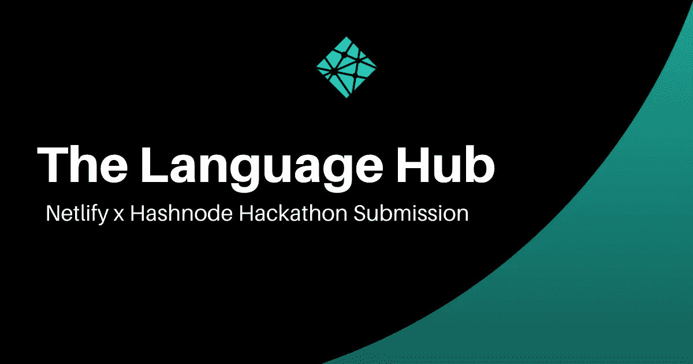

# 语言中枢——Netlify x hash node 黑客马拉松

> 原文：<https://blog.devgenius.io/the-language-hub-netlify-x-hashnode-hackathon-58702eb387c0?source=collection_archive---------11----------------------->



> 语言中心是满足您语言学习需求的中心。让您快速、轻松地找到您需要的东西

我从未参加过黑客马拉松。不是因为我不想，更多的是因为当我找到他们时，他们关注的是超出我当时技能范围的事情…

# 介绍

当我阅读一些文章时，我看到 Hashnode 正在举办另一个黑客马拉松。我通读了要求，唯一重要的是它是开源的。

所以，我正在做一件贴近我内心的事情——某种意义上的语言中心。语言参考书

## 参观语言中心

看看 t [他的代号](https://github.com/Psypher1/the-language-hub)

# 这个想法

我学习和教授语言已经有一段时间了。我经常遇到这样的情况，在这种情况下，需要花费大量的时间来寻找我试图理解或解释的概念的信息——重要的部分。
我的学生也来找我，要求我解释一些事情。为了给他们正确的答案，我必须搜索相当多的信息。

## 我的想法

一个中心位置——真理的来源——那里有你需要知道的语言的重要部分。无论是法语，西班牙语，俄语，普通话…

一个能让你快速轻松地掌握一门语言的重要部分的地方。

> 本质上，我想有一个顶部酒吧，你可以选择你的学习路径。这将带你到你选择的路径的页面。
> 该页面将有一个主要内容区和侧栏，列出所有相关的项目。单击侧边栏中的一个项目会将该内容加载到主区域中。

这是一项伟大的事业，需要全世界人民的参与才能实现

# 语言中枢是如何工作的？

到达网站后，有语言按钮。


选择一张卡，您将进入所选语言的详细页面。在那里你可以了解你选择的语言

详细页面分为两个主要部分:
1。主要内容区，包含关于所选语言主题的信息
2。侧边栏链接到更多关于所选语言的主题。


导航中还有一个下拉菜单，便于切换语言路径。


> 多亏了顺风，这个网站有了反应

# 该过程

以下是我如何将这个项目付诸实施的

## 技术堆栈

我选择了 Nextjs，用 TailwindCSS 风格的 Markdown。

*   [**Next.js**](https://nextjs.org) :如果一切都是静态生成的，效果最好
*   这是最简单的造型方式，一点也不夸张
*   **Markdown** :这是一种易于编写的格式，在处理拉取请求时不会给我带来太多麻烦
*   [**next-mdx-remote**](https://github.com/hashicorp/next-mdx-remote) :渲染 markdown 文件。
*   [**查克拉 Ui**](https://chakra-ui.com/) :我加查克拉 Ui 是因为我实在不想花时间和一个下拉战斗
*   [](https://netlify.com)**:部署 app**

## **规划**

**我建立了 Github 库，并确保它是公开的。**

**网站设计 Figma 设计所以我对所有的东西都有一个概念。**

****

**主页概念**

****

**详细页面概念**

****文件和文件夹结构** :
因为我想拥有多种语言，所以降价文件必须放在各自的文件夹中**

```
├── allLanguages
│ ├── languageOne
│ │ ├── file1.md
│ │ ├── file2.md
│ ├── languageTwo
│ │ ├── file!.md
```

**投稿指南给想投稿的人一些简单的指南。**

# **这栋建筑**

**有了我正在做的事情的轮廓，我继续创作。**

## **设置项目**

**我启动了一个新的 Nextjs 项目，并立即做了一些事情。文件夹结构:
—语言文件
—功能组件
—布局组件
2。SEO 与 next-seo
3。通过使用“jscofig.json”文件避免相对路径**

## **我必须弄清楚的事情**

****渲染嵌套目录中的文件**
首先要解决的主要问题是如何动态渲染嵌套目录中的文件，使用目录名和文件名作为 slug。**

**从本质上来说，**语言中心* *是一个降价博客。然而，要获得每个语言文件夹中每个文件的路径需要不同的方法。**

**乔恩·佩普尼克 在解决这个问题上很有帮助。**

**除了访问 **learn** 文件夹，我必须为 **learn** 中的每个文件夹运行一个`forEach`循环，并为这些文件夹中的每个文件运行另一个循环。然后我提取了没有扩展名的文件名，这些就成了 slugs。
除此之外，我还取了文件所在的文件夹名来形成完整的路径。**

**这些步骤是:
-访问 **learn** 目录
-对 **learn** 目录
中的每个文件夹(learnPath)运行一个`forEach`循环-对 learn path 中的每个文件运行一个`forEach`
-从文件名中提取 slug
-将 slug 和`learnPath`作为`params`返回**

```
export async function getStaticPaths() {// get the directory for all language info
  const learnDir = path.join("learn");// read the learn directory
  const languagePathsDirs = await fs.readdirSync(learnDir);// create empty array where all the paths will be added to
  const allPaths = [];// run a loop to get each folder in the learn directory
  languagePathsDirs.forEach((langPath) => {
    const langPathDir = path.join(learnDir, langPath);// read the  folders
    const files = fs.readdirSync(langPathDir);// run another loop to get the files in each of
    files.forEach((filename) => {
      const path = {
        params: {
          // extract the langPath
          langPath: langPath,
           // extract the file name to be used as part of the slug
          slug: filename.replace(".md", ""),
        },
      };
      // push the path to the empty array
      allPaths.push(path);
    });
  });return {
    // return the paths as params
    paths: allPaths,
    fallback: false,
  };
}
```

> **当上面的代码工作时，已经处理了许多繁重的工作**

**然后，它现在只是将“参数”传递给“getStaticProps ”,然后传递给页面组件**

****在侧边栏中呈现语言路径中的文件列表**
接下来，我必须弄清楚如何在侧边栏中呈现给定语言的文件名，并能够链接到它们。本质上，我需要各个文件夹中每个文件的名称，这些名称将成为侧边栏菜单项。**

****解决方案**
这是事情变得真正有趣的时候。我得出的解决方案分为两部分。
首先，用语言路径(文件夹)作为字符串数组(文件)的文件。然后，一个查找文件将获取这些数组，并根据匹配的路径呈现数组。**

**语言菜单文件如下所示:**

****

**查找文件:**

****

**然后，我在详细页面中调用 lookup，并将其结果传递给侧栏组件。**

**导航中的**下拉菜单**
我的下一个任务是在导航栏中设置一个下拉菜单，列出当前可用的所有语言。**

**解决方案这是比较简单的任务。为了做到这一点，我有一个包含所有可用语言及其国旗的文件。我绘制了它们，并在 Chakra UI 的菜单中显示出来。**

**这里是[源代码]([https://github.com/Psypher1/the-language-hub](https://github.com/Psypher1/the-language-hub))，我们有一些问题是公开的**

## **设计网站**

**当我完成所有的工作后，我对结果非常满意，所以我开始关注网站的外观。**

**我还确保有一个自定义的 404 页面，可以提示访问者请求语言或对网站做出贡献。**

## **部署语言中心**

**由于这是一个 Netlify 黑客马拉松，其中一个要求是你制作的应用程序必须部署在 Netlify 上。**

> **Netlfy 使部署您的项目变得轻而易举。上传你的静态文件或者链接一个 github 库**

**我登录了我的 Netlify 账户，选择了“the-language-hub”回购，然后等待 Netlify 完成剩下的工作**

**我在部署时遇到了一些错误，都是我造成的。**

**错误 1 :
Netlify 或 Eslint 不喜欢我的“404.js”页面上的撇号。我花了一点时间才弄清楚到底是什么问题。当我这样做时，我重试了部署。**

**然后第二个错误出现了…**

****错误 2** :
部署的站点在部署日志中没有显示任何问题。但是当你访问这些页面时，你得到了一个服务器错误。**

**出了什么事？
我用了这么多 Next.js，习惯把`revalidate`加到我的`getStaticProps`里。事情是这样的，只有当你的`getStaticPaths`中的`fallback`被设置为除了假以外的任何值时，这才有效。
这就是我所做的——为导致服务器错误的 false 回退设置一个重新验证**

**我纠正了这个问题，然后这个应用程序开始像我预期的那样工作**

# ****我现在在做什么？****

**目前我正在添加更多的语言数据，所以网站看起来并不空。**

**想加一个你自己的吗？想给点建议吗？请在评论中或在 [Twitter](https://twitter.com/Psypher1) 上联系我**

# **结果呢**

**总的来说，我对我能够学习和完成的事情感到高兴。**

**查看 [**语言中枢**](https://thelanguagehub.netlify.app/)**

**说到底，这是**你的项目**。我可能已经想到了，但是我已经考虑到了其他人。我将非常感谢您的任何反馈和建议。**

**我也在寻找那些想帮助改进现有语言和添加另一种语言的人。**

# **结论**

**我的第一次黑客马拉松经历很有趣。我喜欢有一个固定的时间框架来思考一个想法，为之努力，并将其实现为有形的东西。**

**我非常愿意再次参加另一个黑客马拉松。**

## **感谢您的阅读，我们来连线吧！**

**谢谢你来参观我的这个小角落。让我们在 [Twitter)](https://twitter.com/Psypher1) 、 [Polywork](https://www.polywork.com/psypher1) 和 [LinkedIn](https://www.linkedin.com/in/jamesmidzi/) 上连线**