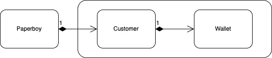

# 德米特里定律——减少不当耦合的基本原理

> 原文：<https://blog.devgenius.io/the-law-of-demeter-a-basic-principle-to-reduce-improper-cohesion-9cdcd73fc3be?source=collection_archive---------14----------------------->

# 松散耦合是好的

这几天我在读 [OOAD](https://www.amazon.com/Object-Oriented-Analysis-Design-Applications-3rd/dp/020189551X) 的时候，一个专业名词从书里蹦了出来——**得墨忒耳定律**，勾起了我调查它用法的兴趣。据说该原理可以帮助减少可能导致模块的私有实体被暴露的不适当的耦合。因此，我调查了一下[的联想论文](https://www2.ccs.neu.edu/research/demeter/demeter-method/LawOfDemeter/paper-boy/demeter.pdf)，想知道它到底在说些什么。

> **德米特定律**表明**一个对象的方法只能调用下面几种对象的方法**
> 
> 1.物体本身
> 
> 2.该方法的参数
> 
> 3.它创建的对象/实例
> 
> 4.它包含的直接组件(字段或属性)

# 案例研究——一个报童、一个顾客和一个钱包

上一节的定义似乎有点抽象。所以我决定将[论文](https://www2.ccs.neu.edu/research/demeter/demeter-method/LawOfDemeter/paper-boy/demeter.pdf)中的案例翻译成一个 Rust 的例子。我们能够感受到**得墨忒耳**法则的力量。

试着想象一个场景:一个报童骑着自行车沿街挨家挨户卖报纸。他在一所房子前停下来，按响了门铃，要求顾客支付这笔交易的费用。顾客掏出钱包，把钱付给了报童。

该场景指出共有 3 个对象相互作用:一个**报童**、一个**顾客**和一个**钱包**。为了更好地描述它们之间的相互作用，我试着画出它们之间的关系图如下:

正如你所看到的，一个报童正在和一个有钱包的顾客互动。并且顾客正试图通过拿出他的钱包来支付报纸。我们可以先写一些代码来描述它们之间的交互。例如，我们将 wallet 类原型化如下，加上基本的 ***加上*** 和 ***减去*** 来调整其余额。

此外，还有一个 customer 类，它包含一个 wallet 实例，以便客户能够通过调用其 wallet 上的查询函数来获得他的余额。理论上，任何客户都可以访问自己的钱包，但是除了客户之外，其他人是看不见的。

让我们看看报童是如何要求顾客付款的。当一个报童开始为一个顾客服务时，他应该与他的顾客合作，这样他就可以拿到顾客归还的钱包，就像函数 ***需求*** *所做的那样。*

然而，这就是问题所在。除了顾客之外，钱包还可以被外部实例 paperboy 访问。也就是说，报童能够看到顾客拥有的详细资料。所以在 ***需求*** 函数中这样一个链式语句就产生了一个不恰当的耦合。

> person.get_wallet()。减去(价格)；

事实上，当我们试图快速实现某个特性时，类似的模式经常发生，因此不可避免地会产生一些设计缺陷，如 **a.b.c.d()** ，以获得快速反馈。

# 不要和陌生人说话。与直接的朋友交谈。

**德米特里定律**旨在尽可能地消除不必要的耦合，这样开发者就不必处理由不恰当的设计产生的以下副作用。虽然这个原则的定义对大多数人来说似乎很抽象，但我们可以用小时候经常听到的来缩写它。

不要和陌生人说话。与直接的朋友交谈。

这听起来像是我们的父母要求我们不要为房子外面的陌生人开门，以免我们被带走。当我们处理多个实例之间的交互时，它做同样的事情。那么，为了正确的信息隐藏，我们如何重构我们的源来遵守这个原则呢？从上面的定义，我们可以认识到报童违反了**访问最直接的组件**，它可以获得顾客钱包的详细信息。这就是我们需要解决的问题。

首先，我们需要对除客户之外的其他组件隐藏 wallet 实例。因此，我们改进了客户尝试支付的方式。正如您所看到的，我对钱包的查询函数进行了注释，以便只有客户可以访问他的钱包。

另外，还有一个新的签名:**支付**，负责检查余额是否充足，并根据结果采取行动。重构将 wallet 实例隐藏在客户内部，此后任何其他实例都无法访问它。

最后，让我们回头看看报童会发生什么。由于 customer 类已经被细化为对其他人隐藏私有实例，报童只能与客户交互；对它的细节一无所知，这成功地让一个报童只和最亲近的朋友说话，而不是陌生人。

> let RES:bool = person . payment(price)；

# **何时采用得墨忒耳定律**

我们刚刚解决了一个问题。下一个问题是:当我们已经嗅到程序中隐藏的 bug 时，我们应该何时采用德米特定律？[的论文](https://www2.ccs.neu.edu/research/demeter/demeter-method/LawOfDemeter/paper-boy/demeter.pdf)指出了我们可以考虑的 3 个方面:

*   **连锁报表**

我们应该重构的最明显的地方是当我们遇到像 **a.b()这样的链式语句时。c()。d()…foo()** ，它隐含地表明当我们滥用表单的便利时，多个实例被耦合/显示。

因此，我们应该保证每个实例只能访问它的直接朋友，而不能访问其他人。

*   **大量临时对象**

事实上，许多一起工作的临时对象可以被看作是另一种形式的链式语句。让我们以上面的链式形式为例。我们可以将链式语句重写如下:

*设 TM P1 = a . b()；
设 tmp 2 = tmp 1 . c()；
设 tmp 3 = tmp 2 . d()；
…
let result = tmpn . foo()；*

这也声明了多个实例被临时对象不正确地耦合，所以这里使用的原则是分离组件。

*   **导入许多类**

我们不可避免地要将外部库导入到源代码中，这样我们就可以在它们的功能的帮助下工作。然而，这也意味着我们与他们结合在一起。当它们改变时，我们会受到影响。所以我们应该做的是尽可能避免不必要的依赖。

# 蔻驰杂音

当我们追求速度、快速反馈和快速交付时，有时我们会产生错误。然而，当多个实例耦合在一起时，我们将冒架构稳定性的风险。是时候采用德米特定律来消除强耦合元件的副作用了。

老实说，当我们谨记只和最亲近的朋友而不是陌生人交谈时，这个原则很容易遵循。如果我们把它作为编程的习惯，它会隐含地带来很多可维护性。

如果你想看一下得墨忒耳律法的全部样本，请查阅[资料库](https://github.com/tsunghsiang/The-Law-of-Demeter)。谢谢您们。

—

如果你认可我与你分享的价值，请做如下:
1。**鼓掌**文章
2。**订阅**我最新内容
3。**在其他平台关注**我了解更多信息
-IG:[@ ur _ Agile _ coach](https://www.instagram.com/ur_agile_coach/)
-播客(中文):[敏捷火箭](https://player.soundon.fm/p/7f7dc3df-d738-405c-8cf9-02157a92ec61)
- Youtube: [你的敏捷蔻驰](https://www.youtube.com/channel/UCzD0wQmD1n4MuTKk-JocACA)
- LinkedIn: [吴宗祥](https://www.linkedin.com/in/tsung-hsiang-wu-8542409b/)

如果您需要咨询或其他形式的合作，请发送邮件至:【urscrummaster@gmail.com】