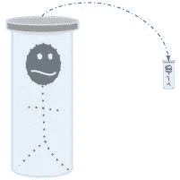
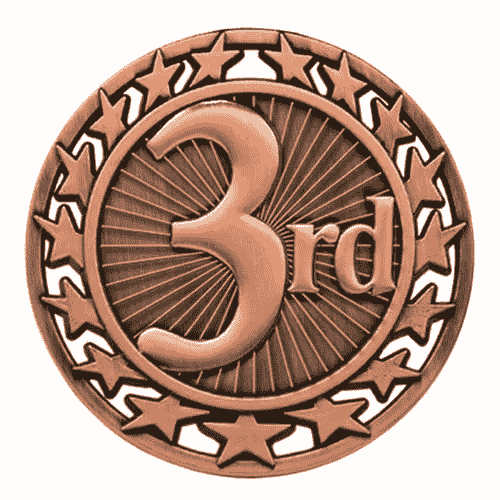

# 第三最佳法则

> 原文：<https://blog.devgenius.io/the-law-of-the-third-best-29fb52eea2c2?source=collection_archive---------13----------------------->

我的一位长期导师，除了他在软件方面的广博知识外，还分享了我在作为一名工程师的日常活动中不断想起的智慧花絮。我称之为第三最佳法则。这句引语的确切陈述似乎已经丢失，所以我将对其进行解释。

> *“第一个最佳方案无法建成，是因为我们目前的技术还不够先进。第二个最好的解决方案无法建立，因为我们没有足够的时间和资金。因此，我们能争取的最好结果是第三个最好的解决方案。”*

# 第一好

> *“第一个最佳方案无法建成，是因为我们目前的技术还不够先进。”*

这是什么意思，怎么会这样？这可以通过一个简单的例子得到最好的证明。我想尽快从洛杉矶去纽约。我该怎么做？嗯，我跳进我的可靠的斯科特牌传送机，输入我的目的地地址，说出口令“把我传送上去，斯科特”，噗的三秒钟后，我出现在纽约。快速、廉价、环保，致癌风险极低。

哦，你还没有购买你的斯科特牌传送器。不幸的是，我也没有。事实上，这已经是我能想到的最好的解决方案了。相反，我会花一大笔钱买一张票，天刚亮就起床，排队等一个小时，这样我就可以被耽误了。最后，我将登上一艘船，在接下来的八个小时里，我将被困在与其他六个人靠得太近的座位上。这次旅行将消耗 20，000 磅化石燃料，如果在高海拔旅行的额外辐射不能释放一些自由基，那么微波午餐中的防腐剂几乎肯定会。

# 第二好的

> *“第二好的解决方案无法建立，因为我们没有足够的时间和资金。”*

不幸的是，我们还不知道如何传送物质。也许在几十年内，我们会弄清楚量子纠缠的事情，它可以成为现实。相反，我会乘坐超级高铁穿越全国。我将开车十五或二十分钟到最近的车站。最多等三十分钟，下一班超级渡轮就会到达。和其他五辆或十辆车一起开到站台上，然后以每小时数百英里的速度被扔进隧道。我会在舒适的汽车里放松，听播客，在真空中悬浮在磁铁上的无摩擦旅行的和平与宁静中上网。几个小时后，我将精神焕发地到达目的地，准备参加商务会议。

哇哦！超回路也不存在？当然，我们对磁力和流体动力学的了解足以建造这样一个东西？是的，我们可能会做，我们不知道的可以通过一些原型来学习。问题是这将花费 25 年时间和数千亿美元来建造。谁会资助这样一个项目？谁会在这种激进的交通工具上冒可能死亡的风险呢？挖隧道会毁掉濒临灭绝的蜗牛的唯一习惯，它们会怎么样呢？这些问题和顾虑阻碍了次佳解决方案的建立。这是社会、经济、政治的影响。没有技术上的原因不能做到这一点，但有许多原因不能做到。

# 第三好的

> “我们能争取的最好结果是第三个最好的解决方案。”

以我们目前的技术和我们目前的经济和社会环境，从洛杉矶到纽约的最佳解决方案是飞机。是的，飞行远不是穿越美国的最佳解决方案，但这是一项惊人的工程壮举，它极大地改变了我们看待世界的方式。两百年前，人们不会相信每天会有数百万人飞越大陆和海洋。最终，科学和技术变得足够好，人类能够飞行。在它变得商业上可行后不久，现在它相当安全，相当有效，相当便宜，并被认为是一种正常的活动。也许传送机的未来终究不是那么黯淡。

注意争取第三好的措辞。不要认为第三好很容易实现，因为事实并非如此。找到第三好的解决方案，而不是第四、第五或第十好的解决方案是非常困难的。即使该团队能够在大海捞针中找到这根针，实际建造它也可能是一项艰巨的任务。第三个最好的解决方案几乎总是健壮、稳定、快速和可扩展的。实现其中任何一个都是有问题的。实现所有这些需要一点智慧。

# 实践中第三好

我的例子是一个宏大的规模，但这些相同的权衡是在每天的每个项目中进行的，无论多么简单。一般的例子是这样的。

***创意工程师:*** *“好家伙，如果这个软件能根据我目前正在做的事情，计算出我想要它做的事情，那该多好啊。”*

***经验丰富的架构师:*** *“这不太现实，人工智能还没好到能搞清楚。”*

***创意工程师:*** *“那么，如果用户告诉软件他们在做什么，它就能弄明白。”*

***经验丰富的建筑师:*** *“这是一个很好的想法，但我们需要* [*五年的时间和一个研究团队*](http://xkcd.com/1425/) *来制作原型。”*

***创意工程师:*** *“你说得对，我想我们可以使用最近 10 条推文中的位置数据和一些关键词，尝试给用户一些他们可能在做什么的选项。”*

***有经验的架构师:*** *“这应该不会太难，我们可以逐步改进猜测算法。让我们试试看。”*

我相信在处理一个新问题时，至少应该考虑所有这三个层次的解决方案。对蓝天解决方案的思考给了工程师一些用户真正想要什么的视角。有了这种感觉，他们就可以逐渐调整这些疯狂的想法，直到发现一些可行的东西。这一过程让创造性的汁液流动起来，可能会发现一个盒子之外的解决方案，否则永远不会被考虑。

知道作为工程师，我们将总是被困在构建第三好的解决方案中，这似乎有点令人沮丧。如果它开始看起来那样，意识到这实际上是在解决一个优化问题。给定一组可能性和一组约束条件，包括时间和金钱，找出最符合所有约束条件的可能性。这是一个需要解决的难题，就像其他日常问题一样。拥抱它，并为实际可能的最佳解决方案而努力。