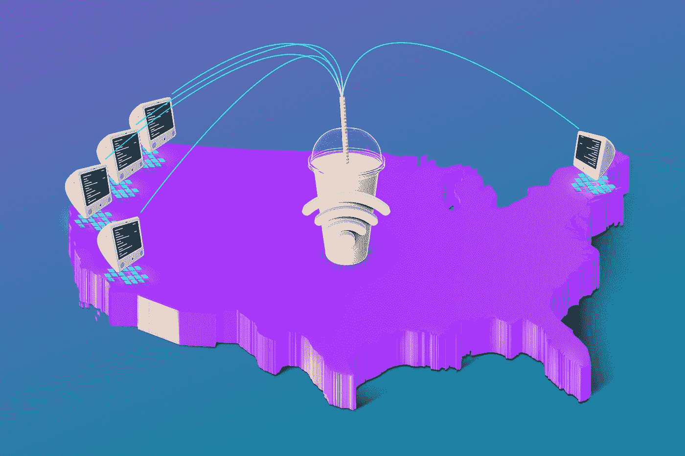

# 互联网的层次

> 原文：<https://blog.devgenius.io/the-layers-of-the-internet-5546b481d848?source=collection_archive---------3----------------------->

照片由[晨酿](https://unsplash.com/@morningbrew?utm_source=medium&utm_medium=referral)在 [Unsplash](https://unsplash.com?utm_source=medium&utm_medium=referral) 拍摄

在这篇文章中，我将讨论一些大多数人通常不会想到的事情:互联网是如何工作的。我们可以打开浏览器，在几毫秒内访问更多的内容，但你有没有停下来想过这些内容是如何被传送到你的电脑上的？这看起来几乎是不可思议的，但是有一个巨大的、复杂的、几乎看不见的基础设施存在，使得我们所知道的互联网成为可能。

最基本的，互联网只是一个巨大的网络的网络。您家中的本地网络可能由几台计算机或其他设备组成，但您的路由器将您的本地网络与整个互联网连接起来。当您将您的设备连接到该网络时，您可以访问大约 7500 万台托管网站的服务器，并能够通过电子邮件或其他服务向大约 50 亿台连接到互联网的设备发送消息。当您在浏览器中键入 URL 时，您的浏览器会识别托管您尝试访问的页面的服务器，向该服务器请求该页面，并以您可以理解的格式显示该页面。这是理解互联网的一个很好的起点，但它没有解释数据实际上是如何传输的细节。这就是我希望在这篇文章的剩余部分解释的。

协议使互联网上的交流成为可能。在 internet 环境中，协议是一组管理数据交换的规则。如果每台设备都有自己的一套规则，就不可能进行通信，因此开发了协议，以便每台设备都知道如何与其他设备通信。为了有助于我的解释，我将使用互联网的 TCP/IP 模型，它将这些协议分为四层。

1.  应用
2.  运输
3.  互联网
4.  环

每一层都有自己的一套协议来决定如何通信，数据将在互联网的旅程中通过所有四层。

# 应用层

应用层关注计算机上运行的应用程序或进程之间的数据传输。这两个应用程序通常是浏览器(如何访问网页)和服务器(响应资源请求的程序)。管理这些交互的协议是 HTTP，即超文本传输协议。当按照 HTTP 规则发送消息时，有 3 个必需的组件:方法、路径和主机头。该方法描述了发生的通信的类型。最常见的方法是 GET 和 POST，前者用于检索数据，后者用于提交数据。路径告诉服务器您正在请求哪个资源，可以在 URL 中的/后面看到。主机是指资源所在的位置，例如 medium.com。一旦服务器接收到这个请求，它将用一个状态代码来响应，比如 200 OK 或 404 Not Found。如果一切顺利，它还将包含所请求的资源。

所有这些请求都以明文形式发送和接收，这使事情变得简单，但也不安全。这就是 HTTPS 或安全 HTTP 的用武之地。HTTPS 使用与上述相同的协议，但也使用 TLS 来保证安全性。TLS 代表传输层安全性，使数据能够在离开应用层后安全地通过传输层。TLS 提供的安全服务包括加密、身份验证和完整性。加密是通过称为 TLS 握手的过程提供的。这种通信发生在实际数据交换之前，使客户机(您的浏览器)和服务器能够共享一个密钥来加密和解密数据。在 TLS 握手过程中，服务器还会向客户端发送一个证书来验证服务器的身份。最后，为了确保数据在传输过程中不会丢失，消息中包含一个消息认证码。此代码是使用哈希算法从发送的数据中创建的，客户端使用相同的哈希算法从接收的数据中重新创建此代码。只要两个代码匹配，就不会有数据丢失或被篡改。

# 传输层

离开应用层后，数据转移到传输层。传输层关心的是一旦数据到达主机，如何将数据传送到正确的应用程序。这是通过使用网络端口实现的，网络端口是主机上运行的特定进程的标识符。TCP 是这一层最常见的协议，它首先与服务器建立连接。这是通过所谓的 TCP 握手来建立的，在 TCP 握手中，客户端试图用一条简短的消息(SYN)到达服务器，服务器确认该消息(SYN-ACK)，客户端确认服务器的消息(ACK)。一旦建立了连接，源端口号和目的端口号就被附加到来自应用层的原始消息中，然后消息就被发送出去。这个过程称为封装，因为原始的 HTTP 请求被封装在 TCP 数据段中。这意味着 TCP 不需要知道 HTTP 是如何工作的，它只是将消息发送到它需要去的地方。你可以把它想象成把信息放在信封里，把地址写在外面。TCP 还提供了其他一些使其更加可靠的功能，例如，如果必须将消息分成多个部分，则按顺序传递消息，确保通过消息确认接收到所有部分，如果没有收到确认，则重新传输消息。

# 互联网层

既然我们知道了数据到达目的主机后如何到达正确的应用程序，那么它首先是如何到达目的主机的呢？答案是通过 IP，IP 代表互联网协议。这是在互联网层使用的主要协议，也是在网络之间传输数据的协议。现在，来自传输层的消息被进一步封装，并添加了源和目的 IP 地址。IP 地址是分配给网络中每台设备的唯一地址。请注意，如果您连接到不同的网络，您的设备将有不同的 IP 地址，因此它不是特定于您的设备的。每台路由器都有一个它可以连接的 IP 地址列表，并将信息转发到它需要去的地方。为了获得目的 IP 地址，必须执行 DNS 查找。DNS 代表域名系统，DNS 服务器有一个将每个网页与 IP 地址相关联的表。一旦获得了目的 IP 地址，数据包就可以在互联网上发送了。

# 链接层

这是最低层，最接近物理层，由电信号、光信号或跨越物理距离的无线电波组成。链路层关注的是如何识别网络上的设备，并在它们之间传输数据。为了识别设备，需要使用 MAC 地址。MAC 代表媒体访问控制，是在制造设备时分配给设备的唯一代码。不像 IP 地址，无论你去哪里，它都会跟随着你的设备。来自互联网层的整个消息被最后一次封装，并附有源和目的 MAC 地址。您可能想知道您的计算机是如何获得世界另一端的设备的 MAC 地址的。答案是，不会。相反，它获得它要到达的下一个设备的 MAC 地址。一旦到达目的地，它将删除源和目的地 MAC 地址，并将它们更新为新地址。随着数据在传输过程中通过不同的设备，这一过程将重复多次。

一旦消息到达其最终目的地，它将反向通过所有层，直到服务器从您的浏览器接收到原始 HTTP 请求。尽管还涉及更多的细节，但这只是对数据如何在互联网上传输的一个基本概述。我希望这能让你更好地理解每次访问网页时发生的事情。下次你在看一个有趣的猫咪视频时，花一分钟时间停下来，惊叹发生在屏幕上的一切。