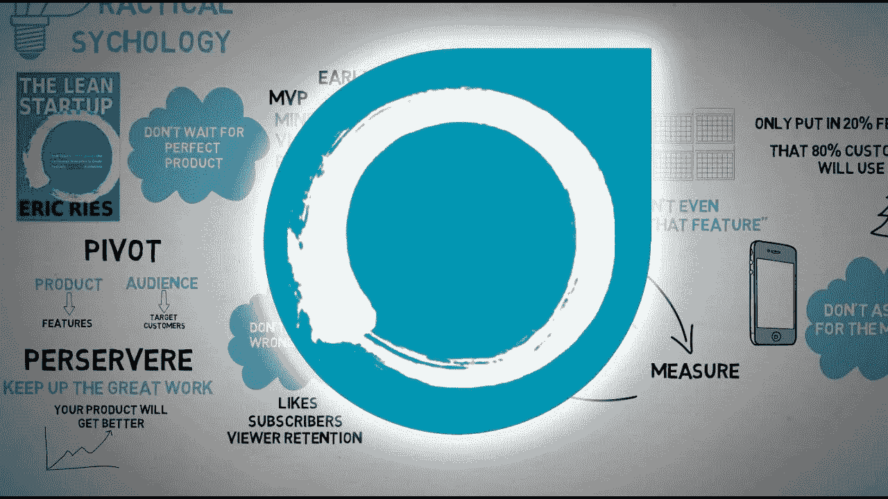

# 精益创业——工程师的收获

> 原文：<https://blog.devgenius.io/the-lean-startup-takeaways-from-an-engineer-85f4d2258b43?source=collection_archive---------5----------------------->

## 产品管理/精益启动

## 从技术人员的角度看 Eric Ries 的《精益创业》中的关键观点

《实用心理学》图片([精益创业—埃里克·里斯—动画书评](https://www.youtube.com/watch?v=9bPgNEDdX3E))

我从我工作的小组开始了解精益创业运动，努力持续学习。

我是一个贸易开发的软件，我买了 Eric Ries 的书来开发一个工具集，探索我对产品管理的热情。我一头扎进这本书，爱上了它，因此我决定写下我的一些想法。

本文无意成为一篇关于方法论的综合文章(许多其他文章对此进行了阐述！).它强调了**我发现很吸引人的一些观点**(或*玩笑* ) **以及关于**技术同事如何从阅读这本书中受益的一些最终想法。****

# 难题

我读完了这本书，上面有很多书签，但我想挑几个作为更广泛内容的引子。我说过了，没有综合作文！

*   **构建—测量—学习**(当然！):把**创新当成科学实验**。从一个假设开始，一个设想，任何你认为可以导向一个相关的和可测量的目标的东西。建立最低限度来测试假设。看看数据，从中学习。重复一遍。
*   **经验证的学习:**我喜欢用经验证的学习来交换物理(/软件)可交付成果的想法，以数据和可操作的见解为后盾。这个游戏不是为了创造东西，而是为了创造价值。
*   创新会计:这也是一个伟大的概念。我已经不喜欢像速度这样的虚荣心指标，因为它们没有提供实际的洞察力。相反，创新会计**有助于看到全局，以及正在创造的价值**。然而，我没有从书中获得足够的实用工具，我建议阅读[这篇文章](https://www.scrum.org/resources/evidence-based-management-guide)(尤其是附录)以获得一些具体的度量标准。
*   创新沙盒(Innovation Sandbox):在这本书的结尾，它出色地结束了这个故事，给出了在大公司中使用精益创业方法的实用方法。简而言之，创造 ***安全地带*供团队试验和学习**，就像他们是初创公司一样。
*   **价值与成长假设**:一个新命题必须证明的两大类假设。产品能传递价值吗？产品将如何被越来越多的客户发现？

# 为什么要读？

> 我们制造产品的目标是能够进行实验，帮助我们学习如何建立一个可持续发展的企业。
> 精益创业公司 Eric Ries

让我迷上这本书的一个原因是，我可以挑选作者的每个想法和例子，并将其映射到工作经历中。例如，某个时刻，我们做了某个选择，实现了某个特性，或者我把一个故事放入了待办事项中。

当我合上书的最后一页时，我觉得我对自己的工作有了一个更批判性的看法，也有了一套工具来定义我未来的工作方式。而不是看特性和功能，看价值和如何快速实现。

它没有让我成为一个更好的程序员，但它让我成为一个更好的思考者。