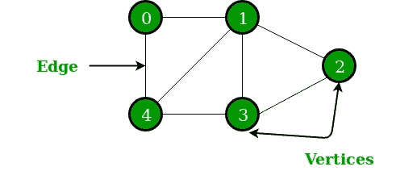
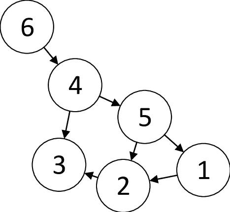
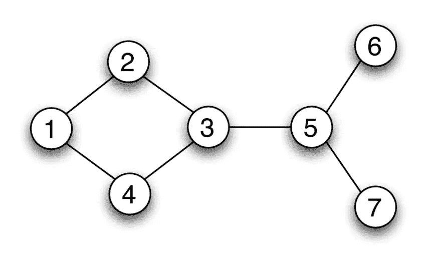
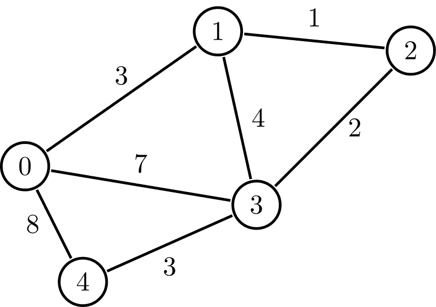

# 图表的魔力

> 原文：<https://blog.devgenius.io/the-magic-of-graphs-acaebea155ca?source=collection_archive---------7----------------------->

geeksforgeeks.org

我相信图可能是最复杂的数据结构之一。人们可以说，它甚至看起来令人困惑(查看顶部的图片！)，还有所有这些乱七八糟的元素也就是节点和线条。讽刺的是，这是现实世界中最常用的数据结构之一。

在哪里可以遇到这些神秘的图形？嗯，几乎到处都是。这里有一些你肯定遇到过的生动例子。

*   **社交网络**(脸书、Linkedin 等。)—每次你看到好友推荐(从技术上来说，这意味着你和这个人有很多好友，所以系统会建议你也把这个人加入你的好友名单)
*   **地图上的位置/路线**(谷歌地图、苹果地图等)。)—方向是两个或多个节点之间的路径，您希望在这些节点之间导航
*   **流媒体服务**(网飞，HBO)——每次你得到一个新的电影推荐(和你平时看的一样的类型(=节点))

听起来很令人兴奋，但是等等:什么是真正的图形？

维基百科说，图是一种数据结构，由有限(可能可变)的一组**顶点**(也称为**节点**或**点**)以及无向图中这些顶点的一组无序对或有向图中的一组有序对组成。

嗯，这说不通。简单地说，图是节点(=元素)和这些节点之间的连接(=线)的集合。它没有起点/头。然而，有一个术语是很有用的。

**顶点** —一个节点。

**边** —节点之间的连接。

**有向图** —一个有向边的图。这是一种单向连接，通常用指示确切方向(或极性)的箭头来表示。Instagram 就是一个很好的有向图的例子，默认情况下，关注是不相互的。

researchgate.net

**无向图** —没有指向边的图。它表示双向连接。无向图的一个强有力的例子是脸书的相互友谊。

researchgate.net

**未加权图**——一个没有给边赋值的图。上面所有的图都没有加权。

**加权图**——一个给边赋值的图。加权图最常见的例子可能是谷歌地图——在这里，一个值是两个地方之间的距离。了解距离有助于选择到达目的地的最佳和最短路径。这是一个加权图的样子。

hyperskill.org

总结一下这个简短的图形介绍，这里有一个有趣的事实:树数据结构也是一种图形！

**来源:**

1.  [维基百科](https://en.wikipedia.org/wiki/Graph_(abstract_data_type))
2.  [JavaScript 算法和数据结构大师班](https://www.udemy.com/course/js-algorithms-and-data-structures-masterclass)
3.  [图形数据结构和算法](https://www.geeksforgeeks.org/graph-data-structure-and-algorithms/)