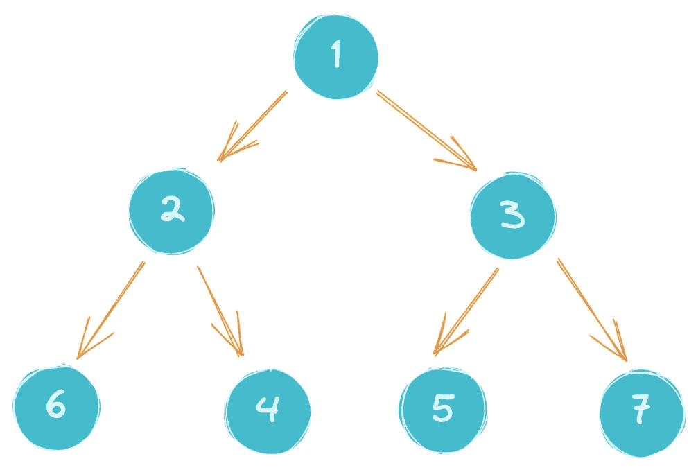

# 用 Golang 实现二叉树的主要思想

> 原文：<https://blog.devgenius.io/the-main-idea-of-implementing-a-binary-tree-with-golang-556fac53ced4?source=collection_archive---------4----------------------->

手动实现二叉树

在 [Unsplash](https://unsplash.com?utm_source=medium&utm_medium=referral) 上由 [Kam Idris](https://unsplash.com/@ka_idris?utm_source=medium&utm_medium=referral) 拍摄的照片

一般的算法操作，无非就是写、查、删三个主要操作。此外，可能还有一些操作，例如获取关于相应数据结构的信息。比如二叉树可能需要获得树的度，栈和队列需要获得长度。

根据这个想法，我们需要理解这些对于二叉树的操作:

1.  二叉树结构的定义
2.  二叉树的创建
3.  向二叉树中添加数据
4.  计算二叉树中节点的数量
5.  计算二叉树的深度
6.  二叉树遍历:四种遍历方法

*   前序遍历:先访问根节点，再访问左子树，最后访问右子树；这种情况反复出现直到结束。
*   后序遍历:先访问左侧子树，再访问右侧子树，最后访问根节点；这种情况反复出现直到结束。
*   有序遍历:先访问左边的子树，再访问根节点，最后访问右边的子树；这种情况反复出现直到结束。
*   分层遍历:每一层从左到右访问每个节点。

**二叉树的结构。**

设计二叉树的结构。利用单向链表的特点和二叉树的相似性来设计。

*   该树是一种递归形式，在每个节点之间进行链接和存储
*   二叉树只有左右两个子树

**二叉树的创建。**

主要思想是利用单向链表的特点创建一棵二叉树(其实这里不能叫单向链表，因为应该是单向链表；一个根节点指向两个子节点)，所以二叉树的节点就是链表的节点。

**向二叉树添加数据。**

主要思想是只从一个根节点开始，然后根据需要，或者在左子树方向，或者在右子树方向，然后直接链接到新节点，等等。

结果的示意图如下:

**统计一棵二叉树的节点数。**

我们用上面的例子来测试。由于二叉树是递归结构，我们可以使用递归来遍历计算。

**计算二叉树的深度。**

树的深度也是树的最大级别。

根节点是第一级，只要有一个左子树或者有一个右子树，这个级别就需要加一，一直计算到最后。

所以这可以通过递归来实现。

**遍历四种二叉树。**

前三种简单，用递归的方法，第四种方法比较麻烦。

1.  前序遍历

为了在前序中遍历二叉树，执行以下操作:

*   访根。
*   遍历根的左子树。
*   遍历根的右边子树。

对于上面的例子，结果应该输出`1 2 6 4 3 5 7`。

2.后序遍历

为了在后序遍历中遍历二叉树，执行以下操作:

*   遍历根的左子树。
*   遍历根的右边子树。
*   访根。

对于上面的例子，结果应该输出`6 4 2 5 7 3 1`。

3.有序遍历

为了在有序遍历中遍历二叉树，执行以下操作:

*   遍历最左边的子树。
*   访根。
*   遍历最右边的子树。

对于上面的例子，结果应该输出`6 2 4 1 5 3 7`。

4.等级顺序遍历。

主旨。

因为是树形结构并且想逐层输出结果，输出左节点值后，下一个需要输出本层的右节点值。

前面的三种方法都是按照模型“一棵小三节点树”的方式输出的，所以这三种方法都无法立即找到正确的下一个节点。

所以可以考虑创建一个队列缓存(先进先出特性)，遍历数据，按照输出的顺序放入队列。

所以解决方案是实现每个层从左到右访问每个节点。

首先，把树的根节点放入队列，你需要定义一个链表队列。

从队列中移除节点，首先打印节点值，如果节点有左子树节点，左子树上栈，如果节点有右子树节点，右子树上栈。

重复此操作，直到队列中没有元素。

二叉树的层次顺序遍历的完整代码。

感谢您阅读本文，如果您认为文章写得很好，请关注我。

如果发现本文有错误，欢迎留言讨论。

祝你愉快。