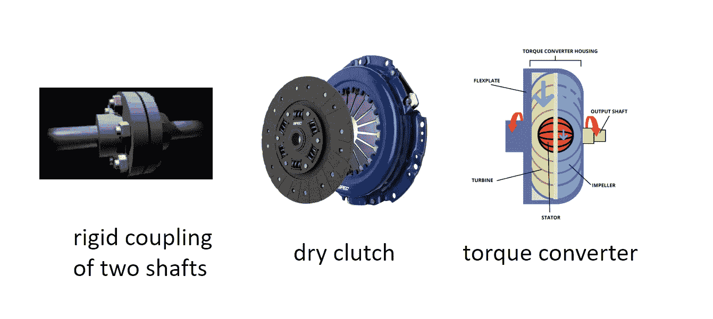
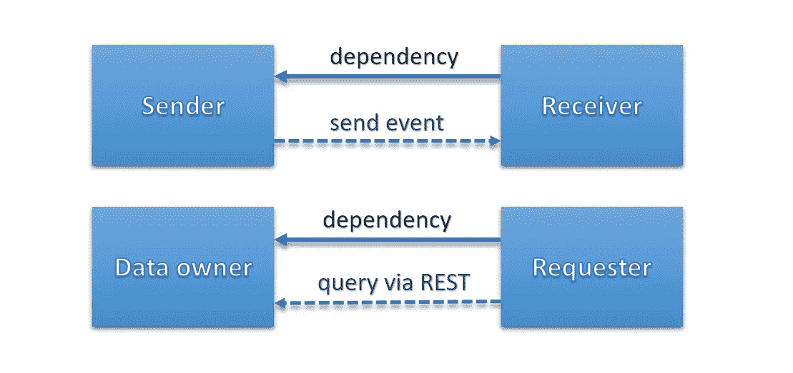
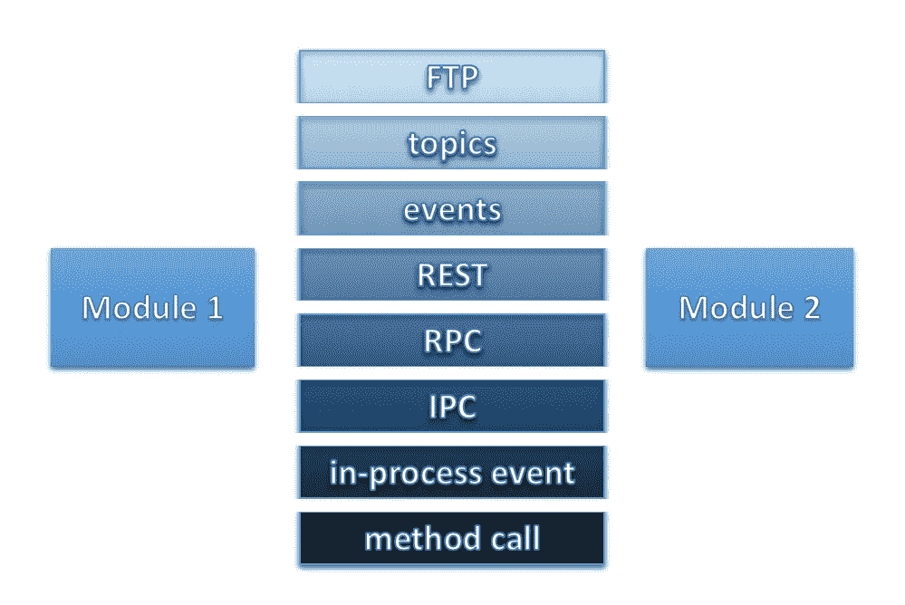

# 松散耦合的许多方面

> 原文：<https://blog.devgenius.io/the-many-faces-of-loose-coupling-7f4fc31d9b1?source=collection_archive---------5----------------------->

**编辑:**你可以在 [**这个帖子**](https://pkonyves.medium.com/loose-coupling-cheat-sheet-391f70006390) 里找到小抄

在物理世界中使用联轴器是连接两根轴来传递扭矩。联轴器可以是刚性的，也可以是柔性的。齿轮可以用来把扭矩换成速度。手动变速器车辆中的离合器允许主轴和变速箱之间的滑动，以使力逐渐增大而不停止发动机，并在换档过程中同步齿轮。自动变速汽车上的变矩器可以让你在红灯时停下来，同时有效地保持档位。

软件世界中的刚性联轴器、离合器或变矩器的例子有哪些？刚性耦合可能是一个进程内方法调用，而变矩器可能是*涡轮*服务发出事件和*叶轮*服务接收。如果叶轮服务没有运行，事件就会丢失。

松散耦合是设计软件系统时最需要的范例之一。就像一句口头禅“让它松散耦合”。

> 耦合是软件组件之间的*依赖*，耦合的质量描述了改变一个组件如何影响依赖的组件。

一个组件(即类、模块、库、服务)不能松散耦合。耦合总是至少两个组件之间的关系。

耦合与其他范例如*单一责任*、*内聚*、*封装*携手并进。你越能更好地定义组件的域模型和职责，你就越能减少耦合。

思考:考虑下面的列表，我从最弱耦合到最强耦合(从上到下)排列连接类型，你同意吗？是什么使得*主题(又称为发布-订阅)*比 *RPC(远程过程调用)*更松耦合？

# 定义

> 在系统设计中，松耦合系统是这样一个系统，其中的每个组件都拥有或利用了其他独立组件的**定义**的**很少**或**没有**知识
> 
> 耦合是软件模块之间相互依赖的程度。—维基百科

在松散耦合的系统中，组件可以用替代实现来替换。组件的*较少约束*到其他组件的**实现**。

你说的实现，是什么意思？编程语言？通信协议，例如 TCP、UDP、HTTP？数据格式，例如 Protobuf、JSON？操作系统？架构，例如 ARM、x86？地理定位(意味着消息的往返时间)？

它们都影响耦合。考虑到大多数图像不是为 ARM 构建的，最近推出的采用 M1 ARM 处理器的 Macbooks 将如何运行您最喜爱的 Docker 容器？

# **测量联轴器**

这很容易衡量，只要问问你自己

> 东西怎么破？

改变一个**依赖关系**可以基于许多不同的标准打破**依赖关系**:

*   **连接数:**使用更多的 API 端点、dto、另一个服务的事件增加了某些东西崩溃的可能性
*   **亲密度:**连接的直接性意味着两个组件对彼此的了解程度。他们需要知道服务器名称吗？网址？数据结构？一个众所周知的坏习惯是将数据库直接连接到依赖服务的底层数据库…这是一种非常亲密的关系:)
*   **突出:**如果依赖服务的依赖不可达，那么依赖服务还能工作吗？在新闻网站上不显示当前天气不是世界末日，但不显示新闻肯定是
*   **灵活性:**如果依赖关系发生变化，调整依赖服务的难易程度如何？

# **联轴器尺寸**

原来联轴器有几种尺寸，根据您的需求，其中一种对您的应用有更大的影响。

*   **时间耦合:**如果服务发送请求，是否应该等待响应？当数据产生后，消费者是需要立即消费，还是可以等待？这归结为*同步或异步通信*。通过*消息队列*交谈就像异步的涅槃。相反，进程内方法调用是最好的同步通信。时间耦合的直接影响在于服务可用性，通常还有性能。
*   **空间耦合:**分布式还是集中式，一起部署还是分开部署？它们是在同一个虚拟机中还是在不同的虚拟机中？他们在同一个地区吗？空间耦合影响往返时间和可用性。
*   **格式/协议耦合:**很多人在假设事件会使系统松散耦合时，并没有想到格式耦合。但它就在那里。客户端仍然需要知道接收到的事件是 JSON 还是 XML，并且仍然需要知道事件中的字段。如果您将系统设计成使用同构的通信形式，例如一切都是 HTTP/REST/JSON，就可以减少协议耦合。
*   **数据局部性:**软件模块因为需要信息而通信。这本身就产生了耦合。你将如何传输数据？您可以复制它，或者按需查询。更想使用事件源？这意味着系统内的数据一致性和完整性
*   **服务绑定:**依赖服务如何知道服务器地址？您需要某种服务发现:是将 URL 硬编码到您的应用程序中，还是由编排平台(Kubernetes)负责服务绑定？
*   **控制流:**在完成业务事务时，您可以选择在模块之间进行编排，或者您的架构将包含编排。编排可以为一个组件创建更强的耦合，即单点故障，而编排可以更均匀地分布微服务之间的耦合。

这是一条路，这与题目无关

# **耦合的含义**

前面已经提到了一些，但这里列出了一些强加的含义。

*   有效性
*   表演
*   对变化的容忍
*   可量测性
*   分区容差
*   数据一致性
*   部署

**作业:**拿一张纸和一支铅笔。在*左侧*列出联轴器的尺寸，在*右侧*列出其含义。在两个列表之间建立联系，并进行推理。

## **示例**

*服务绑定*确实会影响*水平*可伸缩性，因为依赖服务必须以某种方式平衡对依赖的调用。这可能是一个客户端负载均衡，一个负载均衡代理，或者一个 Kubernetes 服务。

*数据局部性*影响*性能，*因为检索本地可用数据比从另一个服务查询要快。

# 结论

如果有人说*“使用事件化使其更加松散耦合”*那么问问他们想解决什么问题？在金融交易中，异步事件(或弱时间耦合)使得解决方案在重试和协调过程的形式上更加复杂，而不是在服务之间使用同步 RPC 或 REST 调用。

人们不喜欢 RPC，因为它造成了紧密耦合，然而 RPC 并不比 REST 有更多的*协议/格式耦合*，你必须考虑两种情况下数据格式改变的影响。然而，人们更熟悉 REST，它在实现中产生的摩擦更少。

松耦合不是二元的，它甚至不是一维尺度。软件中的耦合有许多方面和含义。总是想着你努力要达到的目标，以及你会有什么样的取舍。