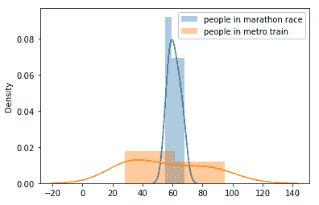
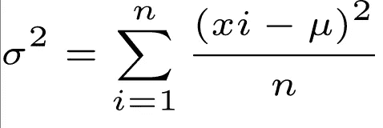
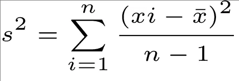
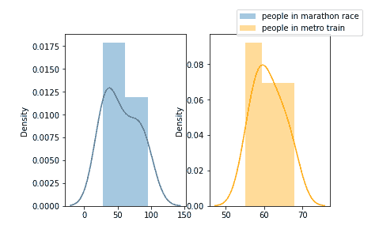
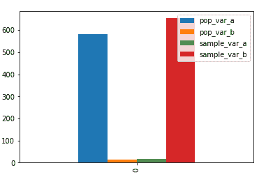
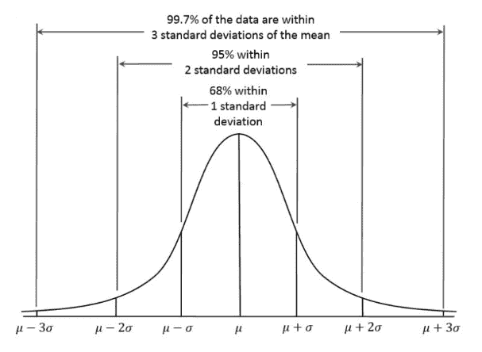
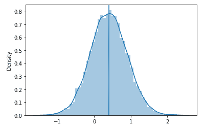
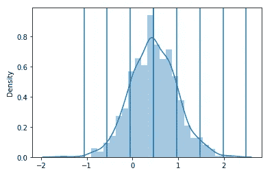

# 离差的度量

> 原文：<https://blog.devgenius.io/the-measure-of-dispersion-4c3b84708d21?source=collection_archive---------11----------------------->

你的传播令人困惑！


Erick Butler 在 [Unsplash](https://unsplash.com?utm_source=medium&utm_medium=referral) 上的照片

根据维基百科的一篇文章:

> *中的* [*统计*](https://en.wikipedia.org/wiki/Statistics) *，***(也叫* ***变异性*** *，* ***散点*** *，或* ***点差*** *)就是一个* [*【1】*](https://en.wikipedia.org/wiki/Statistical_dispersion#cite_note-1)*统计离差度量的常见例子有* [*方差*](https://en.wikipedia.org/wiki/Variance) *、* [*标准差*](https://en.wikipedia.org/wiki/Standard_deviation) *和* [*四分位距*](https://en.wikipedia.org/wiki/Interquartile_range) *。例如，当一组数据的方差很大时，数据就非常分散。另一方面，当方差较小时，集合中的数据是聚类的。分散与位置或* [*集中趋势*](https://en.wikipedia.org/wiki/Central_tendency) *形成对比，它们一起是分布最常用的性质。**

*~统计离差。(2022 年 8 月 13 日)。在维基百科上。[https://en.wikipedia.org/wiki/Statistical_dispersion](https://en.wikipedia.org/wiki/Statistical_dispersion)*

*离差只不过是数据扩散的程度。为了理解“数据分布”这个术语，我们举个例子，如果我问你，*

*   *进入地铁列车的人的体重是多少？，以及*
*   *参加马拉松比赛的人的体重是多少？*

*你对第一个问题的回答可能是(以公斤为单位):(61，60，59，55，63，68，66，64，58，57)，对第二个问题的回答可能是(以公斤为单位):(30，55，48，32，67，85，95，28，32，82)。*

*你会得到这样的直方图:*

**

*参加马拉松比赛的人与地铁列车上的人，图片由作者提供*

*我们可以清楚地看到，马拉松比赛中人的体重“分布”远不如地铁列车中人的体重分散。*

*现在你可能会问，我们有分布，我们知道它，接下来呢？这有什么用？*

*要回答这些问题，我们需要了解方差和标准差。*

# *差异*

*方差只不过是对数据集分布范围的一种度量。差异用以下公式表示:*

**

*用于计算人口方差的公式，按作者分类的图像*

*这个公式是针对总体方差的，一般来说，我们计算样本方差是:*

**

*寻找样本方差的公式，按作者排序的图像*

*你可能会有一个问题，为什么样本方差公式的分母是 n-1？要知道为什么，这里有一个 PDF 链接，可以很好地解释这一点:*

*在前面的例子中，我们使用了地铁列车上的人与马拉松比赛中的人的类比，让我们再考虑一下，*

**

*作者图片*

*让我们把“马拉松比赛中的人”称为 B，把“地铁列车中的人”称为 a。*

*对于集合 A，方差将高于集合 b。*

*集合 A 的总体方差:*

```
*import statistics as stats
setA = {30,55,48,32,67,85,95,28,32,82}
setB = {61,60,59,55,63,68,66,64,58,57}
mean_a = stats.mean(setA)
mean_b = stats.mean(setB)
print("mean of set A:",mean_a)
print("mean of set B:",mean_b)*
```

> *A 组平均值:58*
> 
> *B 组平均值:61.1*

```
*sum_a = 0
for i in setA:
sum_a += ((i-mean_a)**2)/len(setA)
print(sum_a)*
```

> *`*580.4444444444445*`*

*集合 A 的样本方差:*

```
*stats.variance(setA)*
```

> *`*653*`*

*集合 B 的总体方差:*

```
*sum_b = 0
for i in setB:
sum_b += ((i-mean_b)**2)/len(setB)
print(sum_b)*
```

> *`*15.29*`*

*集合 B 的样本方差:*

```
*stats.variance(setB)*
```

> *`*16.988888888888887*`*

**

*作者图片*

*所以，我们可以看到，集合 A 的样本方差是 653，而集合 B 的样本方差是 16.99，这也表明，地铁列车上的人的体重比马拉松比赛中的人更分布。*

# *标准偏差*

**

*标准偏差，作者图片*

*标准差是方差的根，它帮助我们区分不同的数据点，例如:*

```
*import seaborn as sns
import numpy as np
import statistics as stats
mu, sigma = 0.4, 0.5
s = np.random.normal(mu, sigma, 10000)
plt.axvline(stats.mean(s))
sns.distplot(s)*
```

**

*情节 1，作者提供的图像*

*在上面的图中，您可以看到线图遵循关于平均值的对称性，这意味着如果图形遵循纯正态分布，则中点两侧的数据点数量相同，或者我们可以说“围绕垂直线的曲线下的面积相同”。*

```
*mu, sigma = 0.5, 0.5
s = np.random.normal(mu, sigma, 1000)
plt.axvline(stats.mean(s))
for i in range(-3,5):
    plt.axvline(stats.mean(s) + stats.stdev(s)*i)
sns.distplot(s)*
```

**

*图 2，作者提供的图像*

*在上图中，你可以看到图表被分成几个部分，这就是标准差的作用，你可以问这样的问题:*

*   *有多少个数据点位于第一个标准差之下，即上图中 x 轴上 0.0 到 1.0 的区域？*
*   *分布正态吗？(我们将在接下来的博客中深入了解正态分布)*

*关于分散度的测量，还有更多话题:*

*   *[四分位距](https://en.wikipedia.org/wiki/Interquartile_range) (IQR)*
*   *[射程](https://en.wikipedia.org/wiki/Range_(statistics))*
*   *[平均绝对差](https://en.wikipedia.org/wiki/Mean_absolute_difference)(也称基尼平均绝对差)*
*   *[中位数绝对偏差](https://en.wikipedia.org/wiki/Median_absolute_deviation) (MAD)*
*   *[平均绝对偏差](https://en.wikipedia.org/wiki/Average_absolute_deviation)(或简称平均偏差)*
*   *[距离标准偏差](https://en.wikipedia.org/wiki/Distance_standard_deviation)*
*   *[变异系数](https://en.wikipedia.org/wiki/Coefficient_of_variation)*
*   *[四分位离散系数](https://en.wikipedia.org/wiki/Quartile_coefficient_of_dispersion)*
*   *[相对平均差](https://en.wikipedia.org/wiki/Relative_mean_difference)，等于基尼系数[的两倍](https://en.wikipedia.org/wiki/Gini_coefficient)*
*   *[熵](https://en.wikipedia.org/wiki/Entropy_(information_theory))*

*这些将在接下来的博客中讨论。*