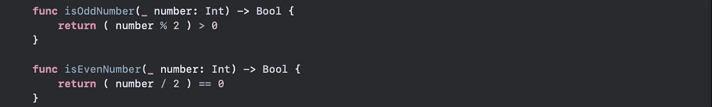

# Swift 回忆录:单元测试之谜

> 原文：<https://blog.devgenius.io/the-memoirs-of-swift-the-enigma-called-unit-testing-c800d77c8e5b?source=collection_archive---------22----------------------->


图片来自 [EEP](https://electrical-engineering-portal.com/4-test-instruments-most-frequently-used-by-electricians)

我多次听到关于单元测试这一伟大探索的神话故事。我听到开发人员说“单元测试是这样的…..而单元测试就是….”
我甚至曾经听说，200 名全副武装的开发人员在几个世纪前接受了这项任务，没有一个人回来。然后我坐下来问我谦卑的自己“他们所说的这个术语是什么？，请把我的工资给我”。带着谷歌和一本 pdf 格式的书，我进入了测试的黑暗洞穴，不知道我是否会回来，这些话在我脑海中回响“如果我灭亡了，我就灭亡了”。

我跳进黑暗的测试洞穴。

在我告诉你我在洞穴中的发现之前，你可能想知道单元测试到底是什么，🧐.在我探索之前，我对单元测试的定义是这样的:

> “单元测试是邪恶的开发者创造的一个术语，让你花更多的时间在代码上，写不必要的术语，同时占用你的网飞和游戏时间。”

我的意思是为什么测试代码明显有效😡。当应用程序已经在商店里并且运行良好时，为什么还要紧张呢？首先，软件测试人员的工作是什么💁🏿‍♂️.它在我的模拟器上运行“没人有时间做这个”。我可以继续咆哮，因为我确信无论是 T4 艾伦图灵还是马克扎克伯格都没有写过测试，但是我想我必须学会它，因为我希望有一天能在 M onzo 工作🤷🏿‍♀️".

现在回到我的任务。黑暗中几个小时后，我看到远处有一个发光的实体。我开始问自己，这是一个神，一个人吗？这个实体会给我永生吗？它会给我我所寻找的答案吗？。随着我越走越近，我开始问自己其他问题，“嗯，这可能是一个希腊神吗？这是宙斯吗？这是哈迪斯还是奎托斯？”。由于山洞里没有手机信号，我无法给我的朋友和家人打电话，告诉他们我有多爱他们，所以我一直靠近他们。我拿出我的剑(Xcode👨🏿‍💻)向这个未知实体冲锋。至少“如果我死了，我就在战斗中死去”。突然，我被一道眩目的光击中，失去了行动能力，"我听到一个声音说，"你在找谁？"".我回答道:“我没有特别找谁，大人，我只是在寻找测试的黑暗艺术”。然后那个声音回应道:“起来吧，我的孩子，你来对地方了，因为我是库比蒂诺神，在我身上你会找到你需要知道的一切”。

我是不是听到你问什么是 **XCTest？**。XCTest 是 apple 提供的一个框架，用于为您的 Xcode 项目编写单元测试。有了这个框架，苹果可以很容易地向你的 xcode 项目添加测试，并执行不同的操作，比如创建测试用例、UI 测试、异步测试等等。对于本文的范围，我们将把它限制在少数几件事情上。

# **我们在学什么**

1.  从一开始就将测试添加到项目中，或者添加到现有项目中
2.  XCTestCase 是什么？
3.  测试断言
4.  测试覆盖率

## 陪审团的女士们先生们，在我们开始这篇文章之前，请消毒你们的手🌚。

[](https://github.com/m0ji/EnigmaTest) [## m0ji/EnigmaTest

### 在 swift 中演示单元测试的项目。创建一个帐户，为 m0ji/EnigmaTest 的开发做出贡献…

github.com](https://github.com/m0ji/EnigmaTest) 

# 向 Xcode 项目添加测试

对于新的 Xcode 项目，它非常简单

1.  创建一个新项目，
2.  选择“包含单元测试”选项。
3.  单击下一步，然后单击创建。


为了确认你这样做是否正确，你应该在你的导航器中看到一个带有<nameofyourproject>测试的文件夹。</nameofyourproject>


对于现有项目

1.  从 Xcode 菜单中，单击文件>新建>目标
2.  从给定的模板中选择单元测试包
3.  确保选择了要测试的目标(项目的名称)
4.  单击完成。


# XCTestCase 是什么？

XCTestCase 是一个类，它为我们提供了用来编写测试用例的方法。您通常会通过创建一个新类来使用它，这个新类将是 XCTestCase 的子类。

在导航窗格中，您会看到一个包含测试文件的文件夹。打开文件时，您应该看到:


默认情况下，XCTestCase 附带了这些方法，也请注意我添加的编号(1，2，3)，它显示了测试运行的顺序。

**setupWithError** :设置类似于 viewDidLoad。这是第一个运行的方法。您通常会在这里实例化您的类，并执行所有的初始设置。

**tearDownWithError** :这个方法在每个测试用例完成后被调用。您通常会使用它来初始化您的实例化对象，并执行任何其他清理，就像为视图控制器定义一样。这个方法在每个测试用例之后立即运行。所以如果你有 50 个测试用例，这个方法也将运行 50 次。

这是你的测试用例。你可以在这里做任何你想做的测试。请记住，我们可以在您的类中有一个以上的这种方法。此外，您可以像在 swift 中重命名任何功能一样重命名该功能。您可以使用 testLoginFailedLogic()、testNetworkRequestResponse()等。为了验证测试是否通过，你使用断言。

**testPerformanceExample:**这也是一个测试用例，但是这里的主要区别在于其中使用了 **measure** 方法。此方法测量代码性能。

**菱形按钮**:在屏幕左侧，你会看到一个钻石心形，实际上是一个按钮。点击它将开始测试。如果测试通过，它变成绿色，如果测试失败，它变成红色。


💡照原样运行测试会通过，因为默认情况下每个测试用例都会通过。要编写一个合适的测试用例来决定成功或失败，你需要使用断言

# 测试断言

为了知道一个特定的测试是通过还是失败，你使用断言。断言方法由 XCTestCase 类提供。为了理解断言，我们将测试这个仿形函数。


嗯，仔细观察这个算术函数，你会发现加法和除法的情况是不正确的🚨。如果你没有看到这一点，那么你就会明白为什么你需要写测试了🌚。我敢肯定，开发者可能急于玩[使命召唤:战区](https://www.callofduty.com/warzone)，没有耐心去完成，因为我的意思是，他/她为什么会犯这样一个愚蠢的错误💁🏿‍♂️.
快进到应用程序进入应用程序商店，用户开始给出负面评价和评论，或者最差用户开始在交易进行时获得成倍的余额。哦，好吧，一旦你公司的财务部门开始发现他们拥有比平时更多的百万富翁用户或破产，你应该肯定会在第二天早上被解雇。总之，法庭上见。附注:当然是你和那个 QA 人员🏃🏿‍♂️.

好了，回到断言！你如何避免这种尴尬？Swift 为我们提供了不同的断言功能，包括:

```
*XCTAssert*(expression: Bool)
// Assert that a certain expression is true. If the expression is false then the test fails ❌XCTAssertEqual(expression1: Equatable, expression2: Equatable)
// Assert that expression 1 is equal to expression 2\. If false you know the drill ❌XCTFail()
//Assert an outright failure ❌XCTAssertNil(expression: Any?)
// Assert an expression is Nil. If otherwise ❌.
```

在苹果 XCTest 文档中还有更多。现在让我们测试某个开发人员编写的灾难并保存他的工作。

## 1)设置您的测试类


## 2)为减法设置您的测试用例


对于这个测试用例，我们使用了 XCTAssertEqual。

首先定义两个表达式，然后将预期结果传递给 XCTAssertEqual，以确定您的测试是通过还是失败。

请注意，这里的命名约定是在 snake 的情况下🤔。在编写测试时，这通常是可以接受的，因为我们希望函数名尽可能具有描述性。

现在让我们以第一个方法为例，我们正在检查(10-5)应该是 5。所以将它传递给 XCTAssertEqual 将决定它是否真的是 5，否则测试失败。

这一点非常重要，因为如果将来另一个开发人员或您自己篡改了算术方法，您的测试将会失败，因此您要么重写测试以通过测试，要么撤销导致测试失败的原因。

还要注意如何在 navigator 面板上测试单个测试用例😃。

## 3)为添加设置您的测试用例


万岁，我们的测试失败了💃🏿。现在是时候挽救你的工作了。嗯，我倾向于放弃一些深刻的报价👴🏿。

> 失败不是你的测试失败了多少次，而是你根本不写测试

嗯，有意义吗🌚。

现在让我们集中注意力。看方法**test _ 算术 _ 加法 _for_two_positive_numbers()** 我们可以看到它明显失败了。但是为什么呢？因为它的期望值是(10
+ 5 = 15)，但在这种情况下是 50！。那场灾难无法投入生产。还要注意精心制作的错误消息💁🏿‍♂️告诉开发商到底发生了什么。

像这样的测试失败将帮助我们重新评估我们的代码来解决问题。

## 测试失败时要做的三件事

**A)** 首先问问自己为什么要写这个测试，因为一个从未写过的测试是不可能失败的。完全移除它🤝。知道这一点，就知道和平😉。

B)重新评估你的代码逻辑:在大多数情况下，这就是问题的来源。在这种情况下，如果您检查加法情况，您会注意到实际上执行的是乘法而不是加法。

```
**case** .addition:**return** expression1 * expression2 // using * instead of +
```

C)重新评估你的测试用例逻辑:编写错误的测试用例是有可能的。如果您的断言预期 10 + 5 是 15，但您提供了 55 作为预期结果，即使代码逻辑实际上是正确的，测试也会失败。

## 仍然是断言

让我们在算术结构中定义另外两个方法来检查一个数是奇数还是偶数。



我们将使用 XCTAssert 和 XCTAssertFalse

```
*XCTAssert*(expression: Bool)
// Assert that a certain expression is true. If the expression is false then the test fails ❌*XCTAssertFalse*(expression: Bool)
// Assert that a certain expression is false. If the expression is true then the test fails ❌
```

仔细观察 isEvenNumber 函数，可以明显看出逻辑是错误的。通过测试，这种错误可以被及早发现，但有一个转折！


test _ if _ number _ is _ even _ true()失败，因为我们断言偶数中的 4 as 应该为真，但在这种情况下它为假。

嗯，但也有问题，**test _ if _ number _ is _ even _ false()**通过🤔。你会说是的，当然应该，但是因为 11 不是一个偶数。

虽然这是正确的。也不是因为理想情况下两项测试都应该通过。这是因为判断数字是否为偶数的底层代码逻辑是错误的，它总是返回 false。因此，在 isEvenNumber 方法只有一个测试用例(**test _ if _ number _ is _ even _ false()**)的情况下，我们会认为一切正常。

💡所以我在这里想说的是，对于一个特定的逻辑，总是有不止一个测试用例，因为一个通过的测试也可能是误导性的。两个测试用例比一个要好。*智慧💆🏿‍♂️*

# 测试覆盖率

简而言之，测试覆盖率是一个向你展示你的代码有多少已经被测试的指标。

默认情况下，Xcode 不会显示测试覆盖率，所以您必须手动启用它。

1.  想办法编辑方案⌥⌘U
2.  选择测试>选项>勾选代码覆盖率选项
3.  再次运行您的测试以获得生成的报告
4.  打开报表浏览器并选择保险


启用测试覆盖后，您可以打开项目中的单个文件，查看哪些部分尚未测试。


在这里，我们可以推断出 isOddNumber 方法、乘法和除法案例没有经过测试，因为它们以红色突出显示😭。

因为我们是人，我们不可能是完美的，达到 100%的测试覆盖率可能并不总是可行的，这取决于你来定义标准。我想是 0.5%🌚。

我相信你累了，🛌

# 结论

我们了解到:

*   单元测试是为了给你的生活增加压力而创建的，为了避免这种压力，不要写它😉
*   要在 Xcode 中创建单元测试，您需要子类化 XCTestCase
*   断言用于确定测试是通过还是失败
*   要访问您的项目类，您可以使用**@ testable import<project name>**来访问您的测试类中的变量和方法
*   默认情况下，所有测试用例都通过
*   **setupWithError** 首先运行，然后是您的**测试用例**，最后是 **tearDownWithError**
*   测试覆盖率向您展示了您的代码已经测试了多少
*   用两个或更多的测试用例来测试你的代码逻辑比一个要好

因此，在与库比蒂诺神 XCTest 一起在洞穴里呆了 50 天 50 夜之后，除了用 0 和 1 装饰的振动什么也没吃，我胜利了🎉。

找我吗，🕵🏿‍♂️?你可以通过 [Twitter](https://twitter.com/_m0jisola) 或 [LinkedIn](http://linkedin.com/in/adebiyi-mojisola-674034144) 联系我。

阿桑特·萨那🤗