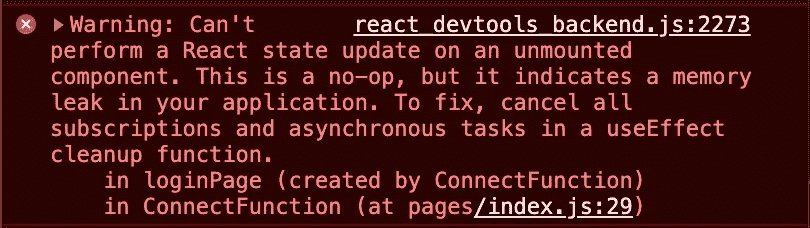

# 对反应内存泄漏的误解！

> 原文：<https://blog.devgenius.io/the-misconception-about-react-memory-leak-c6d983aba21b?source=collection_archive---------5----------------------->


乔·兹洛梅克在 [Unsplash](https://unsplash.com?utm_source=medium&utm_medium=referral) 上拍摄的照片说明了泄漏情况。

我写这篇文章是为了帮助澄清关于 React 内存泄漏的误解。有很多关于如何避免 React 内存泄漏的文章，但是很多文章都使用了一个不会导致内存泄漏的例子。

让我们看看经常使用的例子:

```
import { useState, useEffect } from "react";
​
export const UserList = () => {
  const [users, setUsers] = useState(null);
​
  useEffect(() => {
    const getUsers = async () => {
      const usersResponse = await fetch("https://dummy-api.com/api/v1/users");
      setUsers(await usersResponse.json());
    };
    getUsers();
  }, []);
​
  return (
    <>
       ...my-jsx...
    </>
  );
};
```

上面的代码演示了一个简单的 React 组件获取数据并将结果设置为状态。但是如果用户在 API 响应之前从组件导航会发生什么呢？答案是在组件被卸载后调用 setState。这意味着我们在一个卸载的组件上设置状态。React <= 17 was throwing an error within the console as the image below is showing.



- Warning: Can’t perform a React state update on an unmounted component.

Is it true that this case is causing memory leaks as the message tells us? To understand it, we need some basic understanding of memory management.

# Memory Management

Every programming language needs to handle memory. With low-level languages, the programmer needs to administrate the memory manually. In high-level languages like JavaScript, it’s handled automatically.

The concept of memory management consists of three life cycles which are almost the same regardless of the language.

1.  Allocating the needed memory
2.  Use the allocated memory
3.  Release the allocated memory when it’s not needed

Within this article, I'm not going to explain those life cycles in detail. But we need to understand what release of the allocated memory is meaning and how it is done within JavaScript.

## Release of the allocated memory

Release of the allocated memory means removing data within the memory that is not needed anymore. The release of allocated memory in JavaScript is accomplished by a Garbage Collector (GC), and therefore developers don't need to handle releasing of memory manually.

Releasing allocated memory by reference is the main concept within Garbage Collectors. The reference concept is about whether an object has any other objects referencing it or not. If the object does not have anyone other objects referencing/pointing to it, it's collectable for the GC to release the allocated memory.

# **回到 React 示例**

现在，我们对内存管理有了更多的了解，并且我们可以更好地理解为什么在本文顶部看到的代码示例中没有真正的内存泄漏。

那么，如果在一个卸载的组件上调用 setState，会发生什么呢？因为 API 调用是一个承诺，一旦它被设置，就不再有对状态对象的连续引用。

我们了解到没有其他对象引用它的对象对于 GC 来说是可收集的。因为我们用户的状态没有任何其他对象引用它，所以它将被收集并从分配的内存中释放。因此，我们看到的关于内存泄漏的消息在这个特定场景中是不真实的。

如果我们的组件订阅的是 WebSocket 连接，而不是 Promise HTTP 请求，那么就会出现内存泄漏。因为订阅的 WebSocket 连接将一直监听事件，所以会有内存泄漏。因此，将会有另一个引用状态的对象。正如我们所了解的，被另一个对象引用的对象不能被 GC 收集。

# 结论

来自 React 的消息是一个误报，让开发人员误以为在 HTTP 请求响应之前卸载组件时，他们通过向后端发出常规 HTTP 请求而导致内存泄漏。

React 合并了一个 Pull 请求来删除关于内存泄漏的错误消息。请随意查看 Github、[https://github.com/facebook/react/pull/22114](https://github.com/facebook/react/pull/22114)上的拉取请求，了解更多详情。

感谢阅读！🙌