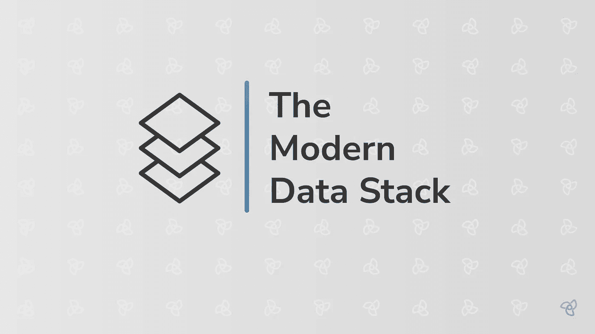
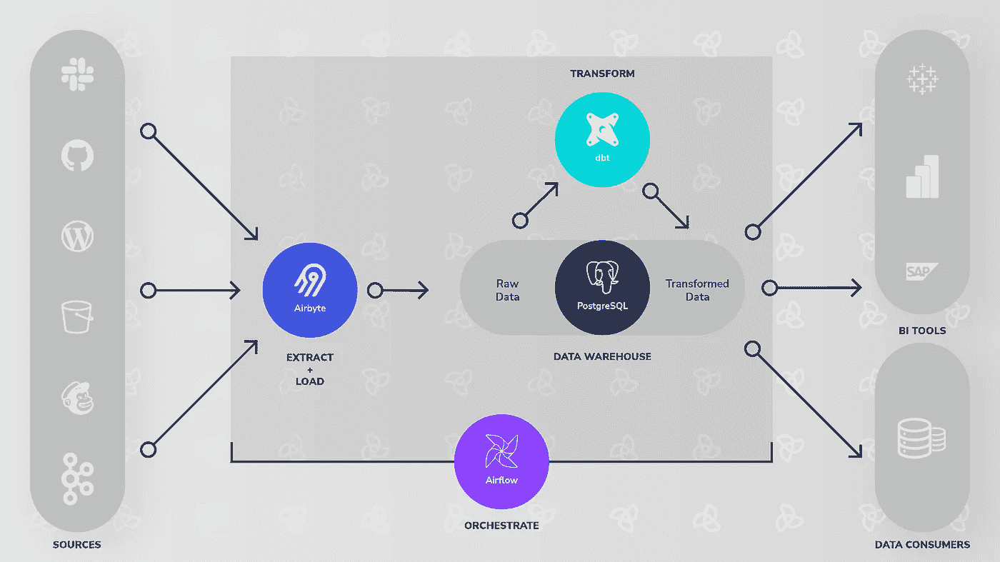

# 现代数据堆栈:需要考虑的东西？

> 原文：<https://blog.devgenius.io/the-modern-data-stack-something-to-consider-b7049b3d9f75?source=collection_archive---------4----------------------->

一个现代化的数据堆栈:一组几乎毫不费力集成的工具，如果需要，可以定制这些工具来解决非常具体的业务用例。它可扩展且易于配置，但现代数据堆栈的实际优势是什么？你应该换掉你现在的平台吗？在这篇文章中，我将阐述我在使用现代数据堆栈时遇到的一些好处，并希望让您更清楚地了解转换(部分)到这样一个平台是否有趣。

# 传统数据堆栈

考虑以下情况:您的公司在规模小得多的时候就建立了数据平台。他们选择了数据仓库解决方案，可能是因为它已经被无数次证明是成功的，而且我们不要自欺欺人了，它是相对容易实现的。它的入门过程有些简单，因为大部分都是用 SQL 语言编写的(这是一种大多数精通数据的人都精通的语言)，而且直到某一点，它都做得很好。尽管企业的数据策略越来越重要，数据量也在快速增长。在许多情况下，数据仓库解决方案将很快不再足够。它变得难以维护，有许多遗留代码，并且难以扩展。我整理了一份遗留数据堆栈的一些问题的列表。通常，它:

*   需要很多时间来维护；
*   包含复杂的 SQL 脚本；
*   很难浏览，因为依赖性密度很高；
*   包含重复转换(干原理)；
*   难以(或昂贵)扩大规模；
*   很难测试好(也很难测试)；
    [*阅读我们关于测试金字塔的帖子。*](https://blenddata.medium.com/the-testing-pyramid-one-of-the-wonders-of-the-engineering-world-6aaee2a59e27)
*   吸收新成员需要很长时间；
*   由大量遗留代码组成，因此很难将其转移出去。

对于许多组织来说，将当前的数据堆栈迁移到现代数据堆栈是一件令人望而生畏的事情。有更多的移动部分(例如，与单个 SQL 数据库相比)，但它似乎比实际情况更糟。它可能能够解决许多数据问题，并且，一旦你进行了公平的尝试，它并不比你所习惯的“数据仓库”更难实现。

# 现代数据堆栈

在我们深入了解现代数据堆栈的优点(和缺点)之前，让我先澄清一下什么是现代数据堆栈。术语数据平台和数据栈有时可以互换使用。虽然数据平台是一组数据流动的组件，而数据栈是一组服务于这些组件的工具。现代数据堆栈指的是一组特定的工具，这些工具通常被广大社区认为是其专业领域中最好的。
一般来说，现代数据堆栈中的工具具有以下特征:

*   云优先
*   围绕云数据仓库/湖构建
*   专注于解决一个问题
*   以 SaaS 或开放核心的形式提供
*   易于配置(低门槛)
*   受到活跃的大型社区的支持

同样，就像数据仓库一样，一刀切的解决方案似乎是许多人的选择。不同行业的公司选择低代码数据平台和服务，如 Azure Synapse、Data Factory 或市场上的其他竞争服务，不要误解我的意思，它们可以提供非常快速和有价值的结果，但也有一些缺点。这些解决方案通常不支持软件工程最佳实践(每个开发人员和架构师都深知这是构建成功的数据平台所必需的)，并且它们通常没有清晰的 CI/CD，因此包含很高的维护风险。这在很大程度上导致了一个庞大的整体解决方案，由于这个原因，维护变得几乎不可能，团队氛围显著下降，一些人甚至离开了。在整个公司中，利益相关者开始对数据平台产生负面的联想，最重要的是:这都要花费大量的金钱。

现代数据堆栈在某些方面类似于上述解决方案:它是低代码(或无代码)的，因此很容易配置，并且实现通常很快就有结果。最大的区别在于，现代数据堆栈支持(软件)工程最佳实践。每个工具都解决一个问题(而且做得很好)，因此它们必须是模块化的，以确保它们能与其他工具协同工作。这意味着数据堆栈的一部分可以很容易地被其他部分替换掉，导致一些良性竞争，并允许用户(您)选择哪个工具随着时间的推移最适合您的用例。此外，由于这一点，您可以自动防止您的团队和企业最终使用一个不可能导航的复杂平台，以及与数据的负面关联(这是您作为一名数据通管理者所希望的)。这些工具通常有非常活跃和有用的社区。通常，有一个 Slack 频道、Discord 社区或其他一些论坛，你可以在上面发表你的问题(当然还有答案)。加上经常提供的与流行云服务的现成集成以及定期公开的 API 或提供的 SDK，它们可以连接到定制的应用程序或网站。最后，他们以云为中心的方法允许平台根据您的业务需求轻松扩展或缩减。

# 实践中的现代数据堆栈

实践中现代数据堆栈的示例示意图。

首先，我们要提取数据。为此，我们使用了 [Airbyte](https://airbyte.com/) ，这是一个开源工具，可以方便地提取和加载数据。它提供了许多现成的连接器，因此将其配置到我们的数据源应该不是太大的问题。除此之外，它们还提供了多种方法来实现您自己的到非标准数据源的定制连接器。这导致了平滑的设置过程和非常容易管理的工具。除此之外，Airbyte 运行在 Docker 容器中，这对我来说也是一个好处，因为它使这个工具更加灵活和可靠。

对于我们的数据存储，我们使用像 Azure Synapse 或 Amazon Redshift 这样的托管云数据仓库。从将计算成本与存储成本分开的意义上来说，它们是经济高效的。对于更传统的数据库，当存储容量达到最大值时，您需要升级整个系统，即使您只使用了计算的一小部分。根据最新的趋势，与 ETL 相比，ELT 越来越受欢迎，我们也更喜欢 ELT 平台而不是 ETL。因此，与存储相比，我们通常不会使用太多计算，因此能够分别扩展这两种资源使得托管云数据仓库比非托管云数据仓库更具成本效益。

对于转换来说， [dbt](https://www.getdbt.com/) (数据构建工具)是一个很好的解决方案。这个工具非常通用，提供了许多值得赞赏的功能。很明显，它不仅能够进行转换，还能够对数据和转换进行快照(也称为变更数据捕获)、记录和测试。最后一点是我要求很高的一点。它很容易集成到 CI 管道中，从而在生产中产生更健壮的代码和更少的错误！Dbt 允许用 SQL 方言创建转换，尽管我们很喜欢 Python，但我看到了让精通 SQL 的数据工程师用他们喜欢的语言实现转换的价值，甚至可以用 SQL 编写测试。模型可以模块化地建立，从而减少重复代码，并且可以非常容易地依赖于其他模型的输出。这些特性使系统易于管理，并且对于熟悉数据的 SQL 业务开发人员来说也很容易上手。即使在工程最佳实践方面经验较少的人也能够保持他们的代码干净并经过测试，从长远来看，这对整个公司及其过程都有好处。和 Airbyte 一样，它也在 Docker 容器中运行。
Dbt 提供了许多可能性，我现在不会太深入，但可以为 Dbt 写一篇完全独立的文章。

现在已经介绍了 ELT 过程，我们需要一个 orchestrator。对于这种[气流](https://airflow.apache.org/)是我们最喜欢的选择。这个工具允许我们计划和监控工作流程。使用 Python 很容易创建 Dag(yay)，这使得代码更容易测试(double yay)。Airflow 有一个用户友好的 web 界面，甚至 Python 代码也非常简单，这在我看来是管道编排的首选。最后，你可能会猜到我要说什么:气流在 Docker 中运行。

我只是提到了一个简单的设置，但是现代数据堆栈还有许多其他部分。比如:

*   数据可视化
*   数据治理
*   数据质量
*   反向 ETL

如果你将它与像 [Kubernetes](https://kubernetes.io/) 这样的工具相结合，以实现轻松管理和可扩展性，并与 [Terraform](https://www.terraform.io/) 相结合，以自动将(基础设施作为代码)你的数据平台部署到云，你就拥有了一个非常强大而灵活的工具。

# 过渡到现代数据堆栈

话虽如此，问题依然存在:“我应该过渡到现代数据堆栈吗？”而我的回答是“很抱歉，但一如既往:视情况而定”。你得为自己考虑利大于弊。在这篇文章中，我主要关注的是好处，但是现代数据堆栈中的许多工具都在不断发展。你可以想象这伴随着一些缺失的功能甚至是 bug。除此之外，这些工具确实很好地配合在一起，但是事实上，您必须管理不同的工具，而不是一个一刀切的解决方案，这确实带来了一些开销复杂性。虽然好处真的越来越多，而且有许多使用现代数据堆栈，所以，对许多人来说，利大于弊。我想说，如果:

*   平台的复杂程度在快速增加(太快了)。
*   您平台的维护成本正在增加。
*   由于开发人员的错误，平台经常崩溃。
*   新功能的开发时间呈指数增长。
*   由于供应商锁定，该平台缺乏灵活性。

现代数据堆栈值得考虑！

***关于作者***

[**耶鲁安·塞斯**](https://www.linkedin.com/in/jeroen-sies/) 是荷兰一家数据工程咨询公司 [**Blenddata**](https://www.blenddata.nl/) 的数据工程师。[**blend data**](https://www.blenddata.nl/)**住着第二个名字是质量的人，以及那些对解决数据和 IT 交叉问题的挑战感到兴奋的人。**

***感谢* [*罗埃尔·斯密茨*](https://www.linkedin.com/in/roelsmits90/)*[*文森特·福克*](https://www.linkedin.com/in/vincent-fokker/)*[*贾里·伯格斯*](https://www.linkedin.com/in/jari-burgers-35989a10a/) *为本贴校对。*****