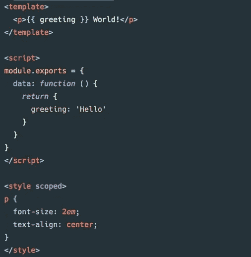

# 我获得的经验越多，我就越不想使用 React.js

> 原文：<https://blog.devgenius.io/the-more-experience-i-gain-the-less-i-have-any-desire-to-use-react-js-af4e87487835?source=collection_archive---------8----------------------->

以及为什么我认为几乎任何其他选择都更好。

驴

# React 是一个教学工具

## 这就是我认为它的好处

与 Vue 和 Angular 相比，它同时缺乏功能和灵活性。严格来说，它也不比设计良好的普通 JS 应用程序快。

我在学校用过 react。我记得它最酷的一点是，我们可以用编程的方式快速渲染一堆组件。当我在学校的时候，我鹦鹉学舌 react 网站上的所有声明。这样更快！更有条理！它强制约定俗成！大企业网站更好！

从那以后，我得到了一份实习和一份真正的工作，学会了很多其他的选择，并把它们用在了企业应用程序上。我学到了什么？看起来 100%都是错的。

就极简和灵活的单页面应用框架而言，Vue 要轻得多，处理内联样式也更明智。Angular 有更多的特性和严格的约定，Vanilla JS 总是有潜力变得更快，因为它在大多数时候严格地要求更少的代码。

更好的是，React.js 中有一些东西需要一整个该死的模块来实现，而你也许可以通过用我们的老朋友 PHP 在键盘上随机按下 15 个字母来实现。

我没有看到 React 在任何类别中领先。

我认为它唯一的好处是，如果你使用 node.js，你可以用一种语言拥有整个堆栈，这在理论上是很好的，但在这一点上，如果你希望一切都从你身上抽象出来，你可能会选择 angular。

我甚至还没有找到这个框架的真正杀手。

# 内嵌样式。

现在，你可能想知道为什么内联样式让我如此苦恼。理论上，如果你正确使用 CSS，当你使用一些框架时，你可能永远不需要内联样式。

我大部分是前端开发者。这里面有很多东西，但有几个主要问题经常比其他问题出现得更多。我的长期职业生涯取决于我成功解决这些经常出现的问题的能力。

1.  浏览器兼容性。
2.  屏幕尺寸兼容性。
3.  吸引人的 UI 特性。
4.  特例模板。

有很多工具可以更好或更坏地解决这些问题，通常你需要一些随机的“从帽子里拿出来”的工具组合来尝试解决它们，但是有一件事我可以绝对肯定。

任何一个框架，如果它的 CSS 和 HTML(或者任何可以编译成它们的东西)不在同一个文件中，那么它在解决这些问题上就不太好。

> 任何一个框架，如果它的 CSS 和 HTML(或者任何可以编译成它们的东西)不在同一个文件中，那么它在解决这些问题上就不太好。

React 在这方面有两个缺点。如果您选择使用内联样式，您不仅必须在一些 javascript 对象中使用一些反向的 javascript 语法，而且从根本上来说，CSS 和 JSX 不能并排使用。你可以完成它，但是上帝会因为你创造了这个令人厌恶的东西而严厉地审判你。

人们可以整天向我哭诉“你不应该使用内嵌样式”

# 但是你知道吗？想象一下。

你正在做一个 10 年前的大型网站，有一些不错的模板工作。客户说，他们想要一个模板来呈现一些不可预测的世界事件或新的营销活动的特定组件，但该模板用于 500，000 个其他页面，而这个新组件只需要在使用该模板的 30，000 个页面上呈现。

哦，客户不愿意在这个项目上花费超过 10 小时的开发时间。

突然间，我们在这个 Vue.js 文件中看到的这种单个文件组件看起来就像红色浩克，旁边是一个被锁在隐石棺材中 50 年的超人。

看，CSS，HTML，甚至一点点逻辑都可以在同一个组件中完成。这是一座金矿。这是前端工程师的春梦。这就是 Vue 希望您完成每个单元的方式。Vue 知道。Vue 支持你，它会打败你的恶霸。它能照看你的孩子，还能帮你省钱。

vue.js 文件

还有一件事要考虑。假设客户希望您构建一些华而不实的新 css 动画小玩意。将 CSS 和 HTML 放在同一个文件中，将会为你在试验和测试这个新设计时节省很多时间。你将能够看到你的 html 类，对它们应用逻辑，引用你的 css，而几乎不用移动你的眼球。

# Vue 不是唯一一个明白这一点的硬汉。

事实上，据我所知，React 似乎是唯一一个**还没有**接受这个约定的好处的主要框架。这就像街区里有一个孩子试图加入棒球比赛，但他拒绝用除了泡沫泳池面条之外的任何东西击球。其他人都在比赛，都在为胜利而战。

将 HTML 和 CSS 放在同一个模块中，而不需要太多的麻烦，这是意料之中的事情，用 php blade 文件、vanilla JS、Vue.js、slim 甚至 ERB 都可以轻松实现。

# 这就是我的看法。

希望你喜欢我的散文。下次见。