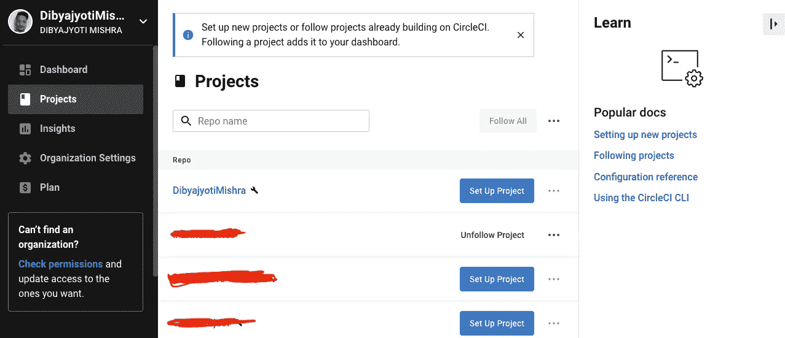
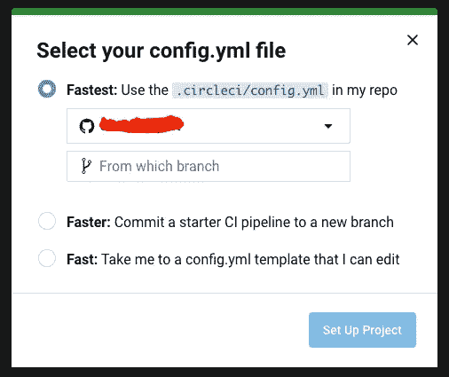
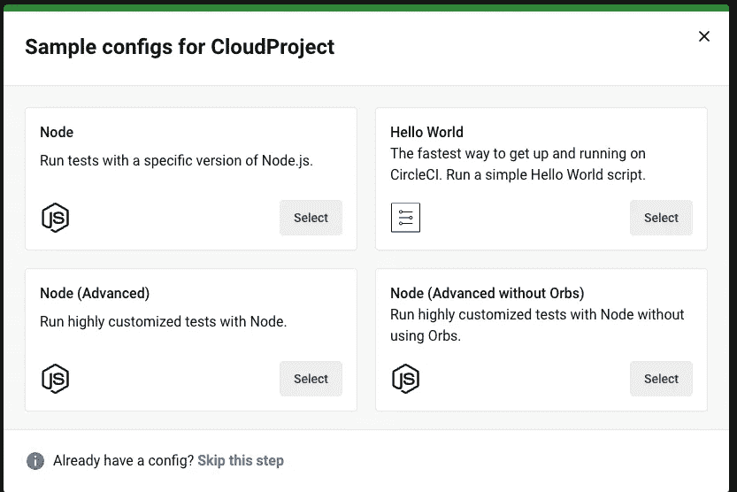
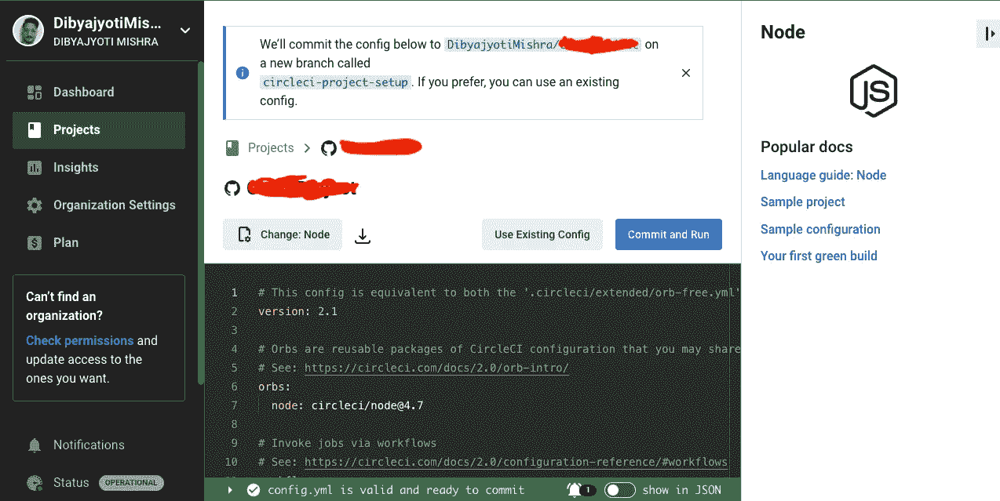
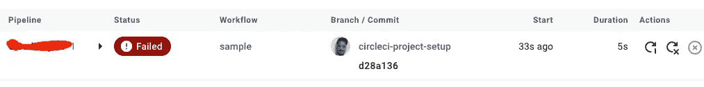

# 对初学者最友好的 CircleCI 入门。

> 原文：<https://blog.devgenius.io/the-most-beginner-friendly-introduction-to-circleci-91cbfcd30a01?source=collection_archive---------6----------------------->


切尔莱西

持续集成(CI)是一种开发实践，其中开发人员频繁地将他们的代码变更合并到一个共享的存储库中，通常是每天多次。他们可以避免管理大规模的代码更新，并通过早期监控和修复问题来确保代码库保持稳定。如果开发人员定期进行集成，他们可以更快地注意到问题，并更方便地识别它们。对于敏捷团队来说，持续集成(CI)是一个至关重要的策略。

有很多工具可以在 CI 工作流程中帮助你，比如 Jenkins、CircleCI、Travis、GitHub actions 等。今天，我们来讨论一下 CircleCI。该工具非常独立于框架和语言。然而，为了举例，我今天将选择一个 React 应用程序。

不要再耽搁了，让我们开始吧。

前往**circleci.com**创建一个账户。如果你已经有了一个，那就登录进去。

在左侧菜单中，点击**项目选项，**会显示所有项目的列表。

> **注意**:确保你已经连接了你的 GitHub/GitLab/Similar 账号，获得所有项目列表。



点击**设置项目**按钮，然后你会得到一个类似这样的弹出窗口。



选择第三个选项:**快速**，点击**设置项目**。

从示例配置中选择**节点**。



暂时保留默认值，我们会在某个时候更改它们。点击**提交并运行**按钮。



然后你将进入**仪表板，**在那里你的构建可能会失败，这取决于你是使用 npm 还是 yarn 作为包管理器。默认情况下，CircleCI 希望您有一个 package-lock.json 文件。如果您使用 yarn，那么您将拥有一个 yarn-lock.json。



但是，如果您到了您的存储库，您将会看到一个新的分支已经被创建，名称为" **circleci-project-setup** "。将其与您当前正在处理的分支合并，启动您的代码编辑器，让我们开始配置。

设置好之后，打开 config.yml 文件并删除其中的所有内容。让我们从头开始设置它。

在写入您的配置文件之前，我们将首先简化几个术语。

1.  executors: CircleCI 提供了几个执行环境。这些人被称为**执行者**。执行器定义了运行作业的底层技术或环境。您可以在 **docker** 、 **machine** 、 **macOS** 或 **windows** executors 中进行选择，并用您需要的工具和软件包指定一个映像。在这个例子中，我们将使用 **docker** 。
2.  别名:**别名**类似于变量，您可以使用它来重用项目中的某个配置块。这有助于减少冗余，同时保持配置文件的整洁和可读性。
3.  乔布斯:这些是你希望 CircleCI 为你完成的实际任务。
4.  工作流程:**工作流程**定义您创建的作业在 CircleCI 中运行的顺序。
5.  orb:**orb**用于 **d** 降低配置复杂性，并帮助您在许多项目中快速轻松地集成软件和服务堆栈。它们是开源的、可共享的可参数化的可重用配置元素包，包括作业、命令和执行器。

在编写配置时，我们将学习更多的内容。现在，让我们开始编写代码。

现在让我们创建我们的第一个作业。

```
version: 2.1orbs:
  node: circleci/node@1.1.6 # orb versionjobs:
  setup: # name of the job
    executor:
       name: node/default
    steps:
       - checkout # to checkout to the git branch
       - node/with-cache:
             run: npm install
workflows:    
   install_dependencies:    # name of workflow 
     jobs:                  # jobs to be performed in the workflow
      - setup               # the actual job
```

**run** 用于运行任何脚本，类似于您在终端中手动运行的方式。

保存您的配置并提交到您的存储库。转到您的仪表板，您将看到工作流已经开始运行。

做完基础工作后，让我们进入一些更高级的设置。跟我来。

这一次我们要做的是，一旦代码被提交，我们将 lint 它，运行它更漂亮，然后构建它。

让我们像以前一样定义版本。

```
version: 2.1
```

这一次我们将分离出我们的执行者，因为将会有一些多余的部分，我们将只是重用它们。

```
executors:
  app-executor:
    docker: 
       - image: circleci/node:14.18.1
    working_directory: ~/project
```

那我们在这里做什么？让我们从第一行开始。我们将我们的执行器命名为 app-executor，这不是一个保留的标识符名称，您可以随意命名。然后，我们告诉 CircleCI 从 docker 映像设置 Node.js 环境。这里 14.18.1 简单来说就是节点版本。请随意选择您自己的版本。你可以在这里找到名单。工作目录是指 CircleCI 中所有项目文件所在的目录。同样，您可以随意命名该文件夹，但路径保持不变。

继续…让我们定义我们的别名。我们会写一堆。

```
aliases:
  - &show-current-branch:
    run:
      name: Show Current Branch
      command: echo ${CIRCLE_BRANCH}
  - &restore-cache:
    restore_cache:
      keys:
       - app-{{ checksum "package.json" }}
       - app-
  - &install-dependencies:
    run:
      name: Install Dependencies
      command: npm install
  - &save-cache:
    save_cache:
     paths:
       - node_modules
     keys: app-{{ checksum "package.json" }}
 - &build-project    
   run:      
     name: Build Project      
     command: |        
       npm install        
       npm run build        
       cd build        
       zip ../build.zip -r * .[^.]*        
       echo "Build Successful !"
```

我们先来了解一下到目前为止我们做了什么。我们已经创建了 5 个作业，并将其放在别名下以重用它们。

job-1:**show-current-branch:**所有这些都是在控制台上打印当前工作的分支。我们在这里使用一个名为 CIRCLE_BRANCH 的变量，它来自 CircleCI 的环境变量。

Job-2: **restore-cache:** 在这里，我们检查是否存在任何缓存，以便我们可以从那里构建它。基本上是检查 node_modules。

job-3:**install-dependencies:**类似于我们在本地机器上开始一个新项目时所做的，我们在这里安装依赖项。

Job-4: **save-cache:** 缓存我们的 node_modules，这样我们接下来的构建会更快。

Job-5: **build-project:** 我们正在这里构建项目。当我们需要在一个任务中连续运行许多命令时，我们使用“|”。

让我们现在写我们的实际工作。

```
jobs:
  setup:
   executor: app-executor
   steps:
    - checkout
    - *show-current-branch
    - *restore-cache
    - *install-dependencies
    - *save-cache
 linting:
   executor: app-executor
   steps:
    - checkout
    - *show-current-branch
    - *restore-cache
    - run:
       name: Run Linting
       command: npm run lint
 prettify:
   executor: app-executor
   steps:
    - checkout
    - *show-current-branch
    - *restore-cache
    - run:
       name: Run Prettier
       command: npm run prettify
 build:
   - executor: app-executor
   - steps:
      - checkout
      - *show-current-branch
      - *restore-cache
      - *build-project
```

这里，我们已经定义了我们希望针对每个提交运行的所有作业。我们现在要做的就是设置工作流，以便这些命令可以按顺序运行。

**注意**:您的 package.json 必须已经安装了 lint 和 prettify 命令，否则构建将会失败。我已经就此写了一篇详细的博客。在这里找到它[。](https://medium.com/dev-genius/enforce-strict-code-style-in-a-team-cda6f68d944b)

```
workflows:
  setup_and_build:
    jobs:
      - setup
      - linting:
         requires:
          - setup
         filters:
           branches:
             only:
               - develop
               - master
     - prettify:
         requires:
          - setup
         filters:
           branches:
             only:
               - develop
               - master
    - build:
         requires:
           - linting
           - prettify filters:
           branches:
             only:
               - develop
               - master
```

祝贺🎉，我们现在已经完成了第一个完整的工作流设置。现在，您可以提交代码并查看它的运行情况。


这是 **CircleCI 系列的第 1 部分。许多有趣的故事很快就会出现。敬请期待！**

如果有任何疑问，请在下面评论。我很乐意帮助你。编码快乐！**关注**我获取更多此类内容。谢了。祝你有美好的一天！