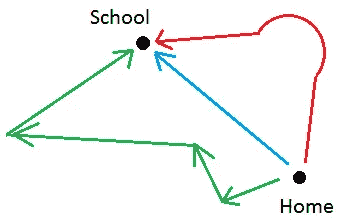

# 数据结构和算法最实用的介绍

> 原文：<https://blog.devgenius.io/the-most-practical-introduction-to-data-structure-and-algorithm-36bb6f0de6ed?source=collection_archive---------0----------------------->


奥拉夫·阿伦斯·罗特内在 [Unsplash](https://unsplash.com?utm_source=medium&utm_medium=referral) 上的照片

我们都知道**数据结构和算法**对于**编程**、**面试**和**竞技编程很重要。**

但是我们错过的是学习和理解这些概念的正确方法。在这篇文章中，你将会对数据结构和算法有一个清晰而实用的介绍。所以让我们开始吧！

数据结构是所有关于优化你的代码和提高性能。现在，看下图。



如你所见，从家到学校有三条不同的路径。我很确定你注意到了蓝色的小路是去学校最快的路。但真的是最快的吗？如果蓝色的道路充满了交通，花了你 1 小时 20 分钟到达学校，同样红色的道路充满了坑坑洼洼，花了大约 50 分钟，另一方面，绿色的道路可能看起来很长，但它是一条干净的道路，花了你 40 分钟。现在你会选择哪个？

在这里，我们不能仅仅通过观察来说哪一个是最快的，但是我们需要的是一些参数，比如交通，坑洼等等，这样我们才能得出更好的结论。

让我们来看看 N 个数字相加的两种不同方法。仔细看看两种方法，试着找出**哪个更优化？**

```
**// METHOD 1**
function sum(N) {
    var total = 0;
    for(var i = 1; i <= N; i++) {
        total += i;
    }
    return total;
}**// METHOD 2**
var res = (n*(n+1))/2;
```

## 那么方法 1 和方法 2 哪个更优化呢？

> 如果你的答案是我们不能仅仅通过查看代码来决定，而是我们需要一些参数来分析，那么我很高兴看到你走在正确的轨道上。

## 我们如何计算代码的性能？

为了计算代码的性能，我们将看到两种不同的方法。

## 方法 1:基于时间

```
calculateTime();
function numberSun(n) {
    **// Code...** }
calculateTimeDifference();
```

是的，我们可以检查代码的执行时间，并决定哪个在性能方面更好。函数 **calculateTime()** 和**calculate time difference()**完成这项工作。

但这并不是计算性能的更好方法。它有一些缺点。基于**时间的**方法的问题是:

I)它基于机器。这意味着不同的机器有不同的处理器，所以不同的机器会根据它们各自的处理器给你不同的结果。

ii)如果一个处理器完全空闲，不做任何其他工作，那么你会得到更快的结果，如果处理器很忙，那么你会得到更慢的结果。

## 方法 2:计数操作

看看给定的代码，告诉我执行了多少操作？

```
a = a + 2
```

总的操作是 2(数字相加，赋值)。

> 如果你是这样想的，从现在开始，我们将计算代码上的每个操作，并找出哪个更好？

我会说从技术上讲你是正确的，但是我们用一些简单的数学来做更好的方法。现在让我们看看另一个问题，并尝试找出执行的操作数。

```
sum = 0;
potato = 1;
for (i = 1; i < n; i++) {
    sum = sum + i;
}
```

在上面的代码中 **sum=0** ， **potato=1** 和 **i=1** 各做 **1** 运算。 **sum=sum+i** 做 **2** 运算， **i++** (i=i+1)做 **2** 运算， **i < n** 做 **1** 运算，直到 **n** 次。因此，使得**总运算量= 5n + 3。**

这种计数方法引入了 BigO 的概念。用于测量输入增长的代码的性能。

> 在**计算机科学**中，**大 O** **符号**用于根据**算法**的运行时间或空间需求如何随着输入大小的增长而增长来对其进行分类。—维基百科

随着 **BigO** ，的引入，我们可以省略常数(如 1，2，3...)而现在上面例子的复杂度(运算)是 **O(5n+3)** 将是 **O(n)** 。

## 数据结构和算法到底是什么？

**数据结构:**它是数据的表示或数据存储的方式，以便我们可以有效地检索、重新排列或搜索数据。

为了做到上面提到的，我们有不同的数据结构，如**数组**、**链表**、**图形**等。

为了实现数据结构(如数组、链表等)，我们需要一步一步地完成一些指令。这些指令是由算法定义的。

## 数据结构和算法之间的关系:


马克·弗莱彻-布朗在 [Unsplash](https://unsplash.com?utm_source=medium&utm_medium=referral) 上的照片

**算法**向你展示如何一步一步地输入数据。为了选择任何一种**算法**，我们首先需要选择我们正在使用的**数据结构**。

**举例:**在链表中插入值的步骤与图形不同。

# 非常感谢你一直读到最后。

# 如果你想要更多这样的内容，请在媒体上关注我，订阅我的 [YouTube 频道](https://www.youtube.com/channel/UCgfW-cxlW7NlpbOscKJYkfA)

# 有疑问吗？通过[推特](https://twitter.com/izrajesh)联系我