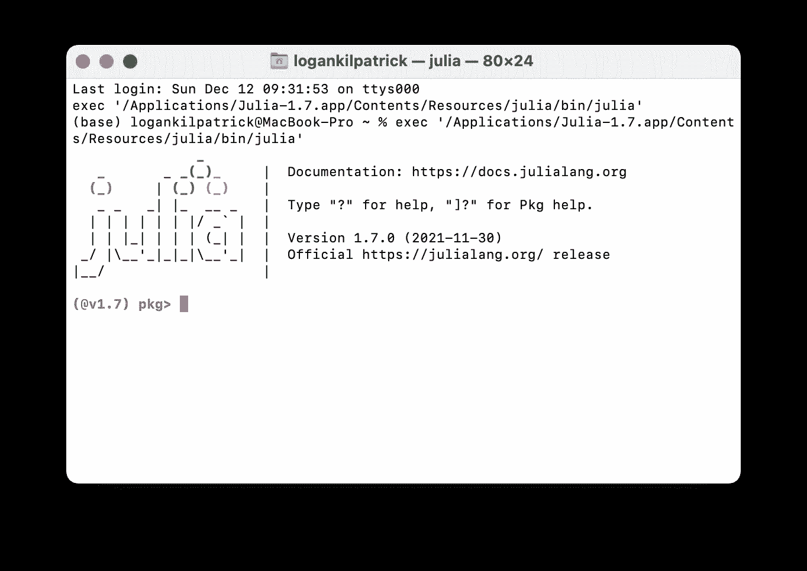
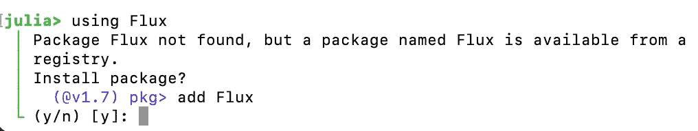
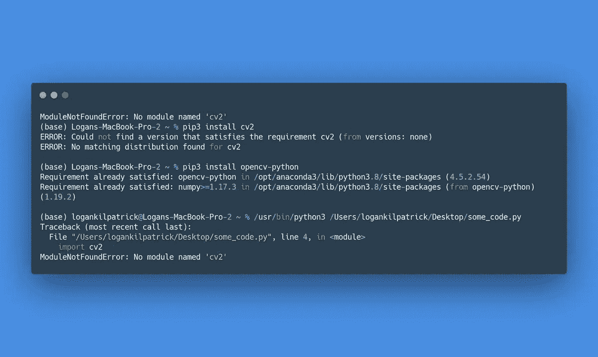

# Julia 编程语言最被低估的特性👀，包管理器📦

> 原文：<https://blog.devgenius.io/the-most-underrated-feature-of-the-julia-programming-language-the-package-manager-652065f45a3a?source=collection_archive---------0----------------------->


照片由 [Kira auf der Heide](https://unsplash.com/@kadh?utm_source=medium&utm_medium=referral) 在 [Unsplash](https://unsplash.com?utm_source=medium&utm_medium=referral) 拍摄

我要坦率地说一会儿；我真的不明白如何管理我的 Python 包环境，我想我不是一个人。每次事情不像我期望的那样工作，我都会松一口气，感谢我的幸运星，Julia 有一个“工作正常”的软件包管理器。对于那些寻找 Python 包生态系统的苛刻评论的人来说，你在这里找不到。在 Python 社区中，有很多人非常努力地工作，希望这不成为问题，我衷心希望他们成功。不管怎样，我想写这篇文章，强调是什么让 Julia 包管理器和包生态系统对该语言的用户如此有益。

*编辑:我和我的合著者很高兴地告诉大家，我们的新书《朱莉娅速成教程》已经开始预售了:*

[](https://logankilpatrick.gumroad.com/l/juliacrashcourse) [## 朱莉娅速成班(电子书预购)

### Julia 速成课程是使用 Julia 编程语言的实践指南，是为初学者编写的。我们接受…

logankilpatrick.gumroad.com](https://logankilpatrick.gumroad.com/l/juliacrashcourse) 

# 朱莉娅软件包管理器基础🛠

在 Julia 中有两种方式与包交互:通过 REPL 或者使用 Pkg 包。在这篇文章中，我们将主要关注 REPL，因为根据我的经验，它更容易使用。要访问 REPL 中的 Julia 包管理器，首先需要安装 Julia:

安装完 Julia 后，您可以通过键入`]`从 REPL 进入软件包管理器。



作者图片

现在我们在包管理器中，有一些我们通常想做的事情:

*   添加包
*   取出包裹
*   检查已经安装了什么
*   创建新的包环境
*   添加新的注册表

如果你不喜欢长篇大论，想深入研究久经考验的文档，我会让你一路顺风:[https://pkgdocs.julialang.org/v1/](https://pkgdocs.julialang.org/v1/)如果你想查看 REPL 中所有可能的命令，只需输入`]`进入 Pkg 模式，然后输入`?`。

对于朱莉娅的 Pkg 的高层次概述，由朱莉娅的共同创作者斯特凡卡尔平斯基，检查:

## 添加 Julia 包➕

让我们添加我们的第一个包，`Example.jl`。为此，我们可以运行:

```
**(@v1.7) pkg>** add Example
```

它应该提供类似如下的输出:

```
**(@v1.7) pkg>** add Example**Updating** registry at `~/.julia/registries/General`**Updating** git-repo `https://github.com/JuliaRegistries/General.git`**Updating** registry at `~/.julia/registries/JuliaPOMDP`**Updating** git-repo `https://github.com/JuliaPOMDP/Registry`**Resolving** package versions...**Installed** Example ─ v0.5.3**Updating** `~/.julia/environments/v1.7/Project.toml`[7876af07] + Example v0.5.3**Updating** `~/.julia/environments/v1.7/Manifest.toml`[7876af07] + Example v0.5.3**Precompiling** project...1 dependency successfully precompiled in 1 seconds (69 already precompiled)**(@v1.7) pkg>**
```

*由于篇幅的原因，我将跳过更多的输出，假设您正在跟随我。*

## 检查包状态🔍

现在我们认为已经安装了一个包，让我们通过在包管理器中键入`status`(或简称为`st`)来检查它是否真的存在:

```
**(@v1.7) pkg>** st**Status** `~/.julia/environments/v1.7/Project.toml`[7876af07] Example v0.5.3[587475ba] Flux v0.12.8
```

在这里，我们可以看到我安装了两个软件包，Flux 和 Example。它还为我提供了管理当前环境(在本例中为全局 Julia v1.7)的文件路径以及我已安装的软件包版本。

## 移除朱莉娅包📛

如果我想从我的活动环境中删除一个包，比如 Flux，我可以简单地键入`remove Flux`(或简称为`rm`):

```
**(@v1.7) pkg>** rm Flux**Updating** `~/.julia/environments/v1.7/Project.toml`[587475ba] - Flux v0.12.8
```

`status`简短的结束语表明这是成功的:

```
**(@v1.7) pkg>** st**Status** `~/.julia/environments/v1.7/Project.toml`[7876af07] Example v0.5.3
```

我们现在知道了使用包的最基本的知识。但是，利用我们的全球软件包环境，我们犯下了重大的编程罪行。为了弥补这一点，我们需要创造一个新的环境，我将在下面展示。

## 创造朱莉娅的环境🌎

如前所述，我们以前在全局命名空间中工作。现在我们想在本地环境中工作，所以让我们转到桌面，创建一个文件夹，并创建一个新环境:

```
**julia>** # type ; to enter shell mode**shell>** cd Desktop/Users/logankilpatrick/Desktop **shell>** mkdir test # create a test folder on my desktop**shell>** cd test # switch to the test dir /Users/logankilpatrick/Desktop/test **(@v1.7) pkg>** activate .**Activating** new project at `~/Desktop/test` **(test) pkg>** st**Status** `~/Desktop/test/Project.toml` (empty project)
```

这个例子中的魔法发生在我运行`activate .`的时候，它激活了我所在的当前目录。您可以在“pkg”的左侧看到，现在显示“test ”,表示 env 处于活动状态。我们现在也看到，当我运行`st`时，我们处于一个空的项目中。您现在可以执行与之前相同的命令，但是因为“test”项目处于活动状态，所以这些包将被安装在一个新的环境中。

这里要提到的最后一件事是如何返回到主全局环境。您需要做的就是键入`activate`，您会看到切换回主环境的提示。您可以再次键入`activate .`重新激活测试项目。

# 使用朱莉娅包📦

既然我们已经讨论了如何管理包，那么让我们来探索如何使用它们。朱莉娅 1.7 中我最喜欢的一个新功能(在这篇博文中突出显示)如下:



作者形象

如果你还记得，我们移除了焊剂包，当然，我忘记了这一点，所以我去使用它，并通过键入`using Flux`加载它。REPL 通过一个简单的 y/n 提示自动提示我安装它。这是一件小事，但可以节省大量时间。

# 与🧑‍注册管理机构合作🤝‍🧑

注册表是存储软件包的地方。如果您对它们一点也不熟悉，我建议您去听听 Kristoffer Carlsson 在 PackagingCon 2021 上的演讲:

在高层次上，注册表是存储包的地方。如果你以包的形式写了一些很棒的 Julia 代码，发布它的方法是通过在通用 Julia 注册表中注册它。你可以在这里阅读更多关于如何注册一个软件包的信息:[https://github . com/Julia registries/registrator . JL # how-to-use](https://github.com/JuliaRegistries/Registrator.jl#how-to-use)

要使用注册表，首先让我们检查一下我们当前连接到了哪些注册表:

```
**(@v1.7) pkg>** registry st**Registry Status**[23338594] General
```

在这种情况下，我只连接到通用的 Julia 注册表。但是你也可以为你的实验室或公司创建新的注册表。让我们尝试通过以下方式添加一个:

```
**(@v1.7) pkg>** registry add https://github.com/HolyLab/HolyLabRegistry**Cloning** registry from "https://github.com/HolyLab/HolyLabRegistry"**Added** registry `HolyLabRegistry` to `~/.julia/registries/HolyLabRegistry`**(@v1.7) pkg>** registry st**Registry Status**[23338594] General[c72e0888] HolyLabRegistry
```

现在我们可以看到来自神圣实验室的注册表(以著名的 Julia 贡献者 Tim Holy 命名)。自定义注册中心可以给包作者更多的灵活性，以及对如何使用包的控制。你可以在 Pkg 文档中找到更多关于注册中心的信息:【https://pkgdocs.julialang.org/v1/registries/ 

# 在笔记本中管理 Julia 包📝

需要注意的一点是，当你在 Jupyter 笔记本上使用 Julia 时，REPL 没有内置任何东西。这可能会让您想知道如何在那个 env 中添加包。谢天谢地，非常相似。您可以执行以下操作:

```
**julia>** import Pkg**julia>** Pkg.add("Example")**Resolving** package versions...**No Changes** to `~/.julia/environments/v1.7/Project.toml`**No Changes** to `~/.julia/environments/v1.7/Manifest.toml` **julia>** Pkg.rm("Example")**Updating** `~/.julia/environments/v1.7/Project.toml`[7876af07] - Example v0.5.3**Updating** `~/.julia/environments/v1.7/Manifest.toml`[7876af07] - Example v0.5.3
```

命令都是一样的，它们只需要加上前缀 Pkg。

# 结束语


作者图片

在其他生态系统中，管理软件包是唯一给我带来最多问题的事情。下面这个例子出现得如此频繁，真让我头疼:



作者图片

拥有一个直观的包管理器使得整个编程过程更加愉快。我感谢 Pkg.jl 的所有 112 位贡献者，他们让在 Julia 中使用软件包变得如此简单:【https://github.com/JuliaLang/Pkg.jl/graphs/contributors

包管理器是 Julia 最被低估的特性。有不同意见吗？让我在推特上知道:[https://twitter.com/OfficialLoganK](https://twitter.com/OfficialLoganK)