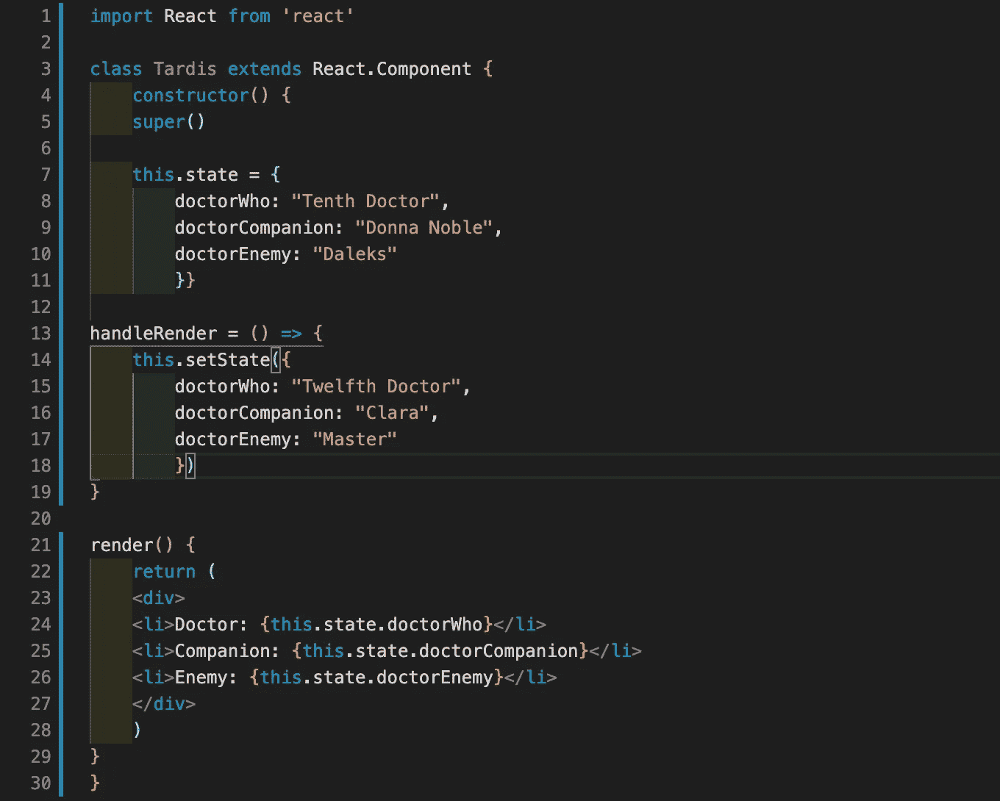

# 的奥秘。设置状态

> 原文：<https://blog.devgenius.io/the-mystery-of-setstate-bae4143b1e96?source=collection_archive---------34----------------------->

我开始钻研 React 已经四天了。

我能说什么呢？这是一个真正强大的工具。强大——但一点也不容易。你肯定会纠结于语法和新概念，尤其是如果你是个新手。这些奇怪但有趣的概念之一是. setState 函数。

但是，不要操之过急！首先:这种状态是什么？

**State** 是 React 组件的普通 JavaScript 对象(React 组件是构成用户界面(UI)的可重用代码)。这意味着，在状态中，我们可以存储属于一个组件的值。

但是等等！那么**道具**呢？它也是 React 用来存储值的 JavaScript 对象。不用深入黑暗深处，考虑一下这个:道具是不可改变的。这是我们需要国家的主要原因。你不能改变道具，它们是静态的。有时它对我们有用，但有时我们需要让我们的应用程序更有活力。国家队来了！

**重要提示:**你不必在每个 React 组件中都使用状态！只有在运行应用程序时需要可以更改的参数时，才使用它。

记住这一点，让我们来看看我们实际上是如何用这个神秘的. setState 对值进行变异的例子。

**。setState** 是一个内置的 React 函数。我们绝对需要它，因为新值的直接赋值对 state 不起作用:我们应该遵循约定。这是我的一个例子，灵感来自我最喜欢的电视节目《神秘博士》。

使用示例。设置状态

类组件的代码类似于下面的伪代码。

。setState 伪代码

此外，在一些旧代码中，您可能会遇到不同的、更复杂的语法，包括**构造函数()**和**超级()**。不要反应过度！它做同样的工作。不过用 plain **state = {}** 完全没问题。

老式的。setState 伪代码

**重要:**别忘了**。设置状态**是异步的。我们在它之后写的代码不会看到我们刚刚声明的新状态。要解决这个问题，我们需要添加一个回调作为第二个参数。

。使用回调函数设置状态

一点都不神秘，是吧？这只是一个基本的方法，但我相信它足以开始你的反应之旅。

**来源:**

1.  [理解反应过来。设置状态](https://css-tricks.com/understanding-react-setstate/)
2.  [做出反应。设置状态](https://riptutorial.com/reactjs/example/5936/setstate--)
3.  [如何在 10 分钟内用 React setState()成为 pro](https://www.freecodecamp.org/news/get-pro-with-react-setstate-in-10-minutes-d38251d1c781/)(这个比较高级但是强烈推荐！)
4.  [道具 vs 状态](https://github.com/uberVU/react-guide/blob/master/props-vs-state.md)
5.  Learn.co