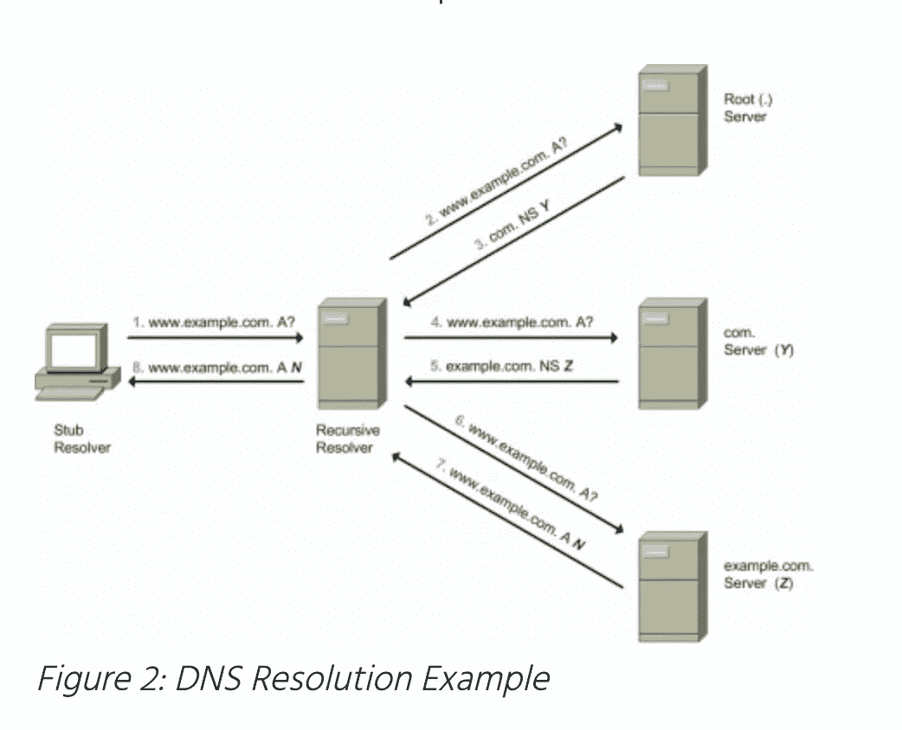

# DNS 简化的神话

> 原文：<https://blog.devgenius.io/the-myth-of-dns-simplified-e169a6dadc0a?source=collection_archive---------7----------------------->

这篇博客是我们从零开始讨论 **DevOps** 概念的系列文章的一部分，面向的是入门知识有限的读者。重述这个系列的前三篇博客，来自*初级*。这篇文章属于中级系列，因为它涉及到对一个简单而复杂的网络的端到端的理解，这是互联网的主干网(包括 **Web2 和 Web3】)**

本系列的早期博客

[**Ansible**](https://amit894.medium.com/ansible-hello-world-8d37627758a9)[**宋承宪**](https://amit894.medium.com/ssh-what-not-to-do-92c266ca430f)[**第一静态网站**](https://amit894.medium.com/public-cloud-first-static-website-7d6f7c6f794)[**本地**](https://medium.com/@amit894/k8s-on-laptop-first-proxy-f0413145c9d1)**K8**

# 什么是 DNS？

DNS 是世界上所有互联网地址的黄页。域名系统的简写，它是一种常见的可读的数字 IP 地址映射。这些 IP 地址又与服务器、本地负载平衡器以及基于云的部署模型等资源相关联。

**示例**-*amit894.medium.com*翻译成 162.159.152.4([IP v4](https://en.wikipedia.org/wiki/IPv4))地址和*2606:2800:220:1:248:1893:25 c8:1946*([IPv6](https://en.wikipedia.org/wiki/IPv6))

# DNS 是如何工作的？

DNS 名称空间是一种树型数据结构，每个节点或叶子与一个标签和零个或多个资源记录相关联。从根区域开始，从域/URL 的右侧到左侧遍历该树，并细分为进一步的子区域，这些子区域按照 URL 结构由点分隔。

最右边的标签被称为[顶级域名](https://en.wikipedia.org/wiki/Top-level_domain)，在上例中为*。com* 是 TLD。单个标签的大小为 0-63 个字符，整个 URL 不得超过 253 个字符，以满足最终用户和客户的易读性需求。

**参考 DNS 树**

# 什么是名称服务器？

它是一个分布式数据库，用户使用客户端-服务器协议来存储关于 DNS 系统的信息。每个域服务器至少包括一个*权威名称服务器*来保存 IP 映射，以及*0-n* *非权威名称服务器*取决于幕后的 DNS 解析。

**权威名称服务器-** It 配置为一次返回整个 DNS 解析，而不是查询整个树。它可以是主服务器，也可以是辅助服务器。

**递归和缓存域名服务器-** 如果互联网仅提供权威域名服务，则所有客户端必须在客户端上构建递归/迭代逻辑，以查询整个 DNS 树。我们使用递归和缓存名称服务器来卸载服务器端的递归/迭代，而不是在客户端上进行繁重的工作。

# DNS 查找的类型

**非递归查询-** 在这种情况下，DNS 解析器查询权威名称服务器并提供完整/部分记录，而无需查询层级中的其他名称服务器。

**递归查询-** 对于这种类型的查询，DNS 解析器使用单个 DNS 服务器，该服务器进一步使用层次结构中的其他 DNS 服务器来完成名称解析

**迭代查询-** 在这种情况下，DNS 解析器对一个或多个 DNS 服务器链进行多次查询尝试，以完成端到端地址解析。

在递归查询中，DNS 服务器执行遍历 DNS 树的繁重工作，而在迭代查询的情况下，这主要在客户端完成。

# **递归地址**解析如何工作？

DNS 本身是一个非常庞大的概念，涉及很多术语，这些术语在日常运营中并不需要。这个博客试图简化最常见的用例，所以每个人都很容易理解互联网自己的黄页。

如需反馈，请发邮件至**Amit[dot]894[at]Gmail[dot]com**或联系[https://about.me/amit_raj](https://about.me/amit_raj)的任何链接