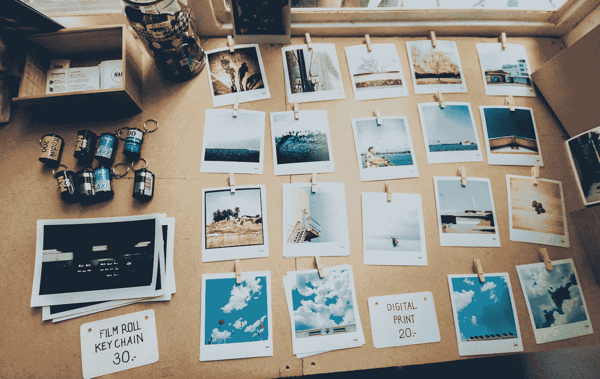
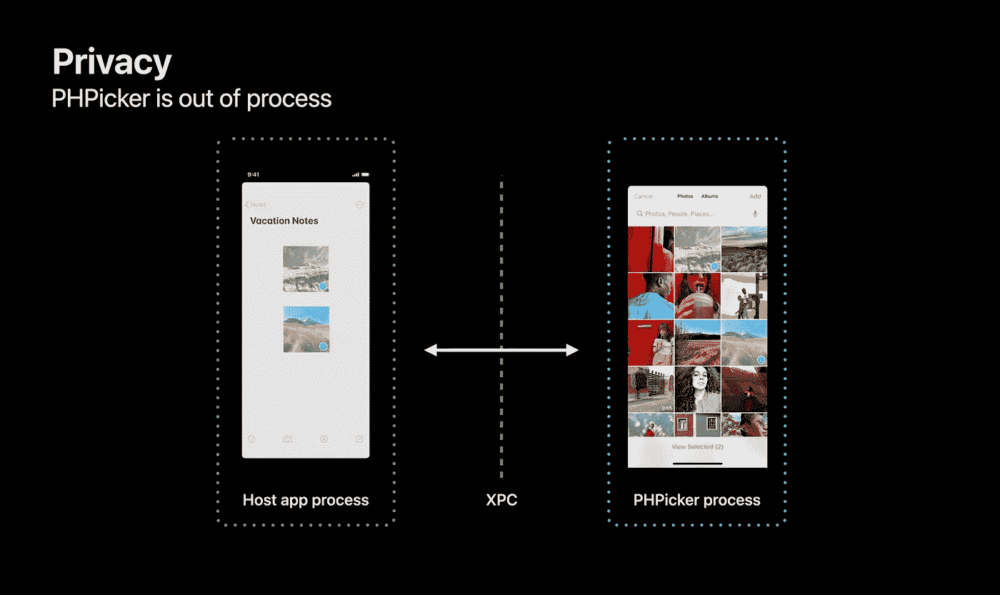
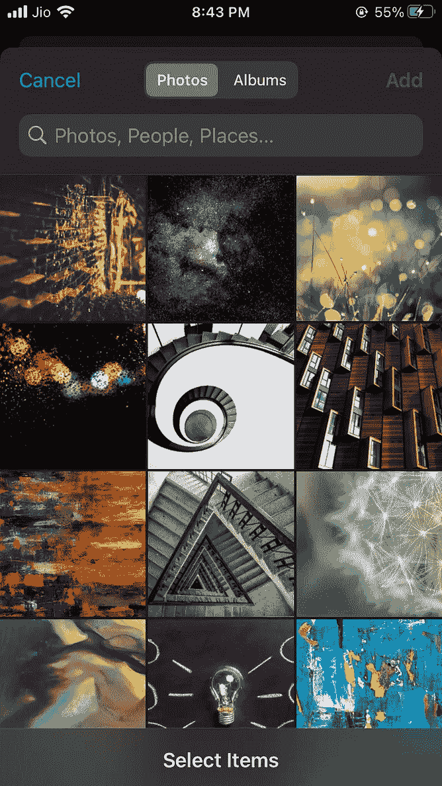
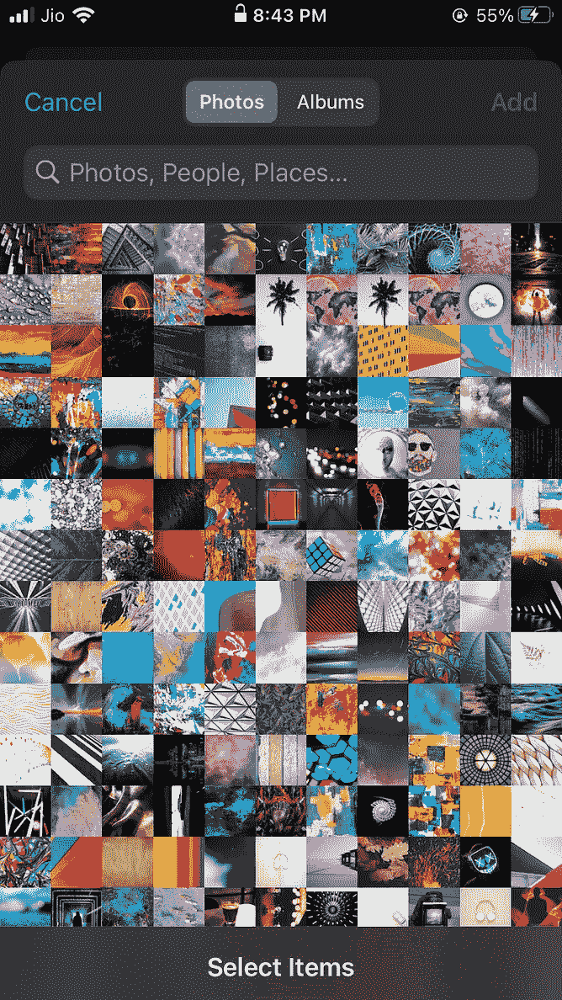
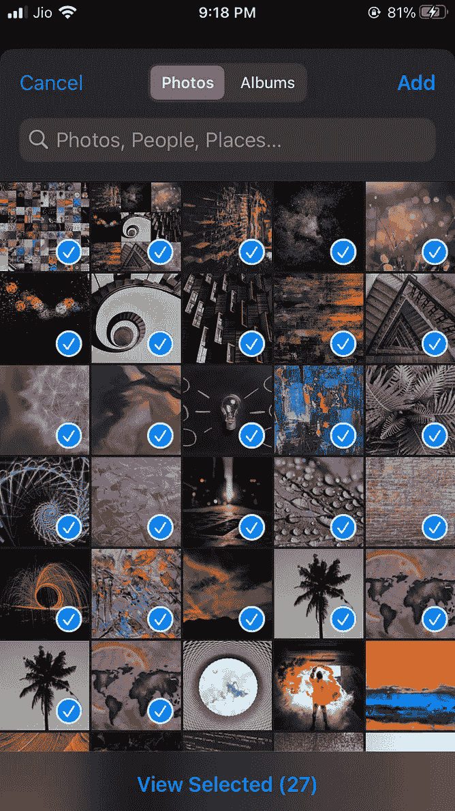
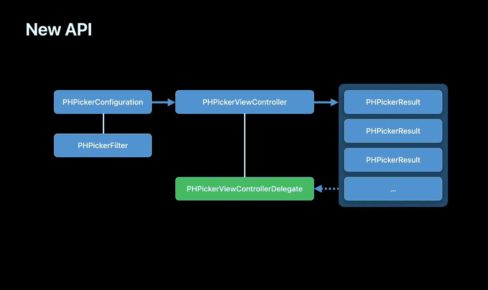

# iOS 14 中新的照片拾取器-第 1 部分

> 原文：<https://blog.devgenius.io/the-new-photos-picker-in-ios-14-part-1-c15e4820b335?source=collection_archive---------1----------------------->

## iOS 14 带来了一个新的图像拾取器，具有更新的用户界面和功能。让我们探索这个 API 带来的令人兴奋的新特性和更新，以及如何使用它。



照片由 [Soragrit Wongsa](https://unsplash.com/@invictar1997?utm_source=unsplash&utm_medium=referral&utm_content=creditCopyText) 在 [Unsplash](/s/photos/photo-collection?utm_source=unsplash&utm_medium=referral&utm_content=creditCopyText) 上拍摄

iOS 14 推出了新的 PHPickerViewController API，用于从 iPhones 照片库中拾取图像、实时照片和视频。这个 API 是 PhotoKit 的一部分，属于 PhotosUI 框架。这个 picker 立即**用UIImagePickerController 解决了一个老问题**,即**不能一次挑选/选择多个资产**!允许多重选择是这个 API 的最大特点，这将迫使所有开发人员更新他们的代码，并使用这个选择器，而不是 UIImagePickerController 或其他第三方库。不仅如此，我们还可以选择**搜索图片**，就像我们在 iPhone 的照片应用中所做的那样。让我们探索一下所有这些新 API 都提供了什么。

## **新提货人的隐私**

在 WWDC20 会议 [10652:认识新的照片拾取器](https://developer.apple.com/videos/play/wwdc2020/10652/)中提到，该拾取器在主机应用程序进程之外运行，主机应用程序无法访问。只有用户选择的内容才会与主机应用程序共享。还提到主机应用程序将无法对该选取器的内容进行截图。**我试图以编程方式对这个呈现的选取器视图进行截图**，但是**它没有在截图**中呈现任何内容。另外对于那些不清楚的人来说，即使在 iOS 14 中也可以对 UIImagePickerViewControllers 内容进行截图(**我试过了！**)。



WWDC20 会议 [10652:认识新的照片挑选者](https://developer.apple.com/videos/play/wwdc2020/10652/)

## **新拾取器的用户界面**



新照片拾取器的用户界面

新 Picker 的 UI 就是这样的，是不是很棒？我们可以选择所有的照片或相册，一个“添加”按钮，一个“取消”按钮和一个搜索栏。只有当我们指定选择多张照片时，添加按钮才会出现，我们还可以通过收缩来调整网格，以放大和缩小。在继续之前，我们必须注意到**该 API 处于测试阶段**并且仍在开发中，因此这不是最终版本，可能会在测试阶段进行修改。

## **使用 PHPickerViewController**



仍然来自 WWDC20 会议 [10652:认识新的照片拾取器](https://developer.apple.com/videos/play/wwdc2020/10652/)

PHPickerViewController 将 PHPickerConfiguration 作为初始化参数和实例属性。首先要创建 PHPickerConfiguration 的实例或引用。

```
// Create configuration for photo picker
**var configuration = PHPickerConfiguration()**
```

这里需要考虑两个主要属性，**过滤器**和**选择限制**。Filter 属性告诉选取器要显示哪种资产以供选择。该属性是可选的，类型为 PHPickerFilter。如果没有指定任何过滤器，它显示所有媒体类型，即图像，现场照片和视频。

```
// Specify type of media to be filtered or picked. Default is all
**configuration.filter = .images**
```

该过滤器的组合可以指定如下

```
**configuration.filter = .any(of: [.images,.livePhotos,.videos])**
```

selectionLimit 属性以整数为值，该值应为 **≥ 0** 。当前指定负整数**值**导致应用**崩溃。该属性的默认值为 1，这意味着只能选择 1 项资产。如果设置为 0，它可以选择无限的图像(它做到了，我尝试选择我的照片库中的所有图像，它的工作！).为该属性设置一个特定的数字将导致选择限制在设定的范围内。**

```
// For unlimited selections use 0\. Default is 1
**configuration.selectionLimit = 1**
```

现在我们已经准备好实例化我们的新选择器并呈现它。

```
// Create instance of PHPickerViewController
**let picker = PHPickerViewController(configuration: configuration)**
// Set the delegate
**picker.delegate = self
//** Present the picker
**present(picker, animated: true)**
```

这里需要注意的一点是，与 UIImagePickerViewController 不同，我们**不需要设置 UINavigationControllerDelegate**和 PHPickerViewControllerDelegate。现在，当我们已经将选择器设置为呈现所有正确的配置时，就该从这个选择器接收数据并解析它了。要接收数据，首先要实现 PHPickerViewControllerDelegate 的 didFinishPicking 方法。

```
**func picker(_ picker: PHPickerViewController, didFinishPicking results: [PHPickerResult])**
```

正如我们所看到的，我们有一个结果对象，它是一个 PHPickerResult 类型的数组，包含一个 NSItemProvider 对象。现在我们需要从这个项目提供者那里获取图像。

使用 NSItemProvider 对象分析图像的代码

这正是在 WWDC20 会议上演示的方式 [10652:认识新的照片拾取器](https://developer.apple.com/videos/play/wwdc2020/10652/)。这是从 NSItemProvider 解析图像的演示方式。

## 如何解析 livePhoto 和 Video？

由于这篇文章已经变得相当长，我将**写另一篇**作为这篇文章的延续，这篇文章将有这个问题的答案以及一个演示项目的链接。我还将在接下来的文章中包括讨论的要点，如-

UIImagePickerController 会怎么样？

PHPickerViewController 允许通过设备摄像头拍摄照片/视频吗？

**更新:**本文第二部分发表。你可以在这里查看[T5](https://medium.com/@aarsh.parekh/the-new-photos-picker-in-ios-14-part-2-f4864b5df837)

> 如果你想雇我做 app 开发，可以从 [**这里**](https://www.fiverr.com/aarsh_parekh)