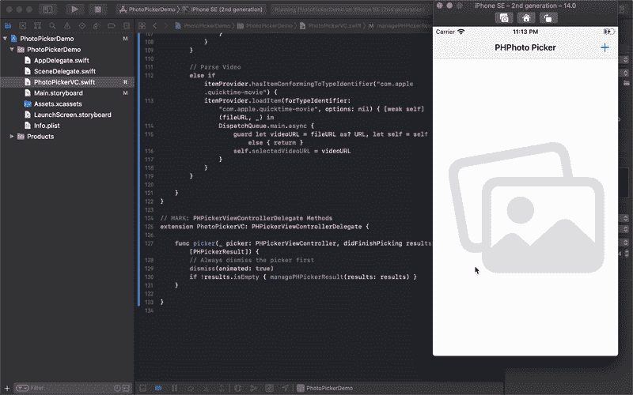

# iOS 14 中新的照片拾取器-第 2 部分

> 原文：<https://blog.devgenius.io/the-new-photos-picker-in-ios-14-part-2-f4864b5df837?source=collection_archive---------4----------------------->

## 这篇文章是我上一篇文章[“iOS 14 中的新照片拾取器-第一部分”](https://medium.com/@aarsh.parekh/the-new-photos-picker-in-ios-14-part-1-c15e4820b335)的延续。

来自 [Pexels](https://www.pexels.com/photo/selective-focus-photography-of-person-using-iphone-x-1542252/?utm_content=attributionCopyText&utm_medium=referral&utm_source=pexels) 的[凯德·塞弗林](https://www.pexels.com/@kseverin?utm_content=attributionCopyText&utm_medium=referral&utm_source=pexels)拍摄的照片

我以一个关于如何使用 PHPickerResult 解析实时照片和视频的未回答问题结束了我的上一篇帖子。除此之外，也没有什么其他问题需要讨论。所以让我们继续。

## 如何解析现场照片和视频？

解析实时照片就像解析图像一样简单。我们已经有了一个 PHLivePhoto 类，它可以用来检查 itemProvider 是否可以加载该类的对象，如果可以，我们可以加载 PHLivePhoto 的对象并将其设置为 PHLivePhotoView。

从 NSItemProvider 对象解析实时照片的代码

现在来看视频，**现在还没有通过 NSItemProvider 对象解析视频**的演示方法。但是我已经想出了一个很好的解决方法。我们可以在 itemProvider 中查找符合"**com . apple . QuickTime-movie "**类型的项目。要加载项目，我们可以使用项目提供程序的 loadItem(forTypeIdentifier:)方法，并加载视频的文件 url。

从 NSItemProvider 对象解析视频的代码

运行中的 PHPicker

## UIImagePicker 会在 iOS 14 中工作吗？

是的，事实上它将在 iOS 14 中呈现时采用 PHPicker 的 UI。从视觉上看，UIImagePicker 和 PHPicker 没有区别，PHPicker 被配置为一次只选择一个资产。遗憾的是，即使 UIImagePicker 继承了 UI，它仍然不能获取多个项目。

## **我们可以用 PHPicker 打开相机吗？**

目前它不支持打开相机拍照和录像。我们将不得不依赖于 UIImagePicker。

## **结论**

PHPicker 提供了许多令人兴奋的特性，但它还不完全稳定。由于该 API 处于测试阶段，它不能按预期工作。有时它会拾取图像，但大多数情况下它会显示错误，即文件不可用或文件不存在，即使它以前可以处理相同的图像/视频。我将继续用这个 API 的最新更新和变化来更新这篇文章。

要试用这个选择器，你可以从以下链接下载演示[https://github.com/aarsh518/PHPickerViewDemo](https://github.com/aarsh518/PHPickerViewDemo)

> 如果你想雇我做 app 开发，可以从 [**这里**](https://www.fiverr.com/aarsh_parekh) 开始