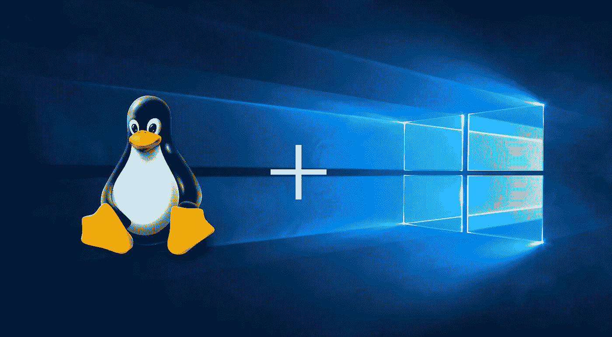
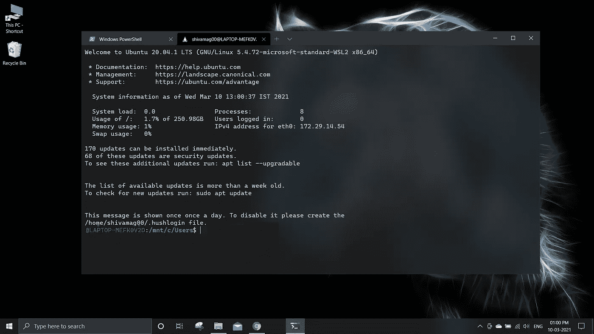
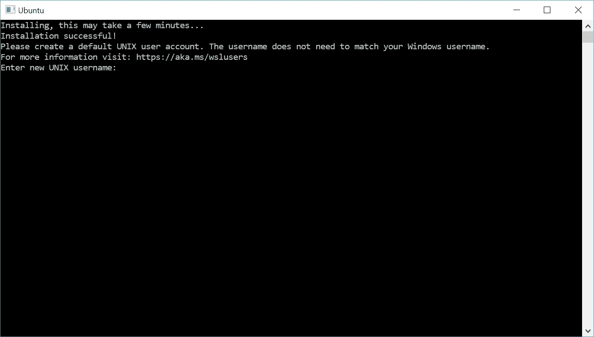

# 用 WSL 在 Windows 中无缝使用 Linux 的新方法

> 原文：<https://blog.devgenius.io/the-new-way-of-using-linux-seamlessly-inwindows-by-wsl-1870968f3209?source=collection_archive---------0----------------------->

通过**Windows Linux 子系统**在没有 VMWare、Virtual Box 等第三方软件的情况下在 Windows 中运行 Linux 内核



作者图片

有一个非常流行的观点，Linux 是软件开发的最佳操作系统，但 Windows 使用起来更容易、更舒适。这一定让你们中的许多人想知道是否有办法在 Windows GUI 下运行 Linux 内核。如果我们能做到这一点，我们将在单一操作系统中获得 Windows 和 Linux 的优势。

原来有一种方法可以做到这一点—**WSL(Linux 的 Windows 子系统)**

在单一操作系统中获得 Windows 和 Linux 的优势

# WSL 与双引导或运行虚拟化软件有什么不同？

**WSL vs 双引导**

*   双重启动意味着在一台计算机上安装多个操作系统，并且能够选择启动哪一个。
*   这意味着你不能同时运行两个操作系统。
*   但是如果你使用 WSL，你可以同时使用两个操作系统而不需要切换操作系统。

**WSL vs 虚拟化软件**

*   如今市场上有许多虚拟化软件。一些最受欢迎的是 Virtual Box、VMWare 等。你们中的一些人甚至可能用过其中的一个。
*   当您使用 VMWare 或 Virtual Box 时，您可以在 Windows 中运行 Linux(带 GUI ),但加载需要很长时间。此外，如果您需要从虚拟机(来宾操作系统)中访问存储在主操作系统或互联网中的文件，您需要安装多个驱动程序，这使得过程非常复杂。
*   WSL2 解决了所有这些问题。加载 Linux 内核只需要**不到一秒** **。该过程与在 Windows 中打开 CMD 或 PowerShell 相同。此外，Windows 桌面环境和 WSL2 环境之间的文件挂载/共享、命令运行和联网是无缝的，并且在启动时几乎是即时的。你不需要管理这个环境，它会和 Windows 一起更新。**
*   而且，**如果使用 WSL，可以从 Linux 内核使用安装在 Windows 上的程序**。VS 代码就是这样一个例子。可以从 Linux 内核执行命令`*code file_name*` 打开 VS 代码(安装在 Windows 中)的文件。

# WSL 看起来怎么样？

如果你是一个更相信看东西而不是读东西的人，你可以看看下面提到的照片。



在 Windows 上使用 WSL 运行 Linux

在上图中，您可以看到一个 linux 终端正在 windows PC 上运行，就像 Windows PowerShell 一样。

# 如何安装 WSL？

在本文中，我们将告诉你如何启用 WSL2 并安装你选择的 Linux 发行版。WSL 2 是 WSL 的最新版本，甚至更好。要了解更多，你可以访问这个微软文档[链接](https://docs.microsoft.com/en-us/windows/wsl/compare-versions)。

要安装 WSL 2，我们会先安装 WSL，然后升级到 WSL 2。

安装 Windows Subsystem for Linux (WSL)有两个选项:

1.  [简化安装](https://docs.microsoft.com/en-us/windows/wsl/install-win10#simplified-installation-for-windows-insiders)(预览)

*   在 powershell 终端上执行命令— `wsl --install`将安装 WSL，不需要任何额外的步骤。但是这个命令要求你加入 [Windows Insiders 计划](https://insider.windows.com/getting-started)并安装 Windows 10 的预览版(OS build 20262 或更高版本)。

2.[手动安装](https://docs.microsoft.com/en-us/windows/wsl/install-win10#manual-installation-steps):

*   手动安装步骤可以用在**任何版本的 Windows 10** 上。

# 手动安装 WSL 2

## 步骤 1 —为 Linux 启用 Windows 子系统

*   我们必须首先启用“Linux 的 Windows 子系统”可选功能。
*   以管理员身份运行 PowerShell，并执行以下命令:

```
dism.exe /online /enable-feature /featurename:Microsoft-Windows-Subsystem-Linux /all /norestart
```

**该命令可能需要 40-90 分钟来运行**。此外，在执行这个命令时，不会有太多输出到终端。因此，在执行这个命令时，您必须要有耐心:)

*   请勿在此阶段重启电脑。

## 步骤 2 —检查运行 WSL 2 的要求

要更新到 WSL 2，必须运行 Windows 10。

*   对于 x64 系统:版本 1903 或更高，内部版本号 18362 或更高。
*   对于 ARM64 系统:版本 2004 或更高，内部版本 19041 或更高。
*   低于 18362 的版本不支持 WSL 2。使用 [Windows 更新助手](https://www.microsoft.com/software-download/windows10)更新您的 Windows 版本。

## 步骤 3 —启用虚拟机功能

*   在安装 WSL 2 之前，我们必须启用虚拟机平台可选特性。
*   以管理员身份运行 PowerShell 并执行:

```
dism.exe /online /enable-feature /featurename:VirtualMachinePlatform /all /norestart
```

重新启动您的机器以完成 WSL 安装并更新到 WSL 2。

## 步骤 4 —下载 Linux 内核更新包

*   使用以下链接下载最新的包— [用于 x64 机器的 WSL2 Linux 内核更新包](https://wslstorestorage.blob.core.windows.net/wslblob/wsl_update_x64.msi)。**如果你使用的是 ARM64 机器，请下载** [**ARM64 包**](https://wslstorestorage.blob.core.windows.net/wslblob/wsl_update_arm64.msi) **代替。**如果你不确定你用的是哪种机器，打开命令提示符或者 PowerShell，输入:`systeminfo | find "System Type"`。
*   运行上一步下载的更新包。(双击运行—将提示您提升权限，选择“是”批准此安装。)

## 步骤 5 —将 WSL 2 设置为默认版本

运行 PowerShell 并执行以下命令，在安装新的 Linux 发行版时将 WSL 2 设置为默认版本:

```
wsl --set-default-version 2
```

## 步骤 6——安装您选择的 Linux 发行版

打开微软商店，选择您喜欢的 Linux 发行版。以下链接将打开每个发行版的 Microsoft store 页面:

*   [LTS Ubuntu 16.04](https://www.microsoft.com/store/apps/9pjn388hp8c9)
*   [LTS Ubuntu 18.04](https://www.microsoft.com/store/apps/9N9TNGVNDL3Q)
*   [LTS Ubuntu 20.04](https://www.microsoft.com/store/apps/9n6svws3rx71)
*   [openSUSE Leap 15.1](https://www.microsoft.com/store/apps/9NJFZK00FGKV)
*   [SUSE Linux 企业服务器 12 SP5](https://www.microsoft.com/store/apps/9MZ3D1TRP8T1)
*   [SUSE Linux 企业服务器 15 SP1](https://www.microsoft.com/store/apps/9PN498VPMF3Z)
*   [卡莉 Linux](https://www.microsoft.com/store/apps/9PKR34TNCV07)
*   Debian GNU/Linux
*   [WSL 的 Fedora 混音](https://www.microsoft.com/store/apps/9n6gdm4k2hnc)
*   [彭温](https://www.microsoft.com/store/apps/9NV1GV1PXZ6P)
*   [鹏润企业](https://www.microsoft.com/store/apps/9N8LP0X93VCP)
*   [阿尔卑斯山 WSL](https://www.microsoft.com/store/apps/9p804crf0395)

在 Windows Store 上打开发行版页面后，选择`Get`安装该发行版。

第一次启动一个新安装的 Linux 发行版时，会打开一个控制台窗口，要求您等待一两分钟，让文件解压缩并存储到您的 PC 上。所有未来的发射应该不到一秒钟。

然后，您需要[为您的新 Linux 发行版](https://docs.microsoft.com/en-us/windows/wsl/user-support)创建一个用户帐户和密码。



# 恭喜你！

您已经成功地安装并设置了与您的 Windows 操作系统完全集成的 Linux 发行版！

我们还建议您安装 Windows 终端。这是**完全可选的**,但会大大增强你对 WSL 的体验。

学分:Windows 开发人员

Windows 终端**启用多个标签**(在多个 Linux 命令行、Windows 命令提示符、PowerShell、Azure CLI 等之间快速切换。)、**创建自定义键绑定**(打开或关闭标签页、复制+粘贴等快捷键。)、**使用搜索功能**和**自定义主题**(配色方案、字体样式和大小、背景图像/模糊/透明)。

您可以访问下面的[链接](https://docs.microsoft.com/en-us/windows/terminal/)来了解更多关于 Windows 终端的信息

要知道如何安装 Windows 终端，可以访问这个[链接](https://docs.microsoft.com/en-us/windows/terminal/get-started)