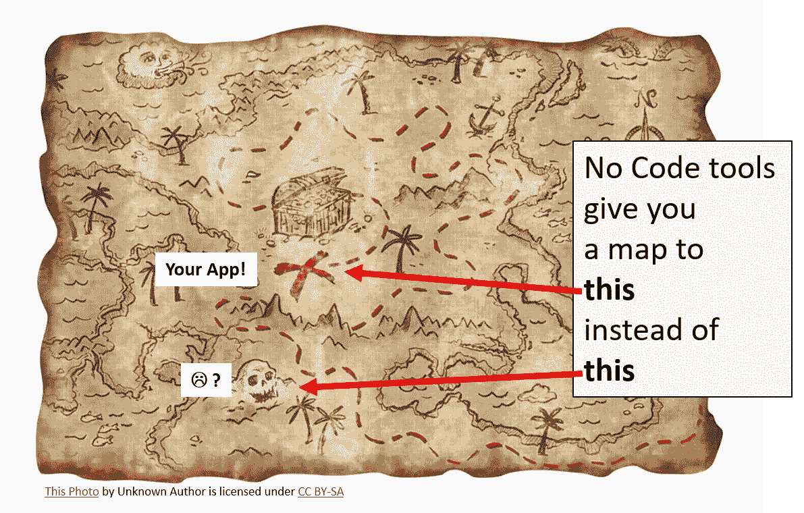

# 无代码运动

> 原文：<https://blog.devgenius.io/the-no-code-movement-6a19e26a15af?source=collection_archive---------25----------------------->

我试图从历史的角度深入了解这场运动是什么及其影响。

**什么是无代码？**

这是一个有点松散的术语，用来描述一组工具(应用程序)，它们允许非软件程序员创建一个应用程序/网站/软件程序，而根本不需要编写任何代码。但是，实际上它更像是“非常少的代码”,而不是没有代码。然而，这些工具已经发展到了非程序员也可以开发应用和网站的地步。想了解更多看看这些: [Zeroqode](https://zeroqode.com/) ， [nocode.tech](https://www.nocode.tech/) ， [Makerpad](https://www.makerpad.co/) 。这些只是少数，还有很多很多。

> 如果你有一个令人信服的想法，你可以使用这些工具为它创建一个应用程序。你不需要成为一名训练有素的软件程序员。

**这些工具给了你什么？**

你有一个伟大的想法，你认为会产生收入。但是等等，你不是一个软件人。你甚至不知道从哪里开始。直到最近，除了寻找昂贵的(时间+金钱)途径来寻找一个程序员或技术团队来建立至少一个 MVP，你还能做什么。

理解的关键是，你仍然必须使用那些工具来构建你认为可以使用的东西。这些工具不能替代对需求和市场适合度的清晰认识。当然，如果你有时间和兴趣，你总是可以使用这些工具快速迭代到一个稳固的市场适合度。

> 更重要的是，事实上这些工具提供的复杂性(以及灵活性)是有限的。

在某种程度上，他们会碰壁，他们能为你做什么，而不用撬开盖子，看看下面的血淋淋的细节，在那里你将需要一个技术人员来进一步移动。一些无代码工具很可能将此作为其业务模型的一部分。

**一堂历史课(或者，“无代码是一种进化，而不是一场革命”):**

有经验的程序员会知道，no-code 只是尝试和自动化创建软件过程的阶梯中的又一级。老前辈可能还记得，像智能感知这样的东西出现的时间并不长。尽管如此，我还是很感激——我不喜欢以前每次在代码中使用第三方函数时都要停下来查看文档的日子！早在 20 年前，当我们在 IDE 中拥有软件项目创建向导时，我们就已经看到了这样的自动化。我是根据个人经历写的。

**需要知道的事情(或者，“细节决定成败”):**

在这一演变过程中，有一点是不变的，即当试图捕捉程序员的“意图”时，自动化仍有许多不足之处。抽象思维仍然不是软件所擅长的。如果您计划利用无代码工具，请注意:

*   你不得不搁置你的想法，或者更糟糕的是，把完全的创作控制权交给另一方的日子已经一去不复返了。您可以在比以前更深的技术层面上帮助推动软件的实际创建。你可以在没有恐惧和不知道自己得到什么的情况下做出合理的选择。

*   这些工具对你来说是一个黑匣子。对于你所关心的，有魔法在下面，一些未知的力量正在把你的想法带入生活。过了一个点，你将需要处理这些力量，然后你必须考虑雇佣一些可以帮助你的人。

这么说，程序员失业了？

当然不是。这些工具将被视为你武库中的又一件武器。拥有它们可以保证，作为程序员，你可以比以前更快地用更成熟的代码创建工作软件。你已经(可能)通过使用你选择的语言(Java Spring，C#)中的各种框架来做这件事了。NET、Django Python——不胜枚举)。无代码是一个加速器，可以帮助你在保持质量的同时更快地前进。

> 无代码的影响不仅适用于程序员，也适用于类似 UX、UI 设计和测试这样的相关学科。上面给出的相同论点也适用于这些。

**机遇**:

无代码运动也为技术人员带来了许多机会:

*   创建扩展无代码工具的支持胶栈
*   无代码工具用户界面，让非技术人员轻松构建他们的应用程序
*   特定领域的无代码工具可以走得更远，因为它们可以做出更集中的假设
*   最后，总是需要有经验的程序员，他们可以在系统层面上进行推理，并创建一个可行的软件包，与无代码工具一起工作。

*感谢您阅读这篇文章！我欢迎您的任何意见或疑问。我是一名独立的技术顾问，我帮助组织在利用机器学习、云计算、物联网、移动应用程序和其他技术开展业务的过程中导航。最近，我 a)启动、设计并制作了一个医疗保健生物反馈平台的原型，b)构建了一个大数据分析管道，c)在自然语言处理领域开创了新方法，d)使用机器学习帮助自动化业务流程，以及 e)稳定并改进了一个报告主要领域问题的 ETL 测试产品。如果您或您的组织正在寻求数字化转型方面的帮助，* [*给我*](https://www.linkedin.com/in/sushrut-mair-3769b62/) *留言吧！*