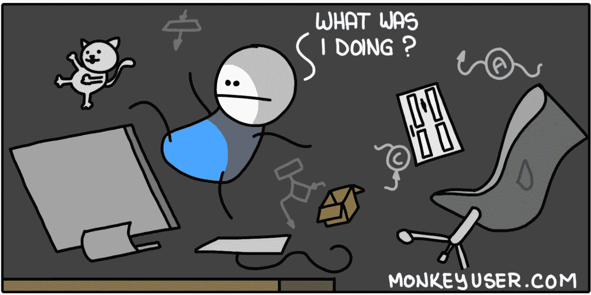
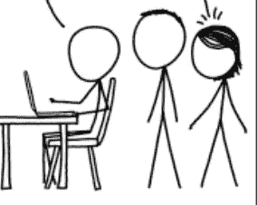
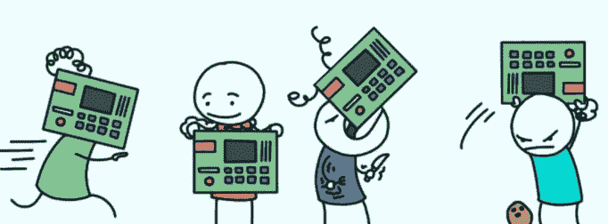

# 观察者效应

> 原文：<https://blog.devgenius.io/the-observer-effect-a3be85b0a502?source=collection_archive---------36----------------------->

当你浏览代码和在不同窗口间切换时，你在键盘上噼啪作响。你在错误、问题和概念中奋力前进。你感觉*真的*好因为你今天在状态中。

你会完成的。但是等等！

有人走向你，问你一个问题。也许他们轻拍你的肩膀。也许他们暴力地做手势试图引起你的注意。就像奇异博士一样，你会被不稳定的多重宇宙拉回现实。当你坐在椅子上转身面对他们时，你低声叹息。

他们双手叉腰站着，等着你的回答，而你内心很恐慌，试图表现得很有能力。

【https://xkcd.com/ 

在量子世界中有一种效应叫做[观察者效应](https://en.wikipedia.org/wiki/Observer_effect_(physics)) t，仅仅是观察一个现象的行为就会改变它的结果。这种效果可能是也可能不是我们所认为的那样，但在我看来，这在一定程度上是真实的。我认识的一些最聪明的人在我看到人们观察他们的那一刻就变成了智力障碍。也许这就是为什么能够很好地谈论技术的人和能够很好地做技术的人之间没有太多交集的原因。

所有这些文字只是为了证明为什么我不喜欢结对编程的概念，竞争性编码和一般的采访。这么想吧。你不会在其他员工工作时呆呆地看着他们&强迫他们当场想出复杂问题的解决方案，并期待完美。在某种程度上，质量和速度似乎总是在玩一场零和游戏。

但是怎么做呢？你如何衡量一个人的技术能力？

这里有一个方法:也许通过给候选人一个非常抽象的、原创的&稍微不相关的问题来补充你的过程。它创造了奇迹。请他们记录他们做的每一件事，他们的每一个问题，他们使用的每一种资源，并给他们机会展示他们最好的一面。

为什么抽象？因为你可以看到他们问的问题以及他们如何从中获得意义。

为什么略有关联？因为你可以向他们投出曲线球。他们知道大局，但不知道如何解决这个特殊的问题。他们从哪里开始？它们放大到哪里？作为一名面试官，你不觉得这很有价值吗？

让他们自己去修补吧(monkeyuser.com)

类似于一个迷你功能周期，不是吗？这不正是你最终希望他们做的吗？

工程的核心是解决问题。这就是为什么我们应该关注候选人是否真的能为自己打造解决问题所需的工具，而不是向他们抛出同样的老问题。我可以保证它会让你的过程变得复杂、不规范、耗时。但是当你根据你的标准找到合适的人时，你可以确定你找到了一块宝石。或者至少是一个正在形成的。