# Unity 中的观察者模式

> 原文：<https://blog.devgenius.io/the-observer-pattern-in-unity-4ee8e12100aa?source=collection_archive---------0----------------------->

## 也称为发布者模式，或者我称之为事件模式。

> **观察者模式**是一种[软件设计模式](https://en.wikipedia.org/wiki/Software_design_pattern)，其中一个名为**主题**的[对象](https://en.wikipedia.org/wiki/Object_(computer_science)#Objects_in_object-oriented_programming)维护一个名为**观察者**的依赖者列表，并自动通知它们任何状态变化，通常通过调用它们的[方法](https://en.wikipedia.org/wiki/Method_(computer_science))之一。
> 来源:[观察者模式](https://en.wikipedia.org/wiki/Observer_pattern)

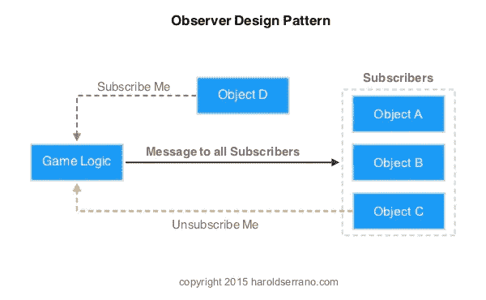

这有助于我们保持类的松散耦合。游戏逻辑将运行，当事件发生时，它发布事件，观察者将对事件做出反应。订户正在监听(观察)该事件的发生。游戏逻辑是发布事件。这是一种一对多的交流方式。你有一个类 publisher，它想给许多不同的观察者发送一个消息，它不关心他们是谁或者他们对事件做了什么。这是一场火灾，忘记。这也有助于稳固的开闭原则，一旦实现就很容易扩展(通过添加额外的行为)，但代码不需要改变来添加这些行为。

# 履行

我有一个可以升级的游戏。当角色升级时，我想让一个粒子来玩，并让角色将当前的生命值重置为完全生命值。

为了设置场景，我有一个关卡脚本来控制角色的关卡，一个健康脚本来控制角色的健康，还有一个调试器脚本来模拟 UI。为了简单起见，为了测试角色，角色将每 0.2 秒获得 10 点经验值，每秒失去 2 点生命值，调试器脚本将显示当前经验值、当前等级和当前生命值。在一个真实的游戏中，这将被替换为实际的游戏逻辑，包括健康系统、等级系统和适当的 UI 来显示所有这些。

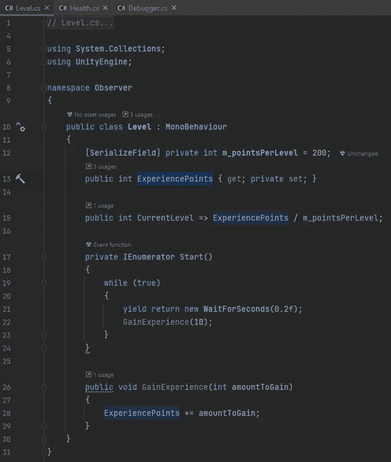

Level.cs

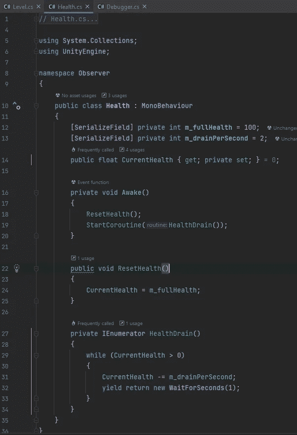

Health.cs

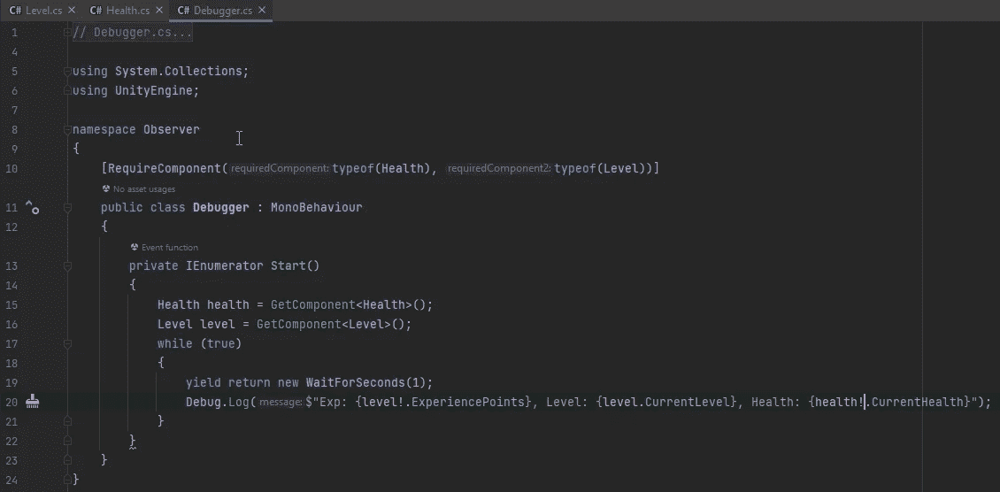

调试器. cs

在我的场景中，我有一个游戏对象，它有关卡、健康和调试器组件，以及一个简单的粒子系统。

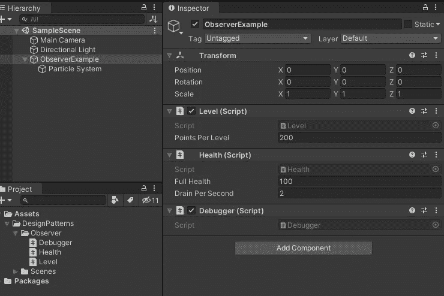

Unity 设置

播放模式

## 团结事件

Unity 使得用 Unity 事件实现观察者模式变得容易。

Unity 事件最多可以有 4 个参数，我只展示了 0 个参数的用法。

 [## UnityEvent

### UnityEngine 中的类。事件/ /建议更改感谢您帮助我们提高 Unity 文档的质量…

docs.unity3d.com](https://docs.unity3d.com/ScriptReference/Events.UnityEvent.html) 

> 可以与场景一起保存的零参数持久回调。
> 
> 来源:[团结事件](https://docs.unity3d.com/ScriptReference/Events.UnityEvent.html)

要使用它，我需要做的就是在我的关卡脚本中添加一个 Unity 事件。

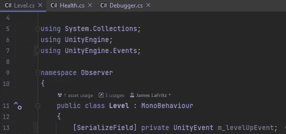

UnityEvent 已添加到 Level.cs

在 Unity 中，我在关卡中添加了一个事件来访问粒子系统游戏对象的粒子系统组件的播放功能。

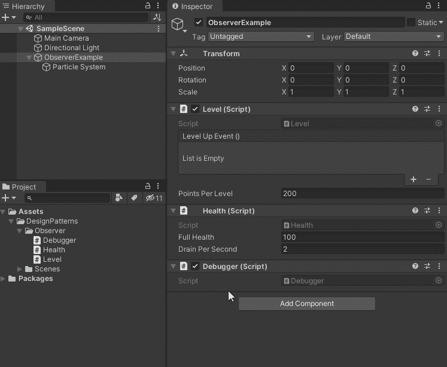

让粒子系统在事件触发时播放。

现在剩下的就是在关卡中添加一些游戏逻辑，通知观察者我们已经升级了。

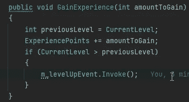

现在，当角色升级时，粒子系统会显示角色升级的视觉提示。

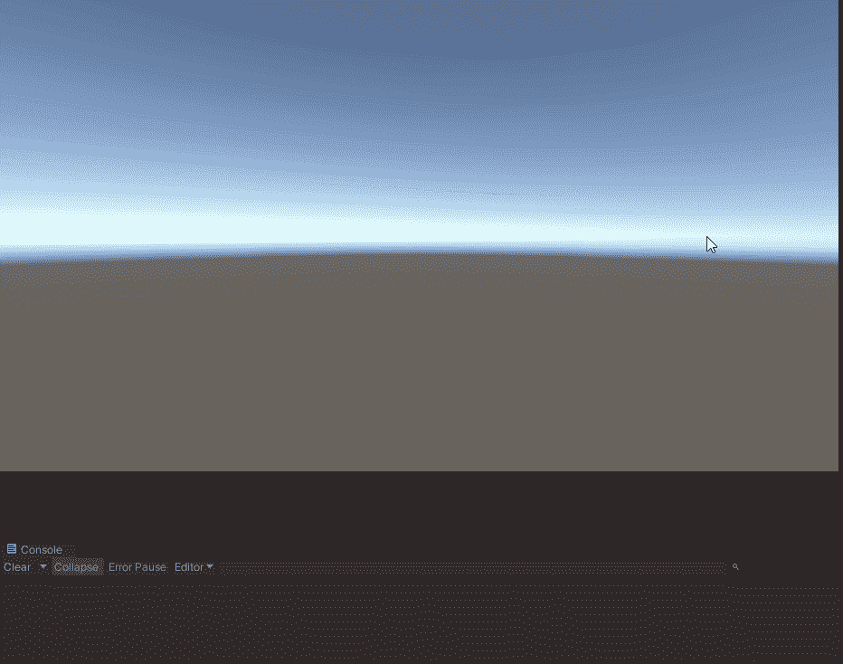

粒子系统播放

现在，当 Unity 事件触发时，我可以做同样的事情来重置健康。

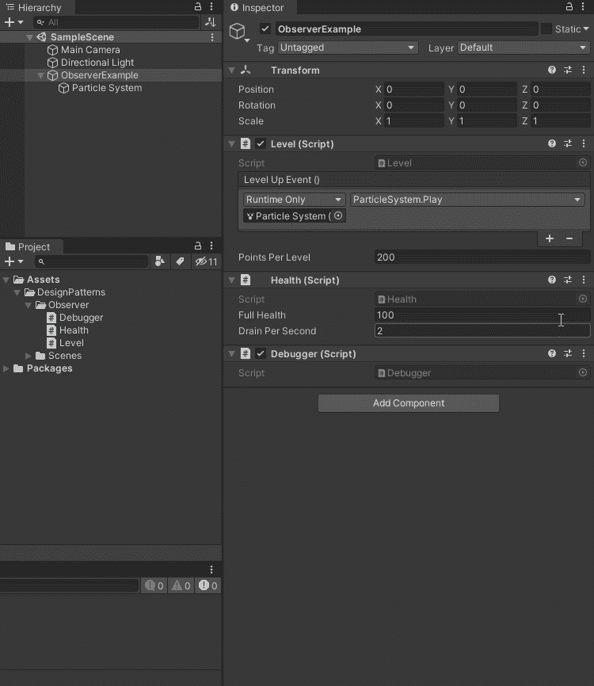

将运行状况重置添加到 Unity 事件。

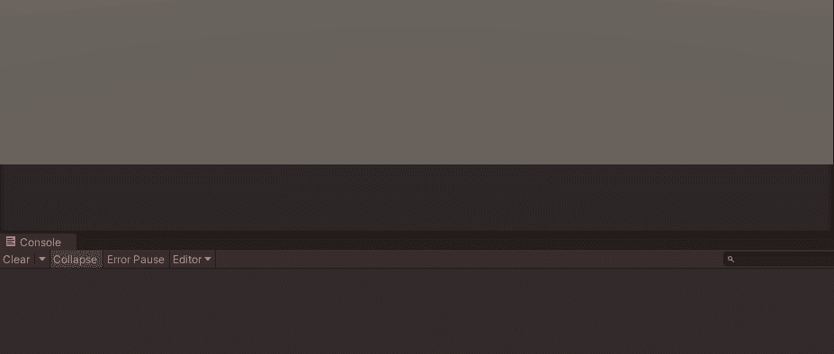

每次角色升级，生命值都会重置

现在，我可以很容易地添加其他观察者，他们会对角色升级做出反应，就像一个实际的用户界面。

## 代表、动作和事件

现在我不想给每个有生命值的角色增加一个单位事件来在角色升级的时候休息生命值。我可以公开这个级别的 Unity 事件，并在 Health 脚本中注册 Health Rest 方法。C#有另一种方法，你可以使用委托、动作和事件。

要使用观察者模式，我们需要一个委托，它是要调用的方法和要调用的事件的签名。

 [## 委托类(系统)

### 公共引用类委托抽象公共引用类委托抽象:ICloneable…

docs.microsoft.com](https://docs.microsoft.com/en-us/dotnet/api/system.delegate?view=net-6.0) 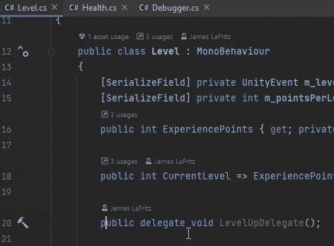

将委托添加到级别

 [## 事件- C#参考

### event 关键字用于声明 publisher 类中的事件。下面的示例显示了如何声明和…

docs.microsoft.com](https://docs.microsoft.com/en-us/dotnet/csharp/language-reference/keywords/event) 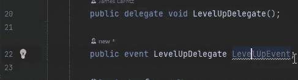

添加到关卡的关卡升级事件

现在我们需要在角色升级时调用事件。

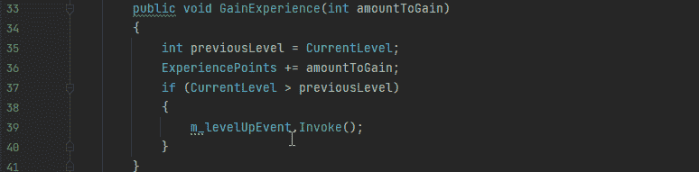

在调用事件之前，我确保事件中添加了方法，我也应该用 UnityEvent 来做这件事。

在代码中使用事件的最佳实践是当脚本被启用时注册到它，当它被禁用时取消注册(不需要时不需要运行方法)。如果观测器被破坏，这也将防止错误。

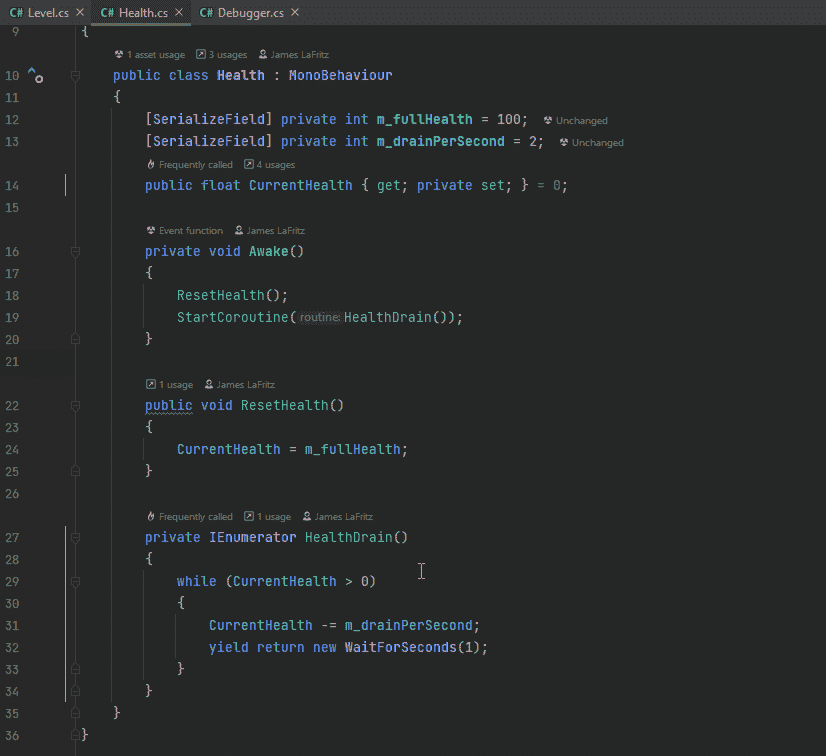

现在角色的生命值会随着等级的提升而重置。

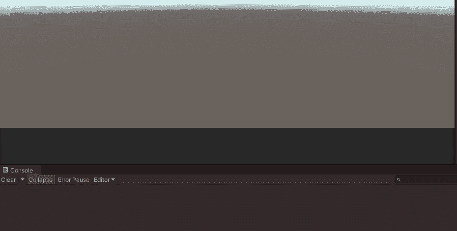

我也可以在事件中使用参数。

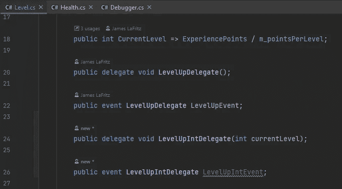

添加 Int 参数以升级事件

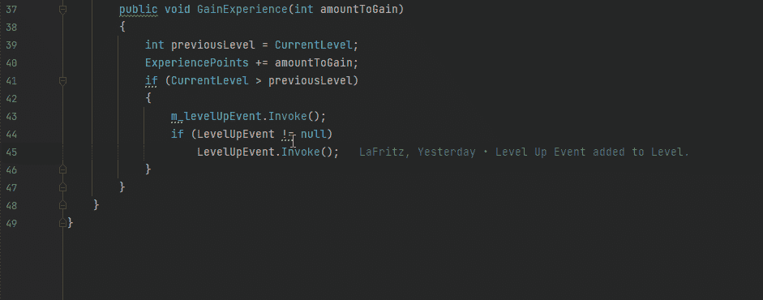

用参数调用委托

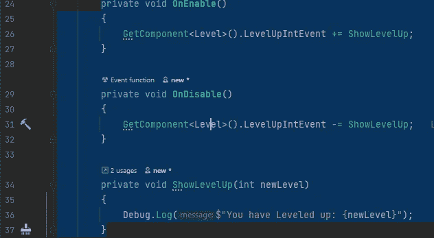

注册和取消注册与无参数事件相同。

 [## 动作委托(系统)

### 公共委托 void Action()；公共委托 void Action()；类型 Action =单位委托->单位公共委托…

docs.microsoft.com](https://docs.microsoft.com/en-us/dotnet/api/system.action?view=net-6.0) 

动作是独特的，因为它们组合了代理和事件。您不必为了调用操作而声明委托。

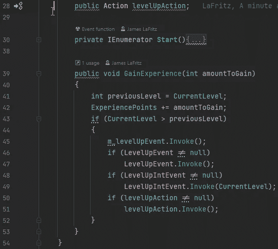

向级别添加操作

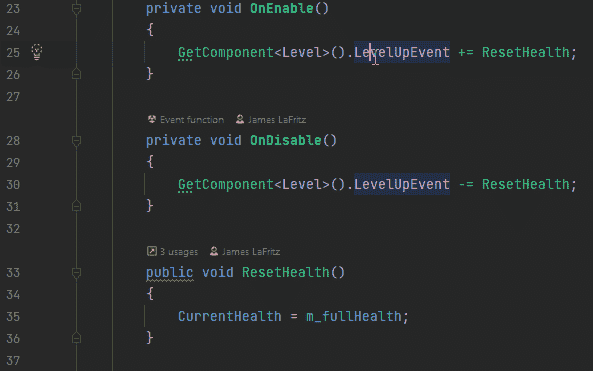

用健康行动代替健康事件

当然，我也可以在动作中使用参数。

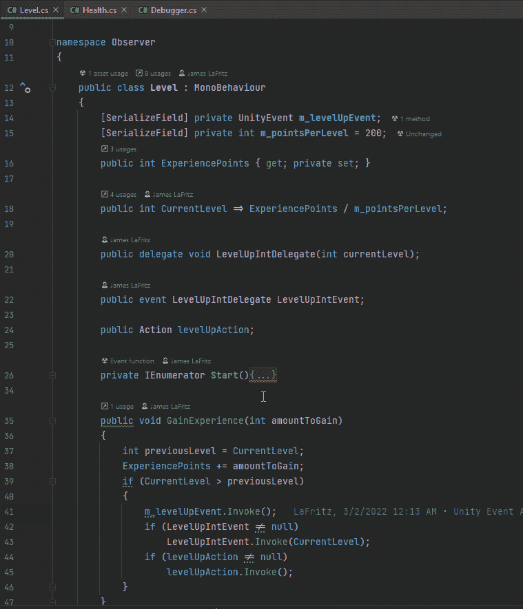

有一点需要注意的是，当使用实参/参数时，我喜欢委托/事件而不是动作，因为委托可以更好地描述实参的用途，从而产生更干净的代码，使代码更具文档化和可读性。

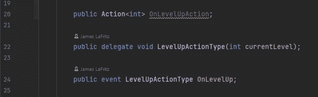

# 结论

观察者模式对于任何程序员的工具箱都是一个有用的工具。它有助于保持您的代码松散耦合，并实现可靠的开闭原则。您可以使用 Unity 事件或 C#委托/事件或动作在您的代码中实现它。你如何实现取决于你的需求和你想要达到的目标。

代码可以在我的 GIT Hub 上找到

 [## GitHub-JamesLaFritz/observer pattern 上的统一设计模式

### 报告 Bug 请求特性展示了 Unity 中不同的编程设计模式。有许多不同的…

github.com](https://github.com/JamesLaFritz/Design-Patterns-For-Unity/tree/ObserverPattern)