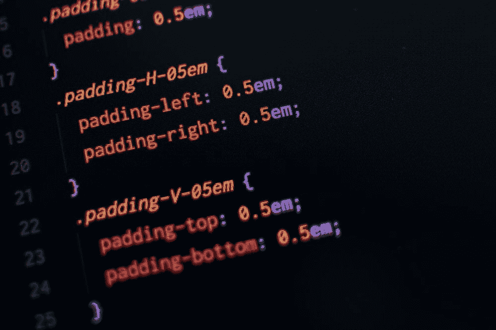
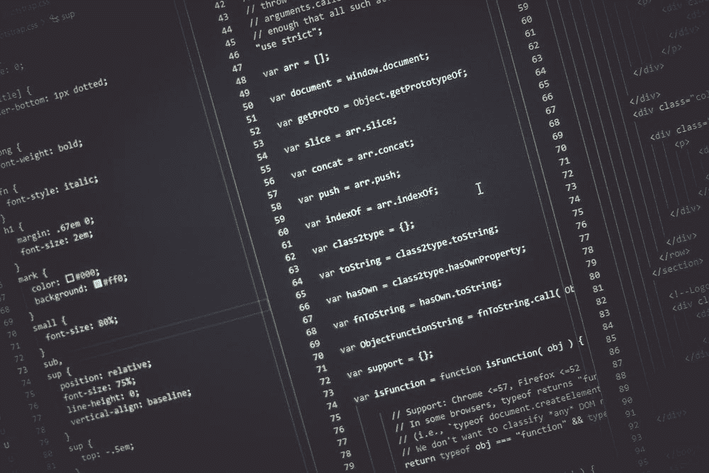
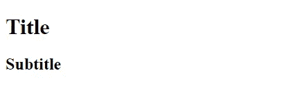
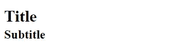

# 初学者需要了解的关于 HTML 和 CSS 的一件关键事情

> 原文：<https://blog.devgenius.io/the-one-key-thing-beginners-need-to-understand-about-html-and-css-dc73cc073a8e?source=collection_archive---------22----------------------->

## 理解默认值的解释和练习。

# 像大多数 web 开发初学者一样，我对 CSS 的第一反应是直接投入进去。

我想立即制作网站。这是一种很好的本能——作为人类，我们通过项目，通过弄脏我们的手来学习。

但我很快变得沮丧。事情看起来不太对劲。间距不对，文本看起来不合适。我觉得我看到的页面没有反映出我输入的代码。虽然这可能有很多原因，但我忽略了一个基本的理解:我不知道默认值是什么。

默认值就是它们听起来的样子。**对于每个 HTML 元素，比如 h1、h2 或 div，都有相应的默认 CSS 值。**让我们以 h1 的默认值为例进行分析。

正如我们在上面看到的，h1 元素实际上只是一个应用了几个 CSS 属性的文本元素。当我们想到 h1 的特别之处时，我们会想:它很大，很大胆，对吧？**我们可以在这里看到这是如何反映在其默认值中的。它的字体大小是 h1 字体大小的两倍(因为我们使用的是 em 单位)** **。而且是字体粗细？大胆。**

这就是 h1 元素的核心。这不是什么特殊的，碰不得的东西。它不是天生的大和大胆。通过适当的调整，我们可以让它变得小巧而简单。它只是一段带有内置 CSS 样式的文本。

为了强调这一点，让我们检查一个 h2 进行比较。

自然，h2 和 h1 非常相似，除了在字体大小上有 5em 的差异。可能会让你惊讶的是，h2 比 h1 有更大的边距。这意味着 h2 元素和另一个元素之间的间距实际上大于 h1 元素和另一个元素之间的间距。

初学者最大的误解是像 h1 和 h2 这样的 html 元素本质上是不同的。他们不是。他们只是有不同的 CSS 预设。不同的“默认值”

那么，为什么这是一件大事呢？默认值是关键，因为它们向我们展示了 HTML 元素开箱后的反应，假设我们没有覆盖它的属性。一旦你理解了 h1 并不是天生的大而粗，它仅仅是内置 CSS 的结果，你就会对你的代码是如何工作的有更深的理解。

# 让我们把这个付诸实践。

作为初学者，你会遇到的第一个问题是，有些东西看起来不像你想要的样子，你完全不知道为什么或者如何修复它。假设你想把你的标题和副标题定制得尽可能的接近，这就是你的基础代码。

你打开网页，看到的是这个。唉，这两个元素之间的空间太大了！啊！为什么！

现在你知道为什么了。根据您对缺省值的了解，您知道 h1 上有一个 0 . 67 EMS 的利润下限，h2 上有一个 0 . 83 EMS 的利润上限。

⭐，你的第一直觉可能会认为这意味着这两个元素之间有 1.5ems 的空间。这是有道理的，对不对？添加值？没有。原因是因为 **CSS 有崩溃的边缘。两个对象之间的边距总是等于较大的边距。所以 h1 和 h2 之间有 83ems 的空间。**

假设我们想要两个物体之间有 0.1 米的空间。有多种方法可以做到这一点。我们可以给 h1 一个 0 . 1em 的边距下限，给 h2 一个 0 的边距上限，或者反过来。或者我们可以给这两个值都取. 1em。让我们试试这种方法。

**正如我们现在看到的，标题和副标题之间有 0.1 米的空间。**即使 h1 的 margin-bottom 为 0，或者 h2 的 margin-top 为 0，看起来也是一样的。由于边缘塌陷，只要这些元素中至少有一个元素保留了某种 0.1 毫米的边缘，该空间将保持不变。

# 接下来呢？

有了这些知识，是时候重新开始编码了。无论何时你可能会问自己:为什么那个元素会这样？为什么这些元素的间距如此之大？为什么这个元素会换行，而这个元素不会？(提示:块与行内块)您的定位标签正在查找其默认值。