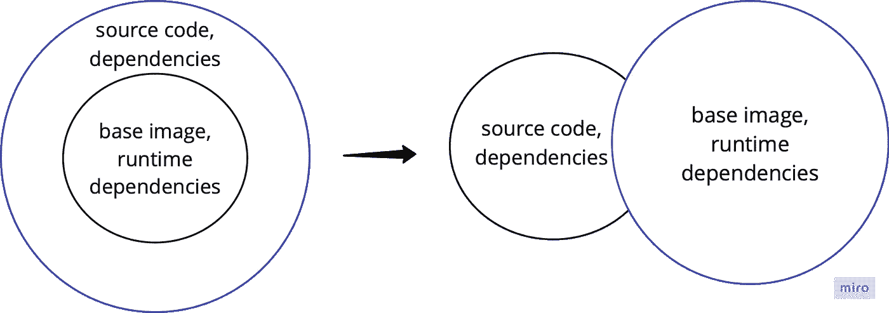
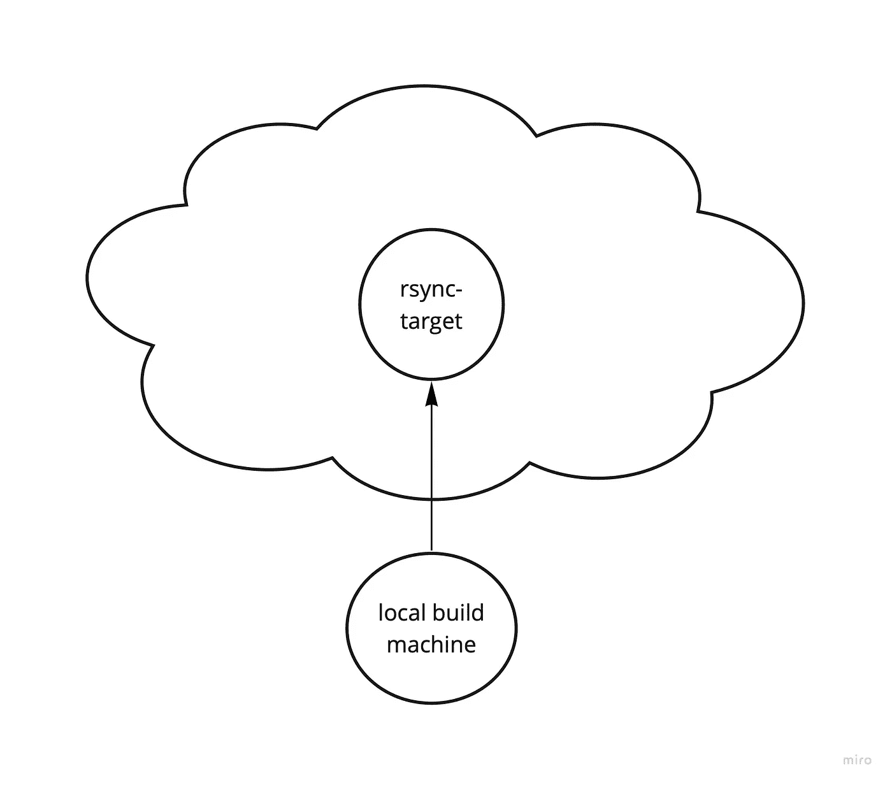
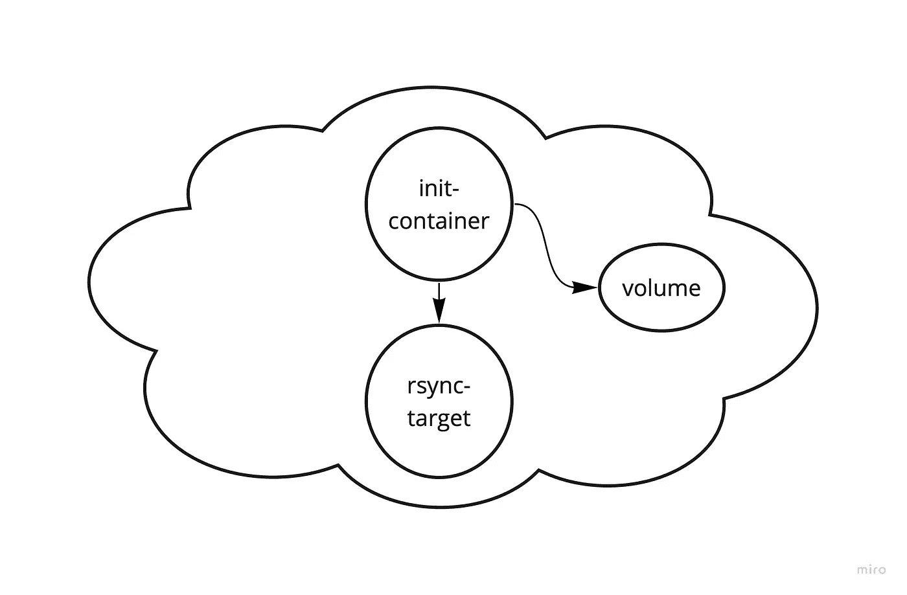
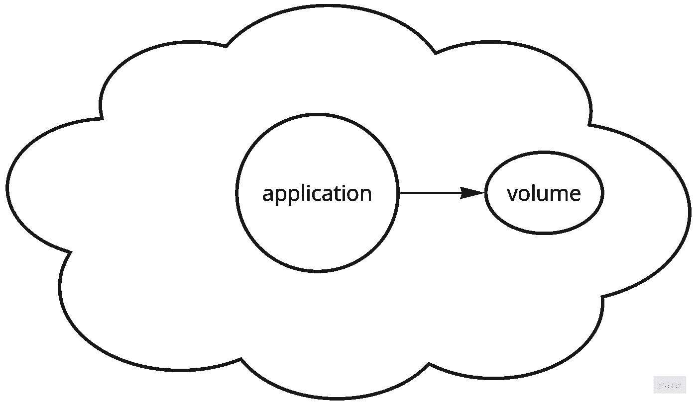

# 我们如何将部署速度提高 97%

> 原文：<https://blog.devgenius.io/the-one-minute-deployment-rethinking-kubernetes-deployments-3f6785918855?source=collection_archive---------1----------------------->

主流的 CI/ CD 工具遵循在容器中执行部署管道的原则。这导致部署缓慢而复杂。我们的一分钟部署架构实现了 97%的无集装箱加速。

容器的出现导致了软件设计模式的转变。开发人员不是构建整体，而是将应用程序拆分成独立的服务。
微服务架构提供了许多优势，但它是一把双刃剑。

在[量子 9](https://www.qubit9.com) ，我们建立了一个分布式存储解决方案。它被设计为一个云原生应用程序，被分成许多特定于领域的服务。然后，我们以最先进的方式在 Kubernetes 集群中部署服务。这使得应用程序能够自动伸缩并令人信服地处理负载峰值。

# 容器非常适合部署；不是为了建筑

*微服务还改变了我们部署软件的方式。复杂的管道定义了部署过程。构建工具在容器中执行这些步骤。这就是一切出错的地方。*

部署这样一个分布式系统本身就提出了复杂的挑战。最重要的是，每个微服务都需要单独构建和部署。容器的出现为我们提供了部署应用程序的优秀解决方案。然而，集装箱对于建筑来说是不够的。

流行的部署工具如 GitHub Actions、Gitlab CI 或 Jenkins 都遵循同样有缺陷的基于容器的方法。

## 开发管道不方便

这些工具要求我们在文本文件中定义管道步骤。然后在一个容器中执行这些步骤。乍看起来，这并不复杂。然而，一旦你试图优化或调整某些东西，你很快就会感受到这种限制性环境的痛苦。
尤其是，调试管道本身几乎是不可能的。最方便的方法是运行它们并查看日志。但是，与此相反，这可能要花很多时间。

此外，版本管理管道几乎是不可能的。对于团队来说，很难调整管道而不中断部署流程。

## 执行缓慢

执行力是最本质的部分。同样，我们希望快速建造，但由于集装箱化，这是不可能的。

容器是虚拟化层上的一个独立实体。这种架构带来了更高的可移植性和隔离性，但同时也降低了性能。

在构建期间，我们安装应用程序的依赖项。在本地机器上全新安装大约需要 30 秒。在一个集装箱里，是 30 分钟。应用了所有巧妙的缓存和图像分层技巧。

# 重新思考部署策略

所有这些缺点促使我们重新思考我们的部署策略。走向无集装箱是前进的合理步骤。

我们将部署管道细化为 Makefile 那样简单，将每个管道步骤作为 bash 脚本执行。

部署仅用了**一分钟**，同时解决了大部分提到的容器化问题。

在本地，您控制执行环境。您可以使用所有工具来调查构建或测试失败。您不需要与容器交互来获取信息。

更重要的是，管道不那么复杂。不需要额外的步骤来构建、缓存或上传图像。

为了在生产中工作，我们发明了运行时映像。

# 一分钟部署

传统上，容器图像有多个层。基础映像包含运行时依赖项。应用层保存源代码和其他应用程序依赖项。

在将应用程序层作为卷附加时，运行时映像仅保存运行时依赖关系。这允许我们只重建应用层，而不需要重建容器映像。图 1 显示了这一演变。

将代码传输到我们的 Kubernetes 集群是拼图的最后一块。

图 1:运行时映像

## (R)将代码库同步到集群

*使用 rsync 将编译后的代码同步到集群，将代码作为持久卷附加到正在运行的 pod。*

我们利用 rsync 工具来组装一分钟部署。下图解释了它的一般架构。

图 2:集群 rsync 目标

如图 2 所示，指定的构建机器构建代码库，运行测试，最后将编译好的代码上传到集群中的 rsync 目标。目标将代码库写入永久卷。使用 rsync 的最大好处是同步两次提交之间的增量。

图 3:初始化卷

初始化前面讨论的卷，我们将代码库作为一个卷附加到运行时容器。然而，这并非完全无关紧要。出于缩放的原因，应用程序窗格不应该处理上述图像的初始化，因为这是由 Kubernetes 管理的。

因此，需要在应用程序窗格启动之前初始化该卷。我们利用 Kubernetes InitContainer 资源来做到这一点。

图 3 显示了基本的初始化流程。

当我们部署一个新的应用程序版本时，InitContainer 会生成，将实际的代码库同步到一个持久卷，最后关闭。然后，应用程序窗格准备好申请该卷，如图 4 所示。应用程序窗格现在执行它的 runargs 最后，应用程序是健康的。

图 4:应用程序 pod 索赔量

# 概念工程证明；下一步是什么？

尽管如此，一分钟部署只是一个概念证明，只适用于令人满意的情况。虽然构建和同步到集群的工作是可靠的，但是管道的测试步骤是非常初级的，并且不检测测试失败。此外，同步目标是一个潜在的瓶颈。目前还不清楚当许多吊舱试图同时启动时，它将如何表现。

尽管如此，这一早期阶段的结果非常令人鼓舞，并提供了一个良好的基础。

虽然该架构是通用的，但一分钟部署仅适用于 Qubit9 应用程序。因此，我现在致力于将它发展成为一个通用的应用程序，并将其集成到 Kubernetes 中。一旦达到 alpha 阶段，该项目将被开源。

如果您想提供反馈或有兴趣投稿，请联系我。

编辑:查看我们如何根据社区反馈改进 OneMinuteDeployment。