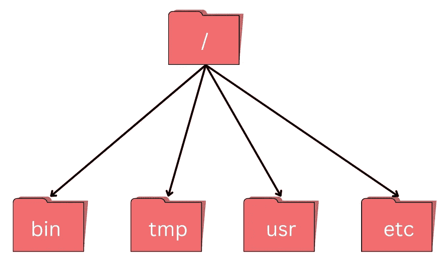

# 您需要的唯一文件系统导航指南。

> 原文：<https://blog.devgenius.io/the-only-file-system-navigation-guide-you-will-ever-need-d13313d1f1bf?source=collection_archive---------10----------------------->

文件导航一开始很难掌握(仍在努力)，但你可以绕过它，不管它是 **Linux 服务器**、 **docker** 配置，还是你的**节点**项目，它都是**必须**知道的。

文件系统**是负责管理文件和目录的操作系统的一部分。数据(新油)被组织成保存信息的**文件**和保存文件或文件夹的**目录**。**

几个命令经常用于**创建、检查、重命名**和**删除**文件和目录。

让我们从一些命令开始，

# 当前目录/当前目录

使用的命令是 pwd，它代表“打印工作目录”

**命令**

```
pwd
```

**输出**

```
/home/tripathi
```

每个操作系统的主目录和路径都不同。在 **Linux** 中，看起来像 **/home/tripathi，**而在 **Windows 中，**看起来像 **C:\Users\tripa。**

而 **pwd** 默认返回**主目录，**如果显示其他内容，则需要 **cd** (更改目录)进入主目录。

在我的电脑上， **/** 是保存一切的根目录。



文件系统看起来像这样

它通过， **/，**单独引用(像我们大多数人一样)，引用主目录，并且是 **/home/tripathi** 中的前导斜杠。


**/** 拥有所有这些目录

以上是 **/** (主目录)中所有目录的列表，像 bin(存储一些内置程序的地方)、data(杂项数据文件)等等。

通过 pwd **/home/tripathi，**获取的当前目录存储在/home 中(因为/home 是它的名字)，类似地，home 存储在/(因为它的名字以/)中。

注意(还记得我们大学时常考的那些吗..没有吗？..我也是):/ character 出现在文件名或者目录名前面的时候有两个意思，它指的是主目录，出现在路径里面的时候只是一个分隔符。

让我们看看/home/tripathi 中的文件和目录的数量，我们将使用 **ls** 命令打印当前目录中的文件和目录的名称 **-F** (给文件和目录名添加一个标记)。

*结尾的/表示这是一个目录*

*@表示链接*

**表示可执行文件*

**命令**

```
ls
```

**输出**

```
adi.txt                    hadoop-3.3.4-src.tar.gz.2  mapred-site.xml
app.py                     hadoop-3.3.4.tar.gz        n1.txt
core-site.xml              hadoop-3.3.4.tar.gz.1      wget-log
hadoop                     hdfs-site.xml              yarn-site.xml
hadoop-3.3.4-src.tar.gz    kafka_2.13-2.6.0
hadoop-3.3.4-src.tar.gz.1  kafka_2.13-2.6.0.tgz
```

在 **ls** 的情况下，没有必要像这样指定路径名，只引用当前目录。

```
ls -F hadoop/
```

嗯，只是看并不能做什么(我希望你们都同意)，所以如果你想导航到指定的目录 **cd** (改变目录)命令被使用。

```
cd hadoop/
```

它将当前目录更改为 **hadoop/** ，记住它只能看到当前目录中的子目录。

```
cd ..
```

**..**是一个特殊的目录名，意为“包含此目录的目录”，是当前目录的**父目录**

**..**目录默认不出现，要显示它，添加**-一个**选项到 ls -F

```
ls -F -a
```

```
Output

./             .bashrc        hadoop-3.3.4-src.tar.gz    kafka_2.13-2.6.0/     n1.txt                     .viminfo
../            .cache/        hadoop-3.3.4-src.tar.gz.1  kafka_2.13-2.6.0.tgz  .profile                   .vscode-server/
adi.txt        .config/       hadoop-3.3.4-src.tar.gz.2  .landscape/           .python_history            wget-log
app.py         core-site.xml  hadoop-3.3.4.tar.gz        .local/               .rediscli_history          yarn-site.xml
.bash_history  .dbus/         hadoop-3.3.4.tar.gz.1      mapred-site.xml       .ssh/
.bash_logout   hadoop/        hdfs-site.xml              .motd_shown           .sudo_as_admin_successful
```

。前缀清晰可见，它们是为了防止使用 **ls** 命令时配置文件弄乱终端。

。就其本身而言意味着'**当前目录'*。***

路径中有波浪号(~)字符，表示当前用户的主目录。

例如

如果主目录是这个

```
/home/tripathi 
```

然后

```
~hadoop means /home/tripathi/hadoop
```

注意:只有当它是路径中的第一个字符时才有效。

如果你喜欢这篇文章，跟我来，你也可以做下面的事情。

让我们连线上**LinkedIn**:[https://www.linkedin.com/in/tripathiadityaprakash](https://www.linkedin.com/in/tripathiadityaprakash)

或者我的**网站**:

[https://tripathiaditya.netlify.app/](https://tripathiaditya.netlify.app/)