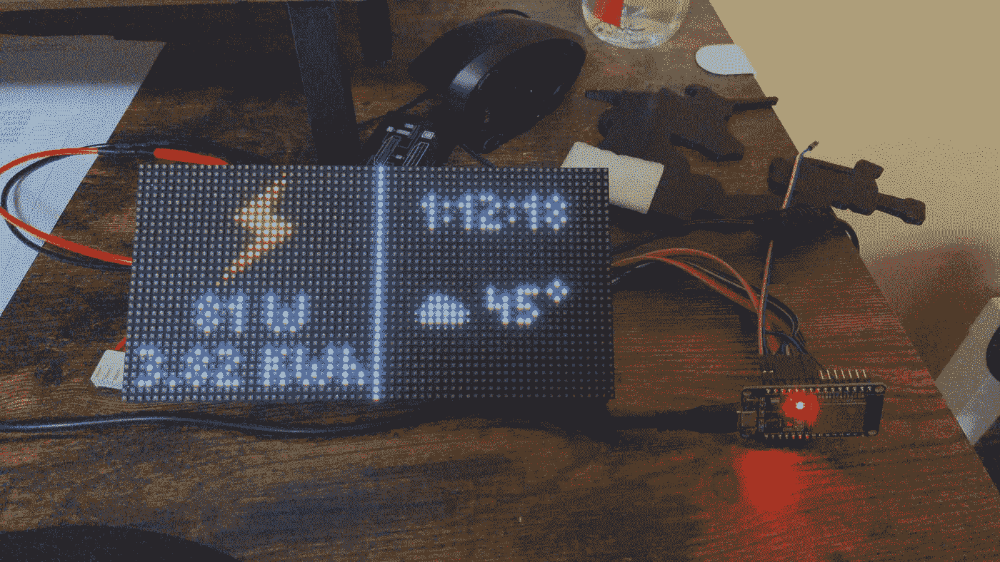

# 在技术限制范围内进行设计的机会

> 原文：<https://blog.devgenius.io/the-opportunity-of-designing-within-technical-constraints-408d2b842405?source=collection_archive---------12----------------------->

保罗·斯科鲁普斯卡斯在 [Unsplash](https://unsplash.com?utm_source=medium&utm_medium=referral) 上的照片

无论你在开发什么，至少会有某种类型的约束。通常这可以是时间或金钱。这些是面向业务的约束。我还没有看到一个项目有无限的时间来完成，而且没有经济决策。在其他时候，我们可能会面临技术上的限制。这些因素可以是 CPU 速度、磁盘空间或可用内存量。它甚至可以是一些基本的东西，就像光速在某些系统中会成为一个限制。这些限制经常感觉像是我们工作的障碍，但我经常认为这是我们展示创造力的地方，也是软件工程的乐趣和挑战所在。

本着尝试全新事物的精神，作为一个有趣的附带项目和我可以在家里使用的东西，我决定编写一个微控制器来运行一个 LED 矩阵，作为我家的信息监视器。想法是它可以显示来自我的[家庭自动化工具](https://www.home-assistant.io/)的统计数据，以及时间、天气和其他有用的信息。我偶然发现了几个 YouTube 视频，视频中有人做了一些类似的事情，这似乎与我编写分布式 web 应用程序的日常工作大相径庭。有问题的微控制器是一个 [ESP 32](https://amzn.to/3MxTJr7) 。这些都是神奇的小装置，只需几美元就能买到。他们有一个高达 240 MHz 的双核处理器，320 KiB 内存，我正在使用的那款有 4 MB 的闪存。作为日常工作中编写 Java 的人来看这些规范，他们感到微不足道。即便如此，从整体来看，它在如此小巧、价格合理的封装中仍拥有令人惊叹的力量。考虑到它的局限性，它通常用 C++编程也就不足为奇了。从大学早期开始，我就没有用 C++编程过，也很高兴地忘记了指针和手动内存管理。C++比许多语言更接近硬件，你必须管理正在发生的一切。例如，进行 HTTP 调用时，我写出主机头并实现 HTTP 规范本身。可能有一些库，你可以拉进来简化其中的一些，但是在我的搜索中，我无法找到一个适合我的需要，并且在如此有限的空间内，希望避免拉进来任何不必要的东西。我没有把这看作一个障碍，而是把它看作一个更全面地了解 HTTP 的组成的机会。还有一些常见的 C++问题，比如没有释放对象导致的内存泄漏，以及当我试图使用指向已经释放的对象的指针时显示垃圾数据。

这些都不是我习惯处理的约束。然而，以自己的方式处理它们很有趣。他们让我思考其他我在其他时间无法思考的事情。有了这个微控制器，我不用担心一秒钟服务许多请求，所以这是一个我现在可以忽略的限制，但是它们被其他东西代替了。从处理这些其他制约因素中获得的经验教训，在它们成为主要问题之后，还可以适用。了解构成 HTTP 请求的内容有助于理解在使用高级语言的库时幕后发生的事情。思考对象分配和使用的位置以及它们之间的关系有助于减少性能关键型应用程序中的垃圾收集器压力。

下一组约束来自 RGB LED 矩阵。我使用的矩阵是 64x32 矩阵，这意味着我有 2048 像素来显示我需要的所有信息。这听起来可能很多，也可能不多，但我可以向您保证，空间并不多。虽然我绝对不会称自己为设计师，但设计这个信息辐射器却很困难。字体选择成了一件大事，因为少了一个像素的字体显示是一个巨大的帮助，但同时我需要确保它清晰易读。寻找通过数据的颜色或位置来表达数据和状态的方法是我不得不探索的另一件事。虽然在我的日常工作中，我并不是主要负责设计和用户体验的人，但至少对你在这个领域中处理的约束类型有一个表面的了解，这很有启发性，并且帮助我建立对那些这是他们主要责任的人的同情心。

工作信息监视器的第一次迭代。

攻击这些约束驱动的需求的一个很好的步骤是确保您理解您在其中工作的约束。只有通过首先了解这些限制，我们才能利用它们对我们有利。拥抱这些约束，它们让事情变得有趣。通常，正是它们让你所做的工作变得有价值。如果事情很简单，其他人早就做了。