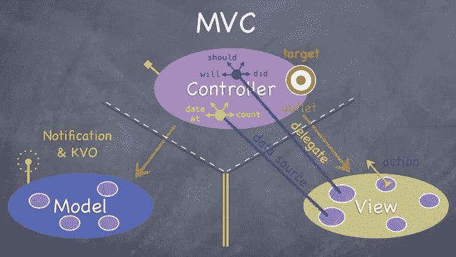

# 被压迫的 MVC

> 原文：<https://blog.devgenius.io/the-oppressed-mvc-bfba59a88ae8?source=collection_archive---------4----------------------->


> 我很确定我会因为下面的观点而受到抨击，但我还是觉得有必要发表它们。

> **首先我爱苹果 MVC**

Objective C，所以第一次在这个奇妙的平台上非常有效地使用了 Objective C 和 MVC。
当 Mac OS X 第一次发布时，在 Mac OS X 上看到 Objective C，并开始使用 Objective C 和 MVC 而不是 CodeWarrior、C++和事件驱动循环来编写 Mac OS X 应用程序，这真是令人欣喜若狂。同样，MVC 对我来说工作得很好。当 iPhone 出现，SDK 第一次可用时，MVC 再次在 iOS 上工作得很好。

使用诸如键值编码、键值观察、关键路径、Cocoa 绑定、格式化器、值转换器、模型的依赖管理和定期的依赖注入。

开发人员不使用在 AppKit、UIKit 和 Foundation 中定义的上述类，最终会编写庞大、复杂且脆弱的视图控制器。

他们编写糟糕的代码，将业务逻辑、数据库逻辑、网络逻辑和表示逻辑直接混合到视图控制器中。对于基本的面向对象，为什么不把这些逻辑封装在导出简化 API 的支持类中，然后在视图控制器中使用这些支持类呢？

OO 的基本原则是**多态、封装**和**继承**，在我看来其中最伟大的是**封装**。[坚实的](https://en.wikipedia.org/wiki/SOLID_%28object-oriented_design%29)原则定义了单一责任原则(就像 Apple I 可能添加的那样),这意味着对象应该做好一件小事情，这些抽象应该被组合成做一件更复杂事情的其他抽象，以此类推。

最佳实践也倾向于组合而不是继承，这意味着视图控制器应该有限地使用从超类控制器继承的功能，而不是使用通过组合方式导入的逻辑。当开发人员使用超类控制器来添加可能在多个视图控制器中通用的逻辑，而不是通过支持对象来访问该逻辑时，通常会导致视图控制器过于复杂。

在简单、干净的 API 中。使用为 iOS 定制开发的**绑定**(或类似的抽象)(因为苹果没有将 Cocoa 绑定移植到 iOS，只有苹果知道为什么没有),使用键值编码、键值路径、键值观察或价值模型(稍后解释)

糟糕的工作人员总是责怪他们的工具
不管他们使用 MVVM、MVC 还是 VIP，不熟练、不知情的开发人员总是会产生糟糕的实现。不管是使用 MVC 还是 MVVM，有经验的开发人员都会开发出优雅、小巧的视图控制器。一个工作不好的人总是责怪他们的工具，因此不熟练的开发人员责怪 MVC，不是因为它有缺陷，而是因为他们有缺陷。

我不是唯一一个持这种观点的 iOS 开发者。我们当中有越来越多的人有同样的感觉；你甚至会认为我们是反改革主义者。

我不是唯一一个持这种观点的 iOS 开发者。我们当中有越来越多的人有同样的感觉；你甚至会认为我们是反改革主义者。

让我们知道什么是 MVC，我知道你们都知道它的名字(模型视图控制器)

*   模型:层负责应用程序的业务逻辑“总是结构或简单的类”
*   视图:在屏幕上显示可视元素和控件，它们通常是 UIView 的子类
*   控制器:协调模型和视图，它们通常是 UIViewController 的子类



CS193p

# 优势

# 关注点分离

MVC 模式的优点是关注点的清晰分离。MVC 模式的每一层都负责应用程序的一个明确定义的方面。在大多数应用程序中，对于什么属于视图和模型层没有混淆。

进入控制器的内容通常不太清楚。结果是控制器经常被用于不属于视图或模型层的任何事情。

# 复用性

尽管控制器通常不可重用，但是视图和模型对象很容易重用。如果正确实现了 MVC 模式，视图层和模型层应该由可重用的组件组成。

对我来说，如果视图控制器变得太复杂，可能是因为

1.  一个视图控制器的责任太多。
2.  这些方法设计得很差。
3.  视图控制器中存储的属性太多。

所以 MVC 将其命名为海量视图控制器

MVC 的最大问题是“是你”而不是庞大的控制器
是的，是你，是你制造了它，并把任何东西放在里面
是你，是你让它变得庞大而丑陋。

通常人们假设*一个视图控制器代表一个场景*，所以视图控制器应该只在有新场景的时候使用。这不是真的。每当场景过于复杂时，就应该将其分解成几个子场景——或子视图控制器。

如果您的视图控制器中有一个表格视图，而您的视图控制器不是一个`UITableViewController`，那么您可能做错了什么。

如果您需要通过观察特定视图的生命周期或任何布局事件来管理它，请考虑将它作为子视图控制器的根视图。当然，如果你需要切换到另一个场景，也为那个场景创建一个新的视图控制器。

总之，在以下情况下应该使用新的视图控制器

1.  父视图控制器太复杂。
2.  您需要观察视图的生命周期。
3.  你需要从一个场景转到另一个场景。

## ViewController 中应该包含什么&不应该包含什么:

*   **将网络置于视图控制器之外是一种代码气味:**

## 它通向哪里？

所有的网络代码都属于`NSOperation`子类。理想情况下，每个网络请求有一个`NSOperation`子类。那个`NSOperation`负责创建网络请求、接收数据、解析成 JSON 并存储在持久层。

这就创建了小的、离散的、易于维护的工作单元。如果网络操作失败，我们可以隔离代码并找到问题。此外，我们可以非常容易地将每个调用放入单元测试中，并孤立地运行它，直到它完美为止。

## 但是我们从哪里开始这些行动呢？

我*强烈*建议创建一个顶层数据控制器，负责维护对持久性引擎的引用。

这个顶层数据控制器通常在应用程序的委托中实例化，并通过依赖注入传递给视图控制器。

# 注意:为此使用单例是不好的；又一股代码味。

数据控制器开始非常简单:

```
import UIKit
import CoreDataclass DataController: NSObject {
    var managedObjectContext: NSManagedObjectContext
    let networkQueue = NSOperationQueue() init(completionClosure: () -> ()) {
        //initialize persistence.  NOT LAZY
    } func refreshRequest() {
    let op = OperationSubclass()
    op.dataController = self
    op.url = ... //Pass in what is needed
    self.networkQueue.addOperation(op)
    }
}
```

将该类传递给视图控制器后，视图控制器可以通过简单地调用以下命令来响应刷新请求:

```
self.dataController.refreshRequest()
```

一行代码可以从按钮的动作直接连接到数据控制器。

# **但是**视图如何知道数据何时准备好？

根据我们处理的是哪种观点，有几种答案。

*   UITableViewController

这是最容易使用的视图控制器类型。当我们使用核心数据作为持久引擎时，视图控制器实际上是自己写的。

通过在数据控制器和表视图控制器之间放置 NSFetchedResultsController，我们有了非常简单的方法实现。

但是表格视图单元格呢？

每个表格视图单元格应该在故事板中设计，然后通过一个`UITableViewCell`子类填充。不要大惊小怪。

使用这种简单的**设计，视图控制器中的群体可以像以下一样简单:**

```
override func tableView(tableView: UITableView, cellForRowAtIndexPath indexPath: NSIndexPath) -> UITableViewCell {
    let cell = tableView.dequeueReusableCellWithIdentifier("cellIdentifier", forIndexPath: indexPath) as! CustomTableViewCell
    let object = self.fetchedResultsController.objectAtIndexPath(indexPath) as! NSManagedObject cell.populateCellFromObject(object)
    return cell
}
```