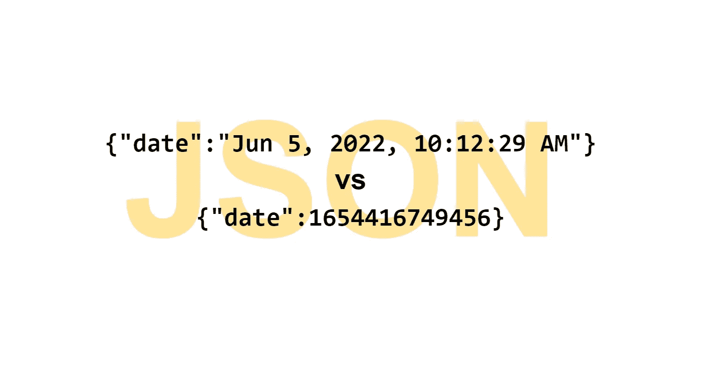
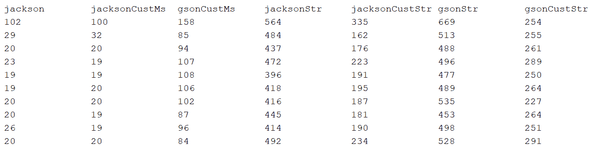

# 在 JSON 中包含日期的最佳方式

> 原文：<https://blog.devgenius.io/the-optimal-way-to-include-dates-in-json-2220c2a355a8?source=collection_archive---------1----------------------->

## 杰克逊和 GSON 哪个更快



web 应用程序后端的主要目的是在数据库和客户端浏览器之间传递数据。为了将数据传递给浏览器，后端通常会将数据转换成 JSON 格式。JSON 格式没有特殊的日期类型。所以日期必须在 JSONs 中表示为毫秒数或字符串。如果日期被格式化为字符串，开发人员可以读取它们。另一方面，这可能是双重浪费时间。服务器端代码必须花时间格式化日期，JavaScript 代码可能需要解析接收到的字符串，以便在计算中使用它们。当然，如果序列化数据很小，只有几个日期，性能损失可以忽略不计。

在这篇文章中，我想找出创建带日期的 JSONs 的最佳方式。

## 数据库驱动程序不使用现代的**日期和时间 API**

不管使用 JPA 或 Spring Data 这样的库，数据库驱动程序总是将数据库中的日期作为`java.sql.Timestamp`或`java.sql.Date`返回。在`ResultSet`没有其他现代类型的吸气剂，比如`LocalDateTime`。两种 JDBC 日期类型都是`java.util.Date`的子类型。`java.sql.Date`是一个`java.util.Date`，由数据库驱动程序将小时、分钟和秒归零。

使用`rs.getDate()`或`rs.getTimestamp()`可以检索相同的表列。实际上，使用`java.sql.Date`没有任何意义。作为`java.sql.Timestamp`加载的相同列值将具有`java.sql.Date`的所有信息，并且不需要驱动程序花费时间来调整时间成分。所以为了简洁起见，我在这篇文章中忽略了`java.util.Date`这个并不普遍有用的子类型。

## 杰克逊和 GSON 的不同违约

要传输到浏览器，日期必须序列化为 JSON 字符串。使用将 Java 对象转换成 JSONs 的库来序列化数据通常更容易。最受欢迎的图书馆是杰克逊和 GSON。

关于日期，它们的默认值是不同的。默认情况下，Jackson 将日期转换为毫秒，而 GSON 转换为字符串。例如，一个示例`ObjectWithDates`类:

```
public class ObjectWithDates {
    Timestamp ts = new Timestamp(1654416749456L);
}
```

被杰克逊转换成`{"ts":1654416749456}`，被 GSON 转换成`{"ts":"Jun 5, 2022, 10:12:29 AM"}`。

在 Jackson 中，可以用语句`disable(SerializationFeature.WRITE_DATES_AS_TIMESTAMPS)`禁用到数字的默认转换。然后 Jackson 将样本对象转换成`{"ts":"2022–06–05T10:12:29.456+02:00"}`。因此，Jackson 和 GSON 中的默认日期格式不同，而且都太长了，没有用。为了比较两个库的性能，我认为最公平的方法是将两个库中的日期格式都改成同样的更简洁的格式。

顺便说一下，在 GSON 中更改日期模式更容易。在 GSON 方法中`setDateFormat(String pattern)`接受一个模式字符串。在 Jackson 中`setDateFormat(DateFormat dateFormat)`需要一个`DateFormat`的实例，通常是`SimpleDateFormat`的实例。根据 Jackson 的文档，如果调用了`setDateFormat()`，那么`ObjectMapper`就不是线程安全的了。这意味着如果并发线程访问同一个`ObjectMapper`实例，它会产生异常的日期。我使用这样配置的`ObjectMapper`进行比较，但是在 web 应用程序中使用这样的`ObjectMapper`是复杂的或者不是最佳的。

## 杰克逊和 GSON 的表现

为了比较 Jackson 和 GSON 的性能，也为了证明将日期转换为字符串是一种相对较慢的日期序列化方式，我使用了 Jackson 和 GSON 的默认实例和几个定制实例。实例被分配给静态字段。这些字段的名称用作下表中基准测试结果的列名。

前三个实例将日期转换为毫秒。它们都将样本`ObjectWithDates`转换成`{"ts":1654416749456}`字符串。

**默认杰克逊**

```
static ObjectMapper **jackson** = new ObjectMapper();
```

**Jackson 使用自定义日期序列化程序返回 getTime()**

```
static ObjectMapper **jacksonCustMs** = new ObjectMapper()
 .registerModule(new SimpleModule() {
     {
         addSerializer(Date.class, new JacksonDateToMsSerializer());
     }
 });class JacksonDateToMsSerializer extends StdSerializer<Date> {public JacksonDateToMsSerializer() {
        super(Date.class);
    }public void serialize(Date value, JsonGenerator gen, SerializerProvider provider) throws IOException {
        if (value != null) {
            gen.writeNumber(value.getTime());
        } else {
            gen.writeNull();
        }
    }
}
```

**带有自定义日期序列化程序的 GSON 返回 getTime()**

```
static Gson **gsonCustMs** = new GsonBuilder()
 .registerTypeAdapter(Date.class, new DateSerializerToMs())
 .create();class DateSerializerToMs implements JsonSerializer<Date> {public JsonElement serialize(Date date, Type typeOfSrc, JsonSerializationContext context) {
        return date == null?null:new JsonPrimitive(date.getTime());
    }
}
```

另外四个实例使用 format 将日期格式化为字符串

```
static String DATE_PATTERN = "dd.MM.yyyy HH:mm:ss";
```

所以样本`ObjectWithDates`对象被它们中的任何一个转换成`{"ts":"05.06.2022 10:12:29"}`。

**杰克森用 setDateFormat()调用**

```
static ObjectMapper **jacksonStr** = new ObjectMapper()
 .setDateFormat(new SimpleDateFormat(DATE_PATTERN));
```

**Jackson 用一个定制的日期序列化器使用 modern DateTimeFormatter 来格式化日期**

```
static ObjectMapper **jacksonCustStr** = new ObjectMapper()
 .registerModule(new SimpleModule() {
     {
         addSerializer(Date.class, new JacksonDateToStringSerializer());
     }
 });class JacksonDateToStringSerializer extends StdSerializer<Date> {static DateTimeFormatter format = DateTimeFormatter.ofPattern(DATE_PATTERN);public JacksonDateToStringSerializer() {
        super(Date.class);
    }

    public void serialize(Date value, JsonGenerator gen, SerializerProvider provider) throws IOException {
        if (value != null) {
            gen.writeString(LocalDateTime.ofInstant(value.toInstant(), ZoneId.systemDefault()).format(format));
        } else {
            gen.writeNull();
        }
    }
}
```

**使用 setDateFormat()设置日期模式的 GSON**

```
static Gson **gsonStr** = new GsonBuilder()
 .setDateFormat(DATE_PATTERN)
 .create();
```

**带自定义日期序列化程序的 GSON，使用 DateTimeFormatter 将日期转换为字符串**

```
static Gson **gsonCustStr** = new GsonBuilder()
 .registerTypeAdapter(Date.class, new DateSerializerToString())
 .create();class DateSerializerToString implements JsonSerializer<Date> {static DateTimeFormatter format = DateTimeFormatter.ofPattern(DATE_PATTERN);public JsonElement serialize(Date value, Type typeOfSrc, JsonSerializationContext context) {return value == null?null:new JsonPrimitive(LocalDateTime.ofInstant(value.toInstant(), ZoneId.systemDefault()).format(format));
    }
}
```

Java API 有两个内置的格式化程序——传统的`SimpleDateFormat`和现代的`DateTimeFormatter`。它们之间的区别对于 web 应用程序来说非常重要。Java 应用服务器是多线程的。当并发线程访问一个`SimpleDateFormat`实例时，没有错误，但是返回的格式化日期与输入不匹配。所以`SimpleDateFormat`实例应该被同步，为每个新的调用重新创建或者存储在一个线程本地字段中。相比之下，`DateTimeFormatter`是线程安全的——多线程可以使用`DateTimeFormatter`的一个实例。现代也应该更有表演性。

我测量了序列化包含 50000 行、每行包含 10 个日期的同一个 2D 数组所需的时间。每个测量重复 10 次。我没有计算平均值，因为差异是显而易见的。



在转换到毫秒类别的赢家是默认的未配置的杰克逊。

在字符串类别中，获胜者是 Jackson，它被配置为使用基于定制的`DateTimeFormatter`的序列化程序。

测量结果表明:

*   格式化日期比仅仅使用以毫秒表示的同等信息需要多 10 倍的时间
*   GSON 比 Jackson 慢。我不知道为什么，但当 GSON 用于将日期序列化为毫秒时，这种差异就特别明显了。
*   杰克逊和 GSON 使用的比现代的慢两倍

在生成上表的代码中，许多代码都用来打印一些东西。与测量相关的代码以粗体显示。

```
public class MeasureMappers {static String PAD = "%-15s";
    **static Date[][] array2d;**public static void main(String[] args) throws JsonProcessingException, Exception {**array2d = new Date[50_000][10];
        Arrays.stream(array2d).forEach(row
                -> Arrays.setAll(row, i -> new Timestamp(System.currentTimeMillis())));****Map<String, ThrowingFunction> approaches = new LinkedHashMap<>() {
            {
                put("jackson", jackson::writeValueAsString );
                put("jacksonCustMs", jacksonCustMs::writeValueAsString );
                put("gsonCustMs", gsonCustMs::toJson );
                put("jacksonStr",  jacksonStr::writeValueAsString );
                put("jacksonCustStr",  jacksonCustStr::writeValueAsString );
                put("gsonStr",  gsonStr::toJson );
                put("gsonCustStr", gsonCustStr::toJson );
                put("gsonCustStr", gsonCustStr::toJson );
            }
        };**// make sure the mappers use the expected date format
        ObjectWithDates obj = new ObjectWithDates();for (Entry<String, ThrowingFunction> e : approaches.entrySet()) {
            System.out.println(String.format(PAD, e.getKey()) + " "
                    + e.getValue().apply(obj));
        }// print headers 
        System.out.println();
        System.out.println(approaches.keySet().stream()
                .map(s -> String.format(PAD, s)).collect(Collectors.joining("")));

        // print measurements repeated 10 times
 **for (int repeat = 0; repeat < 10; repeat++) {
            for (ThrowingFunction f : approaches.values()) {
                measure(f);
            }
            System.out.println();
        }**
    }**static void measure(ThrowingFunction f) throws Exception {
        long s = System.currentTimeMillis();
        f.apply(array2d);
        System.out.format(PAD, (System.currentTimeMillis() - s));
    }**
}
```

# 结论

假设我们有一个在数据库和客户端浏览器之间传递数据的 web 应用程序。数据包含日期。

不考虑 JSON 中的日期表示，Jackson 的表现优于 GSON。

将日期序列化为字符串需要时间。即使性能不是问题，我认为浪费用户的时间也必须有一个合理的理由，即使是以毫秒来衡量。此外，为了以防万一，卸载后端更明智，这样它就不会在可以在客户端浏览器中执行的操作上花费时间。最糟糕的情况是服务器将日期转换成字符串，然后浏览器将它们转换回毫秒，这样日期就可以用于计算、过滤或排序。

如果真的需要将日期序列化为易读的字符串，例如为了便于开发，最好使用 Jackson 和一个定制的序列化器类来处理`Date`。如果 Jackson 被分配了一个`SimpleDateFormat`的实例，那么代码必须稍微复杂一些，以避免对`SimpleDateFormat`的并发访问。

代码可以从[https://github.com/marianc000/datesInJson](https://github.com/marianc000/datesInJson)下载