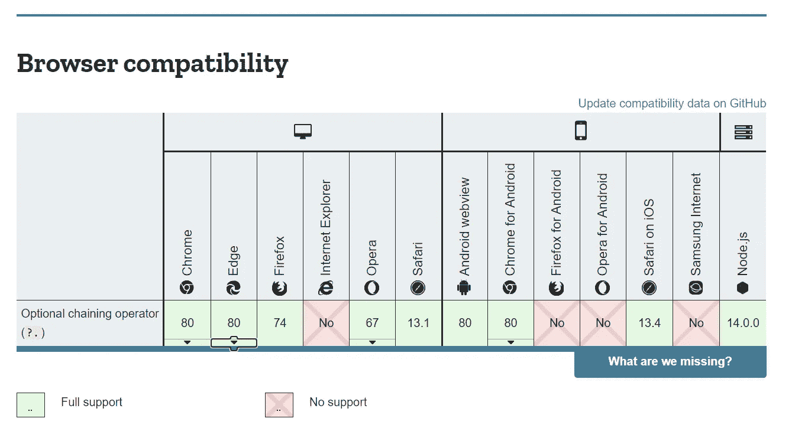

# JavaScript 中可选的链接操作符

> 原文：<https://blog.devgenius.io/the-optional-chaining-operator-in-javascript-59fa7a5c7dd5?source=collection_archive---------14----------------------->

## 和建议的支持对象析构的语法


[Miltiadis frakkidis](https://unsplash.com/@_miltiadis_?utm_source=unsplash&utm_medium=referral&utm_content=creditCopyText)在 [Unsplash](/s/photos/chains?utm_source=unsplash&utm_medium=referral&utm_content=creditCopyText) 上拍摄的照片

ES2020 的这一功能允许您随意访问属性，而不必检查对象是否已定义或是否为空。想象一个`user`物体，它包含`username`、`id`和`name`。您可以像这样访问属性。

```
var id = user.id
```

然而，如果`user`因为某种原因是`undefined` 或`null`，这将会破坏你的代码。传统上，要有条件地访问属性并将它们存储为变量，您需要编写如下代码。

```
var id = user ? user.id : null 
```

多亏了 ES2020 和[可选链接操作符](https://developer.mozilla.org/en-US/docs/Web/JavaScript/Reference/Operators/Optional_chaining)，我们可以使用`?.`缩短上面的代码。

```
var id = user?.id
```

该语法将检查是否定义了`user`。如果是，它将尝试访问属性，否则返回值是`undefined`。这使我们不必编写上面的三元语法。酷！大多数现代浏览器支持这种语法，但也有一些不支持。



尽管这种语法很方便，但我注意到有一个地方可以改进。

## 与对象析构一起使用

[对象析构](https://developer.mozilla.org/en-US/docs/Web/JavaScript/Reference/Operators/Destructuring_assignment)是一个有用的简写，当试图用相同的名字将对象属性存储为变量时。在`user`对象中，我们可以将所有属性存储在同名变量中，如下所示。

```
const {id, name, username} = user
```

这让我们不必在剩下的代码中编写`user.KEY`。为了使用它并说明`user`是`undefined`还是`null`，你必须编写如下代码。

```
const {id, name, username} = user ? user : {}
```

虽然这看起来像是可选链接操作符的工作，但 ES2020 目前不支持它。当开发社区的成员在[讨论](https://github.com/tc39/proposal-optional-chaining/issues/74)关于深度嵌套对象的问题时，我只想使用对象析构来访问我的所有属性。潜在的语法可能如下所示。

```
const {id, name, username} = user?.*
```

我想到这个语法是因为它让人想起使用`import * as A from 'abc'`将导入在`'abc'`中标记为导出的所有内容。这些出口可以通过`A.EXPORT_NAME`进入。我也觉得这可能是一个比简单地允许用户让可选的链接操作符保持开放更好的选择。

```
const {id, name, username} = user?.
```

我想指出的是，我从未参与过 JavaScript 语法的更新、修改或介绍，因此也没有这方面的经验。如果这可行(或不可行),请告诉我！我很想了解更多关于特性/语法开发的知识。请随意提出您自己的可能实现这一功能的语法建议。

[*在此将您的免费媒体会员升级为付费会员*](https://matt-croak.medium.com/membership) *，每月只需 5 美元，您就可以获得数千位作家的无限量无广告故事。这是一个附属链接，你的会员资格的一部分帮助我为我创造的内容获得奖励。谢谢大家！*

# 参考

[](https://developer.mozilla.org/en-US/docs/Web/JavaScript/Reference/Operators/Optional_chaining) [## 可选链接(？。)

### 可选的链接操作符()允许读取一个位于连接的…链深处的属性值

developer.mozilla.org](https://developer.mozilla.org/en-US/docs/Web/JavaScript/Reference/Operators/Optional_chaining) [](https://developer.mozilla.org/en-US/docs/Web/JavaScript/Reference/Operators/Destructuring_assignment) [## 解构分配

### 析构赋值语法是一个 JavaScript 表达式，它使得从数组中解包值成为可能，或者…

developer.mozilla.org](https://developer.mozilla.org/en-US/docs/Web/JavaScript/Reference/Operators/Destructuring_assignment) [](https://github.com/tc39/proposal-optional-chaining/issues/74) [## 析构语法问题# 74 tc39/建议-可选-链接

### 怎么样:const obj = { foo: { bar: { baz: 42，}，}，}；// const baz = obj？。foo？。酒吧？。巴兹；const { baz } =…

github.com](https://github.com/tc39/proposal-optional-chaining/issues/74)