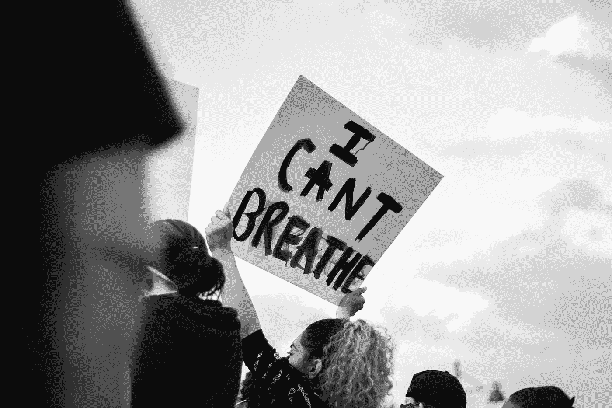
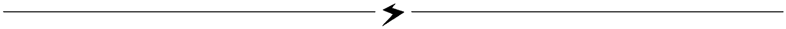

# 被沉默的痛苦

> 原文：<https://blog.devgenius.io/the-pain-of-being-silenced-1bf6618063a9?source=collection_archive---------34----------------------->

软件工程师在全公司内部呼吁团结

库珀·鲍姆加特纳拍摄的照片

几周前，在民间骚乱和正当的愤怒、不断的抗议、强烈的团结声明以及公然的反对声中，作为我公司的一名软件工程师和总共只有 8 名黑人员工的一员，我深感有责任大声疾呼。我在内部发出呼吁，敦促我们的领导人公开表示团结。我的许多同事伸出援手，我希望由于我们的敦促，事情会发生。不幸的是，我后来发现我们的信息被我们的母公司拒绝了，他们选择了保持沉默。

我深感不安和悲伤。正因为如此，我通过内部渠道公开分享了我的回应。我得到了大量的支持、爱和同情。我的许多同事都同意我的观点，他们也为被禁言感到难过，并积极努力为公司做出更大的贡献。

对我来说，我很困惑。我有一个选择，由于价值观和联盟的明显脱节而离开，或者坚持到底，继续代表代表性不足的人民争取平等和机会，加入内部律师，团结起来，并参与社区努力。都是为了尽自己的一份力量为别人铺平道路。

我爱我的团队，我对我的领导没有愤怒或恶感，我相当钦佩他们。我不相信他们的心和我的不一致，但我仍然感到失望。

我现在与你分享这些，是为了鼓励你在你的公司、朋友和家人面前畅所欲言。这对我们很多人来说都不舒服。这并不容易。尽管这样做触动了你意想不到的人的心灵和思想。值了。

以下是我分享的。

原谅我，但我很难找到合适的词来表达我自己，我需要在说服自己不说之前说出来。当我写这封信时，泪水顺着我的脸颊流下，因为今天的小男孩或女孩被告知，仅仅因为他们的皮肤更黑，他们就会被憎恨、拒绝、压迫，甚至可能被杀害。他们必须更加努力才能脱颖而出。那好，根本就不够好。他们不会理解的。会很疼的。没有合适的安慰话语，但他们会被告知要坚强、宽容和耐心。但是因为他们的力量，他们会被定型和排斥。

**T3【我无法呼吸】T4**

有很多次，我大声捍卫并要求我的女性同事得到尊重，而没有人会不顾后果地这样做。我自豪地支持 LGBTQ 社区，毫不犹豫地传播相关意识，有时把人们拉到一边，强调正确的代词用法，以保护受影响的人。我尽了自己的一份力量来吸引、提升和增强年轻人的能力。同事们目睹了我在人群中，当其他人都让开的时候，为了保护一个人数以 10 比 1 轻松超过的孩子，直接踏入了暴力的境地。

***我无法呼吸***

我从不寻求赞美，它从不被拍摄，我从不需要提醒任何人，这在社交上对我没有任何好处。就我个人而言，我不能坐视不管，眼睁睁看着一个朋友、一个熟人，甚至一个完全陌生的人受到伤害而不采取行动。对我来说很自然。不是因为我是男人，或者黑人，或者白人，或者跨种族。不是因为我们生活在同一个国家，或者在同一个屋檐下工作。仅仅因为它是对的，是好的。

**T5【我不能呼吸】T6**

如果这是困扰你的问题，我会站在你的第一线。面对骚扰或逆境，我会为你辩护。如果有必要，我会为你而战。

***我无法呼吸***

当你为同情的表达鼓掌，为情绪欢呼时，我的脖子上有一个膝盖，我无法呼吸！我在为你哭泣，但你只是用关切的眼神看着我。我无法呼吸了！我在颤抖，失去了对身体的控制，伸手去抓你！ ***我不能呼吸了！但是没有人来帮助我。没有人站出来。没人救我。我的哭声消失在永恒的寂静中。***

***我无法呼吸***

有些人不会理解为什么不公开表达团结是一件大事，但事实就是如此。这是一切。这是维护正义。这是为了我的平等权、公正权、生存权而采取的集体立场，不管那些希望我受到伤害的人。这不是一个困难的决定。这么多其他公司都做过。这是一个让对手高兴的商业决定…

如果我今天离开，我的话，我的存在，我的脸可能会消失在你脑海的背景中，很容易被遗忘。但是，别担心…我还是会为你辩护的。我还是会为你和你的孩子而战。别担心，如果有人用膝盖顶你的脖子，我会干预的。你永远也不会大声呼救。我永远不会仅仅因为你的存在而沉默地看着你被攻击、被排斥或受到不公平的对待，我也永远不会因为你的存在而贬低你的战斗。

我会大声说出来，因为沉默的盟友根本不是盟友。

**补充阅读**

 [## 调息法介绍

### 身体、精神和情感健康的呼吸。

medium.com](https://medium.com/@christopherbeards/an-introduction-to-pranayama-2c3c0171ff06)  [## 悬崖

### 没有改变，就不可能有接受；自由诗

medium.com](https://medium.com/@christopherbeards/the-precipice-29bd84683c69)  [## 对投降的简单沉思

### “一旦你做了你能做的一切，就没什么可做的了……”

medium.com](https://medium.com/@christopherbeards/a-simple-meditation-on-surrender-c129af8c8a5b)  [## 通过有意识的呼吸进行压力管理

### 通过练习有意识的呼吸来介绍冥想

medium.com](https://medium.com/@christopherbeards/stress-management-through-conscious-breathing-190e8f15e0c9) 

珍惜你自己，克里斯托弗·比尔德