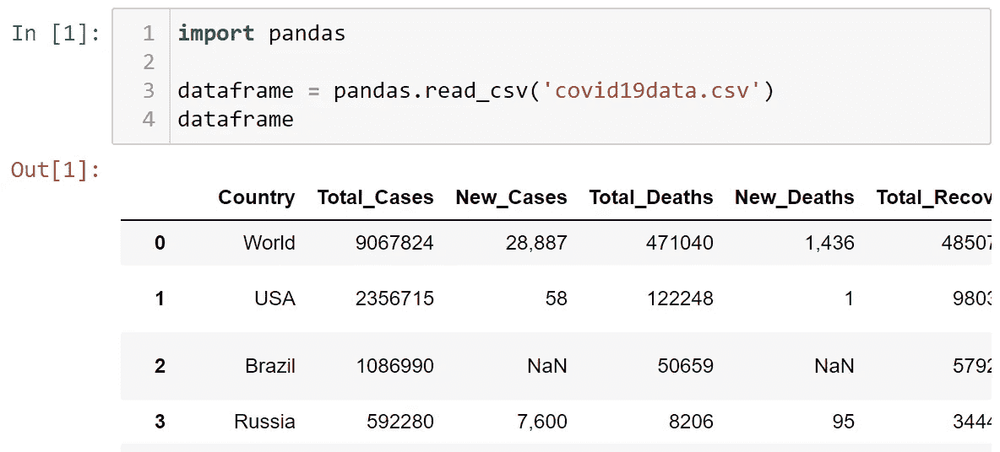
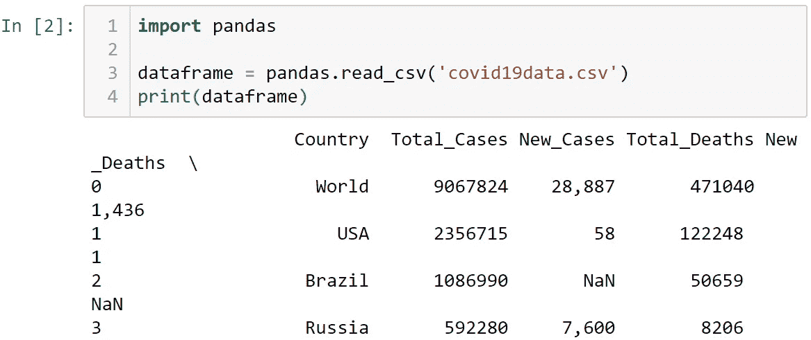
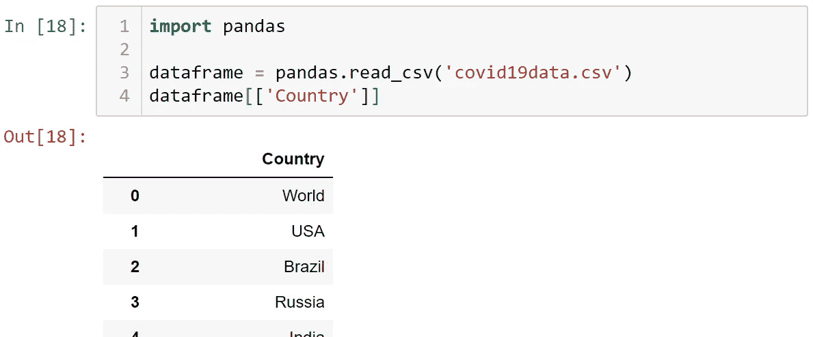
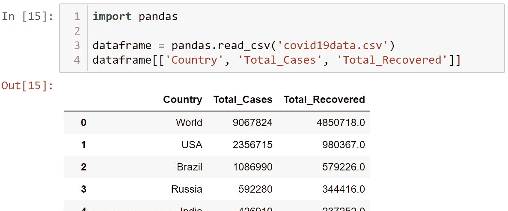
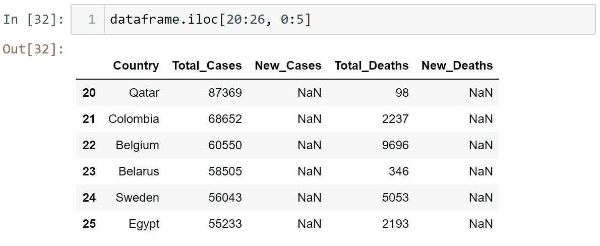
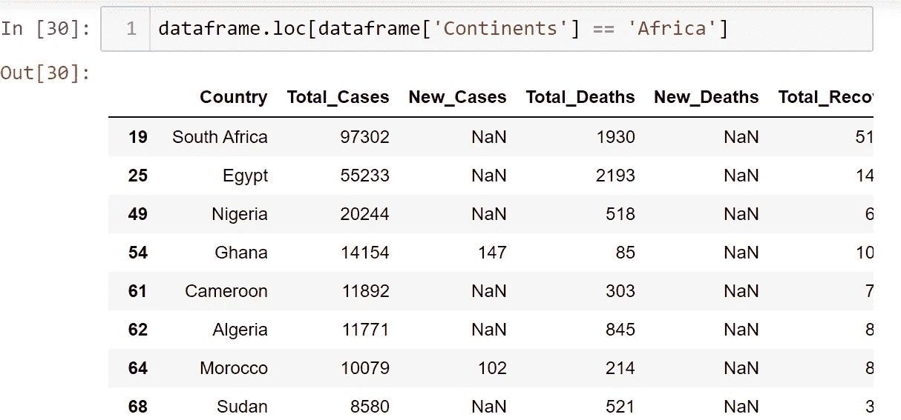

# Python 的熊猫库

> 原文：<https://blog.devgenius.io/the-pandas-library-of-python-2a6cea428bce?source=collection_archive---------30----------------------->

> 虽然据称 Python 编程语言似乎对动物特别是蛇情有独钟，但熊猫不会被混淆为这部功夫漫画中的熊。


蟒蛇的熊猫

Python 的 Pandas 库源自术语“面板数据”，由 AQR Capital Management 的 Wes McKinney 于 2008 年发起，用于无缝操作数据。同样来自 AQR 的常社在 2012 年加入了开发，2015 年由美国 NumFOCUS 赞助。今天，Pandas 被证明是数据科学家用来探索他们的数据财富的最有用的工具，因为它提供了数据结构和操作，用于操纵不同数据类型的数组、数字表和时间序列。与 Microsoft Excel 在处理更复杂大小和维度的数据时受到很大限制不同，Pandas 似乎可以利用 Python 编程语言的能力处理这些复杂的大数据。

Python 编程中的**库**是一个目录或文件夹，里面装满了个人的**。py** 文件称为**模块**，其中嵌入了可重用的代码块。在工作区中，可以用一行代码将一个库导入到一个新程序中——这将把该库中的所有独立模块都引入到新程序中。当然，熊猫开发人员为使软件工作而创建的代码块被安排在库的各个模块中的类和函数中，直接用户(程序员)可以从这些模块中访问和重用。作为一种非常强大的面向对象编程语言，Python 允许这些类和函数的简单可访问性和可用性。

熊猫图书馆可以用来读取不同扩展名的数据文件。csv，。xlsx，或者。txt，甚至 HTML 表格等等；

```
import **pandas**csv_data = **pandas.read_csv('filename.csv')** xlsx_data = **pandas.read_excel('filename.xlsx')** txt_data = **pandas.read_csv('filename.txt', delimiter='\t')**
```

数据以原始维度作为 **dataframe** 导入，之后它可以被一群属性和方法读取和操作。为了简单地查看数据帧，我们称之为数据帧(只需键入它)或打印它。调用它(键入 dataframe 的名称)会呈现一个定制的视图，而打印它会以 Python 方式呈现 dataframe 的数组。在这篇演讲中，我们将有一个新冠肺炎热席卷全球的数据框架。



我们可以从数据帧的属性开始，比如说“列”——我们可以检查数据帧中的列列表，以及总行数(索引计数)。我们还可以应用 **count()** 方法来查看每一列中有多少数据，如果对每一列中的所有数字数据求和或连接字符串有意义，还可以应用 **sum()** 方法。

```
**dataframe.columns
dataframe.index****dataframe.count()
dataframe.sum()**
```

特定的数据列可以通过指定它们的名称[或标签]以优选的顺序单独访问——单个列在一对或两对方括号内的引号中，而多个列仅在一对方括号内的单个引号中(解析列表中的列表)；

```
**dataframe[['Country']]
dataframe[['Country', 'Total_Cases', 'Total_Recovered']]**
```



如果您解析只有一对方括号的单个列，它将以 python 方式呈现，作为原始对象(或数组),而不是上面的可读性更好的样式。



dataframe 对象还具有属性“ **iloc** ”，意为“整数位置”，其可用于访问 dataframe 的所有或不同连续列中的连续行的段。它基本上通过数据帧的可访问索引来分割指定的连续行。例如，在新冠肺炎数据帧中，可以从第 1 列到第 5 列分割数据帧的第 21 行到第 26 行的副本(Python 中的索引不包括最大值，因此第一行的索引是 0，而不是 1，并且不包括最后一项；因此，第 21 行被索引为 20，第 26 行被索引为 25)。



与 **iloc** 地产兄弟的是 **loc** 。这个函数做了一点更有趣的工作——它可以用来访问分布在不同行和列的数据帧的单元格，无论是否连续。dataframe **loc** 允许根据设定条件渲染数据。例如，我们可以在新冠肺炎数据框架中获取非洲国家的数据行，只需通过调整属性来获取任何一行，其中**[' continentals ']**列的值为 **'Africa'** 。



科学家们对熊猫做了很多其他的很酷的事情，这些都不在本文讨论范围之内。使用 **sort_values()** 方法，可以根据首选列按字母顺序或非字母顺序对数据帧进行排序。可以使用类似 **drop()** 的方法从数据帧中删除列和行(索引)。在使用这里没有讨论的其他几种方法操作数据帧之后，您可以将修改保存为任何首选数据文件(。不过 csv 很常见)。

```
**dataframe.to_csv('modified_covid19data.csv')**
```

熊猫图书馆的完整文档可以在这里获得[。](https://pandas.pydata.org/docs/)

彼得·迈克尔
尼日利亚拉各斯大学

SGC GI:048——机器人/物联网/人工智能