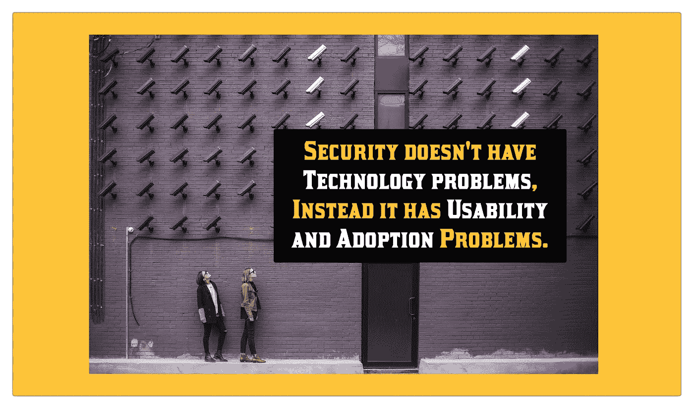
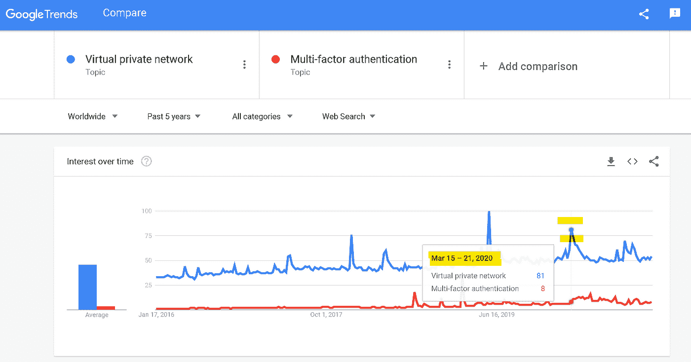
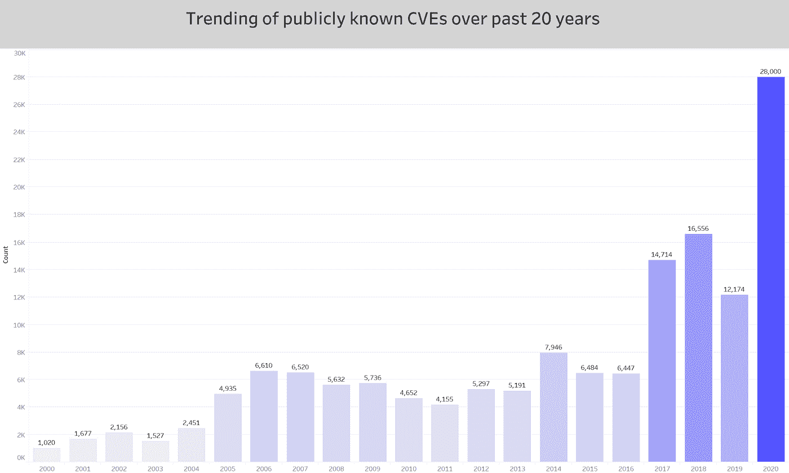
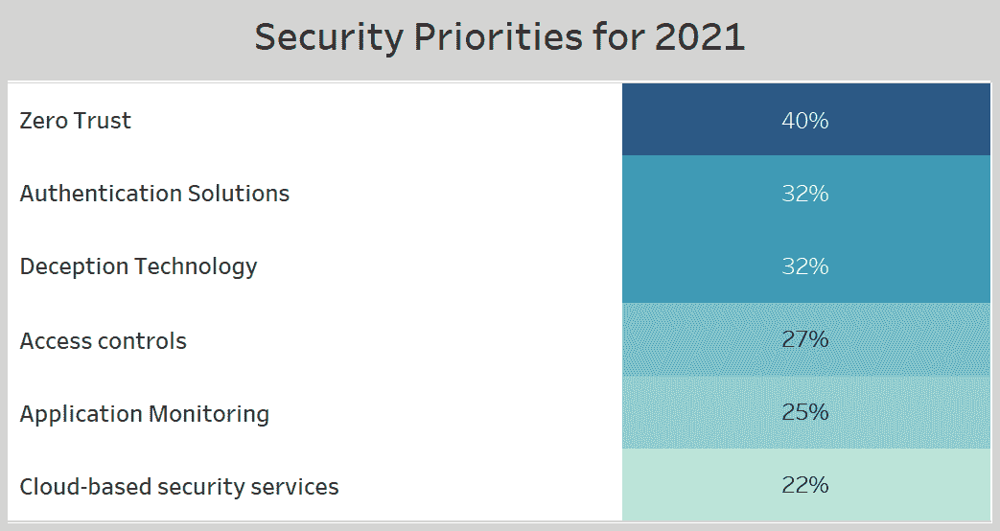
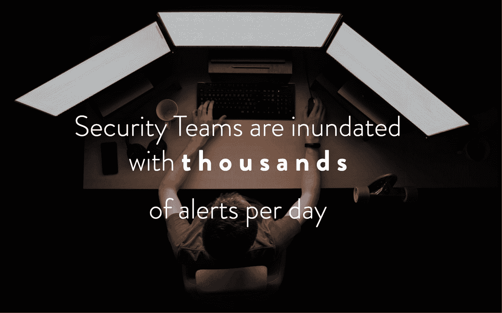

# 疫情是人类依赖网络安全的转折点

> 原文：<https://blog.devgenius.io/the-pandemic-is-a-tipping-point-for-humanitys-reliance-on-cybersecurity-a039f655078c?source=collection_archive---------3----------------------->

2020 年的新冠肺炎疫情以前所未有的方式改变了全球 195 个国家 78 亿人的生活。强制隔离令的实施扰乱了典型的业务流程，并突破了业务战略的束缚。

当在家工作成为通宵工作的要求时，世界各地的公司不得不找出快速实现远程工作的解决方案。我们工作方式的这一巨大变化为公司雇佣远程人才并与之合作打开了大门。

在某种程度上，远程工作对网络安全来说是一件好事。然而，与此同时，也在国内隔离的恶意行为者在疫情期间突然变得更加活跃。黑帽黑客和白帽黑客这两股对立的网络力量之间的斗争正在以过去几十年来从未见过的方式塑造技术、政治和人类。

安全技术在疫情期间被广泛采用

在家工作需求的突然转变导致了可扩展 VPN 和 MFA 认证技术的快速采用，这些技术有助于公司为其分散的员工提供安全的远程访问。

从网络安全的角度来看，远程工作可以被比作“*企业网络的倒置”*，它本身具有多种安全权衡，尤其是当您考虑到围绕您公司的数据、设备以及源自它们的网络流量的保护时。如今，大多数工作设备与多台*可能是* *不够安全的*个人设备共享员工家用路由器。工作地点的这种变化导致了企业网络攻击面的无计划扩张。

疫情病毒爆发后，安全分析师处理了多种*“威胁向量曲线球”*，包括精心制作的、以 COVID 为主题的网络钓鱼电子邮件，这些邮件不易被检测到，在许多情况下，它们通过了垃圾邮件过滤器，逃避了检测。安全团队不得不迅速从处理日常任务和长期目标转向为新组建的远程工作人员设置流程和网络监控。

网络安全引起了媒体的真正关注。

美国大选吸引了全世界的新闻和媒体报道。最近，选举安全和假新闻的话题在各种新闻频道上争论不休。因此，网络安全的话题最近引起了媒体的广泛关注。

网络安全管理软件产品攻击是迄今为止 2020 年最大的黑客攻击，一些专家甚至将最近的网络安全管理软件产品攻击称为“十年一次的黑客攻击”

*   网络安全管理软件产品攻击是由国家行为者实施的，他们发现了多种攻击媒介来攻击和破坏许多公司和政府网络。在一个相互依赖的世界里，企业必须信任他们的第三方软件供应商。最近的攻击将这种隐含的信任作为安全弱点，并影响了软件供应链。在网络安全管理软件产品的攻击中，攻击者插入了恶意源代码，作为后门来监视大约 18000 名网络安全管理软件产品客户，其中大约 200 名被确认受到影响。
*   这次攻击引发了关于新技术和技巧的讨论，这些新技术和技巧可能会在未来防止和检测这种软件供应链危害。

2020 年 7 月， [Twitter 被一名青少年黑客攻击](https://www.bbc.com/news/technology-53445090)。

*   推特账户属于优步，苹果，坎耶韦斯特。杰夫·贝索斯、迈克·彭博和埃隆·马斯克被接管，并在推特上发布比特币骗局请求，要求追随者汇款。

*   Twitter [的回应](https://www.wired.com/story/inside-twitter-hack-election-plan/)是加速推出[的防钓鱼安全密钥](https://blog.twitter.com/en_us/topics/company/2020/our-continued-work-to-keep-twitter-secure.html)，并要求他们的团队在向 Twitter 系统认证时使用它们。此外，twitter 还加快了安全检测和监控工具的采用，以检测未经授权访问 Twitter 内部工具的企图。

在疫情之后，一个更大的攻击面出现了。

疫情开始后，组织已经看到了超过其公平份额的互联网攻击。在许多情况下，攻击者是高级的，但是攻击本身是非常基础的。

这是因为攻击者已经变得更善于发现带有“已知漏洞”的“已知漏洞”，并利用它们来攻击公司的网络和应用程序。

2020 年记录了超过 28000 个 CVE(公开已知的网络安全漏洞列表)(比任何其他年份都多),与此同时，潜在的更多漏洞未被记录、未被检测到，因此也未得到补救。

保护这个攻击面的问题不仅仅局限于在您组织的技术堆栈中发现安全错误配置和漏洞，还涉及到优先修复哪些漏洞。

这一点很重要，因为黑客可以轻松地将不同的低严重性软件漏洞链接在一起，通过软件安全团队的粗略审查，远程访问数据和系统；这就是为什么检测和优先排序是成功的安全计划的重要组成部分。

技术解决方案是存在的，但是它们的可用性和可采用性是一个挑战。

根据 IDG 的[安全优先研究进行的一项调查，](https://www.idg.com/tools-for-marketers/2020-security-priorities-study/)受访者(一群安全和 IT 决策者)有兴趣在 2021 年评估或投资以下技术

在这一点上，零信任显然是每个企业主的想法。“零信任”哲学植根于*的概念，“不要相信，永远要核实。”—* 对当前实践方法— *“信任，但要核实”的改编*

但是，零信任不是技术；没有任何产品可以直接为您的组织实现它。零信任仅仅是设计现有应用程序架构和网络的另一种方式，以获得适当的可见性并实施策略。零信任的功能要求是理解各种应用程序、网络和用户设备之间的关系和相互依赖性。

如今，由现有企业安全工具生成的警报数量之多让人类难以处理，这就是零信任方法提供的更深入的上下文可以帮助补充验证警报或事件时所涉及的耗时的手动工作的地方。

构建有意义的控件:下一个挑战

建立和监控有意义的安全控制说起来容易做起来难——人类需要 6 到 8 个小时的休息才能达到最佳状态；另一方面，企业安全基础设施需要不间断的 24x7 监控。

在行业专家之间的对话中，一个常见的主题是安全部门没有足够的人才供应，因为大多数现有团队在处理业务、技术和市场的总体变化时，都深陷于法规遵从性方面。

除此之外，安全分析师每天经常要处理超过 [11，000 个警报，](https://blog.paloaltonetworks.com/2020/09/secops-analyst-burnout/)一半的组织要努力处理超过 70%的由企业安全工具生成的警报。虽然人工智能和机器学习算法可以帮助检测某些类型的攻击和威胁，但在许多情况下，由于零碎的数据和孤立的分析，这些算法存在不足。

在疫情期间，通信平台的安全性变得至关重要

随着我们生活和工作方式的改变，在线交流平台已经成为我们生活中必不可少的一部分。去年早些时候，攻击者瞄准了 Zoom，这是一家以提供远程协作和通信平台而闻名的公司，在“呆在家里”订单启动并成为用户最爱后，该公司的相关性飙升。随着这种增长，攻击激增，与 Zoom 相关的安全事件和新闻激增。

500，000 份属于 zoom 客户的凭证在网上被泄露，并在黑暗网络上出售。这些数据允许攻击者随机加入和破坏会议，并获得在线讨论的权限。除此之外，Zoom 还受到容易猜测的用户 id 的影响，并导致[“Zoom bombing”](https://www.nytimes.com/2020/03/20/style/zoombombing-zoom-trolling.html)事件。

去年早些时候，我写了一篇关于公司可以从 [Zoom 的恢复安全计划](https://medium.com/dev-genius/what-organizations-can-learn-from-zooms-comeback-security-plan-9bb1ff888520)中学到什么的文章——文章概述了公司管理层采取的一些措施以及从这次事件中吸取的一些宝贵教训。*主要的想法是安全现在更早地介入软件开发生命周期*，并与业务功能本身同步，这是专家们十多年来一直推动的事情。

勒索软件经济在疫情期间势头强劲

2020 年，勒索软件已经影响到政府、医院、学校，并且已经支付了更大的赎金。这些攻击在 2021 年可能不会放缓。据[福布斯](https://www.forbes.com/sites/andreatinianow/2020/07/01/bitcoin-demand-drives-14-billion-ransomware-industry-in-the-us/?sh=31bc153f32d8)报道，仅在美国，比特币就驱动了 14 亿美元的勒索病毒产业。

近年来，勒索软件攻击和方法的种类有所增加，从通过加密文件来劫持文件，到接管服务器和/或在黑暗网络上出售数据。如今，勒索软件的需求如此普遍，以至于你甚至可以找到关于获取和支付比特币作为赎金的“如何做”[文章](https://www.csoonline.com/article/3588152/how-to-buy-bitcoin-for-ransomware-payment-if-you-must.html)。

疫情给了我们一种新的安全思维

为了提高安全团队的工作效率，组织需要找到能够让分析师有效减少手动工作的解决方案。通过整体分析和智能自动化，一种新的垂直安全数据分析工具正在*人员、流程和技术*的交叉点上创新。2021 年即将到来的网络安全技术和创新将通过更好的用户体验使安全变得更加商业友好和可消费。

> 更重要的是构建易于使用的安全自动化，以至于它“实际上”被更多地使用。

网络安全现在是人类关心的问题。

在我们的有生之年，人类将开始完全依赖技术来学习、工作和社交。当我们的生活开始完全依赖于无人驾驶汽车、远程工作和虚拟健康等技术时，安全互联网的概念将变得非常重要。

网络安全不再仅仅局限于隐私问题、商业问题或政府应该解决的问题。今天，网络安全是人类关注的问题，因为它可能会影响人类冲突——甚至可能影响人类的进程——让我们重新考虑潜在的风险。

我错过了什么吗？请在评论中分享你的想法

*作者:维奈·库马尔(Vinay Kumar)是一名崭露头角的企业家，也是一家隐形模式安全初创公司的创始人。在创办这家公司之前，他在 Hulu 的应用安全团队工作。此前，Vinay 曾在沃尔玛实验室的多个团队工作，包括沃尔玛科技的应用安全、安全工程以及安全自动化&分析团队。他的职业生涯始于 Mu-适马公司的一名业务数据分析师，热衷于使用数据科学来推进信息安全团队的使命。*

想聊聊安全分析和自动化吗？— [在 Linkedin 上与我联系](https://www.linkedin.com/in/vinay-appsec/)