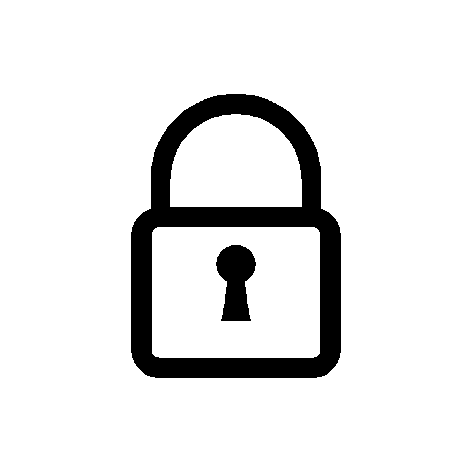

# 为什么要使用密码管理器？

> 原文：<https://blog.devgenius.io/the-password-to-preventing-digital-disaster-17d84fab96b2?source=collection_archive---------45----------------------->

图片版权 2014 Alexander Madyankin，Roman Shamin

杰克·德罗恩

网飞，Snapchat，Gmail，Tiktok。我们都有很多在日常生活中使用的账户。无论你是发送电子邮件、观看陌生事物还是听 Spotify，你都在使用一个你可能用电子邮件和密码注册的账户。注册这些服务通常是这样的:你输入一封电子邮件，一个密码，确认密码，勾选几个框，同意你实际上没有阅读的条款，然后你就可以开始了。但是这么多年来你做的所有账号，都是用同一个密码吗？统计学家给了我权力告诉你，是的，你可能有。根据 Keeper Security 对 1000 人进行的调查，超过 80%的人承认在网上重复使用密码。随着高比例的人重复使用他们的密码，以及我们与技术的联系越来越紧密，每年都会有一场灾难发生。

# 但是我重复使用的密码很难猜！我为什么要担心？

如果您重复使用的密码包含大写字母、小写字母、符号和数字的组合，那么恭喜您，您拥有一个强密码！虽然别人可能很难猜出你的密码，但重复使用的密码如果在数据泄露中暴露，可能会让你付出生命的代价。数据泄露是指公司的服务器被攻击者或叛变的员工破坏。这可能会导致你的信息泄露到整个网络，包括你的电子邮件和密码。很多时候，黑客最终会在互联网上向其他黑客出售大量的姓名、电子邮件和密码，以锁定目标人群，并在多个网站上尝试窃取的凭据。你可以登录这个漂亮的网站[www.haveibeenpwned.com](http://www.google.com/url?q=http%3A%2F%2Fwww.haveibeenpwned.com&sa=D&sntz=1&usg=AFQjCNFc7jgDsiFgaXe0-Z9epYRjuO9IDA)，查看你的电子邮件是否被发现有任何已知的数据泄露。

# 但是记住不同的密码就这么繁琐？

密码管理员来拯救我们了！密码管理器是软件/网站的一部分，允许你为你注册的网站生成完全随机的(然而是强的)密码。然后，密码管理器将密码保存在一个数字保险库中，该保险库由一个强而易记的密码保护。这些保险库的设计将安全性放在第一位。许多密码管理器允许您安装一个浏览器扩展，以自动使用保存的密码填写密码论坛，这样您就再也不用输入密码了。此外，流行的密码管理器通常是跨平台的，这意味着你可以在你的 PC，Mac，Android 和 iPhone 上访问/保存你的密码！它们还允许你从其他来源导入已保存的密码，如谷歌浏览器和火狐浏览器！我个人推荐密码管理器 [Bitwarden](https://www.google.com/url?q=https%3A%2F%2Fbitwarden.com%2F&sa=D&sntz=1&usg=AFQjCNHXlWApGAFq1PQtYJWEPzMLWlbOIw) 。Bitwarden 是所谓的“开源”，这意味着密码管理器的代码是免费的，任何人都可以使用和审计。正因为如此，Bitwarden 接受了多个安全团队的审查，并在网上公布了他们的报告结果。最棒的是，Bitwarden 是免费的，为更懂技术的个人提供一些额外功能，每年只需 10 美元。Bitwarden 还在你的主密码上使用了一种叫做“哈希”的东西。哈希的作用是通过使用一个非常复杂的数学方程，将您的主密码数据转换为一段不可读的数据，这比您在 AP 微积分课程中找到的任何东西都要复杂。这种“哈希”数据无法还原为密码，因此当您登录 Bitwarden 时，您的密码将通过相同的数学等式进行处理，以查看结果或“哈希”是否与您帐户中存储的哈希相同。这意味着，如果 Bitwarden 本身遭到黑客攻击，黑客将无法获得您的主密码来解密(解锁)您保存的密码。

# 但是为什么会有人想黑我呢？

一个好问题。我不知道。但我知道，我们这些出生在 21 世纪的人是第一代在我们上中学之前就拥有电子邮件和网络账户的人。在你未来的生活中，无论是你的工作，你的人际关系，还是你的金钱，你还有很多大的改变。你可能有一天会成为名人，赚很多钱，这将使你处于身份盗窃的高风险中。不幸的是，不管你是下一个金·卡戴珊还是瑞安·罗切特，总会有人喜欢破坏别人的名誉，为了自己的经济利益大肆破坏。现在最好通过良好的安全习惯来防止这种情况发生在你身上。不要让一个不良的网络安全习惯在未来给你制造一个令人头疼的万维网。

# 其他一些在线安全提示:

在你的账户上使用“双重认证”,尤其是你的邮箱和密码管理器。这要求你除了密码之外，还要用别的东西来验证你的身份。它可以是您在手机上收到的简单的 4 位数文本，也可以是您在密码后输入的电子邮件代码，以帮助确定登录的人确实是您。

不要通过短信发送密码(短信在 iMessage 上也被称为绿色短信气泡)。SMS 消息没有加密，能够被黑客拦截和读取。

当被要求输入密码时，一定要检查网址，确保它看起来是正确的，并且你不是在一个被称为网络钓鱼的攻击中设计来窃取你的密码的虚假网站上。

使用强密码来锁定您的手机。你的手机包含大量有价值的信息，可以用来侵入你的账户。

*最初发表于*[*【https://www.linkedin.com】*](https://www.linkedin.com/pulse/password-preventing-digital-disaster-jake-derouin/?trackingId=Yp8xIY%2B77A%2FT9JBd9AF14w%3D%3D)*。*