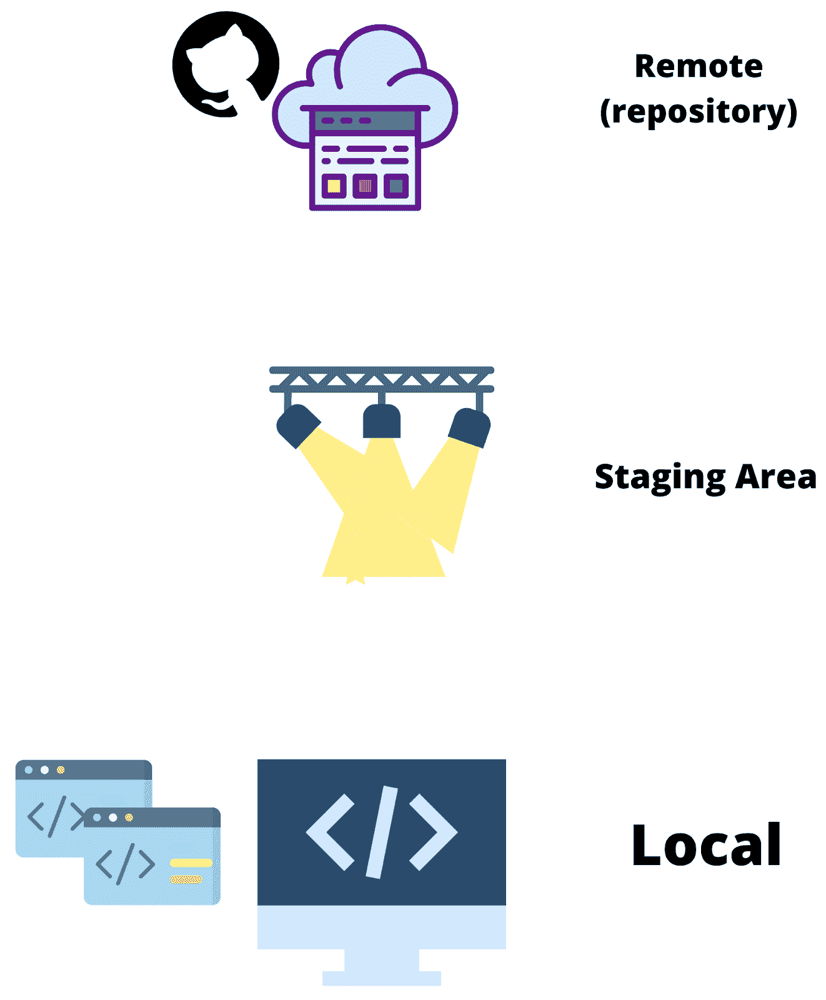
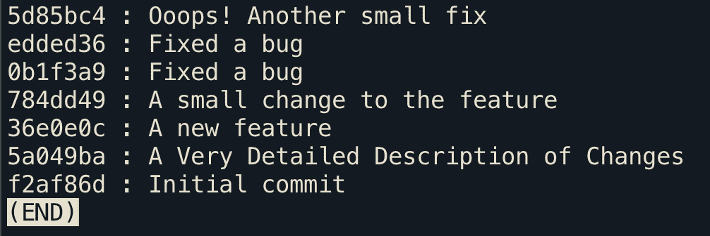

# 在 Git 中重置提交

> 原文：<https://blog.devgenius.io/the-perfect-git-flow-50fbf9690f75?source=collection_archive---------2----------------------->


图片:git

🍎这是您将要阅读的关于 git 流的百万篇文章之一。尽管如此，除非我告诉世界为什么我使用的 git 流比其他所有的都好，为什么每个人都应该使用它，否则我不会成为一名软件工程师。

🧑‍💻每个经验丰富的开发人员和新手都知道 git 及其用途。但是大多数人学习了 ABC，也就是提交、推动和拉动，并使用它。当合并冲突或重新定基问题出现时，他们疯狂地开始谷歌搜索，希望他们的本地更改不会丢失。我知道这是因为我开始用 git 的时候就是那个人。下面是分支工作流的功能解释，简单明了，便于团队在项目中协作。

# **快速回顾:**

📁Git 是一个版本控制系统，允许用户随着时间的推移管理文档和文件系统的版本，使回滚、跟踪变更和协作变得更加容易。VSC 将使我们能够避免向队友发送代码文件夹，并将文件夹命名为“Final”、“FinalFinal”、“FinalFinalFinal”、“OKTHISISFINAL”、“OKTHISISFINAL1.1”

# **复习 ABC 命令:**

💻让我们从您在本地机器上进行更改的第一步开始。现在我们想告诉 git 我们做了更改，它应该开始关心这些文件并跟踪它们。

## 第一步


```
git add .
```



局部变化

**git 将** includes 文件添加到暂存区。尽管这不会将任何东西推送到原始存储库，但它会告诉 git 要跟踪哪些文件。我们可以使用.将所有更新的文件添加到临时区域，或者按名称添加单个文件。现在我们的更改在站立区域，但是我们仍然需要提交更改来记录它们。

## 第二步


中转区的变化

```
git commit -m “<commit_message>”
```

**git commit** 获取当前暂存区的快照并跟踪它。这几乎就像对所有的更改执行“ctrl-s”。在提交之后，git 不会跟踪该提交中的任何新更改。下一步是推动对原点的修改。

## 第三步


```
git push origin <branch_name>
```


回购的变化

**git push** 将最终把变更上传到工作中的远程存储库的映射分支。这是将文件保存到云中的最后一步。运行 git push 命令后，更改将出现在您的 GitHub 存储库中。

# **新功能？新分支**

🌱特征分支工作流有一个中央报告。拥有一个特性分支工作流可以确保所有的特性开发都发生在一个专门的分支中，而不是在主或者开发分支中。这个工作流使得多个开发人员在不干扰其他环境或主分支的情况下处理多个特性变得容易。每个特性都有一个独特的分支，这使得进行拉请求(PR)成为可能，确保了代码审查和错误的代码不会被推送到主/开发分支。


从主分支切换到新的“新酷功能”分支

```
git checkout -b <branch-name>
```

git checkout 让你从一个分支跳到另一个分支。切换到新分支后，文件会更新到本地分支的最新版本。 **-b** 标志创建并切换到新的分支。

# **改写历史书**

📚现在您已经在您的分支上实现了非常酷的特性，是时候将这些更改合并到主分支中了。在推动最终的变更之前，最好从分支中挤压所有的提交。压缩提交意味着将两次或多次提交的更改压缩到一次提交中。如果您倾向于频繁推送，git 提交就会堆积起来，并且变化变得难以跟踪。挤压保证了工作分支的干净、简洁、可读，并且更容易跟踪变更，谁不喜欢干净的 git 日志呢。

## 第一步



在此分支上进行的提交；命令: **git 日志**


此阶段工作流的可视化表示

这种类型的提交经常发生，所以我们将所有这些提交压缩成一个提交。这意味着所有提交中所做的所有更改都将出现在一次提交中。

## 第二步


我们想要粉碎的承诺


我们想做的事情的视觉表现

我们将把白盒中的所有提交压缩成一个提交，理想地表示一个特性。

要调整提交的基础，请使用以下命令:

```
git rebase -i HEAD <hash of the commit above which you want to squash>
```


根据上面的例子，我们将编写以下命令

— — — — — — — —或— — — — —

```
git rebase -i HEAD~<number of commits from the top>
```


根据上面的例子，我们将编写以下命令

🖥运行 rebase 命令将在终端中打开一个文本字段，您可以在其中压缩以前的提交。编辑文件并删除您想要压缩的提交。该列表与提交顺序相反，即最旧的提交将在列表的顶部，而最新的提交将在底部。退出它("；vim 的 wq "😇)，就大功告成了！


第一步:提交在顶部是前一个，列表是相反的顺序


步骤 2:将所有提交压缩成一个提交


此阶段工作流的可视化表示

## **推，推，推变化！！**

🎊将变更推送到分支时，遵循标准程序，在末尾添加一个小的 **-f** 标志。继续工作，就像它是主分支一样。只需记住将更改推送到新的分支，而不是主分支。

最后，要推动您的挤压提交，请使用以下命令:

```
git push origin <branchName> --force
```


此阶段工作流的可视化表示

🔎此时，变更是主分支的一部分。理想情况下，当推进到主分支时，您的团队应该总是有一个变更审查者。让第二只眼睛检查更改有助于捕捉您可能错过的错误或边缘情况。GitHub 允许你在将任何提交合并到 master 之前设置一个 reviewer。它确实降低了提交变更的平均速度，但是会减少潜在的错误。

🍎最后，阅读 git 流上的其他一百万(减一)篇文章，成为一个 git👑。