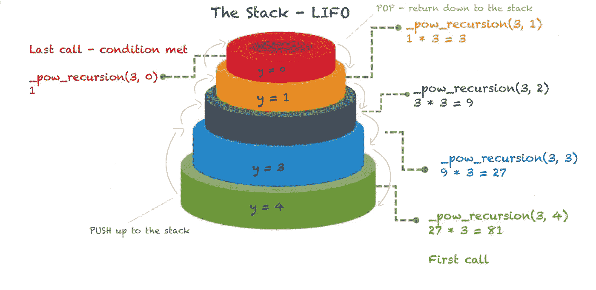

# 递归的力量

> 原文：<https://blog.devgenius.io/the-power-of-recursion-b15910be9ee7?source=collection_archive---------7----------------------->


在这篇博文中，我将讨论递归以及调用递归函数时堆栈中会发生什么。所有代码示例都是用 C 编程语言编写的。

# 什么是递归？

> 要理解递归，首先你必须理解什么是递归！

玩笑归玩笑，简单地说**递归就是函数调用自己。**

## 递归与迭代

假设你想在一个盒子里找到一把钥匙，你有什么方法可以解决这个问题？

下面的插图来自[搜索算法书](https://g.co/kgs/b5Sbzv)展示了两种不同的方法:迭代和递归方法。


图来自 Adit Bhargava 的《搜索算法:程序员和其他好奇者图解指南》

在**迭代方法**中，你穿过一堆盒子——只要盒子堆不是空的，你就抓住一个盒子仔细看——如果你找到钥匙就停下来——问题解决了！否则，你就继续下去，寻找并添加盒子，直到盒子堆空了或者你找到了钥匙。这就是迭代，一系列的指令或代码被重复，直到达到一个特定的最终结果。

而在**递归方法**中，你只需遍历盒子中的每一项，要么找到密钥，要么一遍又一遍地遍历盒子中的每一项。这就是递归，一个反复调用自己的函数。

请注意，这两种方法完成了相同的事情，每个递归函数都可以迭代编写，反之亦然。

现在我们知道了什么是递归，让我们通过查看一个代码示例来更深入地了解一下。

# 递归函数

让我们以函数 `_pow_recursion`为例，它使用递归计算一个数的幂并返回结果。它有两个浮点类型的参数:`x` 是基数，`y`是幂数。

```
float _pow_recursion(float x, float y)
{
    if (y == 0)
        return (1);
    if (y < 0)
        return (_pow_recursion(x, y + 1) / x);

    return (_pow_recursion(x, y - 1) * x);
}
```

## 基本和递归情况

每个递归函数都有两个部分:

*   递归情况——这是函数调用自身的时候
*   基本情况是，函数不调用自己

因为递归程序很容易进入无限循环，所以我们需要基本情况。当基本情况为真时，这用于**终止递归函数**。

如果我们看看上面的代码示例，当`y`达到 0 时，程序将停止并返回 1——这是**的基本情况:**

```
if (y == 0)  // BASE CASE
     return (1); 
```

只要`y` 大于 0，函数就会一直调用自己——这就是**递归的情况:**

```
if (y < 0) // RECURSIVE CASE
     return (_pow_recursion(x, y + 1) / x)return (_pow_recursion(x, y - 1) * x); // RECURSIVE CASE
```

让我们看看**调用递归函数时，堆栈**上会发生什么。

# 调用堆栈

> 调用堆栈是一种抽象的堆栈数据结构，它存储程序按顺序调用的函数的信息，以便每个函数可以在完成时返回到调用它的代码。

(要了解更多关于栈和堆的知识，建议你参考我之前的文章《C 编程中的[内存](https://medium.com/@chiaracaprasi/memory-in-c-programming-5fee2e0f17a2?source=friends_link&sk=89fbd0328ce6516c918b46aaff9a7241))

堆栈有后进先出顺序(LIFO)，这意味着当我们在堆栈中存储项目时，返回的第一个项目是我们放入的最后一个项目，就像在一堆盒子或一堆盘子中一样。向堆栈顶部添加一个新项目称为 **Push** ，从堆栈中移除最顶部的项目称为 **Pop** 。

堆栈在递归中起着重要的作用。事实上，在满足基本情况之前，函数一直存储在堆栈中。

让我们来看看它的实际应用——我们将继续上面的例子，并如下调用递归函数:`_pow_recursion(3, 4)`。

这是我画的一张图，用来展示**在递归中栈上会发生什么。**



Chiara Caprasi 绘制的图，展示了调用递归函数时堆栈中发生的情况

请注意，每次递归调用都会在堆栈内存中创建该方法的新副本。随着对`_pow_recursion`的每次调用，`y`的值都会改变。然后，该值被返回并更新到每个函数调用。然后将返回值乘以`x`，直到最后一次调用——我们最终得到最终值，在本例中是 81。

递归函数在每次递归调用时都会将值添加到堆栈中，并在调用结束前一直保存这些值。由于这个原因，递归使用更多的内存。无限递归可能会导致堆栈内存耗尽或堆栈溢出。

# **递归的力量**🔑

回到开头的例子，我们已经看到有两种方法可以找到答案——迭代和递归具有相同的解决问题的能力。

即使没有性能上的好处，使用递归优于迭代也有一些优点和缺点。让我们来看一些:

**优点**

*   递归有助于减少代码的长度，使其更容易读写。
*   有些问题更适合递归方法，因为它们本质上是递归的，如树遍历、[汉诺塔](https://www.geeksforgeeks.org/c-program-for-tower-of-hanoi/)等。对于这类问题，最好是写递归代码。注意——许多重要的算法都使用递归:合并排序、快速排序、斐波那契数列、阶乘问题等。

**缺点**

*   递归会占用更多的内存空间，因为所有的函数都会保留在堆栈中，直到到达基本情况。
*   递归很容易导致无限循环，因此，如果函数处理不当，计算机可能会耗尽内存(堆栈溢出！)
*   虽然递归可以使代码变得简洁，但由于其长度较小，也使代码难以理解——因此在处理递归函数的代码时，必须格外小心。

感谢你阅读这篇博客——我希望你喜欢它，并发现它有所帮助。如果你有任何问题、评论或者只是打个招呼，请通过 [LinkedIn](https://www.linkedin.com/in/chiara-caprasi/) 联系我，或者通过 Medium 关注我。

*保持快乐，继续编码！*👩🏻‍💻

## 参考资料和有用的资源

*   这里有一个非常棒的 10 分钟递归视频，展示了堆栈是如何工作的[https://www.youtube.com/watch?v=Mv9NEXX1VHc](https://www.youtube.com/watch?v=Mv9NEXX1VHc)
*   [搜索算法书](https://g.co/kgs/b5Sbzv)

[](https://www.freecodecamp.org/news/how-recursion-works-explained-with-flowcharts-and-a-video-de61f40cb7f9/) [## 递归是如何工作的——用流程图和视频解释

### Adit Bhargava 的插图(以及本文中的所有内容)>“为了理解递归，首先必须理解…

www.freecodecamp.org](https://www.freecodecamp.org/news/how-recursion-works-explained-with-flowcharts-and-a-video-de61f40cb7f9/)