# Shopee 的 Apache SeaTunnel 实践

> 原文：<https://blog.devgenius.io/the-practice-of-apache-seatunnel-in-shopee-caa6d90fe8a?source=collection_archive---------8----------------------->

> 在 Apache SeaTunnel(孵化)和 Shopee Meetup 期间，汪洋讨论了 Shopee 数据基础设施团队为什么选择 Apache SeaTunnel 作为他们新的数据集成框架，以及 SeaTunnel 是如何集成到他们的数据管道中的。

# **1 我们面临的问题**

## 1.1 现状

Shopee 是一家电子商务公司，我们为世界各地的人们提供服务，因此每天都会产生万亿字节的数据。为了使我们的业务能够从数据中提取洞察力，Shopee 一直致力于构建我们的大数据平台。我们提供涵盖数据开发整个生命周期的不同工具。

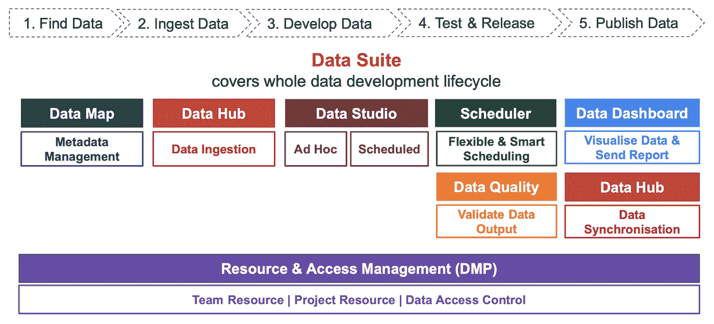

用户可以在 Datahub 中管理摄取作业，还可以浏览数据，并从 DataStudio 中摄取的数据创建非标准数据管道。在 Datahub 或 DataStudio 中创建作业后，调度程序将按预期在特定时间运行这些作业。目前，每天已经创建并运行数万个作业，包括在 Datahub 中运行的批量接收和连续接收作业。连续作业接近实时，他们使用与变更数据捕获相关的技术，并将数据收集到数据湖中。实时摄取基本上是在我们的 Flink 平台上运行的 Flink 作业。内部 ETL 作业通常由用户在 Datastudio 中创建，其中大部分用于基于原始数据构建我们的数据仓库表。

到目前为止，事情看起来很好，但是仍然有许多现有的工作没有被我们的平台管理，并且不能迁移到我们的平台。正因为如此，我们花费了大量的时间来创建和维护它们，这样的过程非常耗时，而且通常我们不能及时交付所需的作业。

## 1.2 多种来源

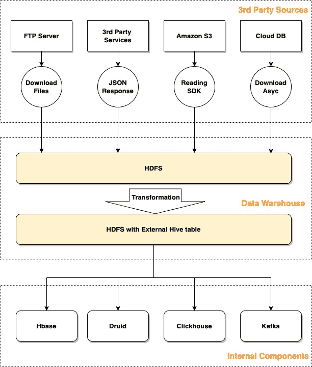

有许多原因使我们不能按时到达。首先，摄取类型的作业经常被请求，但是它们支持的数据源是有限的，主要是 MySQL 和 TiDB。其次，数据源必须是标准化的，这意味着它们应该由 DBA 管理，以便像分片表名这样的事情遵循某些约定，并且模式不应该改变得太频繁。遗憾的是，存储在不同地区的大量数据无法满足这些要求，因此我们无法在短时间内为它们构建标准化的产品。正如我们在图中看到的，我们将这些非标准数据源称为第三方数据源，有许多不同的类型，如 FTP、API、S3、CloudDB 等。

除了从外部来源向 Hive 导入数据，像 Clickhouse 和 Druid 这样的大数据存储被许多团队用于他们的专业。这些组件中的数据通常是从 Hive 导出的，但是其中一些组件也需要将数据接收到 Hive。目前，每个组件对都有一个独立的传输组件，并且每个组件对都有一个代码库。这给开发人员在沟通和理解过程中带来了很多麻烦。

## 1.3 数据处理的多样性

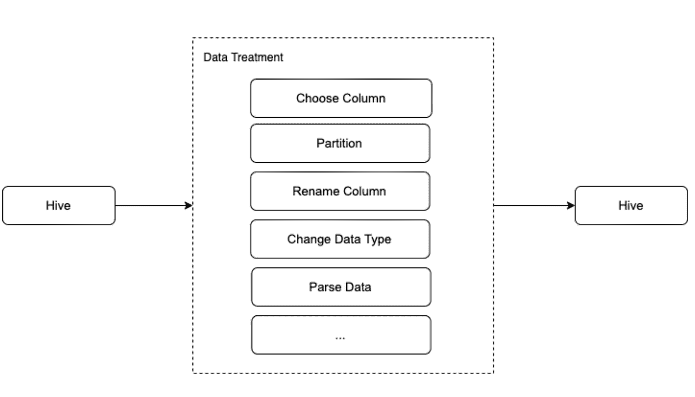

我们还有各种各样的数据清理和处理请求，这些请求是我们复杂的系统无法完成的。来自生产环境的原始数据在分析之前必须经过数据清理过程，例如，数据解析、数据转换、添加区域或日期时间等列。每个传输组件为数据清理提供了有限且独特的过程，这使问题变得复杂。其次，用户没有一个便捷的方法来构建数据仓库。目前，用户在我们的 DataStudio 中逐个案例地自行维护所有数据处理，这需要大量的数据处理工作。

大多数用户仍然直接使用摄入的 ODS 表。缺乏构建 DW 表的统一方法。最后，复杂的数据转换(如 SQL 作业，将不同的表或不同类型的源连接在一起)必须通过开发越来越多的独立管道来处理。

## 1.4 摘要

所有这些限制都会带来不好的体验。从用户的角度来看，由于大多数人不会参与开发，他们不知道发生了什么，他们唯一能做的就是在长时间等待后检查输出数据。

对于那些可以开发的用户，他们可以帮助在 Hbase 和 Clickhouse 等内部组件之间建立和部署管道，但这也充满了手动操作，如请求表和设置专门的转换。从开发人员的角度来看，这是一个操作噩梦，因为有许多来自上游的更改和新请求。有时，如果上游有没有通知我们的变化，数据差异将不会被发现，所以不可避免地，有时来自最终用户的投诉。然后，我们需要通过检查转换的每一步来验证数据，这其中充满了开发人员不熟悉的业务逻辑。

一般来说，自建数据转换管道是不可再生的，耗时长，且难以调试。

而且还有更多副作用。因为构建蜂巢到蜂巢的管道并不容易，所以商业智能团队中的许多人仍然使用原始 ODS 数据，而不是数据仓库表。这些非标准化的工作很难管理，因为它们缺乏统一的数据指标。

# **2 为什么选择阿帕奇海底隧道**

## 2.1 与尖端解决方案相比

我们开始寻找开源解决方案，因为我们不想重新发明轮子。但是在我们引入开源工具之前，我们总是需要知道利弊和界限，所以我们在提名之前通过与其他选择进行比较来做一些研究。

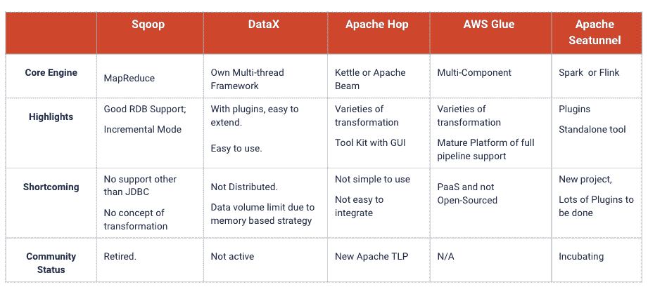

Sqoop 有很长的历史，但它只支持关系数据库，很难处理分片表。此外，它是一个退役的项目，这意味着 Apache 社区不再提供进一步的支持。

DataX 是阿里巴巴集团广泛使用的数据同步工具。很好用，也很容易用插件扩展。但是，开源版本缺乏分布式能力，并且由于其内存使用策略，会给单机带来很大压力。

接下来，Apache Hop 是基于 Kettle 或者 Apache Beam 的旭日东升，它在很多方面看起来很好看，但是对于我们来说太重了，Hop 旨在打造一站式的数据处理平台，但是我们需要的是一个轻量级的工具。

AWS Glue 也是同样的原因，而且它甚至不是开源的，所以我们不使用它。

所以我们开始评估我们最后的选择，阿帕奇海底隧道。

## 2.2 阿帕奇海底隧道简介

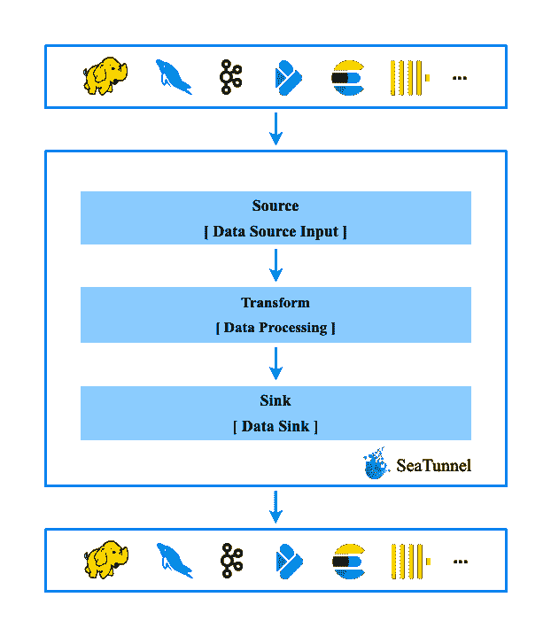

**Apache SeaTunnel** 是一款非常易用的超高性能分布式数据集成工具，支持海量数据的实时同步。它使用 java SPI 机制，这使得它可以以一种方便的方式进行扩展，这就是我们所渴望的。

总的来说，Apache SeaTunnel 是一个功能强大、可扩展且易于使用的无平台摄取工具:

*   易于编辑配置和运行开箱即用的工作。
*   支持火花或弗林克发动机。
*   可以添加和更新源/接收器连接器。
*   这个社区非常活跃。

应用程序的配置非常简洁。环境定义火花相关或 Flink 相关的环境设置。来源定义了数据的来源。转换定义了结果数据的样子。Sink 定义了数据将被写入的位置和方式。

# **3 重构内部通道**

## 3.1 使最终用户开始使用海底隧道

在我们向用户提供正式服务之前，我们需要一种方法让用户尽快自己完成，因为我们的开发人员跟不上他们的各种需求。我们选择使用 Spark Engine 只是为了这个临时的解决方案，有两个原因，第一，我们的大部分用户需求可以通过批量摄取来处理，第二，我们的 Flink 平台当时没有项目和团队级别的管理。

用户需要一个地方来上传他们的 SeaTunnel jar 文件，他们必须在测试后部署它。在测试期间，用户需要一种方法来创建和更新他们的 SeaTunnel 应用程序配置文件。此外，团队合作和管理是重要的，用户应该能够与团队成员分享他们的工作。

幸运的是，我们有一个用户友好的服务，称为 DataStudio，以前我们使用气流，我们把它变成两个服务，DataStudio 和内部调度程序。现在，用户可以在 Datastudio 中做很多事情，例如使用 Presto/Spark 进行即席查询，上传 shell 脚本和 Jar 进行测试，最后将它们部署到调度程序。

很自然地，我们想出了一个主意，在这个平台上教用户使用 SeaTunnel。在基本测试之后，我们编写了一个用户指南来支持用户在 DataStudio 中运行 SeaTunnel，同时，我们正在开发一个

SeaTunnel 的内部版本，当时最新版本是 V2.0.5

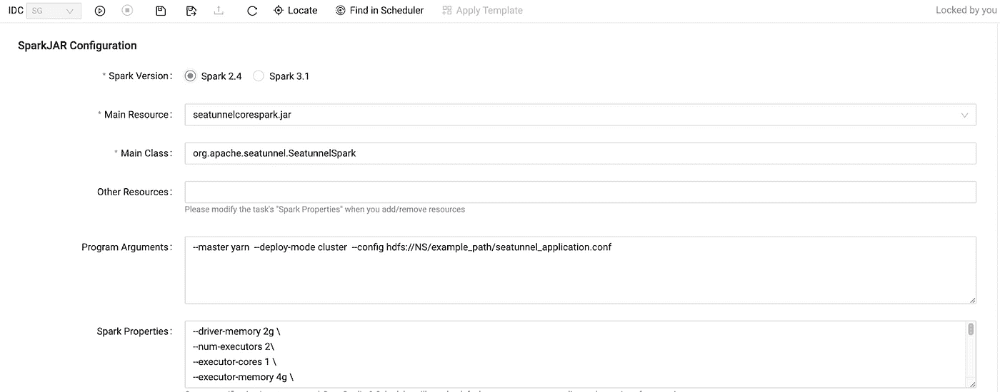

正如我们所看到的，我们可以通过 SSH 使用 Spark Driver 部署 Spark job，但是有几个缺点:

1.  许多最终用户不熟悉 Linux 命令行，运行和调试它可能是一场噩梦
2.  这样每个成员只能访问自己的个人目录，团队成员合作不可行。
3.  对于 Spark Driver 中纱线队列这样的设置，很难做权限控制。

如果用户在 DataStudio 中这样做，这些都不会有问题，下面是命令行示例的等效设置的屏幕截图。纱线队列是由你是哪个项目决定的底层逻辑设置的。其他一些设置是默认的，所以用户不必填写。工作环境看起来干净简单多了。

让我们来看看用户如何设置管道:

用户需要在 DataStudio 中创建新的工作流，并上传 SeaTunnel Spark jar。我们提供了两种下载 jar 的方式，从 HDFS 或者 google drive。用户需要确保他们能够访问我们的一台 HDFS 驱动程序机器，这样他们就可以将应用程序配置文件上传到他们项目下的路径中。之后，在 Studio 中填充其余的 spark 配置。最后，用户可以做一个测试运行，如果没有错误发生，用户可以检查数据通过查询输出表或检查他们在 HDFS 或其他直接汇。如果一切正常，他们可以设置一个调度器时间，并将其部署到调度器。

我们遇到了几个问题。

首先，在测试期间，我们发现 SeaTunnel Spark jar 的大小超过 200 兆字节。但是我们的平台当时只支持比它少的 jar，所以我们注释掉一些连接器和依赖来构建一个更小的 jar，这也降低了下载和上传的时间。

另一个问题是，我们的一些内部组件的版本与官方的 SeaTunnel 支持的版本不同，所以我们更新相关的 POM 依赖项并重新编译它们。

在我们发布用户指南后，更多的问题被报道。

其中之一是 HDFS 接收器连接器，它不会自动创建一个配置单元表。此连接器是必要的，因为配置单元接收器将只在默认路径下创建托管配置单元表，并且它与我们的数据治理规则相冲突，该规则是在特定路径中写入数据。

因此，我们添加了一种新的 Spark sink 连接器，称为 HdfsHiveTable，它从 HDFS 接收器扩展而来，并将在数据写入 HDFS 后创建一个 Hive 表。

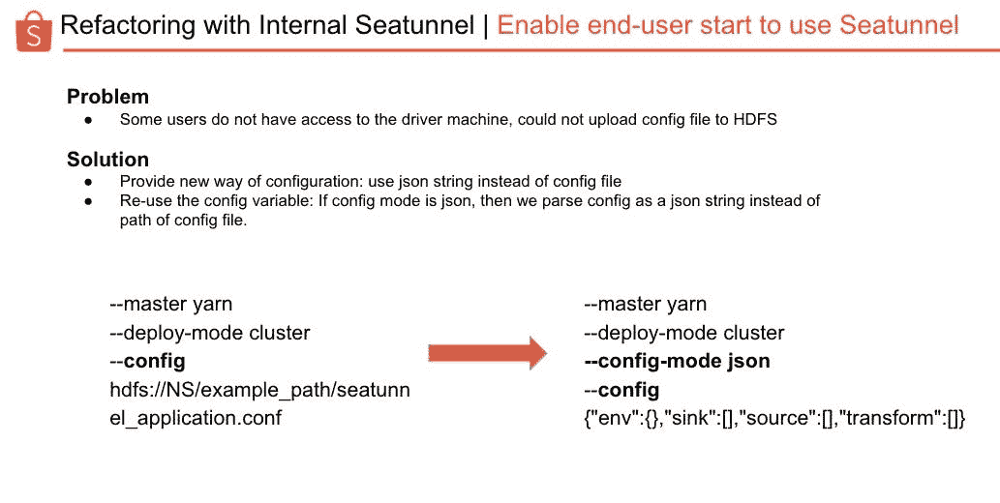

我们意识到，由于某种原因，一些用户无法访问驱动程序，这意味着他们无法将配置文件上传到 HDFS。因此，我们提供了一种新的方法来管理应用程序配置，使用户能够在 DatatStudio 中直接传递 JSON 字符串。它是通过添加一个名为 config-mode 的指示器实现的，如果它被设置为 JSON，用户可以传递一个 JSON 字符串。

JSON 字符串并不像这个虚拟例子显示的那样简单明了，它包含了转义字符，反斜杠。手动创建一个等效的 JSON 文件可能会非常麻烦，所以我们有一个小的离线工具来完成这个转换。对于旧版本的海底隧道来说，这似乎是唯一可行的方法。在最新版本中，SeaTunnel 有一种解析这个配置变量的新方法。

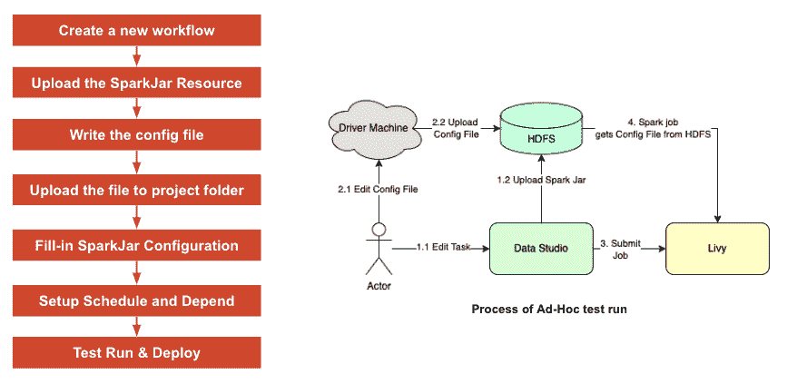

随着越来越多的最终用户的到来，越来越多的请求也随之而来:

首先，正如我们之前提到的，用户希望自动创建一个带有 Spark sink 的 Hive 表。

第二，他们想要一个可以从 AWS Redshift 获取数据的源，这是一个云关系数据库，但有些设置略有不同，所以我们开发了一个新的子类型连接器。

在某些情况下，用户询问 SeaTunnel 是否已经内在地支持一些功能，有时我们不确定，所以我们需要验证它，例如它是否支持 SSL 启用的 MySQL。对于这种情况，好的一面是我们解决了它，坏的一面是开发人员仍然参与其中，因为 SSL 密钥文件需要一些特殊的处理。

我们还试图将一些正在运行的管道实现到 SeaTunnel 中，例如 google sheet 摄取，以前我们开发了一个 spark 数据源来从 Google Sheet 中获取数据，但我们需要重构并解耦源和接收器，SeaTunnel 帮助我们轻松地做到了这一点。在这种情况下，我们使用原始的 spark 数据源和 HdfsHiveTable 作为接收器。

## 3.2 重构批量摄取

在为用户提供临时解决方案以满足他们的迫切需求之后，事情又回到了正轨。我们开始思考 SeaTunnel 能否帮助我们的开发者更有效地开发和管理不同类型的管道。

我们的一个运行系统叫做 BTI，这是一个批量摄取系统。BTI 以对在线 OLTP 系统最小的影响解决了业务分析的挑战，尤其是当及时性要求不是很高的时候。通常，实时和离线数据需求约为 20–80%。因此，BTI 专注于同步大多数对实时性不太敏感但需要分析的数据。典型的 BTI 工作是将在线 OLTP 数据库(如 MySQL)中的数据同步到 OLAP 数据库，如 Hive。这个系统存在不稳定的问题，需要花费大量的时间来维护。众所周知，它是 lambda 大数据架构的一部分。

Shopee 的批量摄取系统的发展历史很长，我将尽可能缩短背景。

当我们决定引进海底隧道时，我们已经摆脱了气流。因此，目前它们是由 Datahub 和内部调度程序触发的，但执行是由独立的服务管理的，这个数据库批处理摄取服务远比图中所示的复杂，它包含一个带 GUI 的微服务，并使用 Apache Nifi 底层来管理一个作业中每个子任务的状态和关系。所有与应用程序相关的配置都保存在 git 存储库中，这对用户来说是不可见的，也很难维护。

我不会透露这个系统的细节，因为它与海底隧道无关，但简化它也是我们的动机之一。

以下是我们决定重构的两个主要原因:

首先，由于海底隧道已显示出巨大的潜力，我们正计划使用海底隧道作为我们的长期统一运输组成部分。

第二，我们被遗留系统的复杂性所困扰，因为当每天创造更多的就业机会时，它们变得脆弱。调试也是一场噩梦。

因此，重构包含三个子任务:

*   使用 SeaTunnel 重新实现原来的传输组件。
*   重构相关服务以降低复杂性。
*   迁移历史作业，我们不想在发布新版本的系统时影响它们。

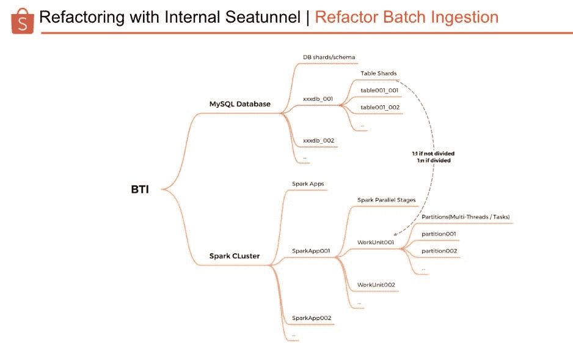

原始批次摄取必须处理什么？

它必须支持分片表、分片数据库，甚至分片主机，所以我们需要多个 Spark 作业来运行它。每个 Spark 作业负责一个物理数据库，作业中的每个阶段负责一个物理表，我们称之为工作单元。

在 spark 应用程序中，单个 Spark 应用程序与一个子数据库(也称为模式)相关，一个子数据库通常包含许多表碎片。如果没有数据不对称(无分割)，子表由一个工作单元同步，否则由多个工作单元同步(取决于部分)。

spark 并行阶段(工作单元)可以引发多线程/任务来执行同步。

如此示例图所示，整个批处理摄取作业包括 4 个步骤:获取、分区、转换和表创建。每一步都是一个 spark 应用。因此，BTI 作业是一个 DAG，或者我们可以称之为工作流，它由几个自定义步骤组成。其中，取数和创建表是必不可少的。

我们需要在从数据库表中获取数据之前检查心跳，以保持数据质量。我们可以从源数据库的 heartbeat 表中进行简单的查询来进行检查。

如图所示，获取是主要步骤，它总是将数据发送到 HDFS。

分区是可选的，有时它用于最小化配置单元分区的数量。如果我们简单地通过分片 DB 或分片主机对表进行分区，将会添加数千个分区，并可能危及 hive megastore。

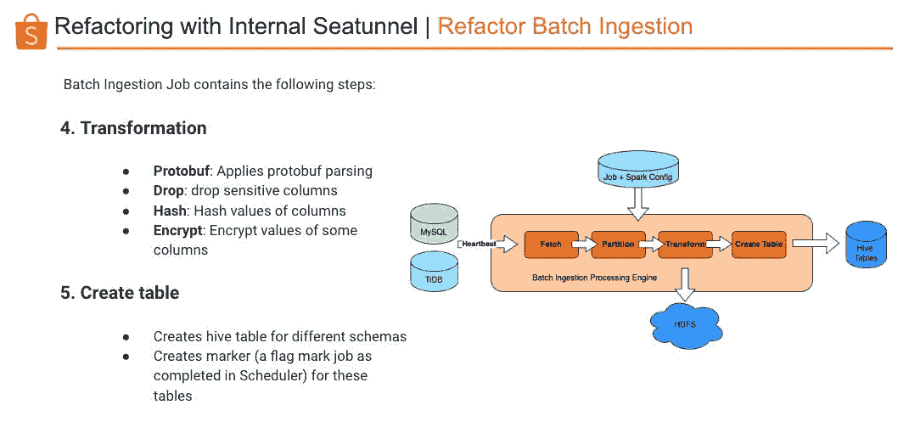

然后，我们支持一些类型的转换，它需要另一轮从 HDFS 摄取数据并将数据写回 HDFS。

最后，将有一个创造性的步骤来创建一个 Hive 表和相应的标记，调度程序中的一个标志，用于让下游知道它已经完成。

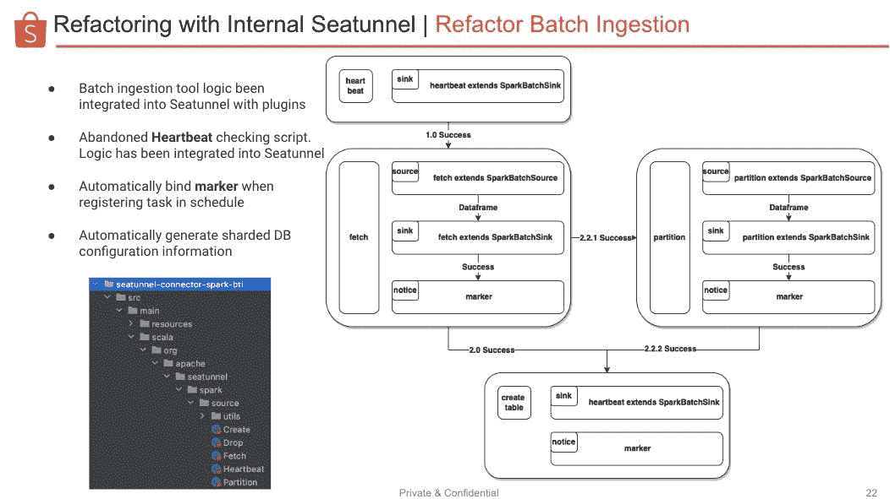

我们已经在 SeaTunnel 中实现了批处理摄取，作为源连接器的插件。这是我们所做的工作。

以前的心跳检查是由 Apache Nifi 触发的脚本。我们可以认为它是一个上游依赖。

在 SeaTunnel 中实现 heartbeat 很简单，您只需要在 heartbeat 检查失败时确保作业失败。

至于 fetch、partition 和 create table 阶段，我们将所有原始逻辑按原样移动到 SeaTunnel 中，我们只是重构一些数据结构，并使 sink 步骤成为 SeaTunnel 源代码中的一个函数。

我们将所有内容都放在源任务中，因为我们的批处理摄取作业包含许多数据帧，因为它们从分片表中获取数据，所以我们不能通过创建临时视图将每个数据帧传递到接收器连接器。

我们想出了这个变通办法，这不是一个优雅的解决方案，但它是可行的。

从图中，您可以看到有两种类型的工作。一种是最简单的情况，它将数据提取到 HDFS 中，并创建一个外部的 hive 表和标记。

另一个有一个分区转换步骤，这个步骤将在 fetch 标记被创建后被触发，然后它也将为创建一个 Hive 表和最终标记的最终步骤生成一个标记。

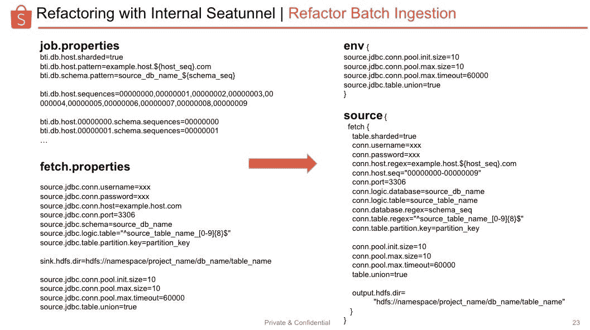

下面是一个我们如何使用 SeaTunnel 实现等效工作的例子。

对于转换，您可以看到定义了一个分区步骤，但是我们仍然将相关的逻辑放在源连接器中。与接收路径相关的配置也是如此。

对于配置详细信息，您可以看到之前它依赖于 2 个文件，作业属性定义了整个摄取作业。

fetch 定义了获取步骤。这些配置比我在这里粘贴的内容要大得多，但是经过重构后，配置变得清晰明了。

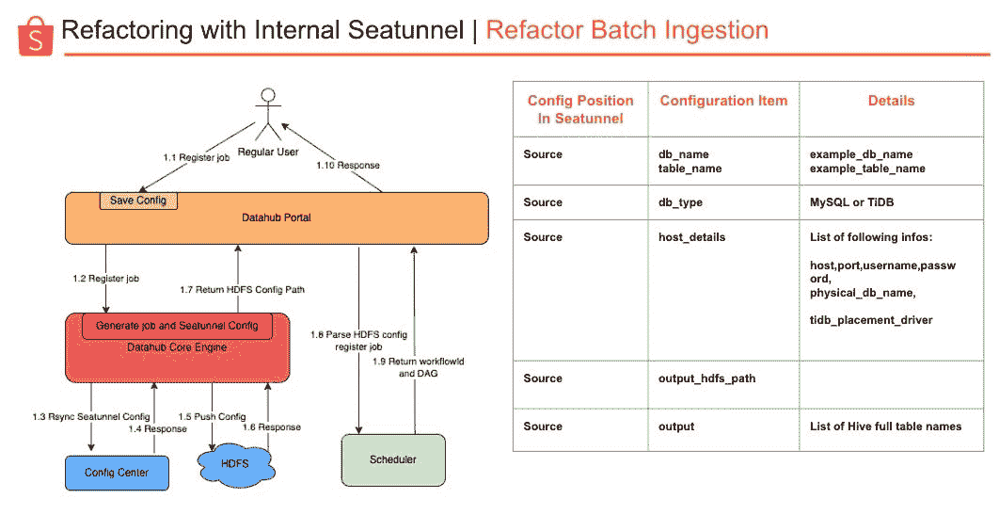

最后，让我们看看 Datahub 如何创建重构的批处理摄取作业。

右边的表格显示了基本任务配置的项目。

在用户点击注册按钮之后，这些 JSON 格式的消息被传递到数据中心的核心引擎，然后核心引擎将与配置中心通信以获得 SeaTunnel 格式的配置，并将在 HDFS 被更新。

注册作业后，门户会将该批处理摄取 DAG 注册到调度程序。

# **4 基于 SeaTunnel 构建 ETL 产品**

## 4.1 ETL 模块边界

最后，让我们看看一个全新的特性是如何基于 SeaTunnel 从零开始创建的。

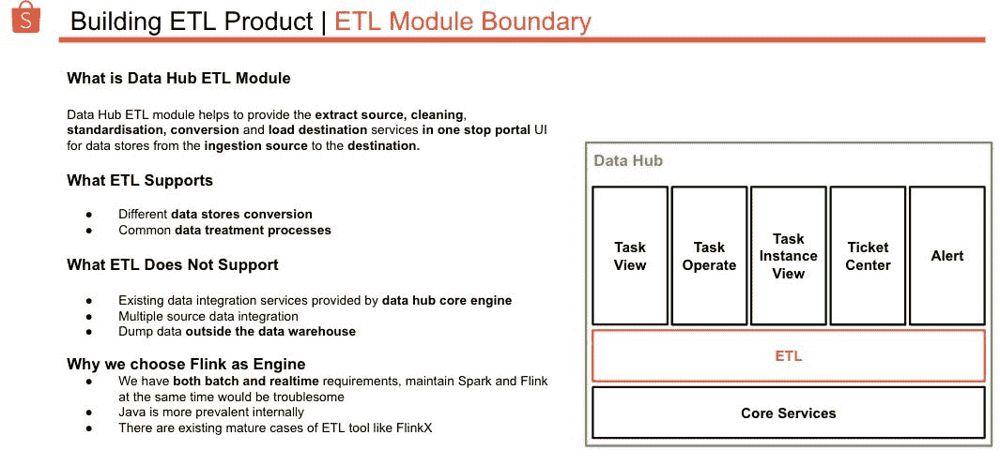

除了我们已经在 Datahub 中为标准化数据源提供的工具之外，这个 ETL 模块的目标是仓库中现有数据之间的非标准化数据接收和数据转换。通常，这些管道需要更复杂的数据处理。

目前，考虑到资源使用难以控制和估计，我们不支持管道中的多个来源。出于安全考虑，我们不允许最终用户将数据导出到我们的数据仓库之外。

ETL 产品基于 3 个原因使用 Flink 引擎:

*   我们同时有批处理和实时需求，同时维护 Spark 和 Flink 会很麻烦。
*   Java 在国内更流行。
*   像 FlinkX 这样的业务 ETL 工具已经有了成熟的案例。

## 4.2 用户任务端到端工作流

从用户的角度来看，让我们看看他们是如何创建 ETL 管道的。

因为这是一个个性化的特性，所以它比普通的摄取工具要复杂一些。

除了选择和设置源和接收器信息之外，用户还必须配置和检查源表和目标表之间的模式映射规则，这是因为模式自动推断在多次转换之后是不可行的，尤其是对于数据类型信息。

设置完所有配置后，用户可以执行一次临时操作，看看效果如何。

只有当用户确认提交任务时，后端才会生成实际的配置文件，让调度器工作。

## 4.3 流程图

后端系统包含 5 个主要组件。

数据中心是用户的界面，是协调一切的中心。

它向 ETL 服务发送 ETL 管道创建和预览管道创建请求

它为预览创建调度程序任务和即席调度程序任务。

它使用 Scheduler OpenAPI 来获取任务实例信息和日志。

它从 Kafka 主题中读取任务实例状态和临时实例状态。

最后，作业将被提交到我们的 Flink 平台。

## 4.4 预览

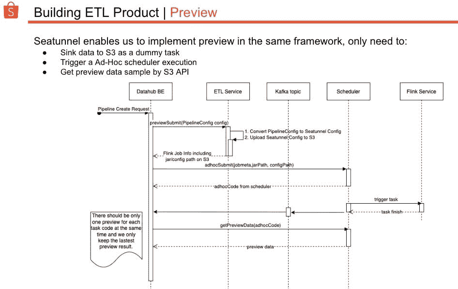

显示 SeaTunnel 优势的一个亮点是预览功能，它也包含了我们系统的主要逻辑。

预览为用户提供了查看中间结果的能力。在预览功能中，Datahub 和 ETL 之间有两个接口。

首先，Datahub 向 ETL 提供当前的管道配置，并像普通管道一样创建一个预览管道。我们创建一个临时配置文件，将数据放入 S3，而不是将数据放入用户配置的真实目的地。正如您在流程图中看到的，ETL 服务完成这项工作，并上传到 S3。

其次，Datahub 需要手动触发任务，这样预览管道才能在调度器中创建实例并运行。

此后，调度程序将接收临时配置文件的路径以及其他信息，并开始临时执行。

最后，Datahub 可以通过 S3 API 获取调度器给定的当前流水线的输出数据。

预览 SeaTunnel 作业是一个 hive-to-hive ETL 任务，它将是一种广泛使用的管道类型，因为用户需要它在像 dwd(数据仓库详细信息)或 dws(服务)这样的级别上构建数据仓库中的表。

如您所见，转换和接收配置都有一些微小的变化。

在 Transform 中，我们在 SQL 脚本中添加了一个限制来控制数据传输的大小。

至于 Sink，目的地已经更改为 S3，连接器是在创建表时在 Flink SQL 的属性中定义的，源表和目标表有不同的路径。

因此，用户将看到 2 个预览表，这是非常方便的，因为他们不必在很长时间后查询该表。

## 4.5 通用解决方案

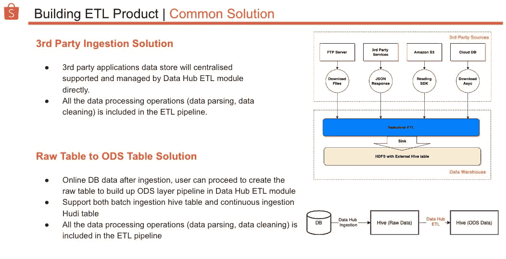

现在我们可以回顾一下 ETL 特性是如何解决我们在开始提到的问题的。

对于第三方接收，数据存储将由数据中心 ETL 模块直接集中、支持和管理。

所有的数据处理操作(数据解析、数据清理)都包含在 ETL 管道中。我们正致力于支持和迁移更多的遗留管道到 ETL 平台。

对于原始数据使用的问题。现在，用户可以继续创建原始表，以便在数据中心 ETL 模块中构建 ODS 层管道，这与 DataStudio 中的过程相比要容易得多，ETL 不仅支持批量摄取配置单元表，还支持连续摄取胡迪表。

类似于上面的原始数据使用问题，用户可以通过创建配置单元到配置单元的 ETL 管道来使用 ETL 构建他们的数据仓库。

最后，还可以解决内部组件之间的一些特殊数据传输，如 Hive 与 Hbase 或 ClickHouse 之间的数据传输。

这是另一个例子，说明我们如何在我们的平台上与其他产品互动和利用。

用户可以为我们的数据治理产品中的每一列设置数据敏感度级别，不同的级别对应不同的操作，我们可以直接删除它们或屏蔽部分数据，例如电话号码或地址。

因此，用户不必在 ETL UI 中手动设置转换配置，该信息将由从这个典型表中接收数据的所有 ETL 管道共享。

好了，现在我们可以总结一下 ETL 平台给用户带来了什么。

鉴于 SeaTunnel 的能力，我们可以轻松地支持更多类型的数据存储，用户可以用更简单、更友好的方式学习和设置 ETL 管道。用户可以专注于数据建模和洞察分析。

与在数据套件中手动部署 spark 应用程序的临时解决方案相比，ETL 管道将更多地由其他数据套件产品支持，如数据沿袭和数据质量检查等。

最后但并非最不重要的是，它是工程师友好的，这意味着易于操作和维护，易于开发更多的管道。

# **5 摘要**

## 5.1 我们取得的成就

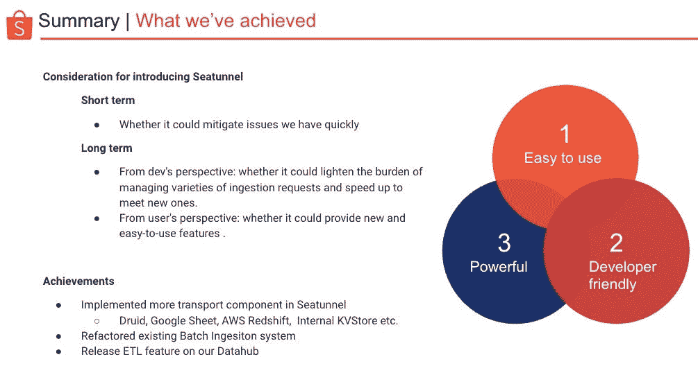

简单回顾一下，从一开始，我们就在寻找解决方案，我们希望它们在三个方面都很棒:

短期内:

-这应该能很快解决我们的问题

从长远来看:

-从开发人员的角度来看:it 应该减轻管理各种摄取请求的负担，并加快速度以满足新的需求。

-从用户的角度来看:它应该提供新的和易于使用的功能。

幸运的是，SeaTunnel 通过了所有测试。

我们已经实现了许多传输组件，其中一些已经交付给用户，还有一些正在等待外部服务重构。

我们重构了我们的一个系统。

此外，我们在 Datahub 中发布了 ETL 特性，我们将继续向它添加更多类型的管道。

# 5.2 未来计划

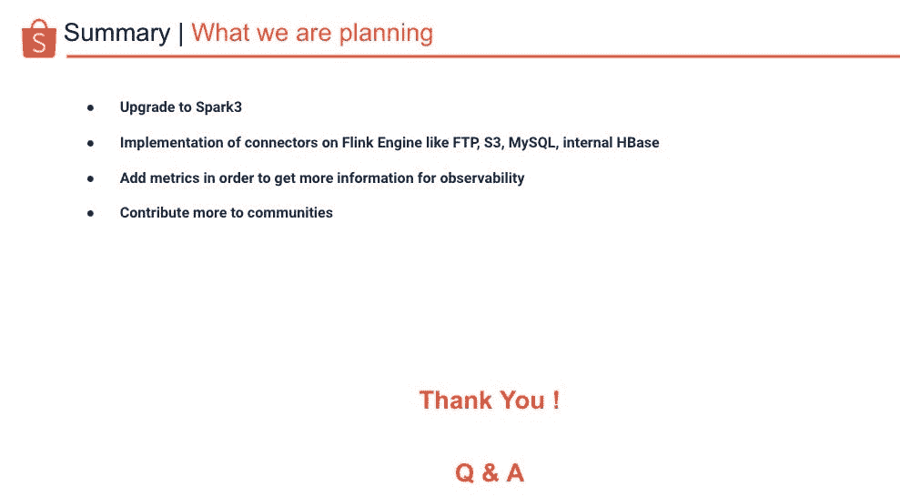

上图提到的一些计划正在进行中。

首先，由于我们的大多数 Spark 应用程序都运行在 Spark 3 中，众所周知，Spark 3.0 具有 AQE(自适应查询执行)特性，可以或多或少地自动解决数据倾斜问题。所以我们急需海底隧道来支持它。我们正在尝试升级一些具有更高优先级的连接器，如批处理摄取。

我们将继续实现更多的连接器，但主要集中在 Flink 引擎上，因为 ETL 平台是我们的长期计划。

我们还试图建立一个可观察性系统，但它需要每个组件的指标，以便我们可以收集信息来做统一的警报系统和仪表板。

# 关于海底隧道

SeaTunnel(原 Waterdrop)是一个简单易用、超高性能的分布式数据集成平台，支持海量数据的实时同步，可以稳定高效地同步每天数千亿的数据。

我们为什么需要海底隧道？

SeaTunnel 竭尽所能解决你在同步海量数据时可能遇到的问题。

*   数据丢失和重复
*   任务构建和延迟
*   低吞吐量
*   从应用到生产周期长
*   缺乏应用程序状态监控

**海底隧道使用场景**

*   海量数据同步
*   海量数据集成
*   大量数据的 ETL
*   海量数据聚合
*   多源数据处理

**海底隧道的特点**

*   丰富的组件
*   高可扩展性
*   使用方便
*   成熟稳重

**如何快速上手 SeaTunnel？**

想快速体验海底隧道？SeaTunnel 2.1.0 只需 10 秒钟即可启动并运行。

[https://seatunnel.apache.org/docs/2.1.0/developement/setup](https://seatunnel.apache.org/docs/2.1.0/developement/setup)

**我能做些什么？**

我们邀请所有对本地开源全球化感兴趣的合作伙伴加入 SeaTunnel 贡献者大家庭，共同促进开源！

提交问题:

[https://github.com/apache/incubator-seatunnel/issues](https://github.com/apache/incubator-seatunnel/issues)

将代码贡献给:

[https://github.com/apache/incubator-seatunnel/pulls](https://github.com/apache/incubator-seatunnel/pulls)

订阅社区发展邮件列表:

dev-subscribe@seatunnel.apache.org

开发邮件列表:

dev@seatunnel.apache.org

加入时差:

[https://join . slack . com/t/Apache seatunnel/shared _ invite/ZT-1 HSO 5 N2 TV-mkfkwxonc 70 heqgxtvi 34 w](https://join.slack.com/t/apacheseatunnel/shared_invite/zt-1hso5n2tv-mkFKWxonc70HeqGxTVi34w)

关注 Twitter:

https://twitter.com/ASFSeaTunnel

来加入我们吧！