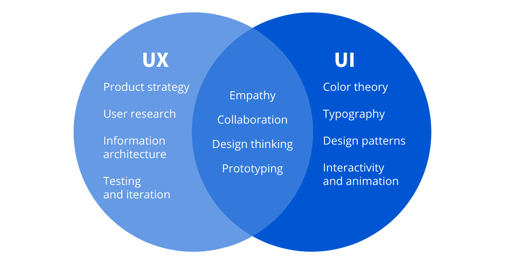

# UI/UX 设计的原则以及 UI 和 UX 设计的区别。

> 原文：<https://blog.devgenius.io/the-principles-of-ui-ux-design-and-the-difference-between-ui-and-ux-design-af38d48824b?source=collection_archive---------5----------------------->

# ***UI 与 UX 设计的区别***

UX 设计是指“ [**用户体验设计**](https://careerfoundry.com/en/blog/ux-design/what-is-user-experience-ux-design-everything-you-need-to-know-to-get-started/) ”这一术语，而 UI 则代表“用户界面设计”。这两个元素对于产品来说都是至关重要的，并且密切配合。但是，尽管他们的专业关系，角色本身是相当不同的，指的是产品开发过程和设计学科的不同方面。他们两个携手并进，在他们的角色方面可能会有一些重叠。

UX 和 UI 的主要区别在于 UI 关注于界面的*外观和感觉*，而 UX 涵盖了*整个*用户体验。UX 为一个产品创造了战略基础，UI 让它变得美丽。UX 需要研究和头脑风暴，而用户界面设计更多的是表面层次。

要创建一个有效的软件产品或网站，你需要 UX 和用户界面协同工作。也就是说，你需要 UX 原则来建立基础，然后进行 UI 设计，让它变得漂亮、可访问、易于使用。UX 设计师考虑用户解决某个特定问题的整个过程；他们采取什么步骤？他们需要完成哪些任务？体验有多直接？

作为一名 UX 设计师，他们的大部分工作都集中在找出用户遇到的问题和痛点，以及某种产品如何解决它们。他们将进行广泛的用户研究，以找出谁是目标用户，他们对某一产品的需求是什么。

然后，他们将绘制出用户在整个产品中的旅程，考虑信息架构之类的事情，即内容如何在产品中组织和标记，以及用户可能需要什么样的功能，然后创建线框，作为绘制出的产品的骨架。用户界面设计者介入并赋予它生命。UI 设计师考虑用户旅程的所有视觉方面，包括用户可能遇到的所有单个屏幕和接触点；想象一下轻点一个按钮，向下滚动一页或者浏览一个图片库。

UI 和 UX 设计的区别总结:

*   UX 设计就是识别和解决用户问题；UI 设计就是创造直观、美观、互动的界面。
*   UX 设计通常在产品开发过程中排在第一位，然后是 UI。UX 设计师描绘出用户旅程的基本框架；然后，UI 设计人员用视觉和交互元素填充它。
*   UX 可以应用于任何种类的产品、服务或体验；UI 是特定于数字产品和体验的。

# 用户界面/UX 设计的原则

[Firmbee.com](https://unsplash.com/@firmbee?utm_source=medium&utm_medium=referral)在 [Unsplash](https://unsplash.com?utm_source=medium&utm_medium=referral) 上拍照

## 1.尽可能避免错误

作为一名设计师，你需要通过防止严重的用户错误来使用户界面尽可能容易使用。这也是[可用性测试](https://maze.co/guides/usability-testing/)的用武之地。作为一名设计师，在发布之前，一切都必须通过与用户一起测试设计来实现。它不仅有助于测试产品的功能和可用性，还能帮助你更好地了解目标受众的需求。

然而，偶尔会发生错误。因此，如果用户犯了一个错误，一定要给他们一个清晰的解释来理解错误，并提供一个简单的解决方案。

## 2.保持简单的用户界面设计

在所有主要的 UI 设计原则中，最重要的是不要忘记你在为谁设计，以及为什么设计。好的 UI 设计是实用的；从不装饰。将注意力从那些真正与用户相关的元素上转移开，始终以尽可能少的步骤和屏幕为目标。使用底部表单和 [**模态窗口**](https://www.framer.com/examples/modal-window/) 等覆盖图来压缩数据，减少应用程序的占用空间。

## 3.灵活性

你不仅需要让你的用户界面对新用户来说是可学习的，还应该有加速器来帮助专业用户加速他们的过程。从新手到专家，确保你的产品对各种用户都是灵活高效的。新用户应该容易学习，并有专家快速做事的快捷方式。

## 4.熟悉

最好的界面是用户熟悉的。可用性，即用户与产品或网站交互的难易程度，与熟悉度密切相关。用户依赖于元素和界面以他们熟悉的数字体验方式运行。用户不应该怀疑他们在软件中的位置，也不应该怀疑他们需要做什么才能到达他们想去的地方。

## 5.将用户置于控制之下

一般来说，在设计中，如果你让用户控制他们在产品中的位置和他们在做什么，他们会有更好的体验。设计应该给用户在这个过程中的控制权，并允许他们重做，撤销和取消他们已经采取的行动。另一种增强控制的方法是为更高级的用户(高级用户)提供提高效率的方法。键盘快捷键是一种很好的方式，模板和宏也可以让用户更有效地完成重复的功能。

## 6.清楚

在 UI 设计中，术语清晰意味着使用可识别的特性和元素，这些特性和元素可以直观地进行交互。这对于按钮和导航菜单等交互式元素尤其重要。在 UI 设计中，术语清晰意味着使用可识别的特性和元素，这些特性和元素可以直观地进行交互。这对于按钮和导航菜单等交互式元素尤其重要。

所以当你创造你的产品时，问问你自己以下的问题:

*   你的导航直观吗？是否引导并鼓励用户轻松地从一个页面转到下一个页面？
*   你是否使用过高度可见的按钮来提示用户点击它们？
*   你的产品、网站或应用上每个元素的用途是否清晰易懂？