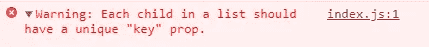
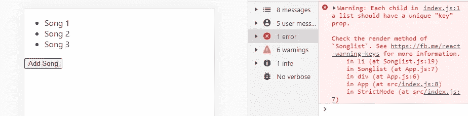
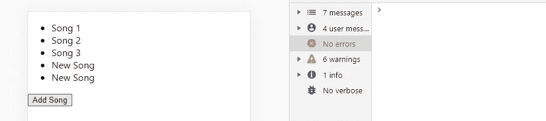

# 为 React 元素创建唯一键的快速、简单但有效的方法

> 原文：<https://blog.devgenius.io/the-quicky-lazy-but-effective-way-to-create-unique-keys-for-react-elements-e45d574028a3?source=collection_archive---------1----------------------->

弗洛里安·伯杰在 [Unsplash](https://unsplash.com?utm_source=medium&utm_medium=referral) 上拍摄的照片

*如果你和我一样，你可能已经多次看到并忽略了这个错误。*

你好，老朋友。

# 唯一键是怎么回事？

那么问题出在哪里？这个错误仅仅是隐藏在控制台中的一个警告，它似乎并不影响程序的运行。这个错误到底告诉了我们什么？本质上，如果我们返回一个元素列表，React 需要一种方法来**尝试区分我们刚刚返回的所有元素**。当 React 试图决定哪些元素需要更新或者元素是否需要以某种方式修改时，这很有帮助(想想 CRUD)。本质上，给一个元素一个稳定的标识可以让 React 工作得更好，这也是我加入的充分理由。

虽然很容易忽略这一点，但修复它几乎同样容易。让我们看看我们有什么选择。

# 我们能做些什么呢？

第一步是承认我们有问题，我们现在可以继续前进，看看如何解决它。以下是几种方式；

> 1.让它保持原样
> 
> 2.使用数组样式索引
> 
> 3.编写自定义 id 生成器
> 
> 4.使用 UUID

哦，亲爱的，我以为我们真的有所进展了。回到本文开头。

**2-** 这似乎是一种直观的方法，但是 React 文档本身声明 [**不要这样做**](https://reactjs.org/docs/lists-and-keys.html) 。所以那也是不可能的。

**3 -** 好主意，我们可以生成唯一的密钥 id。然而，随机函数并不完美，确实会产生两次相同的结果，当我们可以使用…

**4 -** 丁丁！我们有赢家了！UUID 是一个通用的唯一标识符，这意味着我们不应该有任何问题来确保我们的键是唯一的。此外，在 React 项目中有一个超级简单的方法来实现这一点。

# 实现 UUID 生成器

很好，我们决定使用 UUID，就像 Javascript 中的任何东西一样，它有一个库。我将使用 Node 中可用的 [uuidv4 库](https://www.npmjs.com/package/uuidv4)。正如我之前提到的，我很懒，所以让我们用最简单的方式实现它。

这是一个功能组件，它有一个返回一些 JSX 的歌曲列表。超级简单的东西:

Songlist.js —显示歌曲列表的功能组件

我们甚至有一个很好的按钮来添加一首新歌，可爱。
如果按原样运行这段代码，我们会得到我们之前看到的错误:

我们的应用程序遇到了错误。

**我们需要给<Li>/Li>元素添加一个 UUID 键。一般来说，无论你在哪里看到一个`array.map()`，我们都需要使用一个唯一的密钥。**

首先让我们运行`npm i uuidv4`来下载并安装 uuidv4 节点包。我们现在可以用`import { uuid } from uuid4`来导入它。
最后我们可以给< li >元素添加一个关键道具，然后简单地调用函数`uuid()`。该函数返回一个 UUID 字符串。

就是这样。这就是全部了。

当我们再次运行该应用程序时，我们将看到我们不再有这个错误！

不再有错误！

感谢阅读，这里是更新后的代码！🎉🎉🎉

更改在第 2 行和第 19 行。

如果您喜欢这篇文章或觉得它有用，请随意操作。或者，你可以在 Medium [*这里*](https://jamesmbrightman.medium.com/membership) *支持我或者给我买一杯* [*咖啡*](https://ko-fi.com/jamesbrightman) *！非常感谢所有的支持。*