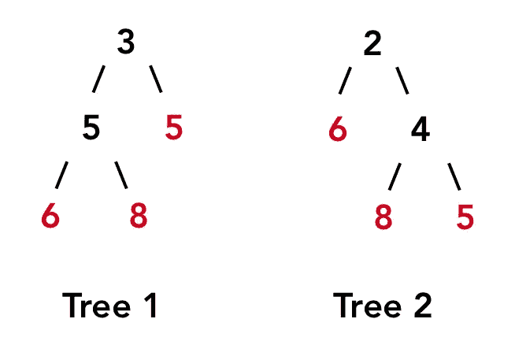

# REACT-O 技术面试框架

> 原文：<https://blog.devgenius.io/the-react-o-technical-interview-framework-17144e6ede06?source=collection_archive---------6----------------------->

## 解决白板问题的六个步骤

在 [Unsplash](https://unsplash.com?utm_source=medium&utm_medium=referral) 上拍摄的 [ThisisEngineering RAEng](https://unsplash.com/@thisisengineering?utm_source=medium&utm_medium=referral)

昨晚我参加了一个软件工程师的虚拟聚会，他们聚在一起练习数据结构和算法问题。我几乎是个白板初学者，所以进去的时候我很紧张。

然而，我使用了一个六步框架来帮助我解决问题，并在做的过程中获得乐趣！

这篇文章是写给那些刚刚开始技术面试，或者想了解更多关于白板的人的。

# 示例:比较二叉树

树 1 和树 2 具有相同的叶值序列:6，8，5。

> 考虑二叉树的所有叶子。从左到右，这些叶的值形成一个叶值序列。
> 
> 如果两个二叉树的叶值序列相同，则认为它们是叶相似的。
> 
> 当且仅当头节点为 root1 和 root2 的两棵树是叶子相似的树时，返回 true。

# 第一步-重申

用语言表达你对问题的理解——这是你检验自己对问题理解的机会。

确保你同意你应该输出什么。在这种情况下，我们的目标是编写一个函数，该函数接受两个树根，如果这两棵树以相同的顺序包含相同的叶子(无子节点)，则返回 *true* 。

问问你在处理什么样的约束。例如，你可能会问面试官如果树是空的，这个函数应该返回什么，他们可能会说假设你应该假设所有的树至少有一个节点。

# 步骤 2-示例

想出一些例子，代表将通过你的问题集的数据，并尝试包括任何棘手的边缘情况。这将引导您找到需要编写的代码，以便返回正确的结果。

例如，在我的模拟面试中，我们使用了上面的例子，这让我们看到我们需要进行深度优先搜索，而不是广度优先搜索。

# 第三步-接近

用语言描述并写下你想采取的步骤以及你采取这些步骤的理由。这有助于你的面试官了解你的想法，并在合适的时候帮助你。伪代码。

# 步骤 4 和 5-编码和测试

这是你把你想出来的方法转化成工作代码的地方。

一些面试官提到，想出一个正确的方法和为它写代码并不一定要齐头并进——你需要两者都实践。

理想情况下，当您编写解决方案时，您也在测试它是否按照您期望的方式运行。这将帮助你发现你犯的任何语法错误或逻辑跳跃。

通过您的解决方案运行示例来验证它是否有效，或者您是否还有更多工作要做。

# 第六步-优化

一个蛮力的方法可以解决问题，但是如果有剩余时间，尽量优化你的工作，降低它的时空复杂度。一些面试官希望你仔细检查你的解决方案，并使用大 O 符号来识别它的性能。

# 结论

这就是 REACT-O 框架:重申、提出例子、制定方法、编码、测试和优化。

这里有一些传授给我的其他技巧——用你能想到的尽可能多的方法练习解决问题。这将增强你提出前所未见的解决方案的能力，并展示你对所学知识的掌握。把你的算法想成一个孩子；你需要简单明了地解释你想让它做什么，这样它才能遵循你的指示。最后，不要依靠记忆方便的方法来完成工作。练习编写结合简单方法的函数。

# 感谢

我从 Caryn McCarthy 那里学到了 REACT-O 面试框架，并从杰夫·格林那里获得了额外的白板建议。

[她在编西雅图](https://www.meetup.com/shescoding-seattle/)是我参加的 meetup 群。他们每周都会为技术领域的女性和非二进制人士举办初学者友好的白板练习课。

二叉树比较问题来自他们，这个例子是由缔安娜·廷格创造的。