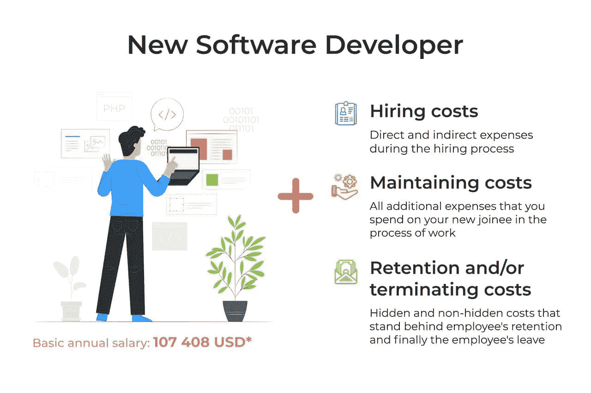

# 雇佣一名新软件开发人员的真实成本

> 原文：<https://blog.devgenius.io/the-real-cost-of-hiring-a-new-software-developer-bdc6bbcd9745?source=collection_archive---------4----------------------->

所有公司，无论是老牌公司还是新成立的公司，都面临着的招聘挑战。随着公司的发展，需要扩展 IT 部门，市场需要越来越多的软件应用程序，因此对软件开发人员的需求居高不下，并持续增长。

当然，开发人员的某些技能和专业知识是寻找合适候选人的主要对象。但是技能之后是什么呢？决，费。

**每个人都想以优惠的价格找到一个技术过硬的完美人选。**但是我们所说的“成本”到底是什么意思呢？

首先，我们通常会考虑新员工的薪酬金额。但是你考虑伴随费用包括隐藏费用吗？

不同的信息来源指出，雇佣内部开发人员的实际成本可能在每位员工年薪的 25%到 200%之间。

你能想象吗？这意味着许多公司严重低估了成本当他们把雇佣一个开发者的成本等同于一个新员工的工资时。

事实上，在雇佣、维持和解雇长期员工的过程中，会涉及到许多可观的成本(其中许多成本并不明显)。我们想要探究雇主在追求、保持和失去永久 IT 员工的整个过程中所产生的一些明显的(和不那么明显的)成本，以试图以一种成本有效的方式持续地生产有价值的软件。

首先，我们想展示雇佣一个新开发人员的真实成本的组成部分。看看下图就知道了。

因此，如果关于实际成本(每个员工年薪的 25%到 200%)的陈述是正确的，那么你将为一个年薪为 107，408 美元的软件开发人员花费大约 134，260–322，224 美元。令人印象深刻，不是吗？

**美国基本工资根据*[*www.indeed.com*](http://www.indeed.com)

*为了不显得毫无根据，我们想以货币当量来计算所有直接和间接成本。根据 2020 年 12 月 3 日的 indeed.com 报告，在美国，软件开发人员的平均工资约为 107 408 美元。因此，在我们的研究中，我们将 107，408 美元作为基本工资(大约 50-55 美元/小时)。*

让我们继续这个话题，并把重点放在最初的招聘，保持永久员工，和终止。因此，我将详细介绍招聘过程以及相关费用。

当然，就需要投入多少资金而言，寻找和雇用候选人的过程可能是不可预测的。但这并不意味着现阶段无法确定你的公司在新开发者身上投入了多少。

**首先，直接成本。**根据贵公司的规模、结构和招聘政策，您寻找新候选人的方法可能会有所不同。让我们比较一下现阶段可能的成本:

## **人才收购**

**招聘机构:**许多公司求助于招聘机构进行招聘，因为这样可以使招聘过程更容易。中介机构平均收取雇员年薪的 15-25%的费用。在我们的案例中，这相当于年薪的 20%**约 21481.6 美元**。

**推荐系统:**公司鼓励现有员工为潜在雇员提供推荐，并帮助获得新职位，这种情况并不少见。许多员工每成功聘用一名员工可获得**1000-3000 美元**的收入，具体取决于所填补职位的类型。资料来源:http://www.hr.com/

**内部人力资源部门:**最初，利用自己的人力资源部门似乎是获得新员工的最具成本效益的方式，但它对没有内部人力资源的小公司不起作用。最终需要管理层投入大量时间。以下是一个职位所需的大致时间:

*   开发工作描述:1 小时；
*   给工作人员专业网络中的人打电话寻找合适的候选人:5 小时；
*   在内部和公司网站上发布职位信息:30 分钟；
*   审阅和回复收到的 20 份简历，进行 5 次电话面试:3 小时；
*   将简历输入公司数据库:2 小时；
*   对 5 名候选人分别进行 2 次面试所花费的时间:8 小时；

总计:19.5 小时* 21.5 美元/小时([美国人力资源经理的平均工资](http://www.payscale.com/research/US/Job=Human_Resources_(HR)_Manager/Salary))=**419.25 美元**

很多时候，人力资源管理也有一个奖金制度，对成功录用的员工给予金钱奖励。标准奖励约为新员工月薪的 **10%** 。在我们的情况下，大约是 895 美元

此外，我们需要提到招聘广告这种东西。是的，它在不同的门户网站、网络等上发布你的空缺职位。总的来说，它需要时间和金钱的投入，但对结果没有任何保证。因此，在 https://www.indeed.com/[这样的门户网站上发布一个职位的成本大约是每个职位 5 美元。在 Linkedin 上发布一个 30 天的列表大约需要 495 美元。因此，我们假设你将花费大约 **500 美元**在三个渠道发布新的职位空缺(其中一个是免费的，比如 Glassdoor)。](https://www.indeed.com/)

**另一个案例——搬迁费用。有时在当地找不到合适的候选人，于是向需要重新安置的人发出邀请。当然，搬迁的成本可能因公司规模、位置等因素而异。然而，根据 Allied Van Lines 的流动性调查，这一数额在 14000 至 38000 美元之间(平均为 26 000 美元)。标准套餐包括找房子、搬家、临时住房和杂费补贴。**

**其次，间接成本。**虽然直接成本很容易估算，但间接成本要复杂得多。它们可能很难量化，但我们将尝试揭示一些更常见的费用:

*   **关键员工的时间损失**

面试软件开发人员，尤其是在寻找资深开发人员时，通常需要内部技术专家和关键员工的参与，例如 CTO 和技术主管。除了参与面试过程之外，关键员工还必须核实测试任务，并对候选人的技术技能撰写评论。这反过来影响了这些高薪员工的正常工作职能和时间能力。

即使我们假设每个技术主管花大约一个小时面试每个候选人，而我们只有五个候选人，五个小时将用于面试，而 10 个小时用于检查测试。这相当于 15 个小时，每小时 65 美元(首席技术官的平均工资为 152，775 美元*，产品经理的平均工资为 105，899 美元*。我们使用这些工资的平均值并计算其小时工资率)。

**根据美国的基本工资。来源:*[*www.indeed.com*](http://www.indeed.com)

你最终的总数是 975 美元。这笔钱不包括不把时间花在核心业务活动上的任何替代成本。

*   **时间和机会的损失**

平仓一般平均需要近 [30](https://resources.workable.com/stories-and-insights/time-to-hire-industry) 天。雇用具有特定技能和专业知识的开发人员可能会花费更多的时间。此外，根据 Allied Van Lines 的流动性调查报告，公司预计在招聘过程中会失去大约 25%的最佳候选人。再加上招聘过程中所有人的时间损失，以及在此期间可能正在进行的项目的替代成本，你应该开始看到影响了。

不幸的是，我们无法确定货币损失方面的确切数字，因为它可能会因情况而有很大差异，但根据给定的信息，您应该明白这些费用会变得相当大。

总而言之，我们知道招聘过程中的最低额外费用为 2，789，25 美元(1，314，25 美元人力资源部门花费+ 500 美元广告+ 975 美元关键员工时间)。在高端，包括代理帮助和重新安置成本的费用相当于 48，456.6 美元(21，481.6 美元的代理费用+ 26，000 美元的重新安置费+ 975 美元的员工工作时间)。因此，我们从一名员工的基本工资中支出大约 **2，6–45%**。

最后，我们需要提到的是，这只是招聘过程。在我们的下一篇文章中，我们将讨论与维持和解雇员工相关的成本。

顺便说一下，[developerx](https://developex.com/)可以建立一个由软件和固件工程师、QA 专家、UI/UX 设计师组成的专门开发团队，还可以根据您的具体需求分配一名项目经理/业务分析师/交付经理！

另外，要了解更多关于 Developex 团队即服务的信息，请查看下面的链接:[https://medium.com/dev-genius/developex-6178088a77bb](https://medium.com/dev-genius/developex-6178088a77bb)

希望你喜欢阅读这篇文章。我们将非常感谢关于它的任何评论。如果你在努力为你的开发团队寻找一个完美的匹配，不要犹豫[联系我们](https://developex.com/contact-form/):[contact@developex.com](mailto:contact@developex.com)

[Developex](https://developex.com/) 将永远为您服务，无论您何时寻找合适的开发团队。