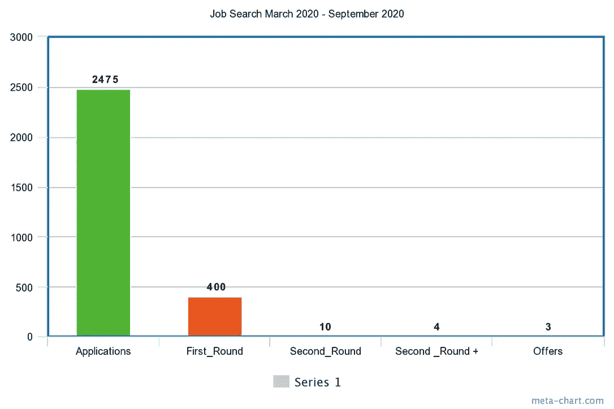
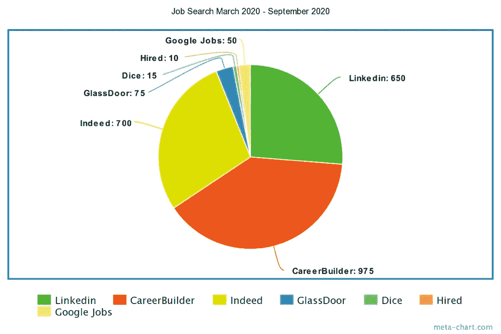

# 没有大学文凭就闯入科技岗位的现实

> 原文：<https://blog.devgenius.io/the-reality-of-breaking-into-tech-post-covid-without-a-college-degree-9f34f841e1a6?source=collection_archive---------7----------------------->

因素和困难

照片由 [Pexels](https://www.pexels.com/photo/close-up-photo-of-coconut-tree-1030320/?utm_content=attributionCopyText&utm_medium=referral&utm_source=pexels) 的 [Suparerg Suksai](https://www.pexels.com/@akedynamic?utm_content=attributionCopyText&utm_medium=referral&utm_source=pexels) 拍摄

这个博客的目的是分享我在没有大学文凭的情况下获得一份好的工程工作的相关知识和经验。我有很多话题要讨论，也有一些数据要分享。

在我展示任何数据之前，我想谈谈我从这次经历中得到了什么。

假设你的下一个主要人生目标是获得一份很棒的技术工作…没有唯一正确的方法去实现它。每个人都是文化、习惯、怪癖、纪律、方言、心理和环境的混沌泡泡。

从来没有一件事让你过线或者让你失望。作为一个人，你有责任尽你所能去成长。当人们衡量你的工作或友谊或其他什么时，他们会衡量许多不同的方面。

以我的经验来看，实现目标的最佳方式是努力改善你生活中经常受到批评的方面。例如，如果你从几个不同的人那里收到了一个关于某个问题的特殊投诉…承担责任并解决这个问题。

你生活中有几个人说过你没礼貌？你可能很粗鲁。练习不那么粗鲁。成长。

大学

# 让我们来讨论一下热门技术工作的大学困境

## 如果你能负担得起，就不要跳过大学。

如果能上大学。上大学。当你找到一份体面的工作时，你的生活并没有结束。知识的价值是不容易表达的。它将超越你的日常工作，改变你的整个生活。如果你扩展你的思维，你每天的每一秒都会有不同的处理。

## 大学提供的不仅仅是知识。

考虑到我所处的行业。我认识的几乎每个人都有大学学位。我们组有 5 个人有博士学位。他们中的一半有硕士学位。我非常幸运地成为世界上最有智力的群体之一。

大学值得吗？绝对的。

大学毕业生是不是大部分时间在专门角色上表现更好？以我的经验来看，绝对是。

大学毕业生更容易成功吗？绝对的。

大学毕业生做同样的工作，扮演同样的角色，通常会赚更多的钱吗？绝对的。

想想现在全世界飞来飞去的信息量。好的大学竞争非常激烈，受到很多审查。他们提供的最有价值的东西之一是良好的学术责任。

你能在互联网上找到的大量不良信息令人震惊。根据我的经验，绝对有必要检查任何给定学术文章的来源，并将其视为不正确，直到它经受住极端的批评。大学为你做了大部分的工作。他们的课程经过严格测试，来源丰富。他们会为你节省很多宝贵的时间。

## 为了上大学而负债是值得的

我现在不打算切入整个金融讨论，但一美元债务并不等于一美元流动资金。

取决于各种因素，一美元债务通常只相当于一美元流动性的一小部分。金融实体试图通过应用各种压力来弥补这种差异，如利息或不良信用评分。即使有这些压力，债务美元通常仍不如流动美元值钱。

大学毕业生每年收入增加的事实，应该比债务威胁带来的焦虑更值得优先考虑。这忽略了获得良好知识的复合利益，这是不可估量的。

## 如果大学是绝对不可能的

我不推荐这条路线。

通过研究著名大学的课程并购买他们在课堂上使用的相同教科书，花几百美元就可以获得一流的大学教育。

然而，所有的责任将完全由你自己承担。你将不得不连续几年每天阅读和研究这些教科书，以便与它们相匹配。

我一直在走这条路，它带来了许多问题。几年来，我一直在购买和阅读教科书，虽然我的知识增长惊人，但我仍然错过了各种大学福利。我的表现仍然不如我的一些同龄人。

这是一个大学福利的例子。我读过一本由罗伯特·哈珀写的关于类型理论和编程语言的著名教科书。当我读这本书时，我发现它令人难以置信地晦涩难懂。我从中学到了一些东西，但是我对这个学科的知识已经被抹去了。

我的朋友也读过这本书，只是他在大学里见过罗伯特·哈珀本人。自那以后，他与罗伯特·哈珀见过几次面，讨论了书中的各种话题。自然，他对素材有了更深的理解。

现代办公室

# 让我们来讨论一下热门技术工作的训练营困境

新兵训练营值得吗？绝对的。

把新兵训练营想象成一个微型大学学位。适用于大学学位的一切也适用于新兵训练营。唯一的区别是新兵训练营通常更短并且(自然地)更便宜。他们的市场价值可以在午餐时估算出来。

他们通常花费大约 10，000 美元，而大学可能花费你 10，000 到 200，000 美元。如果我们排除极端的异常值，我们应该正确地假设大学和训练营之间的成本和价值差异是成比例的。

把新兵训练营想象成或多或少相当于一所像样的四年制州立大学的第一年。

或者，新兵训练营通常教授特定领域的知识。我有几个大学学历的朋友也去了一个训练营，开始学习他们特定领域的知识，以吸引感兴趣的特定公司。成功了。

采访中的两个女人

# 让我们讨论一下这个目标的求职部分

## 如果你想抓住一个滑溜溜的奖品，你就不能连一个洞都不盖上。

热门的技术工作竞争非常激烈。如果你在 Linkedin 上逛逛，你会发现有些网站有多达 9000 名申请者。人们想要他们，非常想要。人们需要它们。他们将竭尽全力为他们而战。

经过几天的练习和研究，你可以很容易地找到前 10%的申请者，但是要从前 10%的申请者变成第一名呢？极其困难。

像任何其他运动一样，在游戏的顶部，利润会成倍增长。你可以训练几个月，开始赢得当地公园的所有篮球比赛，但你离与勒布朗·詹姆斯·莫诺竞争还有几年时间，更没有机会击败他。

当你试图获得一份好的技术工作时，同样的原则也适用。你必须每天练习你的技术知识，持续(可能)几年。你的技能必须是显而易见的，不容置疑的。

实际上，你不需要成为第一名，但你和普通求职者之间应该有一条鸿沟。

## 你找工作最重要的前三个因素是什么，按什么顺序排列？

1.  连接
2.  经验
3.  声望/证书

我想让你把这三样东西看作是对你找工作很重要的一系列子类别的母类别。

## 连接

拥有良好的关系可以确保你有一个良好的态度，你不疯狂，你是一个很好的文化适应者，你可以融入公司而不会损失员工的士气。可以交朋友。

人脉是最重要的因素。大型科技公司有很高的风险。雇佣糟糕的演员是这些公司可能面临的最大成本之一。

如果他们雇佣了一个技术不太好但态度很好的人，他们可以和那个人一起工作来激励更多的加班。

然而，一个坏演员可能会暴露重要信息，破坏大型系统，引发诉讼，或者以上所有情况。不良态度的风险要大得多。

你在找工作时能做的最好的事情就是真诚地和有权势的人交朋友，并保持良好的态度。

## 经验

企业级的技术知识很难获得，而且有很多东西，除非你不得不去弄乱它们，否则你是学不到的。

制作一个复杂的多部分 GUI，让它在每一个屏幕尺寸上都看起来完美，确实是一项艰巨的任务。当你在建造它的时候，经理和非技术客户会紧紧盯着你。

制作一个能够自动完成搜索关键词并具有区域和类别切换选项的搜索引擎是一项艰巨的任务。当你这么做的时候，经理和非技术客户会紧紧盯着你。

没有经验，几乎不可能知道包含这些东西的一切。X 要花多长时间？X 要花多少钱？X 将需要什么架构？X 任务用什么技术最好？在什么情况下，你会介入并拒绝做某件事，因为你知道这会让 X 公司付出开发成本？

这些都是来之不易的技能。

## 声望/证书

谁为大多数企业带来了大部分资金？销售人员。

大多数销售是如何发生的？开出诱人的条件。

找到一份好工作的关键在于适销性。如果一家公司每年付给你 16 万英镑，他们需要合理调整这一成本。你要么需要成为一名出色的工程师，拥有辉煌的技术成功史，要么需要在其他方面有市场。

如果你有很好的态度，但没有市场能力或技能，你可能会得到一份工作，但在你获得更多经验之前，你不会得到那么好的报酬。

如果你是麻省理工学院的新毕业生，这对公司来说是双重的。麻省理工学院培养出有能力的工程师，该公司可以说它的产品是由麻省理工学院的工程师制造的，这促进了销售。

如果你是麻省理工学院的毕业生，他们很乐意付给你更多的钱，因为他们知道你会得到更多的现金，即使你的技术不如在这个行业工作了 15 年的人。

如果你想得到一份很棒的技术工作，你需要尽你所能成为一个有吸引力的候选人。是的，我也是指字面意思。

我的数据的条形图

我的数据的饼图

# 来说说我的个人统计和旅程吧

我贴了一些用我实际的求职数据制作的可视化图片。

我在去了一个新兵训练营后不久就开始了这种探索。在新兵训练营之前，我只有很少的编码经验。

我在我能找到的每一个主要的求职网站上更新和维护了一个简介。

我每天花一两个小时发申请。

最后，在我找工作的时候，我得到了 3 份工作机会。一个是早期的无薪实习。一个是接近尾声的股权支付(利润分享)实习。第三份工作是一份实际的工作，对我这种技术水平的程序员来说，薪水很有竞争力。

## 在我的经历中，确实是迄今为止最有用的网站

有一点我可以肯定。这些网站上的这些广告绝大多数根本不会有反应。你最好把搜索范围缩小到你非常适合的某个特定角色。尽可能多地使用这些过滤器。

然而，确实毫无疑问地得到了最多的回应。我第一轮通过的大部分选项也来自于。

另一方面，CareerBuilder 导致零合法线索。作为一个网站，在我看来 100%没用。

如果你没有企业经验，申请高级职位完全是浪费时间。筛选初级/入门级角色。

## 在通过第二轮的选择中，只有一个不是通过朋友或熟人

向上滚动到我这里，告诉我你的人脉是你找工作的头号工具。

人们喜欢有某种保证。他们需要证明你非常适合他们的公司。成为好朋友是一个很好的验证方式。

## 这是一次非常艰难的旅程

去年九月，我基本上不能描述什么是数组，甚至变量。在那之前的大约 6 个月里，我只为各种工作构建了几个 SQL 数据库。

## 新兵训练营

在申请参加新兵训练营之前，我必须学习一点 Javascript，这样我才能通过入学考试。这是困难的，令人焦虑的。从那以后，基本上每一步都变得更加困难和焦虑。

如果你在生活中走上这条道路，你会习惯于一直学习新的东西，并对你期望使用的技术感到不舒服。

新兵训练营本身正在以极快的速度学习，让人们尽快熟悉各种流行的框架。这非常有价值，但也非常困难。

我的新兵训练营的辍学率约为 50%。许多人无法适应这种节奏。就业安置率也被夸大了。我的新兵训练营声称有 99%的安置率，但是在细则中他们没有报告那些“放弃寻找”的学生。

根据我在校友中读到和看到的，实际的安置率大约是 50-60%。

但是，我坚持了下来。我有很棒的学校项目，我在测试中表现很好。

## 实习(via indeed)

毕业后，我立即在西雅图的一家小型创业公司找到了一份实习工作。)然后，我免费工作了 7 个月左右。

实习很困难，我们必须建造很多比我以前做过的任何东西都要复杂和庞大的东西。我所有的学校项目都是最多 5 页的网站。我的实习是构建一个大型应用程序，有几十个页面、姐妹网站、几个后端、搜索引擎、几个前端、一些带图片的内容管理选项和几个不同的云服务。

我们每天都在研究和制造新的东西。我不断地把我几乎不懂的东西拼凑在一起。在路上我尽了最大努力去学习。我确实构建了一些意大利面条式的代码特性，因为我几乎不知道我在做什么，而且我们有时会有相当紧张的时间。

我们所有的东西都是我在学校里没用过的，所以我不得不学习一门全新的语言和许多新的服务。

## 工作机会(通过真实)

最后，当我在 2020 年 9 月得到一份真正的工作时，是一家小型技术解决方案公司再次打开了我的视野。我的新公司有几十个项目，所有这些项目都可以与我实习时从事的一个项目相媲美。

再说一次，学习另一种编程语言和许多新的服务和框架是我的责任。我新公司 80%的物品都是我在学校或实习时没有用过的。所以，很多新东西。

我还想指出。我在实习和学校的所有努力都得到了回报。它的每一点都是有用的，我对各种东西的所有体验都定期地回到我的心灵中。

随着时间的推移，我所做的一切都慢慢地成为 web 开发工作的坚实基础。我不得不运用所有这些知识来获得我的第一份工作。尽管我非常努力，但很明显，我基本上还是一个初级开发人员，正在一步步升到中级水平。精通并不容易。

别忘了，我进入这个行业才一年半。

长途旅行

## 旅程的每一点都是必要的，到目前为止，这是一次多么凶猛的旅程

总而言之，我最终学会了一大堆编程语言和许多不同的工具。现在，我可以挑战 rust、C、C#、Typescript、Javascript、Ruby、PHP 等等。

我建立了更多的网站，启动了更多的项目，多得数不清。我已经完成了数不清的编码挑战。

这些只是我已经掌握的主要语言。我甚至不打算列出所有的框架，因为那样会很冗长。

在不安全或想到失败的时候，眼泪绝对会流下来。7 个月不发工资对钱包是一个严重的打击，也是一场常规的情感斗争。

这段时间我没有和父母住在一起，但是我从家人和朋友那里得到了很多帮助，减轻了一些经济负担。

我不认为一个普通人可以在没有安全网的情况下做到这一点。

## 我预计挑战会变得更加艰难

我不认为进入的门槛会这么高，如果有人能忍受其中的任务。到目前为止，我作为一个大三学生所遇到的事情已经比我想象的更难了。

但是，如果还有人想搭上这趟顺风车，我鼓励他。挑战让生活充满乐趣。下次见。