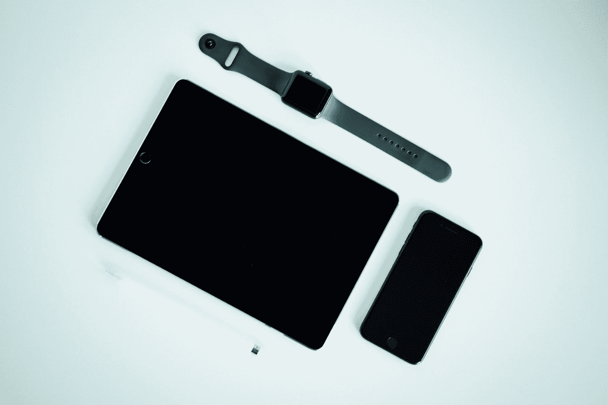
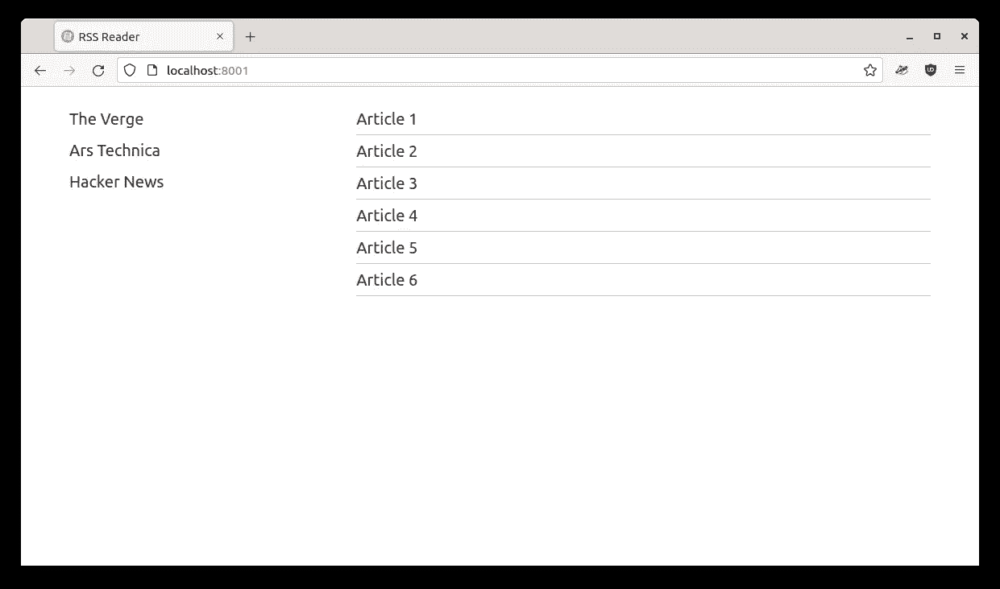
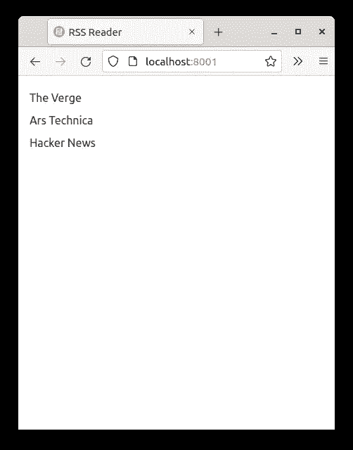
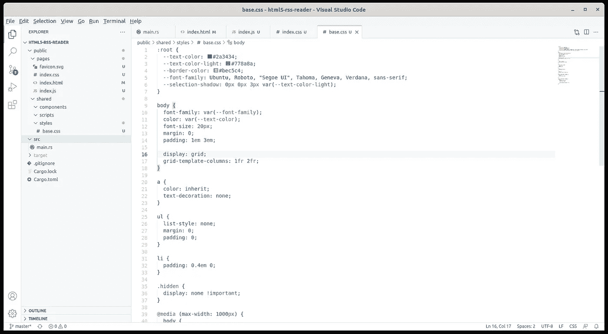
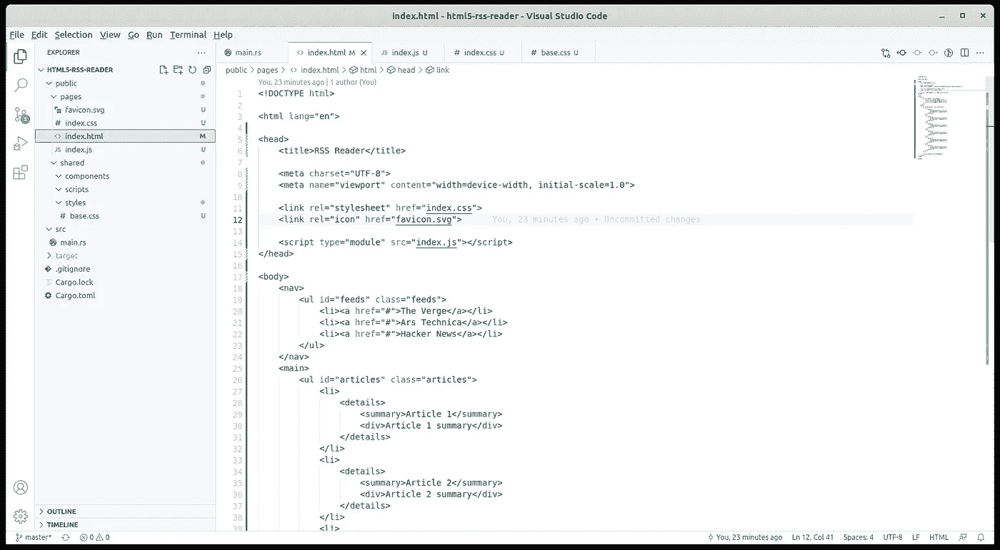
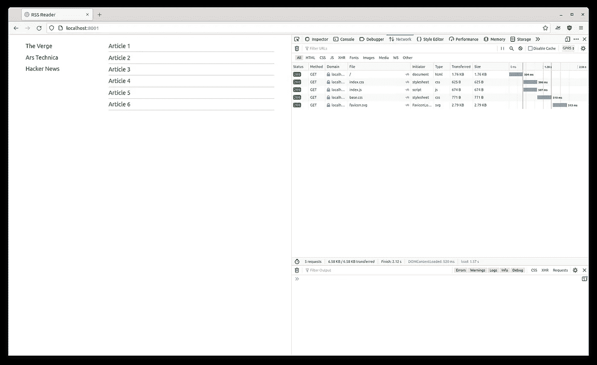

# Rust web 应用程序的响应式布局

> 原文：<https://blog.devgenius.io/the-responsive-layout-for-our-rust-web-application-8fb46fe14c8f?source=collection_archive---------5----------------------->



照片由[剂量媒体](https://unsplash.com/@dose?utm_source=medium&utm_medium=referral)在 [Unsplash](https://unsplash.com?utm_source=medium&utm_medium=referral) 拍摄

在我们开始为 RSS 阅读器应用程序构建 web 组件之前，我们需要对事情的发展有一个初步的概念。本教程是关于 web 组件和 Javascript 模块的，我们不会在后端坚持太多。是的，我们会用 Rust 读取 RSS 数据，但这只是为了让教程更完整。我们的重点是前端。

在编写代码时，我们还会看到一些用现代 Javascript 很好地表达的架构模式:关注点分离和依赖项的延迟加载。

信不信由你，我仍然看到没有响应的 web 应用程序，所以我们不会犯这样的错误。我们的应用程序将从一开始就响应迅速。这将是一个简单的两列应用程序，左边是提要列表，右边是文章列表。大概是这样的:



我们的 RSS 阅读器 web 应用程序的模拟用户界面

如果我们超过某个宽度，字体会变小，如果我们使用移动宽度，用户界面会一分为二，变成这样:



RSS 阅读器应用程序的移动宽度

## CSS 布局



快速浏览项目结构

我们将有一个 CSS 文件为我们描述整个响应布局。我们把它放在`shared/styles/base.css`里吧。这将是我们的基础 CSS，一切都从这里开始:

```
:root {
  --text-color: #2a3434;
  --text-color-light: #778a8a;
  --border-color: #bec5c4;
  --font-family: Ubuntu, Roboto, "Segoe UI", sans-serif;
  --selection-shadow: 0px 0px 3px var(--text-color-light);
}body {
  font-family: var(--font-family);
  color: var(--text-color);
  font-size: 20px;
  margin: 0;
  padding: 1em 3em; display: grid;
  grid-template-columns: 1fr 2fr;
}a {
  color: inherit;
  text-decoration: none;
}ul {
  list-style: none;
  margin: 0;
  padding: 0;
}
li {
  padding: 0.4em 0;
}@media (max-width: 1000px) {
  body {
    font-size: 18px;
  }
}
@media (max-width: 710px) {
  body {
    padding: 1em 1em;
    font-size: 16px; grid-template-columns: 1fr;
  }
}
```

你可以看到我们是如何定义一些通用的文本颜色、边框颜色、字体系列和阴影的。所有这些都是变量，所以我们可以重用它们。接下来，主体获取颜色、边距和填充，最重要的是，两列的网格布局。如果我们跳到底部，我们会看到网格是如何为移动宽度重新定义为单列的。请注意我们如何改变不同宽度的字体大小:`20px`用于桌面，`18px`用于桌面，`16px`用于手机。

还要注意填充和边距都是如何用`em`单位表示的。只要我们到处使用`em`，当我们为不同的窗口宽度减小`font-size`时，它们都会自动调整大小。如果我们以像素为单位指定所有字体，我们将不得不使用媒体查询来调整它们。对于`em`就不是这样了，它是一个相对单位。这给了我们一个好处，即说出我们想要什么样的`em`大小，然后当媒体查询生效时，因为它调整了`body`中的基数`font-size`，一切都会随之而来。

尽管这个基本 CSS 很短，但它定义了我们需要的所有东西，以获得一个具有两列的完全响应的布局。让我们建立我们的 HTML。

## HTML 模拟



index.html 档案一瞥

`index.html`现在将简单地显示假数据，这样我们可以看到我们的应用程序将会是什么样子:

```
<!DOCTYPE html>
<html lang="en">
<head>
  <title>RSS Reader</title>
  <meta charset="UTF-8">
  <meta name="viewport" content="width=device-width, initial-scale=1.0">

  <link rel="stylesheet" href="index.css">
  <link rel="icon" href="favicon.svg"> <script type="module" src="index.js"></script>
</head>
<body>
  <nav>
    <ul id="feeds" class="feeds">
      <li><a href="#">The Verge</a></li>
      <li><a href="#">Ars Technica</a></li>
      <li><a href="#">Hacker News</a></li>
    </ul>
  </nav> <main>
    <ul id="articles" class="articles">
      <li>
        <details>
          <summary>Article 1</summary>
          <div>Article 1 summary</div>
        </details>
      </li>
    </ul>
    <a class="back" href="#">Back</a>
  </main>
</body>
</html>
```

我们在顶部有通常的`meta`声明，一个到`index.css`文件的链接，我们将在下面介绍，一个到`index.js`的链接和一个到 favicon 的链接。注意，favicon 是一个`svg`文件。我强烈推荐使用`svg`图标。它们完全受所有浏览器的支持，可以在所有分辨率下缩放，并且通常非常小。使用它们时，你需要考虑的事情就少多了。

HTML 主体有两个元素:左边一列包含提要列表的`nav`位和右边一列显示文章的`main`位。它还有一个移动视图的后退按钮，一次只能显示一列。因此，当您选择一个提要时，您将看到文章和返回到提要列表的后退按钮。在台式机和平板电脑上，后退按钮将被隐藏。

当然，一旦我们读取了数据，所有的模拟数据都会被真实数据所取代。现在我们只是用它来弄清楚 UI。`index.html`文件引用一个 CSS 文件和一个 Javascript 文件。`base.css`文件定义了应用程序的总体布局。`index.css`文件定义了`index.html`页面使用的细节。让我们来看看:

```
@import url(/shared/styles/base.css);summary {
  cursor: pointer;
}
summary::marker {
  content: none;
}ul.articles li {
  border-bottom: 1px solid var(--border-color);
}
ul.articles li div {
  padding: 1em 0 0.2em 0;
}
ul.feeds li.selected a {
  text-shadow: var(--selection-shadow);
}
ul.articles li.selected summary {
  text-shadow: var(--selection-shadow);
}a.back {
  display: none;
}@media (max-width: 710px) {
  main {
    display: none;
  } body.feed-selected nav {
    display: none;
  }
  body.feed-selected main {
    display: block;
  } a.back {
    display: block;
    padding-top: 2em;
  }
}
```

细节是与主布局无关的一切:后退按钮何时出现，`nav`和`main`何时出现在移动宽度上，所选提要如何高亮显示，`details`标签看起来如何。

但是请注意顶部的`import`。文件`index.html`简单地引用了它的`index.css`文件，它不知道其他任何事情。理解`base.css`的要求是`index.css`的责任，所以我们在这里指定。在`index.html`中加载`base.css`和在这里加载有什么区别？这个`index.html`文件简单地使用需要的标签构建 UI，它不关心样式。风格掌握在 CSS 手中。如果我们把现在的`index.css`换成另一个，我们可以引用不同的基本样式:我们可以改变一切，而`index.html`对此一无所知。关注点的完美分离。让我们看看 Javascript 文件:

```
document.getElementById("feeds").addEventListener("click", (e) => {
  document.body.classList.add("feed-selected"); const selection = document.querySelector("#feeds li.selected");
  if (selection) selection.classList.remove("selected");
  e.target.closest("li").classList.add("selected");
});document.getElementById("articles").addEventListener("click", (e) => {
  const selection = document.querySelector("#articles li.selected");

  if (selection) selection.classList.remove("selected");
  e.target.closest("li").classList.add("selected");
});document.querySelector(".back").addEventListener("click", () => {
  document.body.classList.remove("feed-selected");
});
```

我们只是处理提要和文章选择，以及点击后退按钮。如果我们选择了一篇文章，我们向它添加一个`selected`类，对于提要也是如此。此外，如果我们单击一个提要，我们将`feed-selected`类设置为`body`，宣布一个提要被选中，并允许我们更改移动 UI 以显示文章，当我们单击`back`按钮时，我们清除该类以返回到初始状态。

## 懒惰加载一切



HTML 请求图

让我们看一下请求图，看看所有的东西是如何缓慢加载的。在上面右边网络面板的截图中，看看东西是如何加载的。我把连接速度调得很慢，这样我们就能看得很清楚了。首先，当然是加载`index.html`文件。`index.html`文件直接链接`index.css`和`index.js`，所以它们同时加载 next。下一个`base.css`由`index.css`请求，因此它遵循。最后是网站图标。

类型为`module`的`index.html`加载了`index.js`文件。这意味着它也可以异步加载。一旦我们开始向应用程序中添加更多的 Javascript 文件，我们将更详细地了解这是如何发生的。我们还将看到每一个需要的 Javascript 文件是如何被`index.js`导入的，就像`index.css`导入`base.css`一样。

Chrome 浏览器更详细地显示了启动器。它会告诉你谁引用了哪个文件，你会看到`base.css`是被`index.css`引用的，而不是被`index.html`引用的。不幸的是，Firefox 更加通用。

暂时就这样了。下次我们将开始制作我们的第一个 [HTML5 web 组件](/html5-rss-reader-writing-the-first-web-components-949eec88dbf9)。我们还将了解本地 Javascript 模块是如何工作的。他们现在已经完全发挥作用有一段时间了，所以现在可能是时候放弃需要像 Webpack 这样的捆绑器的旧类型模块了。

代码一如既往地在 [Github](https://github.com/raduzaharia-medium/html5-rss-reader-mock-ui) 上可用，但是正如我在[上一篇文章](/initial-setup-for-a-rust-web-application-using-web-components-and-native-javascript-modules-ee832c062e8a)中所写的，不要急于克隆它。你现在不需要它。试着用自己的方式思考这篇文章，然后自己写出来。祝你好运，下次再见！