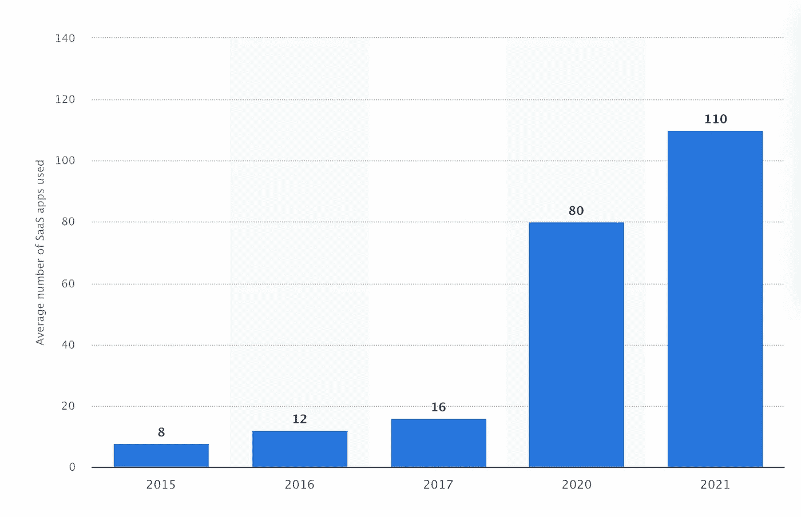
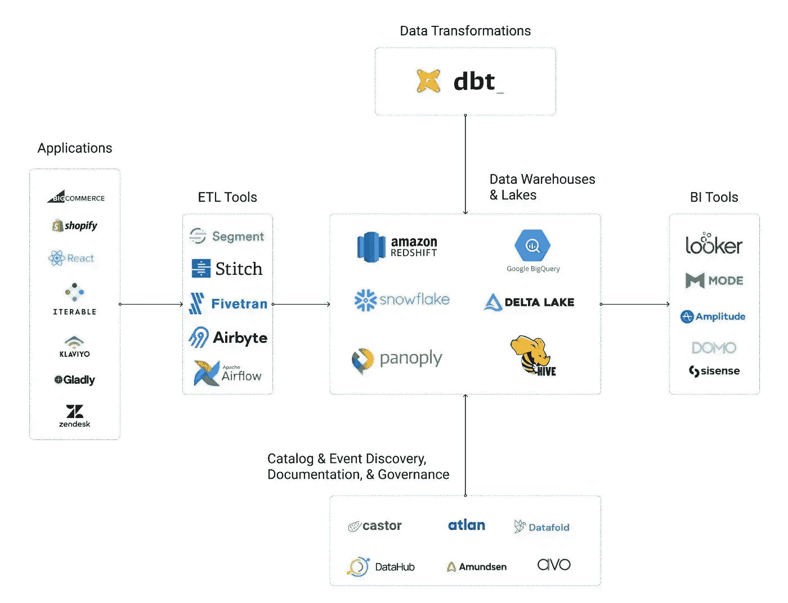
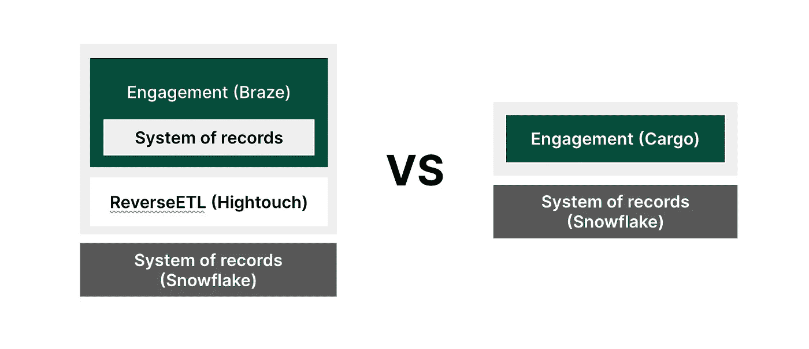
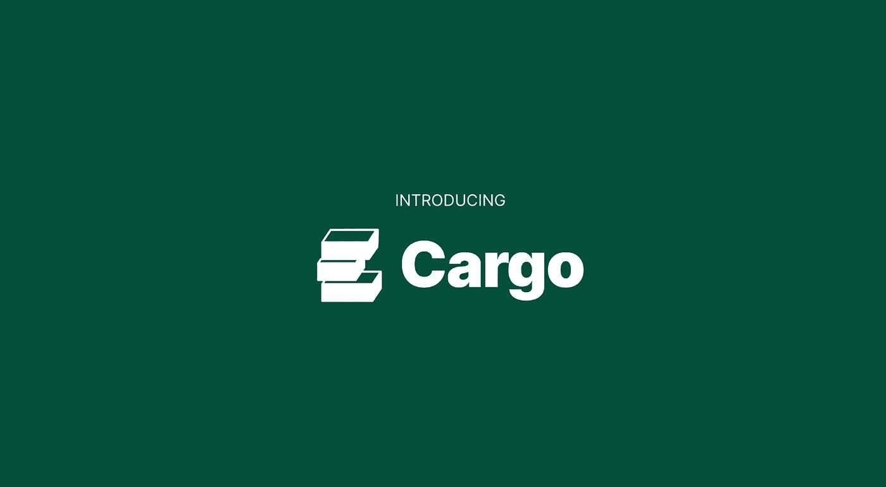

# 数据仓库原生应用的兴起

> 原文：<https://blog.devgenius.io/the-rise-of-datawarehouse-native-apps-fccae721433b?source=collection_archive---------15----------------------->

CRM 不再被视为企业收集客户数据的可靠来源。相反，它已经成为另一个 SaaS 工具，无法处理现代企业创建的复杂数据架构。

仓库已经成为新的记录系统，彻底改变了我们处理数据的方式。结果，在过去的 5 年里，CDW 产业从 360 亿美元增长到 800 亿美元。数据仓库的主要好处之一是它的灵活性、安全性和随业务增长的能力。

一些应用程序已经意识到了数据仓库的真正潜力，并通过在它们的基础上构建来利用它们的能力，使业务应用程序超越了商业智能。

# 数据仓库的好处是什么？

在过去的 5 年里，公司使用的 SaaS 工具的数量增加了 10 倍。

Statista:公司使用的平均工具数量

为了应对日益增长的复杂性和数据量，企业越来越多地采用数据仓库作为其真实来源，并转向现代数据堆栈技术。

它帮助组织集中和管理来自各种来源的大量数据，如事务数据库、日志文件和外部数据源(即第三方工具)。

MDS 插图——肖恩·拉金的功劳

数据仓库的一些具体优势包括:

1.  **改进的数据访问:**数据仓库为来自不同来源的数据提供了一个单一、集中的存储库，使用户更容易访问和分析数据。
2.  **增强的数据质量:**数据仓库通过实施数据标准、执行数据清理和提供一致的数据视图来帮助确保数据的质量和完整性。
3.  **提高效率:**数据仓库使用户能够更快地访问和分析数据，因为数据经过预处理，并以结构化格式组织起来。这有助于减少执行数据分析所需的时间和资源。
4.  **改进的决策制定:**数据仓库提供了组织数据的综合视图，使用户能够识别在单个数据源中可能不明显的趋势、模式和关系。这给*过程* ***带来更多的数据和更少的偏差。***

# 最常见的数据仓库应用是什么？

数据仓库有几种常见的应用，包括:

1.  **商业智能:**数据仓库通常用于支持商业智能(BI)和报告活动。Looker 或 Metabase 等现代 BI 工具直接位于数据仓库之上，使企业能够更快地获得洞察力，并通过数据驱动的方法而不是直觉来推动公司发展。
2.  **运营:**数据仓库使组织能够对大型数据集执行高级分析，如数据挖掘、评分和预测建模。这可以帮助组织识别数据中的趋势、模式和关系，从而优化业务流程并改进决策。
3.  **客户细分:**数据仓库可以根据客户的特征和行为对客户进行细分，使组织能够针对特定的客户群体定制营销活动和其他计划。我们梦寐以求的 360 度客户视角终于到来了！

# 什么是数据仓库原生 app？

‍ *它们是软件应用程序，没有自己的数据后端，只是你公司数据之上的一个应用层。因此，无需设置新的数据管道来将数据同步到目标应用程序。*它们针对处理大量数据和定制业务实体进行了优化。

这些应用程序用于数据分析和报告，最近还用于编排销售流程和客户互动。

不同领域的工具了解这种新一代 SaaS 的潜力，并开始利用特定用例的 CDW。一些例子包括 BI 工具，最初是第一批这样做的，或者最近，像 PLG 工业中的 Pocus 这样的工具。

# 数据仓库原生应用的好处是什么？

最显著的优势之一是，数据不需要在供应商的应用程序上同步或复制，而传统的 SaaS 解决方案通常会出现这种情况。

我们不应该多次为相同的数据付费。我们应该能一次得到它，不用多付钱就能使用它。或者我希望你没有 100 个工具😅

这些应用程序的另一个优势是，它们不拥有你的数据，因为它们不会复制数据。这意味着您可以完全控制您的数据，并且增强了:

1.  **可观察性:**将数据传输到第三方系统的当前模型是有问题的，因为它去除了可见性和跟踪管道内依赖关系的能力。
2.  **安全性:**您拥有自己的数据，并将其保存在您可以控制的环境中。
3.  **成本效率:**与将数据推送到外部平台的同步成本相比，成本降低了约 75%(“基于记录”的大多数 SaaS 工具会让您付费，因此您最终会为相同的数据支付多次费用)。有了 CDW 原生应用，你不必复制你的数据。

他们利用数据仓库更好的可访问性、可靠性和完整性来帮助弥合数据团队和业务人员之间的鸿沟。数据工程师确保数据质量，业务人员利用数据提高收入。

最终，您不必受限于固定的模式。相反，您可以创建并拥有您的数据模型和业务实体定义。

# 介绍货物:走向市场团队的重组

正如我们前面所说的，有几个工具利用了数据仓库的能力。这些是具有独立方法的特殊软件。他们仍然固执己见，所以每个用例都需要一个工具。

相反，在 Cargo，我们对设计不感兴趣——对用例感兴趣。

Cargo 允许成熟的组织自行构建内部的走向市场应用程序，这些应用程序完全可定制，并且在处理其用例时更加有效。

这些中端市场和企业公司需要处理大量且日益复杂的数据。通过站在他们的仓库之上，我们可以轻松构建满足他们特定业务需求的应用程序。

今天，企业公司的主要用例是生命周期营销，如向特定细分市场发送个性化的促销电子邮件，以及基于用户行为构建培育自动化。

对于中端市场和 SaaS 公司，用例是建立一个客户评分或流失评分系统，并根据其区域和规则进行线索路由。

有兴趣了解更多吗？加入运动👉 [https://www.getcargo.io](https://www.getcargo.io)

‍