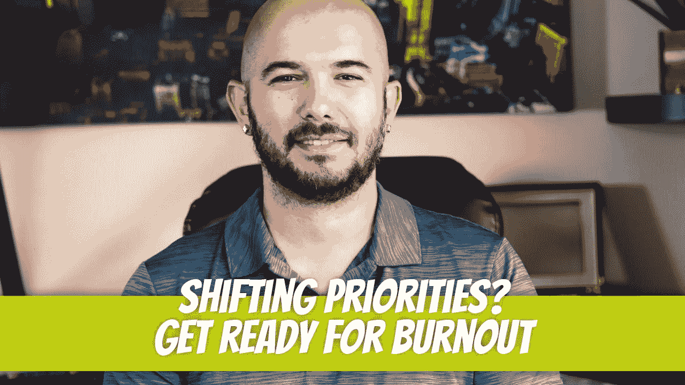

# 倦怠的根源不是一心多用。它被告知要改变优先级。

> 原文：<https://blog.devgenius.io/the-root-of-burnout-is-not-multitasking-its-being-told-to-shift-priorities-942498cad02c?source=collection_archive---------13----------------------->

导致倦怠的原因有很多。我们都经历过 Covid 倦怠:无法适应新的生活方式。有些事情让你感到不安，你的工作质量下降。你日夜被负面新闻轰炸。你一直生活在恐惧中。隧道的尽头没有清晰的光。持续的压力和焦虑导致你的思想和身体表现出强烈的反应，你崩溃了，很严重。

既然我们已经恢复了一些常态，我们可以回到正常的倦怠周期。

## 倦怠周期

每个人的承受能力不同，但每个人都会在某个时刻经历倦怠。这通常是一个明确的信号，表明你应该休假，让你的大脑休息一下。休假和查看电子邮件对你没有任何好处。我知道，当我在度假时，即使收到组织里某个人发来的短信，说“我希望你假期愉快”，也会让我重新考虑工作。我确保每个人都知道不要联系去度假的人，除非是绝对紧急的情况。

休息两天而不是一整周也不足以完全减压。如果你每年只有一周的假期，这样做可能是有意义的，但我肯定会找一份不同的工作，提供至少两周的带薪假期。一年中抽出一周时间，另一周分开，是给自己充电的好方法。

当你度假回来时，你会觉得准备好工作了。这就是你如何知道你有足够的时间休息。几个月后，你会再次有感觉。如果有机会，再休息一段时间。

## 多任务处理与改变优先级

有一个原因让我精疲力尽，但我没有看到太多的讨论，但这可能是最大的原因之一。多任务处理受到指责，但实际上它被告知要改变优先级。

我的日程安排过度优化了。除了全职工作，我每天还写文章，为 YouTube、Instagram、Twitter、T7 等网站创作内容。我仍然每天写代码，目前正在参加#100DaysOfCode 挑战(你可以在我的 [twitter 账户](https://twitter.com/dino_cajic)上关注这个旅程)。

 [## 如何有侵略性的组织？

### 我经常听说一天中没有足够的时间来完成我每天做的事情。我喜欢…

medium.com](https://medium.com/geekculture/how-to-be-aggressively-organized-12c079f41108) 

即使在一个从日出到日落的完整时间表之后，我也很少感到筋疲力尽。告诉我停止做我正在做的事情，去做别的事情，我开始感觉到了。我有过这样的经历，尤其是当我还是一名开发人员的时候，管理层会进来说“嘿，我需要你停止这个项目的工作。我们需要开始另一个项目。这是重中之重。”听起来不坏，但破坏力惊人。

这不像是你可以停下来马上开始做别的事情。你必须降低你当前的环境，提升你的新环境，然后回到状态。你会听到运动员提到他们正处于最佳状态。开发商也进入了这个领域。这是一个神奇的地方，你可以在几个小时内完成一周的工作。不能进入这个区域会降低开发人员的工作成果，并带来不必要的压力。

我以为它是软件开发的专利，但实际上它比软件开发更广泛。我和不同行业的许多不同的人交谈过，一致的意见总是相同的。工作量绝对是一个因素，但几乎立即精疲力竭的触发点是被其他人在一天中重新优先化。

一个例子是我最近就这个话题采访的一位汽车车身技师。他比平时早回家，心情不太好。他在考虑找一家新公司工作。通过交谈，他提到他不再喜欢他的工作了，因为人们会经常说，“我们需要你停止这辆车的工作，开始另一辆车的工作。它今天就需要出去。”对于管理层来说，这似乎不是什么不寻常的事情，但对于收到这些提示的人来说，这可能会升级到他们离开公司的地步。

那次谈话引发了我更深刻的反思。我从来没有因为每天做 100 件不同的事情而感到压力。我只是不喜欢在任务进行中被重新引导。一旦我明白了这一点，我就开始像对待工作一样对待工作。一旦有人把我引向一个不同的方向，我只记得这是工作的一部分，我不应该为此感到压力。如果你一直保持这种想法，你会发现在你开始感到筋疲力尽之前，你会花更长的时间。你可能会因为你已经完成的大量工作而筋疲力尽，但不会因为被告知改变优先事项而筋疲力尽。

迪诺·卡伊奇目前是 [LSBio(生命周期生物科学公司)](https://www.lsbio.com/)、[绝对抗体](https://absoluteantibody.com/)、 [Kerafast](https://www.kerafast.com/) 、[珠穆朗玛生物](https://everestbiotech.com/)、[北欧 MUbio](https://www.nordicmubio.com/) 和 [Exalpha](https://www.exalpha.com/) 的 IT 主管。他还担任我的自动系统的首席执行官。他有十多年的软件工程经验。他拥有计算机科学学士学位，辅修生物学。他的背景包括创建企业级电子商务应用程序、执行基于研究的软件开发，以及通过写作促进知识的传播。

你可以在 [LinkedIn](https://www.linkedin.com/in/dinocajic/) 上联系他，在 [Instagram](https://instagram.com/think.dino) 上关注他，[订阅他的博客](https://www.dinocajic.com/)，或者[订阅他的媒体出版物](https://dinocajic.medium.com/subscribe)。

阅读 Dino Cajic(以及 Medium 上成千上万的其他作家)的每一个故事。你的会员费直接支持迪诺·卡吉克和你阅读的其他作家。你也可以在媒体上看到所有的故事。