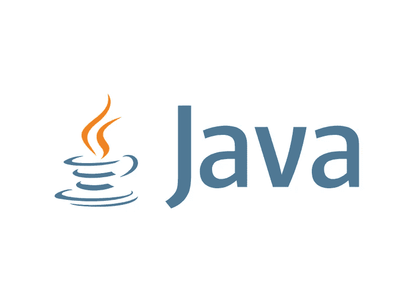

# Java 中的命名规则

> 原文：<https://blog.devgenius.io/the-rules-of-naming-in-java-29be3940d976?source=collection_archive---------12----------------------->



Java 命名的基本规则非常简单，记住它们是有意义的:

-类名应该以大写字母开头，例如 Frame

-方法名、字段名和局部变量名应以小写字母开头，如 read()；

-类、方法和字段的名称必须是驼峰样式(骆驼大小写)，例如 InputStream 或 readFully()；

-常量名称(带有修饰符 final 和 static 的字段名，以及不可变的局部变量)应以大写字母书写，并使用下划线作为分隔符，例如 MAX_CONNECTIONS。

不要使用缩写。像 sprintf 或 nmtkns 这样的名字是超级计算机拥有 32KB 内存的时代遗留下来的。当时，编译器通过将标识符限制在八个字符(或更少)的长度来节省内存。然而，这在 30 多年来都不是问题，所以现在开发者没有借口缩短方法和变量名。没有什么比没有元音字母的不可读变量名更容易暴露一个经过再培训的 C 黑客了。清单 1 给出了一个例子。

**清单 1。缩短变量的名称**

```
for (int i = 0; i < nr; i++) {
for (int j = 0; j < nc; j++) {
t[i][j] = s[i][j];
}
}
```

驼峰式变量的全名要清楚得多，如清单 2 所示。

**清单 2。不缩写的名字更容易读**

代码被阅读的次数比它被编写的次数要多得多，所以易读性是 Java 设计的一部分。与 C 程序员不同，Java 开发人员没有编写复杂代码的狂热倾向。比起简洁，他们更看重清晰。

有几个首字母缩略词已经非常成熟，你可以不用回头就使用它们:

max from maximum
min from minimum
in from input stream
out from output stream
e 或 ex 在 catch 块中(您不应在任何其他地方使用此缩写)
num from number，但仅在用作前缀时使用，例如 numTokens 或 numHits
tmp from temporary 当使用仅在有限范围内访问的临时变量时，例如，重新排列两个值。

除了这些和其他一些情况，你应该在标识符中使用完整的单词。