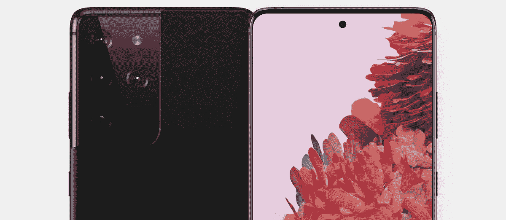
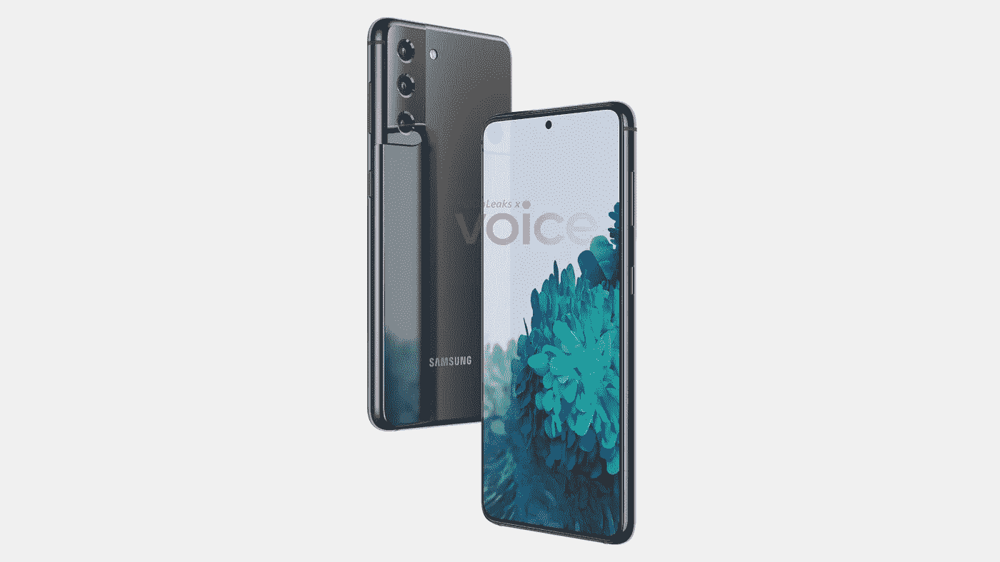
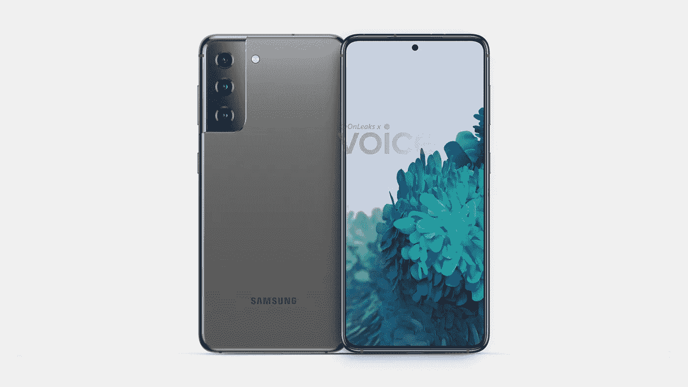
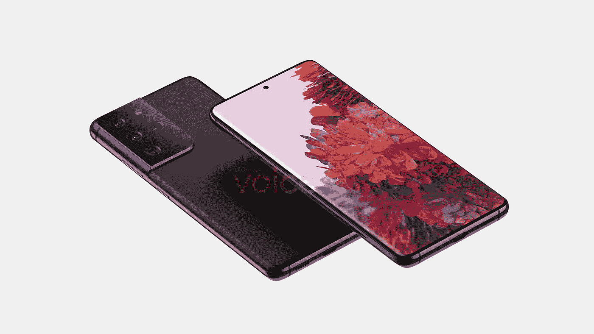
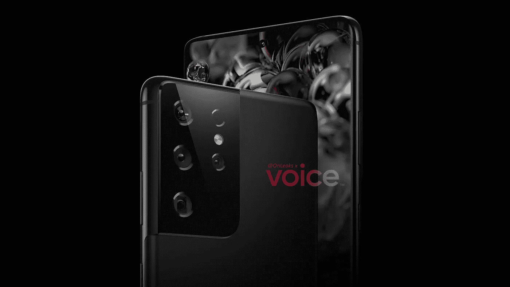
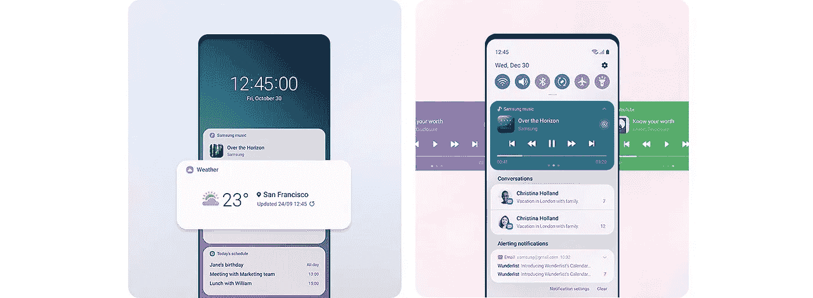

# 三星 Galaxy S21 来了！

> 原文：<https://blog.devgenius.io/the-samsung-galaxy-s21-is-coming-f583125d8951?source=collection_archive---------9----------------------->

三星将于 2021 年 1 月宣布下一代 Galaxy，这是我们所知道的一切。

**银河 S21 超渲染。** |图片来自[语音](https://app.voice.com/post/@onleaks/take-a-look-at-the-latest-and-updated-galaxy-s21-ultra-camera-setup-1603966611-1)。

苹果季已经结束，现在是 11 月，关于三星下一款 Galaxy 旗舰的传言已经开始，这次这么早的原因是因为新传言的 1 月发布，而不是这次的 2 月或 3 月。

看起来三星想要马上用他们最好的产品开始 2021 年，并可能在圣诞节后削减一些 iPhone 12 的销售。

那么我们应该期待什么呢？

直到夏天才会有折叠或笔记本设备，但我们应该会看到三款旗舰产品，有望改善相机、SoC 性能和价格。

我们已经看到了来自 [Onleaks at Voice](https://app.voice.com/post/@onleaks/this-is-the-samsung-galaxy-s21-1603010524-1) 的一些渲染图，展示了我们应该对三星这一全新设计的期待。

**银河 S21 和 S21+**

前两款将是标准的 6.2 英寸 Galaxy S21 和 6.5 英寸 S21+型号，两者在设计上看起来相同，背面设置了三镜头，前面是打孔相机。

它们将以没有曲线的平板显示器为特色，这让我很高兴，相机模块以一种非常独特的方式连接到框架上，我很喜欢这种方式。

三星 Galaxy S21 渲染自[语音](https://app.voice.com/post/@onleaks/this-is-the-samsung-galaxy-s21-1603010524-1)。

我们还应该在显示器上有 120hz 的刷新，并有改进的显示指纹识别器，一如既往地是任何智能手机上最好的有机发光二极管显示器。

我很好奇三星在 S20 上还增加了什么改进，这是一个新的设计，他们肯定会有一些很棒的新配件。

曲面 Galaxy S8 与 S20 的机身框架和显示屏形状非常相似，只是背部摄像头的布局发生了变化，边框变得更薄。

这些渲染显示，S21 的显示屏周围有一个完全统一的边框，最终消除了下巴，这使 S21 看起来很干净，很悦目，更适合这种新的设计。

三星 Galaxy S21 渲染自[语音](https://app.voice.com/post/@onleaks/this-is-the-samsung-galaxy-s21-1603010524-1)

至于背面，我希望是玻璃，但在 999 美元的 Note 20 塑料背面一团糟之后，我现在不太确定它会是玻璃。

我觉得三星会选择眼镜来弥补他们在 Note 20 上犯下的错误，因为在当前的环境下，他们不能失去买家。

不管怎样，他们最近有了一些奇妙的颜色，我希望他们会继续下去。

Galaxy S21 将提供灰色、粉色、紫色和白色，而 Galaxy S21+将提供黑色和银色。

价格方面，也许 799 美元(Galaxy S21)和 899 美元(Galaxy S21+)是我的猜测，可以与 iPhone mini 和 iPhone 12 竞争，但你永远不知道，它们可能会再次变得荒谬，起价为 999 美元，但我们希望不会。

**银河 S21 超**

Galaxy S21 Ultra 的第一张渲染图于上个月出现，展示了一个巨型摄像头，Galaxy S21 Ultra 似乎有一个 6.8 英寸的显示屏，带有一个穿孔的 4000 万像素自拍摄像头和一个 5000 毫安时的电池。

我们还可以期待 5G、Wi-Fi 6、显示器内指纹识别器、立体声扬声器、IP68 认证、Samsung Pay 和无线充电等功能成为所有 3 款车型的标准配置。

三星 Galaxy S21 Ultra render 来自[语音](https://app.voice.com/post/@onleaks/take-a-look-at-the-latest-and-updated-galaxy-s21-ultra-camera-setup-1603966611-1)

还有一种可能性是，Galaxy S21 Ultra 可能有四个后置摄像头，而不是 S21 和 S21+上的三个后置摄像头和一个未知的传感器，主摄像头将是稍微更新的 108MP。

Galaxy S21 Ultra 可以配备两个独立的长焦镜头，将一个标准的 3 倍镜头与一个潜望镜式模块配对，能够实现 5 倍及以上的放大级别。

来自[的声音](https://app.voice.com/post/@onleaks/take-a-look-at-the-latest-and-updated-galaxy-s21-ultra-camera-setup-1603966611-1)三星 Galaxy S21 Ultra render

Ultra 型号总是 Galaxy 设备中最大和最贵的，我希望在这里没有什么不同，我希望起价为 1099 美元，但 1199 美元的价格标签更有可能。

Galaxy S21 Ultra 将有黑色、银色和紫色三种颜色。

**软件—一个 UI 3.0 和 3.1**

我们预计最新的 Galaxy 设备将搭载一个 UI 3.0 和 Android 11，但一些泄漏消息称，它甚至可能是一个 UI 3.1，只是为最新设备添加了一些功能。

无论如何，这将是一个很好的更新，看起来非常干净和“股票一样”,加入了三星自己的设计。

**来自 One UI 3.0 的全新设计。** |图片来自三星。

以下是 Galaxy 21 系列上运行的 One UI 3.0 操作系统的完整概要。

## 一个 UI 3.0 更改日志

## 主屏幕

*   触碰并按住应用程序以添加关联的 widget。
*   双击主屏幕的空白区域关闭屏幕。你可以打开它设置>高级功能>动作和手势。

## 锁定屏幕

*   动态锁屏现在有更多的类别，你可以选择多个。
*   锁屏小工具有所改进。

## 快速面板

*   当您从屏幕顶部向下滑动时，可以更方便地在各自的部分查看您的对话和媒体。

**一个 UI 3.0 上的通知和快速面板。** |图片来自三星。

## 始终展示

*   始终显示小部件得到了改进。

## 易接近

*   在设备设置期间快速访问最重要的辅助功能设置。
*   根据您使用的内容获得推荐的辅助功能。
*   在“设置”中更轻松地设置辅助功能快捷方式。
*   声音探测器现在可以与电视和灯等智能设备配合使用，当门铃响起或婴儿哭泣时，可以发出更多可见的警报。

## 三星键盘

*   在“设置”中的“常规管理”下，您可以更容易地找到键盘设置，设置已被重新组织，以将最重要的设置放在最前面。

## 三星 DeX

*   您现在可以无线连接到支持的电视。
*   新的触摸板多手势让您更轻松地更改屏幕缩放和字体大小

## 互联网

*   增加了当你点击后退按钮时阻止网站重定向你的功能。
*   为显示过多弹出窗口或通知的网站添加警告和阻止选项。
*   重新排列菜单，使东西更容易找到。
*   增加了几个新的插件，包括一个翻译网站。
*   增加了隐藏状态栏的选项，以获得更具沉浸感的浏览体验。
*   将打开标签的最大数量增加到 99 个。
*   增加了锁定和重新排序标签的功能。
*   改进了标签栏的设计，现在所有设备都支持。
*   停止支持三星互联网边缘面板。

## 联系人和电话

*   增加了一次编辑多个链接联系人的功能。
*   增加了一个选项，帮助您快速删除重复的联系人。
*   增强了搜索体验。
*   将垃圾桶的储存期从 15 天延长至 30 天。

## 电话/通话背景

*   增加了用你自己的图片和视频定制通话屏幕的功能。

## 信息

*   创建一个回收站来存储最近删除的邮件。

## 在其他设备上打电话和发短信

*   增加了通过 Bixby 例程打开/关闭其他设备上的呼叫和文本的功能。

## 日历

*   具有相同开始时间的事件现在一起显示在月视图和日程视图中。
*   重新组织了添加和编辑事件的选项。
*   改进了全屏警告的布局。

## 催单

*   改进了全屏警告的布局。

## 数字福利和家长控制

*   在你的每周报告中加入趋势。您可以查看自上周以来您的使用情况发生了怎样的变化，并检查每项功能的使用时间。
*   在每周报告中增加了一个开车时使用手机的曲调。
*   增加了一个锁屏小工具，这样你就可以在不解锁手机的情况下查看屏幕时间。
*   为个人和工作模式添加了单独的配置文件，以便您可以分别跟踪您的屏幕时间。

## 照相机

*   改进的自动对焦和自动曝光功能和可用性。
*   提高了在高变焦水平拍摄月球照片时的稳定性。

## 照片编辑器

*   增加了将编辑过的图片还原成原始版本的功能。

## Bixby 例程

*   分组预置套路帮助你快速入门，学习如何快速建立自己的套路。
*   现在，您可以看到当一个例程结束时，什么动作被反转。
*   增加了新的条件，例如特定的开始时间，蓝牙或 Wi-Fi 网络的断开，特定号码的呼叫等等。
*   添加了新动作，包括与 Bixby 对话和辅助功能动作。
*   您可以为每个程序添加自定义图标，并将程序添加到锁定屏幕以便快速访问。

所以你有它，我迫不及待地想亲自看看这个新设计，三星有什么新的相机改进，并做一个全面的审查。

我们仍然有疑问，比如他们会有 65W 的充电吗？5 纳米 Exynos 2100 最终会与苹果 A14 或骁龙 875 匹敌吗？这次他们会降低价格吗？

看看他们是否会配备充电器和耳机或跟随苹果的领导也将是有趣的，最近有一些传言表明三星可能会放弃 AKG 耳机，并将 S21 与新的未宣布的无线 Galaxy Buds Beyond 一起发运，这将是非常棒的。

公告将于 1 月 14 日发布，当天接受预订，1 月 29 日发售。

三星和安卓粉丝的激动时刻即将到来。