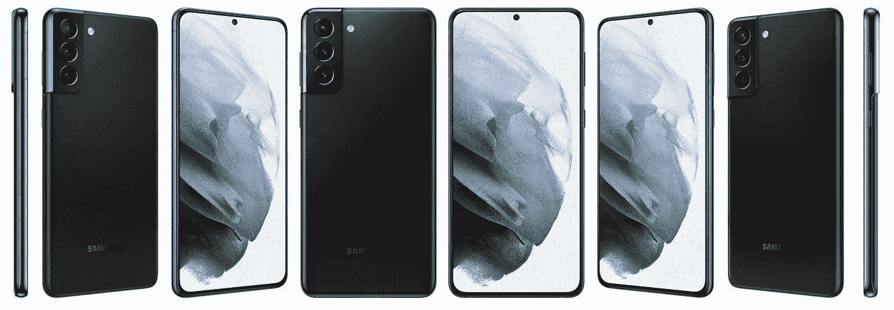
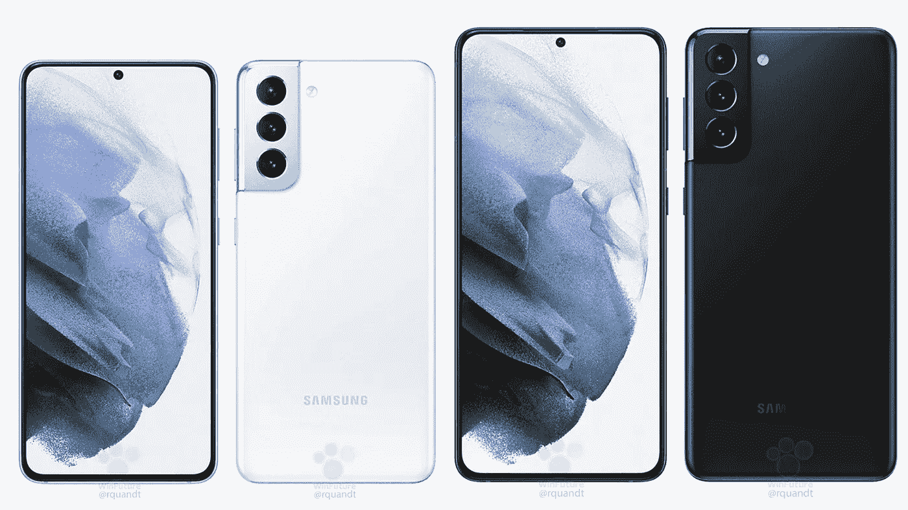
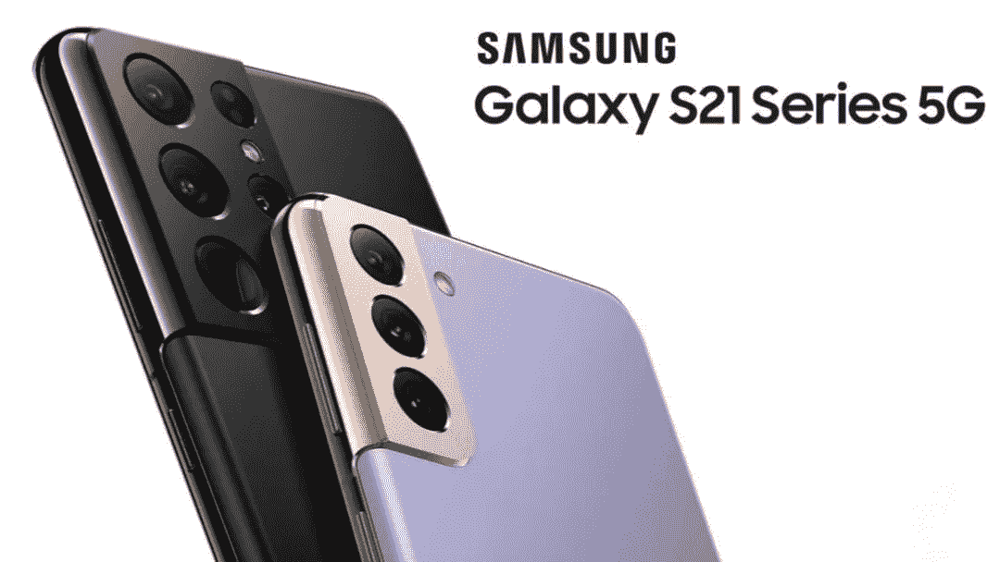
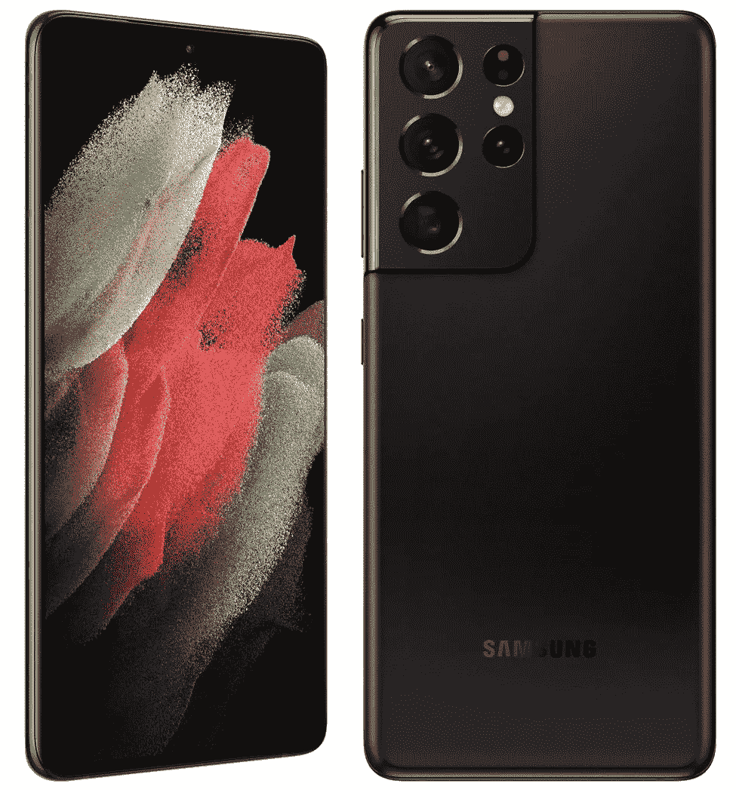
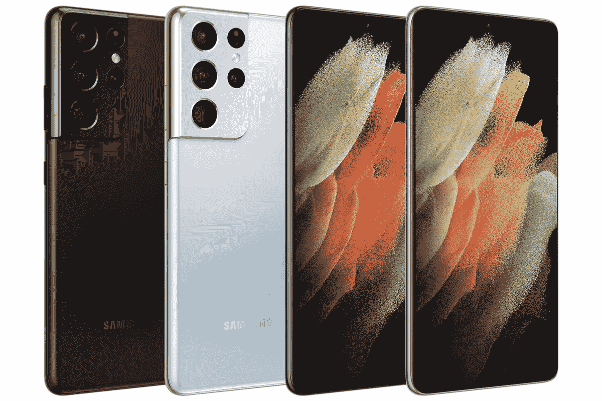
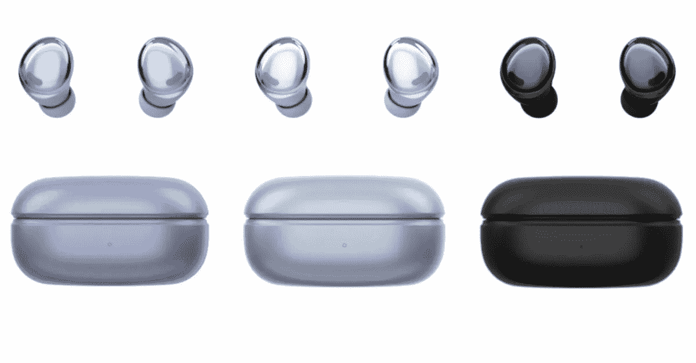
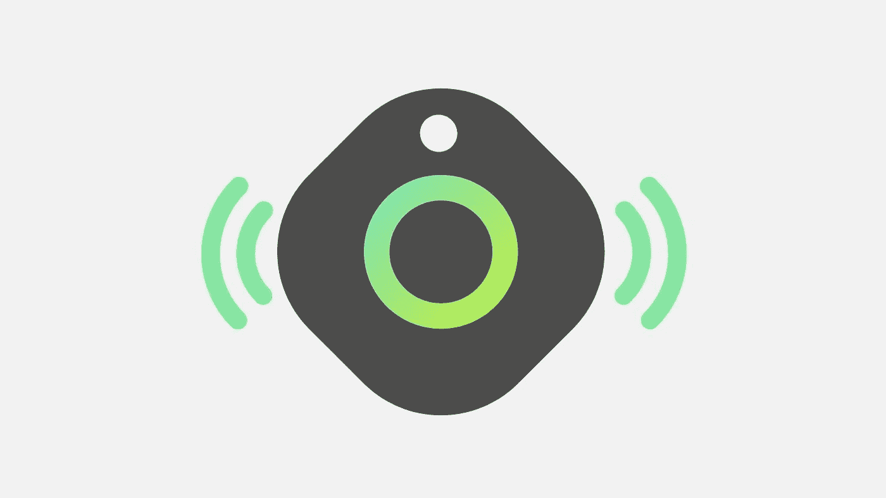
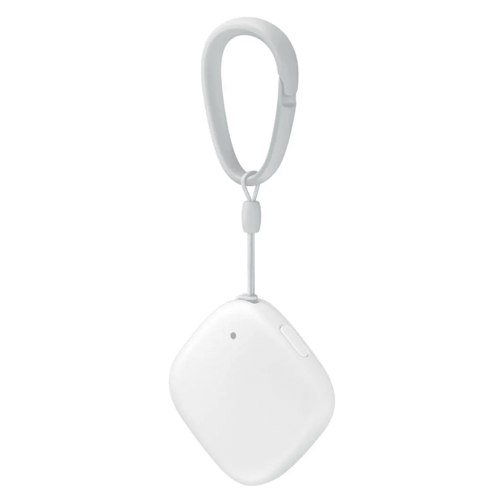
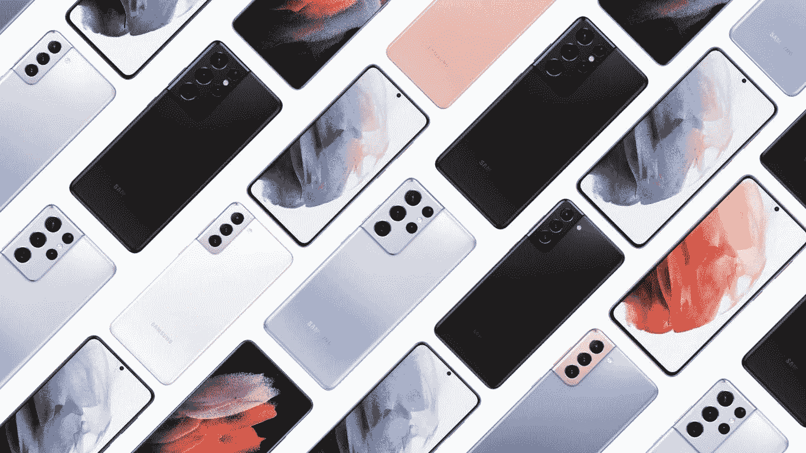

# 三星 Galaxy S21 系列来了！

> 原文：<https://blog.devgenius.io/the-samsung-galaxy-s21-series-is-here-25d36f99cc85?source=collection_archive---------11----------------------->

三星将在本周宣布新的 Galaxy，这是我们知道的一切。

**三星 Galaxy S21**

新年到了，三星的新 Galaxy 旗舰也来了，三星将在 1 月 14 日的 unpacked 活动上公布阵容。

看起来三星想要马上用他们最好的产品开始 2021 年，并可能在圣诞节后削减一些 iPhone 12 的销售。

那么你应该知道什么呢？

在夏季之前不会有折叠或笔记本设备，但我们有三款旗舰产品，它们的摄像头、SoC 性能和价格都有所提高。

**银河 S21 和 S21+**

前两款将是标准的 6.2 英寸 Galaxy S21 和 6.5 英寸 S21+型号，两者在设计上看起来相同，背面设置了三镜头，前面是打孔相机。

它们将以没有曲线的平板显示器为特色，这让我很高兴，相机模块以一种非常独特的方式连接到框架上，我很喜欢这种方式。

**银河 S21 和 S21+** |图片来自 [Winfuture](https://winfuture.de/news,120248.html)

我们还应该在显示器上有 120hz 的刷新，并有改进的显示指纹识别器，一如既往地是任何智能手机上最好的有机发光二极管显示器。

我很好奇三星在 S20 上还增加了什么改进，这是一个新的设计，他们肯定会有一些很棒的新配件。

曲面 Galaxy S8 与 S20 的机身框架和显示屏形状非常相似，只是背部摄像头的布局发生了变化，边框变得更薄。

这些渲染显示，S21 的显示屏周围有一个完全统一的边框，最终消除了下巴，这使 S21 看起来很干净，很悦目，更适合这种新的设计。

**Galaxy S21 Ultra 和 S21+**

至于背面，我希望是玻璃，但在 999 美元的 Note 20 塑料背面一团糟之后，我现在不太确定它会是玻璃。

我觉得三星会选择眼镜来弥补他们在 Note 20 上犯的错误，因为在当前的环境下他们不能失去买家，但有传言称 S21 将是塑料的，而 S21+和 Ultra 型号是玻璃的。

不管怎样，他们最近有了一些奇妙的颜色，我希望他们会继续下去。

Galaxy S21 将提供幻影灰、粉色、紫色和白色，而 Galaxy S21+将提供幻影黑和银色。

价格方面，也许 799 美元(Galaxy S21)和 899 美元(Galaxy S21+)是我的猜测，可以与 iPhone mini 和 iPhone 12 竞争，但你永远不知道，它们可能会再次变得荒谬，起价为 999 美元，但我们希望不会。

**银河 S21 超**

Galaxy S21 Ultra 的第一张渲染图出现在去年，展示了一个巨大的摄像头凸起，Galaxy S21 Ultra 似乎有一个 6.8 英寸的显示屏，带有一个穿孔的 4000 万像素自拍摄像头和一个 5000 毫安时的电池。

我们还可以期待 5G、Wi-Fi 6、显示器内指纹识别器、立体声扬声器、IP68 认证、Samsung Pay 和无线充电等功能成为所有 3 款车型的标准配置。

**银河 S21 超**

还有一种可能性是，Galaxy S21 Ultra 可能有四个后置摄像头，而不是 S21 和 S21+上的三个后置摄像头和一个未知的传感器，主摄像头将是稍微更新的 108MP。

Galaxy S21 Ultra 可以配备两个独立的长焦镜头，将一个标准的 3 倍镜头与一个潜望镜式模块配对，能够实现 5 倍及以上的放大级别。

**银河 S21 超**

Ultra 型号总是 Galaxy 设备中最大和最贵的，我希望在这里没有什么不同，我希望起价为 1099 美元，但 1199 美元的价格标签更有可能。

Ultra 型号还将支持 S-Pen，这使其成为第一个在 Note 系列之外使用它的产品，也是 S21 的一个重要补充，一些情况下可以在不使用时放置笔。

Galaxy S21 Ultra 将有幻影黑、银色和紫色三种颜色。

**银河蓓蕾 Pro**

具有主动噪音消除功能的 Galaxy Buds Pro 无线耳塞已经泄露，包括价格。

Galaxy Buds Pro 上市时售价 199 美元，比我个人最喜欢的入耳式耳机苹果 AirPods Pro 便宜 50 美元。

三星的 pro buds 将具有强大的 IPX7 防尘防水耐久性，以及长达 8 小时的收听时间，使用充电外壳可延长至 28 小时。

**紫色、银色和黑色的 Galaxy Buds Pro。**

这些泄露支持了苹果公司类似杜比全景声的空间音频功能的传言。

至少在纸面上，三星的 Galaxy Buds Pro 看起来与苹果的 best buds 非常有竞争力。

**智能标签**

据透露，去年年底，三星一直在研究一种类似瓷砖的物体追踪器。

三星将推出两款新的物体追踪器:Galaxy SmartTag 和 Galaxy SmartTag+。

**智能标签图标泄露**

虽然目前还不清楚 Galaxy SmartTag+会比 Galaxy SmartTag 提供什么额外的功能，但这两款物体追踪器都可以连接到 Galaxy 智能手机上，并附着在你想要追踪的物体上，如包或钥匙。

它们还具有蓝牙 5.1、端到端加密和增强安全性的“隐私 ID”。

他们被认为拥有 UWB(超宽带),这是最新款 iPhones 和苹果即将发布的 AirTags 的特色，这将允许在搜索标签时获得惊人的准确性，并可能使用 AR。

**智能标签的可能设计**

据传，这两款追踪器都有四种颜色可供选择:黑色、牛仔蓝、薄荷色和燕麦色。

Galaxy SmartTag 和 SmartTag+预计将于 1 月 14 日与 Galaxy S21 系列一起发布。

据传，它们的定价从 15 美元起，Galaxy SmartTag 将在大多数市场上与 Galaxy S21 预购一起免费提供。

这些智能标记将与 SmartThings Find 服务兼容。

**现在你知道了**，我迫不及待地想亲自看看这个新设计，看看三星在相机方面有什么新的改进，并做一个全面的评论。

我们仍然有一些问题，比如 QHD 的 120 赫兹显示器有多好？5 纳米 Exynos 2100 最终会与苹果 A14 或骁龙 888 匹敌吗？这次他们会降低价格吗？

看看他们是否会配备充电器和耳机或跟随苹果的领导也将是有趣的，最近的一些传言表明三星可能会放弃它们，并将 S21 系列与新的即将推出的无线 Galaxy Buds Pro 和智能标签一起作为预购奖励，这将是非常棒的。

**将于 1 月 14 日发布，当天接受预订，1 月 29 日发售。**

**三星和安卓粉丝激动人心的时刻即将到来。**